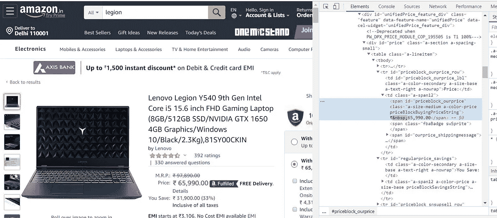

# 使用 JavaScript 和 Node.js 抓取 Amazon.com

> 原文：<https://blog.devgenius.io/scraping-amazon-com-using-javascript-18ef6caf53f6?source=collection_archive---------0----------------------->


在这篇文章中，我将演示如何使用 Javascript 在网上抓取 Amazon.com。同样，您需要设置 Node.js。使用命令行将目录切换到项目文件夹，并键入“npm init”来激活 Node.js 环境。

```
npm init
```

现在使用以下命令安装 express、cheerio 和 axios 依赖项

```
npm install express cheer.io axios
```

在你的浏览器中打开任何亚马逊网页。您将意识到，每件商品的价格及其标题都显示在一个带有 id 的惟一的 html span 中。



价格在 id 为 priceblock_ourprice 的范围内

***价格在 id 为‘price block _ our price’***的范围内

创建一个文件 scrape.js 用于抓取网页，导入 axios 和 Cheer.io 依赖项。现在使用以下代码:-

```
**import axios from 'axios';
import cherrio from 'cheerio';

async function getHTML(productURL) {
    const { data: html } = await  axios.get(productURL, {
        headers: {
            'User-Agent': 'Mozilla/5.0 (X11; Linux x86_64) AppleWebKit/537.36 (KHTML, like Gecko) Chrome/42.0.2311.90 Safari/537.36'
        }
    })
        .catch(function (error) {
            console.log(error);
        });
    return html;
}

async function getAmazonPrice(html) {
    const $ = cherrio.load(html);

    const span = $('#priceblock_dealprice');

      return span.html();

}

async function getAmazonModel(html) {
    const $ = cherrio.load(html);

    const span = $('#productTitle');

      // return span.html();
}

export { getHTML, getAmazonPrice,getAmazonModel };**
```

在函数 getAmazonPrice 和 getAmazonModel 中，变量 span 存储价格和名称块。使用命令 span.html()我们发送存储在其中的块的内容。

# **希望你们喜欢这篇文章**