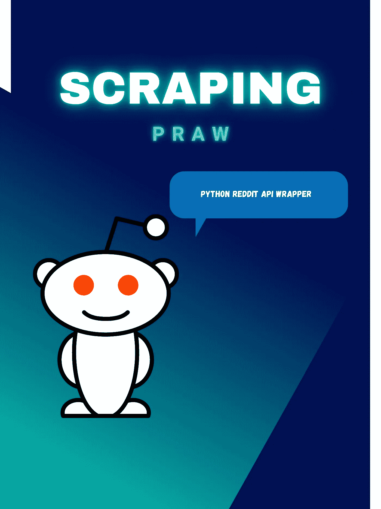
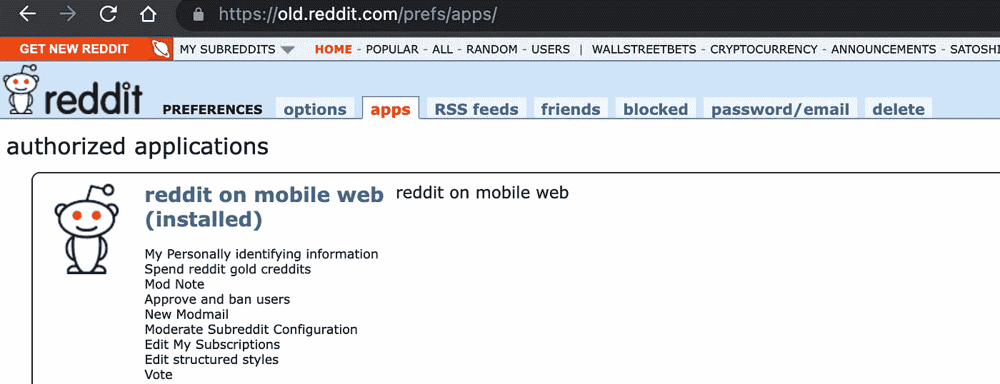

# 用 PRAW 抓取 Reddit(Python Reddit API 包装器)

> 原文：<https://blog.devgenius.io/scraping-reddit-with-praw-python-reddit-api-wrapper-eaa7d788d7b9?source=collection_archive---------2----------------------->



显示 Reddit 徽标的海报

在本文中，我们将看到如何使用 Python 来抓取 Reddit。我们将使用 Python 的 PRAW (Python Reddit API Wrapper)来抓取数据。

## 为什么是 PRAW？

尽管有其他方法可以从 Reddit 上收集数据，但 PRAW 让它变得非常简单。它遵循 Reddit 的所有 API 规则，让您不必在代码中包含睡眠调用。在开始编码之前，我们需要设置身份验证。

## 证明

PRAW 要求认证。跟随这个[链接](https://old.reddit.com/prefs/apps)导航到 Reddit 的开发者账户。注册创建一个新帐户，如果您已经有一个帐户，请登录。

一旦你登录，确保你在应用程序选项卡上——你应该能在页面底部看到一个按钮，上面写着“你是开发人员吗？创建一个应用…”见下图:



该图显示了来自 Reddit 应用程序网站的截图

单击按钮后，应该会出现一个名为“创建应用程序”的表单。您需要填写表格并点击“创建应用程序”按钮。请参见下面的示例:


显示表单的图像

现在，您应该看到您的新应用程序，其中包括您需要的所有信息，如下所示(出于安全原因，下图中显示的键被替换为文本):


显示开发的应用程序信息的图像

现在您已经设置了身份验证，我们可以开始编码了。

## 让我们写一些代码

正如我提到的，我们将使用一个叫做 PRAW 的 Python 包。它真的有很好的记录，你可以随时在他们的 slack 频道提问。

> PRAW 文件: [PRAW 文件](https://praw.readthedocs.io/en/stable/)
> 
> Python 3.6 以上版本支持 PRAW
> 
> PRAW 知识库: [PRAW](https://github.com/praw-dev/praw)
> 
> PRAW 松弛频道:[松弛](https://join.slack.com/t/praw/shared_invite/zt-c4ggb0ap-7Q19mb2QEKbyvRLWDVZ5VA)

本例的目标是在 CryptoCurrency subreddit 中抓取 50 篇关于比特币的帖子的标题、分数、评论数量、日期和 URL 链接，并最终生成一个. json 和。csv 文件。

打开终端并导航到您想要保存工作的目录。

```
cd <workdirectoryname>
```

现在，创建一个新目录，所有与 scraper 相关的文件都将存储在这个目录中。

```
mkdir reddit-scrape
```

cd 放入您的新目录。

```
cd reddit-scrape
```

创建一个. py 文件。

```
touch r_scrape.py
```

安装 PRAW。

```
pip install praw
```

装熊猫。

```
pip install pandas
```

> Pandas 是一个用于数据操作和分析的 Python 库。
> 
> 熊猫文档:[熊猫文档](https://pandas.pydata.org/docs/getting_started/index.html)
> 
> 熊猫仓库:[熊猫回购](https://github.com/pandas-dev/pandas)

打开 r_scrape.py 文件。

首先，导入依赖项。

```
import prawimport pandas as pdimport json
```

> Python 原生支持 json。

使用您开发的应用程序中的信息创建一个只读 Reddit 实例。

```
r = praw.Reddit(client_id="<YOUR_CLIENT_ID_HERE>",client_secret="<YOUR_CLIENT_SECRET_HERE>",user_agent="<YOUR_USER_AGENT>",)
```

> 用实际信息替换助手标签。
> 
> **用户代理**的推荐格式如下:`<platform>:<app ID>:<version string> (by u/<Reddit username>)`
> 
> **来自 PRAW 的文档:**
> 
> **客户端 ID &客户端密码**
> 
> 这两个值是作为**脚本**应用程序访问 Reddit 的 API 所必需的(其他应用程序类型参见[通过 OAuth 认证](https://praw.readthedocs.io/en/latest/getting_started/authentication.html#oauth))。如果您还没有客户端 ID 和客户端密码，请遵循 Reddit 的[第一步指南](https://github.com/reddit/reddit/wiki/OAuth2-Quick-Start-Example#first-steps)来创建它们。
> 
> **用户代理**
> 
> 用户代理是帮助 Reddit 确定网络请求来源的唯一标识符。要使用 Reddit 的 API，您需要一个唯一的、描述性的用户代理。推荐格式为`<platform>:<app ID>:<version string> (by u/<Reddit username>)`。例如，`android:com.example.myredditapp:v1.2.3 (by u/kemitche)`。在 Reddit 的 API wiki 页面阅读更多关于用户代理的信息。

设置搜索参数。

```
q='bitcoin' #querysub='CryptoCurrency' #subredditsort = "top" limit = 50
```

> 多个子记录可以用 a +组合。
> 
> 例如 sub= '加密货币+SatoshiStreetBets '

创建对子编辑的搜索。

```
top_posts = r.subreddit(sub).search(q, sort=sort, limit=limit)
```

初始化一个空列表。

```
total_posts = list()
```

遍历 top_posts，为每个实例创建一个字典，将抓取的数据存储在一个有序的集合中。此外，对于每个实例，将新创建的字典追加到空列表中。

```
for post in top_posts: # print(vars(post)) # print all properties Title=post.title, Score = post.score, Number_Of_Comments = post.num_comments, Publish_Date = post.created, Link = post.permalink, data_set = {"Title":Title[0],"Score":Score[0],   "Number_Of_Comments":Number_Of_Comments[0],"Publish_Date":Publish_Da te[0],"Link":'https://www.reddit.com'+Link[0]}total_posts.append(data_set)
```

> 您可以取消对 print(vars(post))的注释，以查看每个帖子中您可以访问的所有数据。
> 
> 链接中添加了一个预设值，是因为我们从帖子中获取永久链接，通过在它前面添加“https://www.reddit.com ”,我们可以访问帖子的 url。

创建一个 csv 文件。

```
# create csv filedf = pd.DataFrame(total_posts)df.to_csv('data.csv', sep=',', index=False)
```

创建一个 json 文件。

```
#create json filejson_string = json.dumps(total_posts)jsonFile = open("data.json", "w")jsonFile.write(json_string)jsonFile.close()
```

完整代码:

> 参见这段代码的资源库: [**GitHub**](https://github.com/Julio-M/reddit-scrape)

```
import prawimport pandas as pdimport json r = praw.Reddit(client_id="<YOUR_CLIENT_ID_HERE>",client_secret="<YOUR_CLIENT_SECRET_HERE>",user_agent="<YOUR_USER_AGENT>",)# search parametersq='bitcoin'sub='CryptoCurrency'sort = "top"limit = 50 top_posts = r.subreddit(sub).search(q, sort=sort, limit=limit) total_posts = list() for post in top_posts: # print(vars(post)) # print all properties Title=post.title, Score = post.score, Number_Of_Comments = post.num_comments, Publish_Date = post.created, Link = post.permalink, data_set = {"Title":Title[0],"Score":Score[0], "Number_Of_Comments":Number_Of_Comments[0],"Publish_Date":Publish_Date[0],"Link":'https://www.reddit.com'+Link[0]}total_posts.append(data_set) # create csv filedf = pd.DataFrame(total_posts)df.to_csv('data.csv', sep=',', index=False)#create json filejson_string = json.dumps(total_posts)jsonFile = open("data.json", "w")jsonFile.write(json_string)jsonFile.close()
```

我们可以使用以下命令运行上面的代码:

```
python r_scrape.py
```

运行我们的代码后，将在我们的 reddit-scrape 目录中创建一个 data.csv 和 data.json 文件，在这些文件中，我们应该可以看到抓取的数据，如下例所示:


该图显示了 data.csv 中的数据片段


该图显示了 data.json 中的数据片段

希望你喜欢阅读这篇文章，它能帮助你理解使用 PRAW 的基本知识。这只是你使用 PRAW 所能做的一小部分。我强烈建议研究他们的文档，并开始自己尝试。下次见！