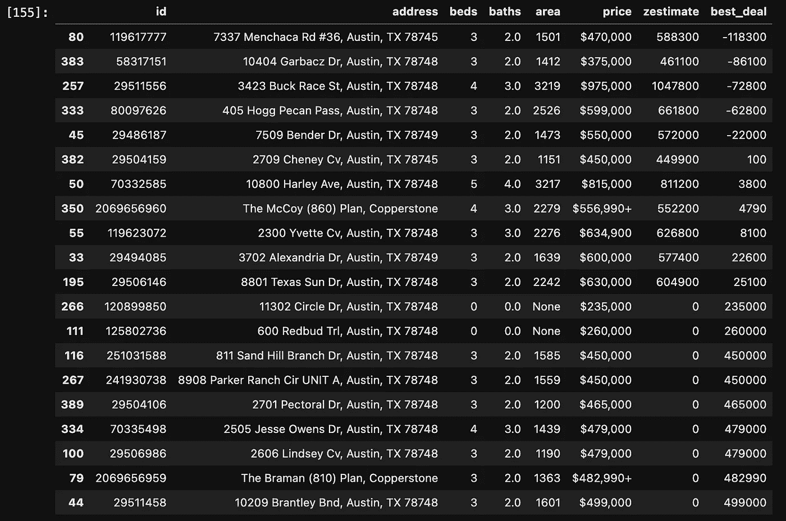

# 用 Python 和 BeautifulSoup 刮 Zillow

> 原文：<https://blog.devgenius.io/scraping-zillow-with-python-and-beautifulsoup-bbc7e581c218?source=collection_archive---------1----------------------->

# 更新的代码

如果你以前读过这篇文章——是的，我删除了几年前写的所有东西，给你留下了更新的代码。

此外，我也认真考虑过这个问题，问题是:我有一百万件事情要做——我几乎没有时间更新这篇文章。我收到了大量关于这个小脚本的问题和电子邮件。所以我会这么做:

*   如果你想使用这个脚本，当然可以。不是我的数据。我只是碰巧点击了正确的按钮来得到它。
*   如果你想让我帮你运行这段代码，并给你发送一个包含所有数据的 csv 文件，请给我 10 美元的加密文件，而不是尝试自己运行这段代码。地址在最下面。
*   如果你像你妈妈经常说的那样，需要更多的帮助，你的要求比这个脚本更具体，比如说你想要租赁数据，给我 100 美元，我会为你写一个你要找的自定义脚本，并通过电子邮件把数据发给你。
*   如果你想让我全神贯注，不管出于什么原因，希望是编程相关的——你不能拥有它。lol。我妻子甚至不明白。

## **接通代码**

不像我希望的那样程序化，但是乞丐不能挑肥拣瘦。只需再添加几个网址——如果你选择的城市没有那么多列表，可能需要注释掉一些行。我确实认为 zillow 过了一会儿就超过了你——试着睡了一觉，但没有成功。记住这一点。我想我的设备现在可能已经被列入黑名单了——但这应该***有效…

## 它应该会返回这样的结果:

# 金钱

**USDC(ERC 20):**0x 0d 1a 78 a 625 c7a 8757 b 78 f 6961681 CD 455 da 1 bb 87

