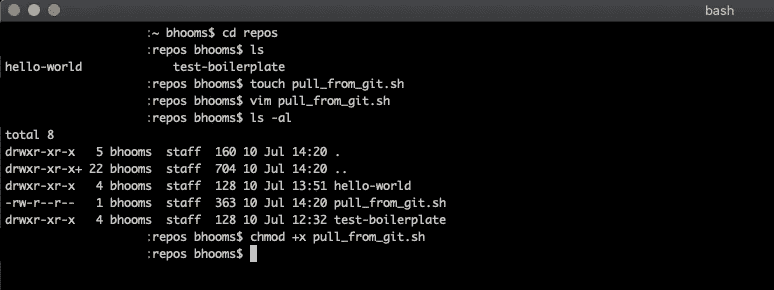
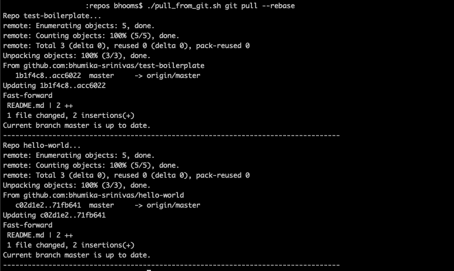
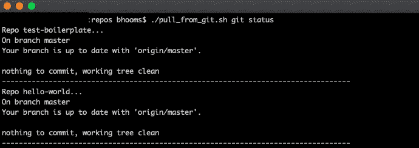

# 跨多个回购运行 git 命令的脚本

> 原文：<https://blog.devgenius.io/script-to-run-git-commands-across-multiple-repos-8e2a1199aa2?source=collection_archive---------4----------------------->


由 [Goran Ivos](https://unsplash.com/@goran_ivos?utm_source=unsplash&utm_medium=referral&utm_content=creditCopyText) 在 [Unsplash](https://unsplash.com/s/photos/code-in-laptop?utm_source=unsplash&utm_medium=referral&utm_content=creditCopyText) 上拍摄的照片组合而成 [Piktochart](https://piktochart.com/) 的图形

GitHub 是一个非常流行的 Git 存储库托管服务，被许多组织和软件开发者使用。如果您的日常工作涉及编写代码或与代码交互，那么在 GitHub 上运行多个共享 Git 存储库(repos)是很正常的。

我曾在团队中工作过，在任何给定的时间点，至少有 20 个人同时将他们的代码推送到多个 repos 中。不。我没有夸大其词！！这使得很难保持所有这些回购与变化同步。

为了解决这个问题，我使用这个简单的脚本循环遍历当前目录中的所有 Git repos，它将命令(在这些目录中运行)作为参数/输入。我在`Steps to run the script`部分列举了一个例子。

# **运行脚本的步骤**

*注意:这里提到的所有命令和例子都只适用于 macOS。对于任何其他基于 Unix 的系统，可以对脚本进行简单的调整，以确保它能够工作。我创建了这个 shell 脚本。但是，这也很容易成为 Ruby 脚本。*

1.  进入有多个回购的目录。使用`cd`命令来完成此操作。
2.  使用`touch` 和/或您选择的任何其他编辑器将 gist 中的代码复制到这个目录下的一个 shell 脚本中。我个人比较喜欢`vim`。
3.  创建脚本后，更改权限以确保您可以执行该脚本。

示例:您可以使用`chmod`向脚本添加执行权限，如下所示:

```
chmod +x pull_from_git.sh
```



将“cd”放入目录，创建脚本并更改权限…

4.现在它已经准备好运行您想要的任何 git 命令，针对该目录中列出的所有 repos。

以下列格式运行脚本:`./pull_from_git.sh <command_to_run>`

示例:

```
./pull_from_git.sh git pull --rebase
```

现在，它将遍历当前文件夹中的所有存储库，并运行`git pull --rebase`命令。

这可以在开始编码之前每天运行，以确保所有最新的更改都从 git 中下载。



对所有仓库运行“git pull — rebase”

运筹学

检查回购的状态:

```
./pull_from_git.sh git status
```



为所有的回复运行“git 状态”…

对于在修改代码时经常使用的所有其他 Git 命令，可以遵循相同的过程。

因此，基本上这个脚本可以用来对所有本地克隆的回购文件运行任何这样的命令，在当前目录中，不需要进入每个回购文件的本地目录并单独下载代码。

只是一个简单的脚本，带走一点痛苦。