# ScriptableObject 游戏事件

> 原文：<https://blog.devgenius.io/scriptableobject-game-events-1f3401bbde72?source=collection_archive---------0----------------------->

## 在 Unity 中创建事件系统

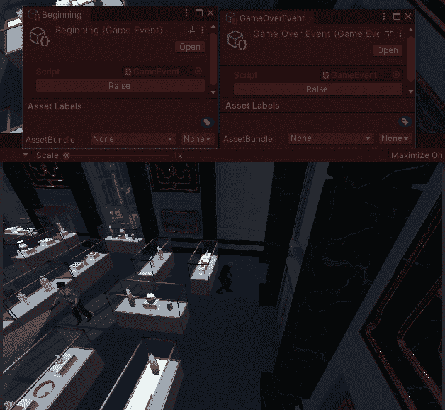

我参加了一个 Unity Talk[**Unite 2017——带可脚本化对象的游戏架构**](https://www.youtube.com/watch?v=raQ3iHhE_Kk) ，我认为它是 Unity 中可以使用的最好的事件系统之一。原代码可在[**Roboryantrin/unite 2017**](https://github.com/roboryantron/Unite2017)找到。我对原始代码做了一些小小的修改，以便添加一个可以在代码中完成的游戏事件监听器。

# ScriptableObject 游戏事件

ScriptableObject 游戏事件有一个游戏事件侦听器列表，这些侦听器使用注册和取消注册的公共方法注册到游戏事件。当事件被引发时，它通知所有注册的侦听器，并告诉它们运行它们的代码。

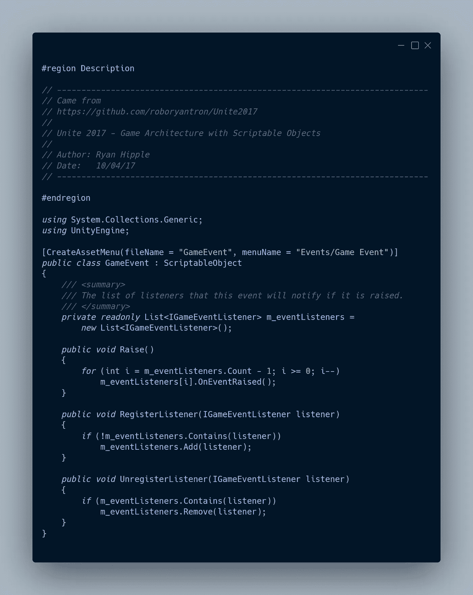

创建一个游戏事件就像在 Unity 中创建任何其他资产一样。

通过在项目视图中右击

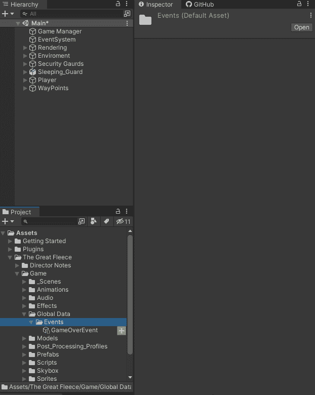

使用资产->创建菜单

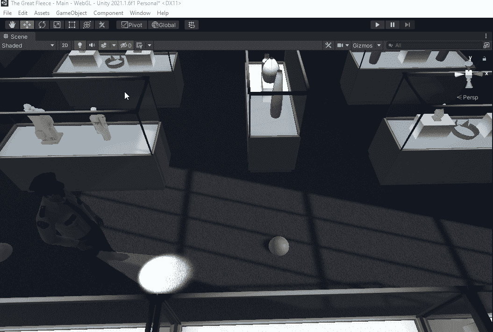

# 游戏事件监听器

游戏事件侦听器接口需要一个名为 OnEventRaised 的方法。

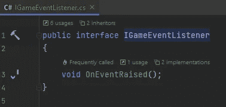

## Unity 游戏事件监听器

Unity 游戏事件监听器是一个 MonBehavior，可以添加到场景中的游戏对象，该对象使用 Unity 事件来响应引发的游戏事件。它实现了游戏事件监听器接口。

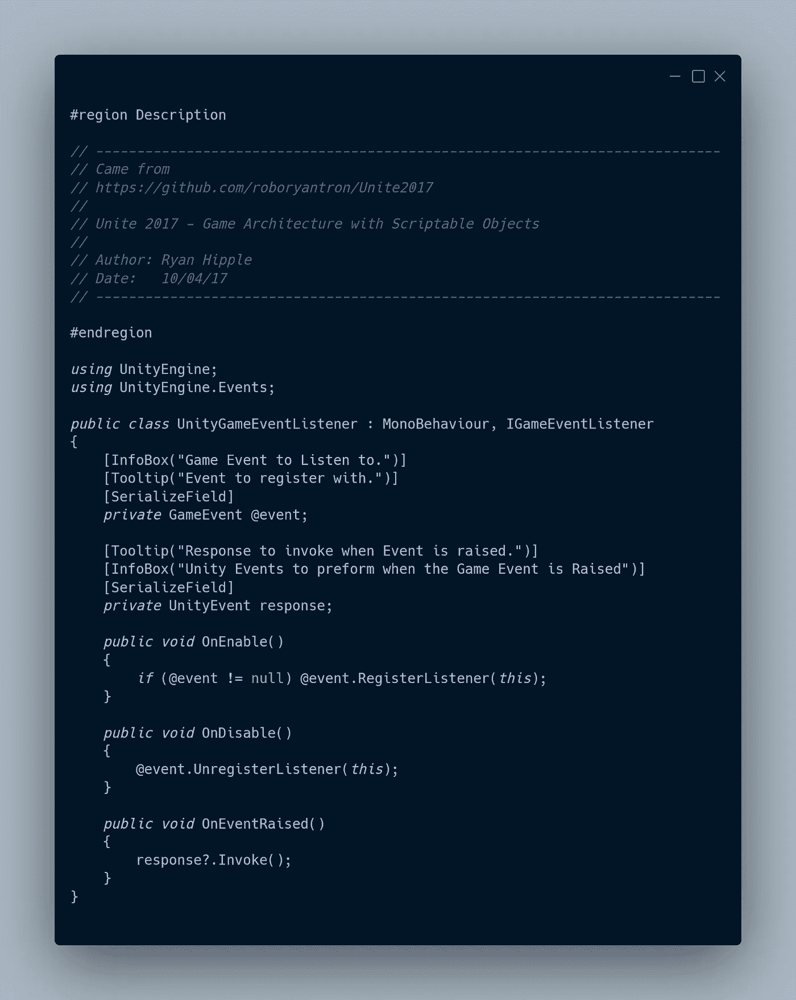

使用 [**Unity Events**](https://docs.unity3d.com/2021.1/Documentation/Manual/UnityEvents.html) 这种方式的好处是，我不必通过代码编写事件被引发时会发生什么。

将 Unity 游戏事件监听器组件添加到场景中的游戏对象。

指定我想听的游戏事件。

在响应中指定我希望发生的事情。我可以在我的场景中使用任何游戏对象，并从该游戏对象上的任何脚本中调用任何公共方法。在这种情况下，我只是激活和停用游戏对象。

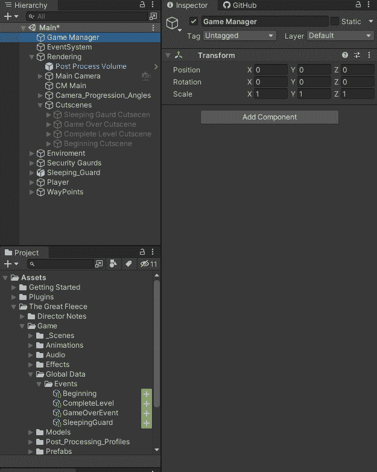

当游戏事件被引发时，响应将被执行。

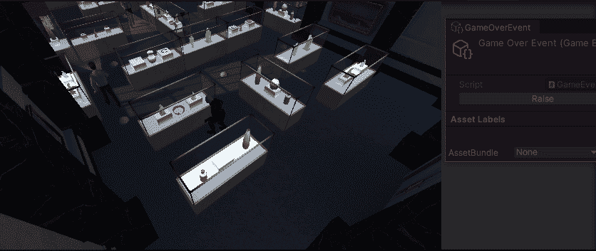

## 编码游戏事件监听器

编码的游戏事件监听器是一个类，可以添加到使用 [**系统动作**](https://docs.microsoft.com/en-us/dotnet/api/system.action?view=net-5.0) 来响应被引发的游戏事件的行为中。它实现了游戏事件监听器接口。

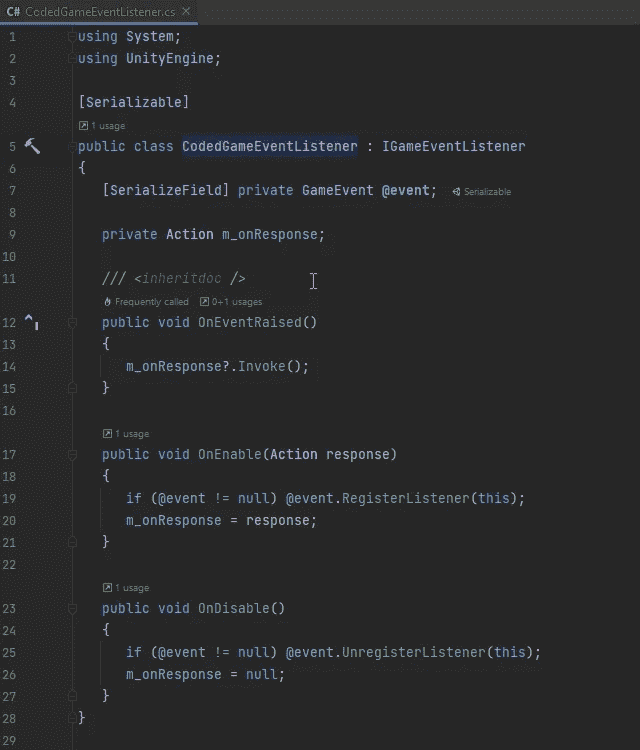

我需要确保 OnEnabled 和 On Disabled 方法被调用。

在 OnEnabled 中，我传递了当游戏事件被引发时我想要运行的方法。

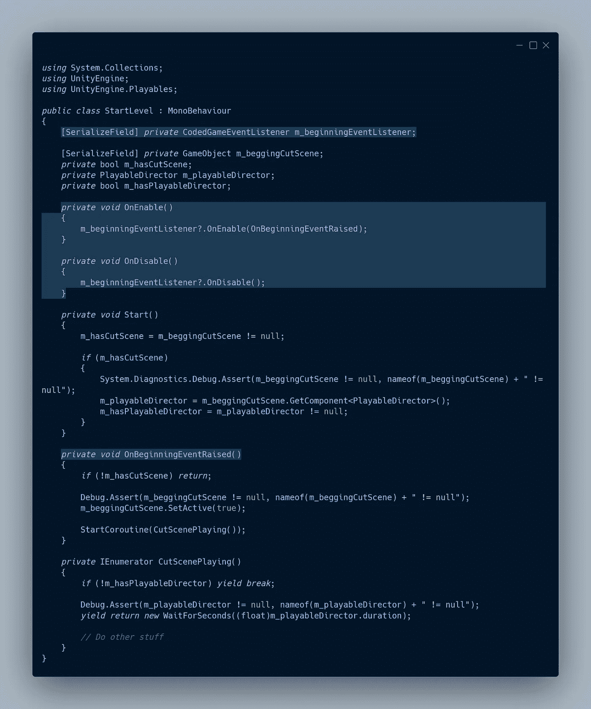

我将新的行为分配给场景中的游戏对象。

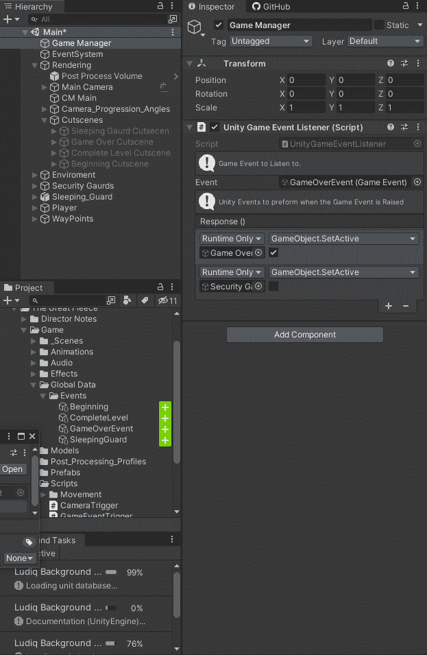

当游戏事件被引发时，开始事件引发方法将运行。

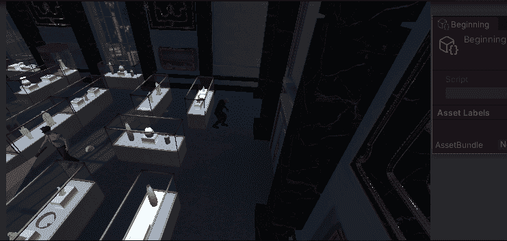

# 触发事件

现在我有了可以使用的游戏事件，我需要一种方法让游戏引发游戏事件。游戏中最常见的事件发生方式之一是玩家与游戏中的特定点进行互动。我创建了一个游戏事件触发器，当带有标签的游戏对象进入触发碰撞器时，它就会被触发。我还做了一个触发器，可以设置为触发一次游戏事件，比如过场动画。在 On Trigger Enter 方法中，我检查触发器是否是一次性触发器，以及游戏事件是否已经被触发，如果两者都为真，那么我退出该方法。我检查输入的碰撞器的标签是否在列表中。如果是，我设置游戏事件是否被触发为真并引发事件。

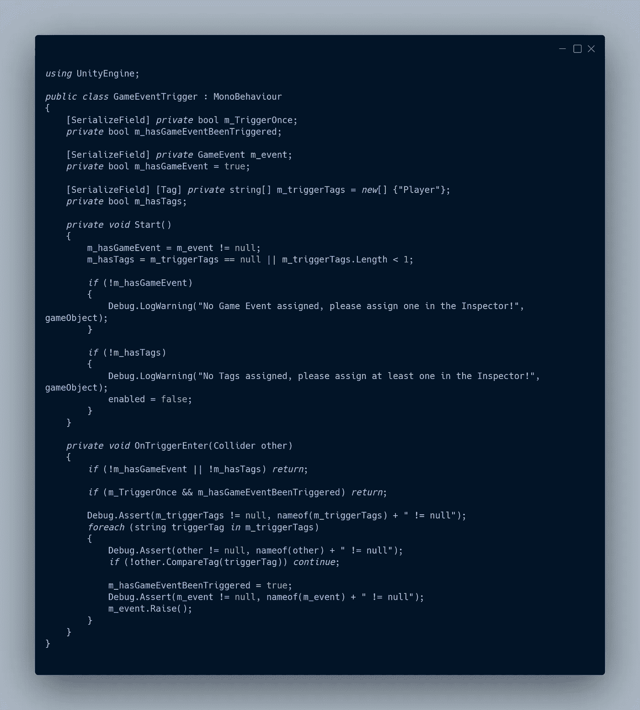

然后我在场景中设置了一个触发器，我可以用它来触发一个游戏事件。我确保碰撞器被设置为触发。然后我添加游戏事件触发器组件。我设置了希望这个触发器引发的游戏事件。我确保标签是正确的。因为这个触发器是我设置的过场动画

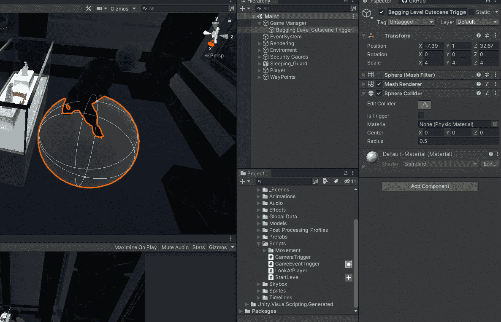

当然，这不是提升游戏事件的唯一方法。一个游戏事件可以在代码中的任何时候被引发，当一个场景开始时，当一个值被改变时，当一个动画事件发生时，在时间轴中的某一点，等等…

# 结论

现在我有了一个简单的事件系统，我可以用 Unity 事件来响应 Inspector，也可以通过代码来响应。当玩家进入触发点时，我可以很容易地触发游戏事件。