# 园丁解释 Scrum

> 原文：<https://blog.devgenius.io/scrum-explained-by-gardeners-30d0b27daf2f?source=collection_archive---------2----------------------->

## 对 scrum 的轻松解释

一个有趣的日常类比来解释 scrum

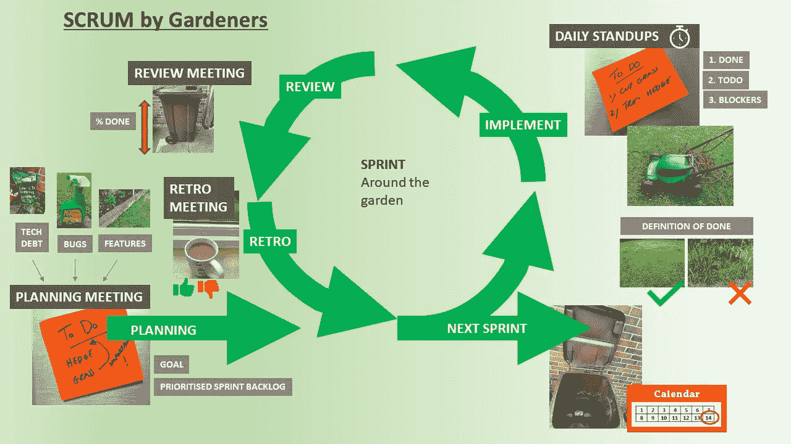

图片作者格雷格·比灵顿

今天早上早些时候，我躺在床上考虑如何向一个新团队解释敏捷概念和 scrum 框架，这时我听到一声巨响。那是一辆两周一次的垃圾车驶过去收集花园里的垃圾(如果你是美国人，那就是垃圾),一瞬间，我知道该怎么做了。园丁们一直在练习“scrum ”,甚至自己都不知道！

事实上，如果我在下面的故事中解释说每个人都已经在做 scrum 了，那么我没有必要教他们，只要让他们意识到他们已经知道了就行了。

# 第一天计划

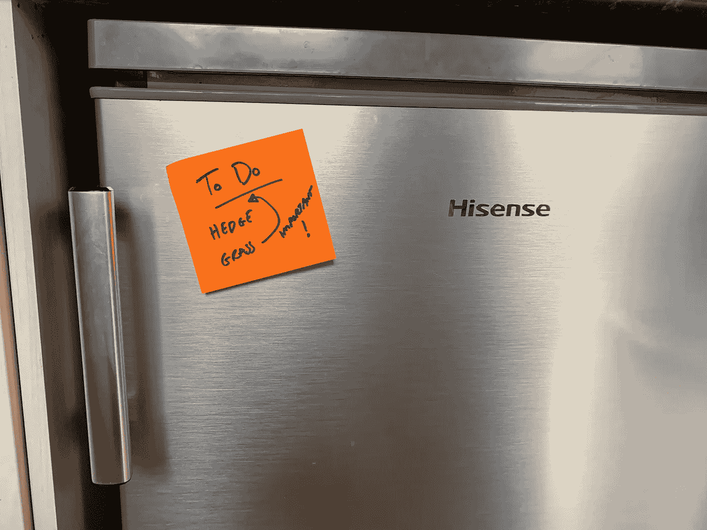

对所有人可见的优先短期计划

团队在**集中的工作区**(厨房)集合，并就下一个时间段的一系列任务达成一致。未来的结束日期是下一次两周收集一次花园垃圾的时间，因为我会在花园里跑来跑去，将这段时间称为“**冲刺**”似乎是个不错的主意。这个日期是不可移动的，并且是由委员会管理的定期两周一次的活动，作为一个团队，我们同意与这个时间表保持一致，并将其设置为我们的节奏。

团队中有谁？

*   我的合伙人——全权负责花园，被认为是花园的**所有者**。创建所需新功能的列表，并对它们进行排序。因为我从来没有到达这个列表的末尾，所以它被称为 **backlog。**
*   我自己——掌握我所看到的一切(嗯，那是我所想的)。我帮助组织各式各样的园丁来实现这个梦想。由于糟糕的着装感和肮脏，我们经常被称为渣渣团队，也许称之为 **scrum 团队**更礼貌。我也和团队一起做园艺工作。
*   第一个孩子——擅长举重，但不擅长识别杂草或植物。
*   第二个孩子——对细节很有眼光，不喜欢举重，但喜欢检查第一个孩子是否达到了规定的标准。

这两周的目标是“T16 让花园看起来整洁，任何人都可以参观”。夏末的长期愿景是将草地改良到接近保龄球果岭的完美状态，这样我们就可以用它来进行家庭推杆练习。这似乎是一个很长的路要走，但如果我们分阶段做，那么它似乎更容易实现，我们可以处理我们发现的其他小工作。

言归正传，任务列表包括:

*   花园的新事物——在花园边缘的空隙中种植一两朵花，这将在下一次大型活动(**发布花园大门的**让游客进来)日历(**路线图**)中的漂亮花园中形成**特色**。这是为了取悦手里拿着大棒的人，又名**利益相关者**。一些新家具会很好，但我们都同意，这是一个太远的步骤，在未来几周内实现。我说我可以做到，但孩子们的赔率是 3:1，我说是 2:1，这听起来像是一场扑克游戏，但我们都认为赔率太高，无法完成，所以家具不在清单上。
*   上周我没有管理的一些工作的完成情况，这些不符合“**完成**的定义”，比如买了植物但没有实际挖坑种植。杂志上一张美丽花园的照片摆在我面前，这是必需的**质量标准**。
*   修复我上周做的一些有一些问题的工作。花坛很整洁，但是灌木上有一些黑色的小昆虫。“去掉**bug**”清晰的指令传来。
*   做一些额外的工作，处理由于决定不做其他事情而不断积累的东西。为了回报几周前没有喷洒除草剂以节省时间，我现在不得不手动挖出一些杂草，如果我再等下去，它们会蔓延得更远。下周，除非我花一个小时和除草剂在一起，否则我还是得去挖新的杂草。这感觉就像在银行贷款，我可以很快借到钱去买东西，但我还钱的时间越长，利息就越多，或者我可以一口气把钱还清。所以杂草技术上感觉像债务，其实姑且称之为**技术债**。

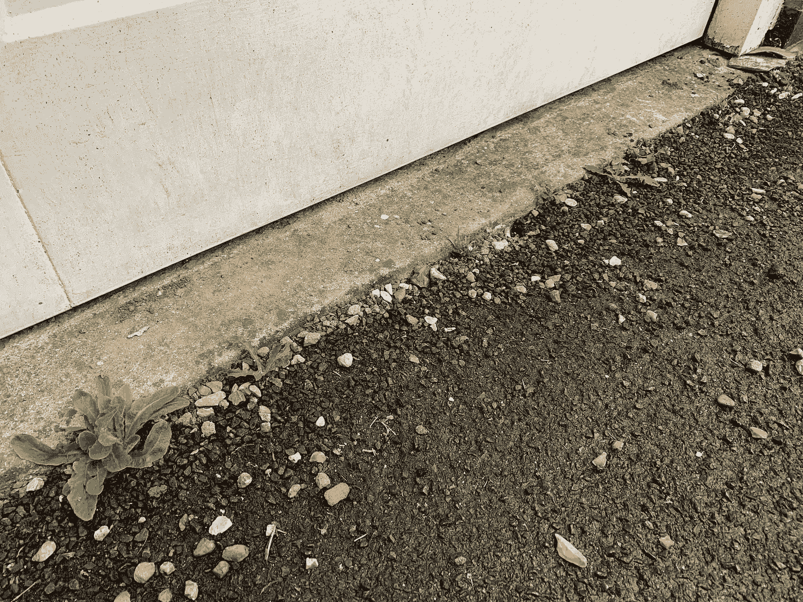

由于省时和跳过喷洒除草剂，正在进行的杂草债务

任务清单记录在便利贴上，贴在冰箱门上，让所有人都能清楚地看到和了解。规划会议到此结束。

# 第 2 天每日站立

早餐在早上 8 点整开始，15 分钟后结束。每个人都很忙，所以这必须很快，没有废话，只是在最短的时间内传达尽可能多的信息。事实上，这么快我们就站着吃**，**还是要冲出去。快速循环并喊出:

1.  你昨天做了什么？
2.  你今天要做什么？
3.  在你的道路上有什么阻碍吗？

这一天唯一的问题是天气，下午可能会下雨，电动割草机的电源线在哪里？作为一家之主，我有责任解决这些问题，让团队按计划进行。

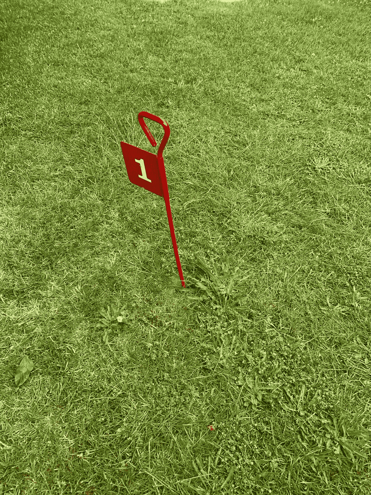

可能妨碍割草

# 第三天另一个每日站立

2 号孩子睡过头了，错过了早餐。没问题，他们不在的日子照样过，他们可以晚点再来，我可以报告他们不在的时候做了什么。我报告说，在小屋后面找到了电源线，今天天气看起来好一些。

# **第 4 天起床号和每日更新**

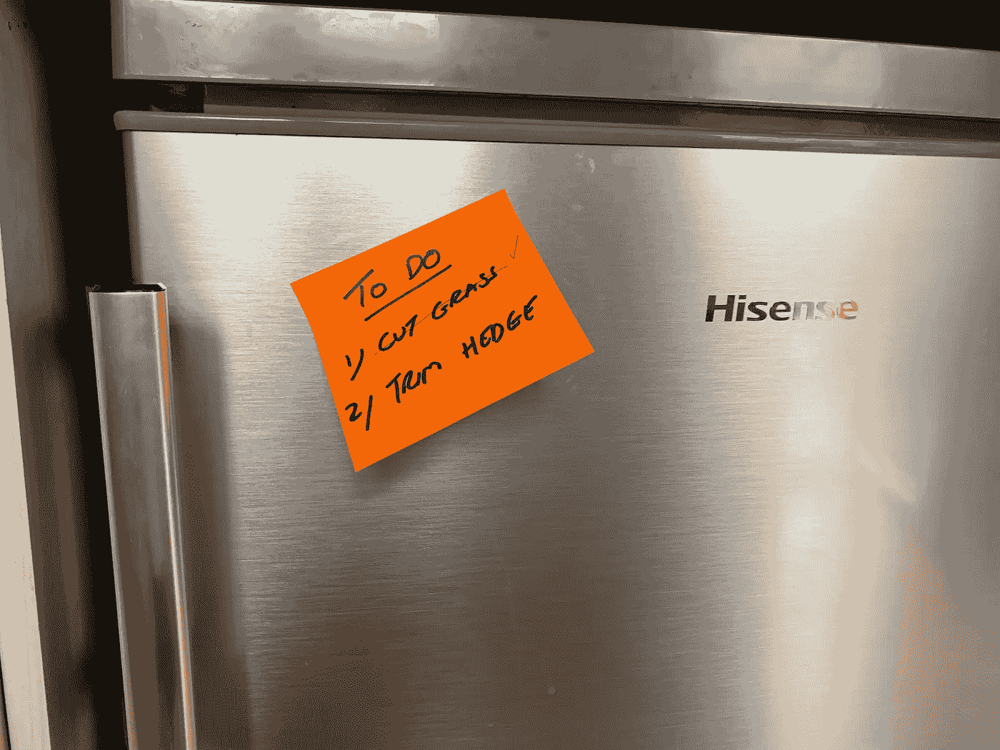

每日更新状态信息的优先计划

昨天雨停了，割草完成了，万岁！设法使用电动割草机，因为我找到了电源线。使用电动**工具**有助于减少时间并更好地完成工作。另一个手动**选项**是剪切机，速度慢且不整齐。第二个孩子抱怨说他们没有被“训练”使用切割设备，所以我替他们修剪了草坪。今天的更新很快，因为我已经在冰箱上的便利贴( **scrum board** )上划掉了这个任务，让所有人都可以看到。

# 第 4 天计划的意外变化

天气预报说今天阳光充足，不寻常，但是很好。由于环境的变化，我们必须灵活，花园的主人已经优先考虑一项新的任务，浇花。作为回应，我们都决定没有时间去种新的花，这样就从清单上删除了。接下来 2 周的总体目标不变。

下午快结束了，该浇水了，所以我从找到的第一个喷壶开始。

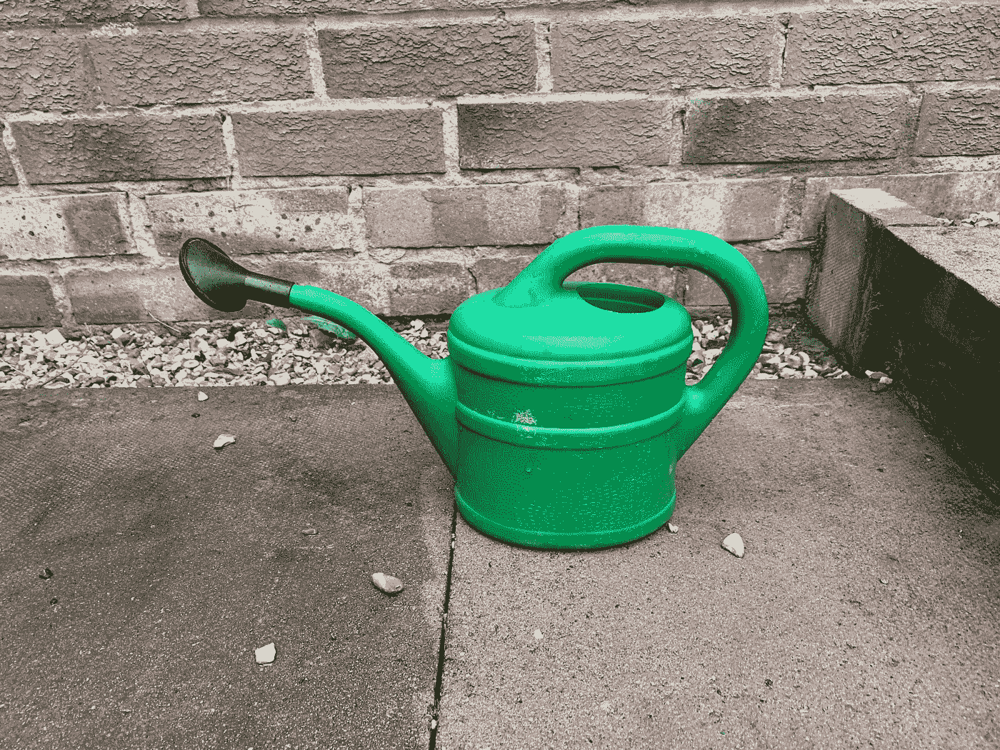

文章作者图片

灌了几次后，我意识到这需要太长时间，所以我去找了一个更大的喷壶。

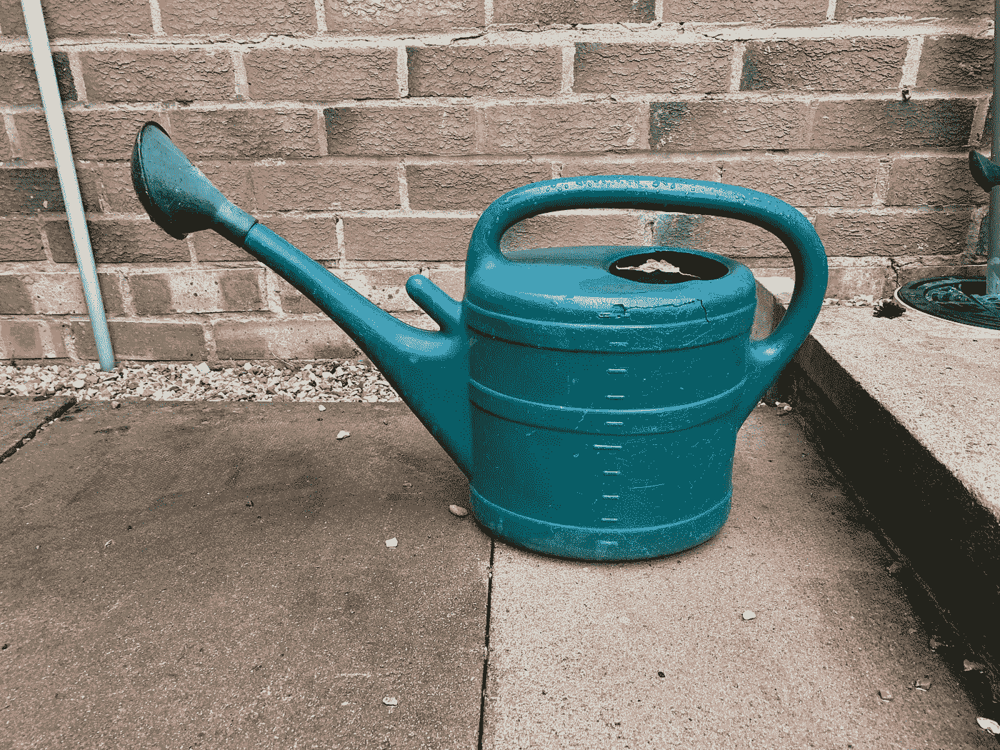

文章作者图片

大一点的喷壶效果更好，但还是太慢了，我需要更快的。我需要一个**管道**来快速排序，然后我可以每周使用它。带上软管。

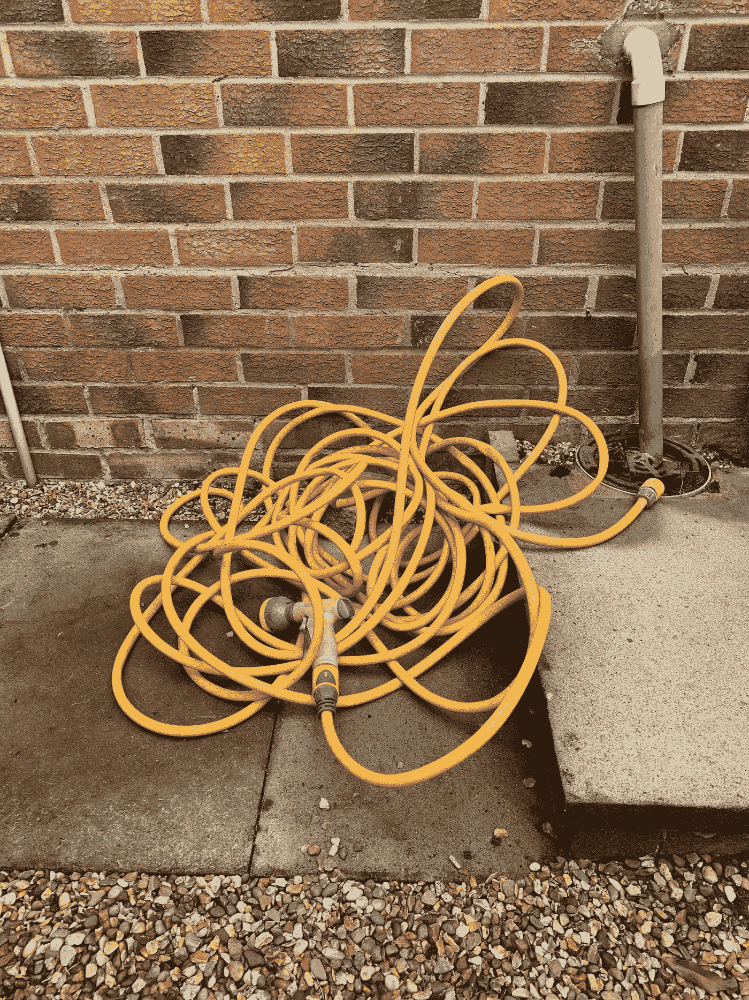

软管又名管道(取代以前效率低下的任务)

第一个孩子有另一个想法，让我们快速的把喷射式洗衣机拿出来，给花喷水。我不确定这些花能不能承受这种压力，所以决定放弃。

天空变得灰暗，可能会下雨吗？也许**云**能在这一点上帮助我？

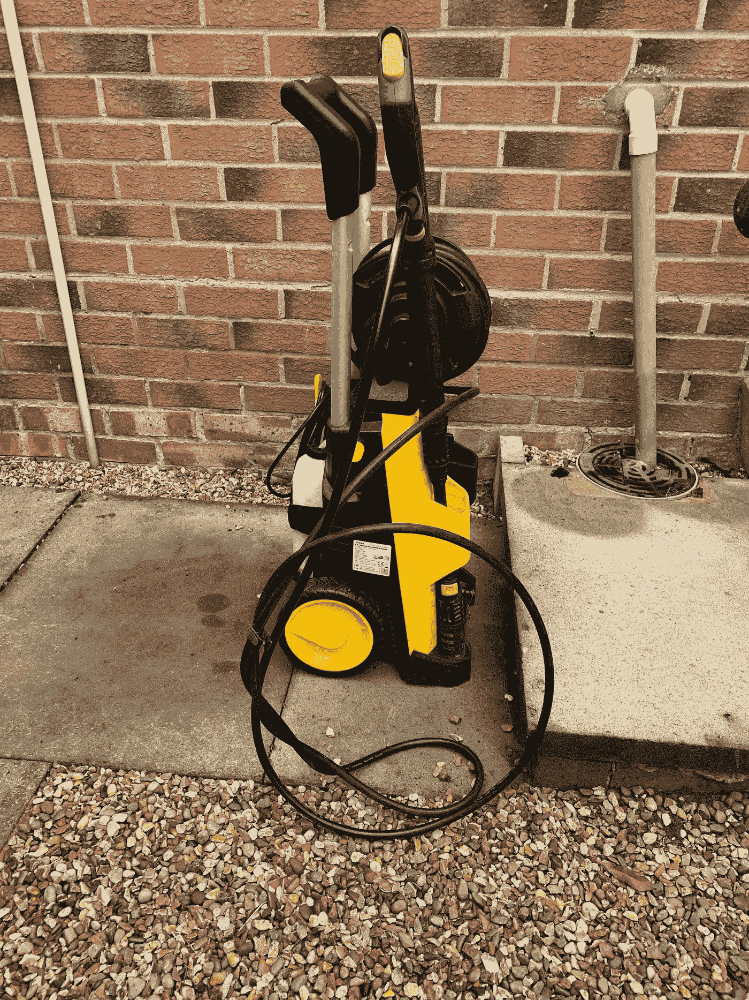

可能的流程改进，供冲刺阶段结束时讨论

# 第 5 天到第 13 天

时光飞逝，花园的工作进展顺利，厨房的清单被勾掉，棕色的带轮子的垃圾箱装满了剪下的草。

如果我在乡下，那么每天我都会拿起一堆干燥的棕色插枝，把它们处理掉，也许每天点一把火，把它们烧掉一点。这将有助于我轻松地检查我是否达到了在 2 周结束时完成的目标。

# 第 14 天冲刺结束

我在厨房召集团队，并邀请利益相关者加入我们的花园。我们在花园里走了一圈，展示了这两周我们做过的所有项目。查看花园的各个部分和工作的完整视图比查看勾掉的列表更容易。如果下雨，所以我们不能参观花园，我们有时会坐在室内，展示花园的照片或视频。这些项目中的大部分我们已经单独展示给利益相关者，随着时间的推移，他们对工作的完成表示满意，或者进行讨论并做一些小的调整。整个工作的演示和**评审**进展顺利，当我们经过各个区域时，团队和利益相关者对未来两周要做的事情的想法有**反馈**。或许再增加一些庭院灯？

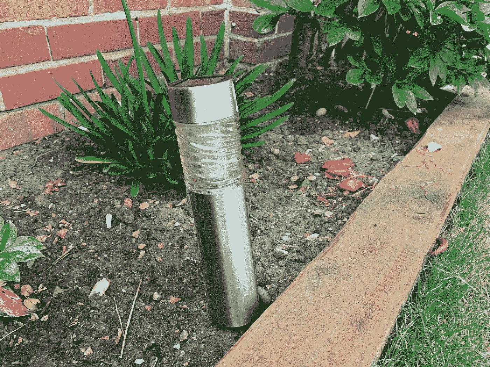

sprint 演练结束时对未来特性的想法

然后，团队成员聚在角落里，喝着咖啡谈论他们对工作进展的感受，并给出回顾性的意见。一些事情进展顺利，使用软管浇水的想法被同意在未来再次进行。小喷壶不是一个好主意，所以我们都决定把它放在小屋黑暗的角落里。动力喷射清洗是一个非常有趣的梦想，但它是一致的，只在院子里使用，而不是在植物上。箱子只有 80%满，所以我们都同意下次我们可以把草剪得更短，因为箱子可以装更多的草。

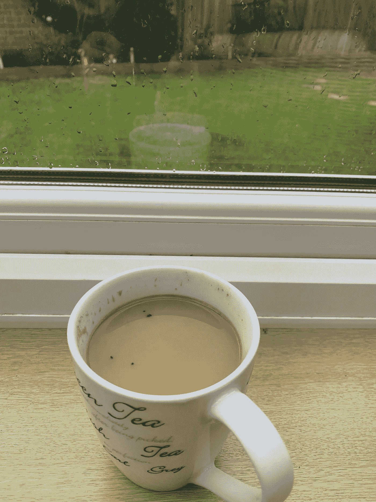

回顾过去两周的经历

# 下一次冲刺

明天早上，卡车会来收集花园垃圾箱，我们可以再次开始下一轮的花园维护和改善。

# 关于作者的更多信息

**Greg** 是一名经验丰富的软件专业人士，也是[**outsource . dev**](https://outsource.dev/)**，**的首席技术官，他曾在多家公司工作过，现在热衷于帮助他人在软件开发、管理和外包方面取得成功。

如果你喜欢这篇文章，请鼓掌👏和**跟着**我。