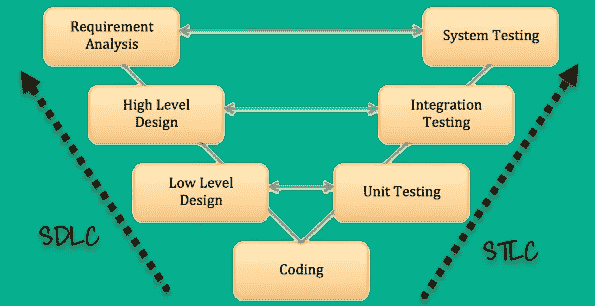

# SDLC 与 STLC

> 原文：<https://blog.devgenius.io/sdlc-vs-stlc-1628f477c3ec?source=collection_archive---------3----------------------->

# 什么 SDLC？

SDLC(软件开发生命周期)定义了软件开发过程中涉及的所有标准阶段。SDLC 生命周期是按以下顺序分阶段开发软件的过程

1.  需求收集
2.  设计软件
3.  构建软件
4.  试验
5.  部署
6.  维护

每个阶段都有明确的进入和退出标准以及可交付成果。

# STLC 是什么？

软件测试生命周期(STLC)是以计划周密的方式执行的测试过程。在 STLC 过程中，进行各种活动来提高产品质量。然而，STLC 阶段只处理测试和检测错误，而不是开发本身。

不同的公司在 STLC 中定义不同的阶段。然而，通用软件测试生命周期有以下几个阶段。

1.  需求分析
2.  测试计划
3.  测试开发
4.  测试环境设置
5.  测试执行和结束

## 关键的区别

*   SDLC 定义了软件开发过程中涉及的所有标准阶段，而 STLC 过程定义了各种提高产品质量的活动。
*   SDLC 是开发生命周期，而 STLC 是测试生命周期。
*   在 SDLC 中，开发团队创建高层次和低层次的设计计划，而在 STLC 中，测试分析师创建系统集成测试计划
*   在 SDLC 中，开发真正的代码，实际工作按照设计文档进行，而在 STLC 中，测试团队准备测试环境并执行测试用例。
*   SDLC 生命周期帮助团队完成软件的成功开发，而 STLC 阶段只包括软件测试。

# 为什么使用 SDLC？

以下是使用 SDLC 方法的一些主要原因:

*   它的目标是生产高质量的软件系统，帮助您满足客户的期望
*   在提供最佳管理控制的每个阶段完成后，创建一个正式的审查。
*   SDLC 帮助您创建大量的系统文档
*   它生产许多中间产品，可以对这些中间产品进行审查，以验证它们是否能够满足用户的需求，是否符合规定的要求。
*   SDLC 帮助您确保系统需求可以追溯到规定的业务需求
*   每个阶段都有具体的可交付成果、进入和退出标准
*   开发阶段一个接一个地进行，对于需求明确的中小型项目来说，这是一个理想的选择

# 为什么是 STLC？

以下是使用 STLC 方法的重要原因:

*   STLC 有助于使测试过程更加复杂、一致和有效
*   您可以包括项目每个步骤的里程碑和可交付成果
*   即使模型扩展到不同的级别，也易于理解和实现
*   时间限制是项目制定中固有的重要因素
*   项目的每个模块都在另一个模块开始之前进行测试
*   具体项目的要求是根据实际结果来衡量的

对于刚刚推出新网站或新应用程序的公司，我们为您提供了优惠。如果您不确定您的网站/移动应用程序是否安全无故障，我们可以为您提供免费的基础设施测试审计。

所以你可以知道你的应用程序是否让你的潜在客户感到沮丧。要申请免费审计，请前往 [StackedQA 网站](https://www.stackedqa.com/)或发送电子邮件至 [StackedQA](http://stackedqa@gmail.com) ，并将您的主题填写为“免费测试审计”

在社交媒体上关注我们:

[脸书](https://www.facebook.com/StackedQA)，[推特](https://twitter.com/stackedqa)， [Instagram](https://instagram.com/stackedqa) ，& [领英](https://www.linkedin.com/company/stackedqa)