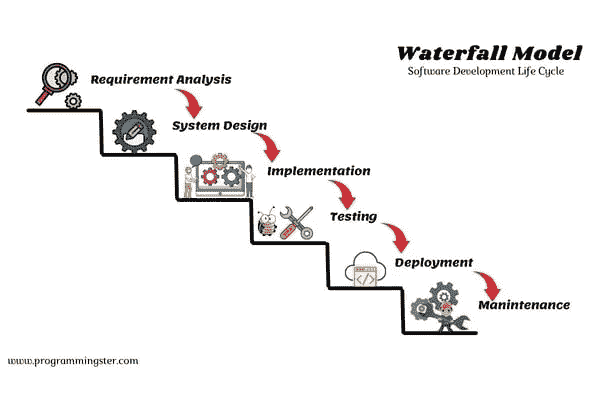

# SDLC 中的瀑布模型是什么？

> 原文：<https://blog.devgenius.io/sdlc-waterfall-model-35482820c6a1?source=collection_archive---------4----------------------->

SDLC —瀑布模型

在本文中，我将讨论瀑布模型，这是软件开发生命周期(SDLC)中遇到的方法之一。这些是我们将要在这里讨论的话题。

## 1.介绍

## 2.瀑布模型的步骤

## 3.何时使用瀑布模型？

## 4.瀑布模型的优势

## 4.瀑布模型的缺点

## 5.结论

# 介绍

这个瀑布模型也是一步一步的流动，很像瀑布里的水。瀑布模型有一个逐步的线性顺序方法，这意味着我们不能在完成前一阶段之前开始开发过程中的新阶段。一旦你完成了一个阶段，你就不能回到上一个阶段。此外，瀑布模型是计划驱动过程的一个例子，这意味着我们需要有一个计划，并在开始开发过程之前为所有活动制定一个时间表。

# 瀑布模型的步骤

该模型由几个阶段组成，每个阶段都有一个负责人负责相应的活动，每个阶段都会产生一个特定的输出，作为下一步的输入。例如，在需求分析阶段的末尾，它为系统设计阶段生成 SRS 文档(系统需求规格)。

*   ***需求分析:***

捕获所有客户的需求是瀑布模型中这一阶段的目标。此外，可行性研究在这一步中完成，以检查需求是否可实现。所有的需求都记录在软件需求说明书中，并提供给设计团队。

*   ***系统设计:***

根据 SRS 文件，设计团队或相关负责人将进行与该阶段相关的设计活动。如架构图设计、UI 设计、数据库结构设计等。在此阶段结束时，设计师将为实施阶段制作设计规格文档(DSD)。

*   ***实现:***

这项工作被分成几个单元，程序员根据设计者提供的文档，用选定的编程语言开发系统。最后，程序员向测试阶段提供源代码，找出系统中的故障，以便在调试过程中排除这些故障。

*   ***测试*** :

执行所有非功能性和功能性测试，以检查是否满足客户的要求。最后，为下一阶段提供测试用例、测试报告和更新的矩阵。

*   ***部署:***

一旦软件没有错误，它就被部署到客户机环境中。

*   ***维修:***

这一步包括根据从客户那里收到的反馈进行修改，并发布具有新功能的新版本。

在需求分析阶段，你需要分析所有客户的需求，然后一个接一个地进行下一步。假设当你在瀑布模型的测试阶段，客户改变了他的需求，那么会发生什么呢？那么你要做的就是，你必须回到需求分析这一步，并做出相关的修改，然后一步一步的回到瀑布模型的底层。然而，不建议在传统的瀑布模型中继续前面的步骤。因为重复所有步骤需要很长时间，有点浪费时间。

# 何时使用瀑布模型

瀑布模型适合于开发小规模的软件，这些软件应该有稳定和清晰的需求。此外，需求不应该不断变化。

# 瀑布模型的优势

*   因为需求变更是不允许的，所以发现 bug 的机会会更少，因此开发人员不需要一次又一次地重新编码。
*   理解和使用起来非常简单。
*   每一个阶段都是从过程的开始就计划好的。
*   因为需求被很好地定义，所以很容易制定时间表、管理资源和定义目标。
*   整个过程有据可查，有据可循。

# 瀑布模型的缺点

*   在这个瀑布模型中，完成一个步骤并进入下一个步骤需要更多的时间，所以向客户交付一个工作产品需要更多的时间。
*   在需求收集阶段之后，没有正式的方法对需求进行修改。(不能后退一步)
*   看用户需求是否要满足，需要很长时间。
*   不能用于复杂项目和需要经常变更需求的项目。
*   复杂项目的高风险和不确定性。

# 结论

结论:瀑布模型是软件开发生命周期最常用的模型之一。这是一种循序渐进的方法，每个阶段都必须成功完成，然后才能进入下一个阶段。然而，它有一些缺点，如缺乏灵活性和无法处理变化，为了克服这些问题，已经引入了几种现代模型。

# 感谢阅读！❤️

给我买杯咖啡