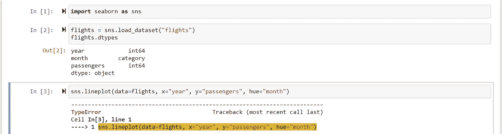
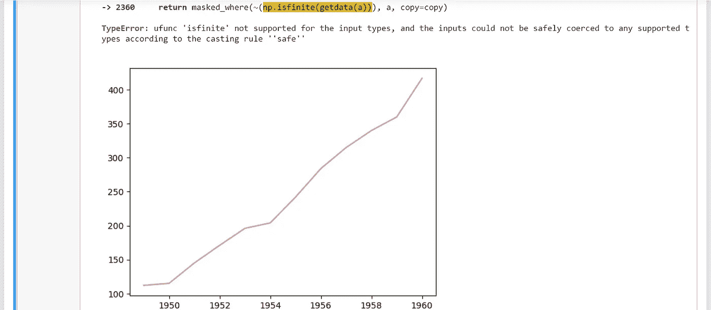
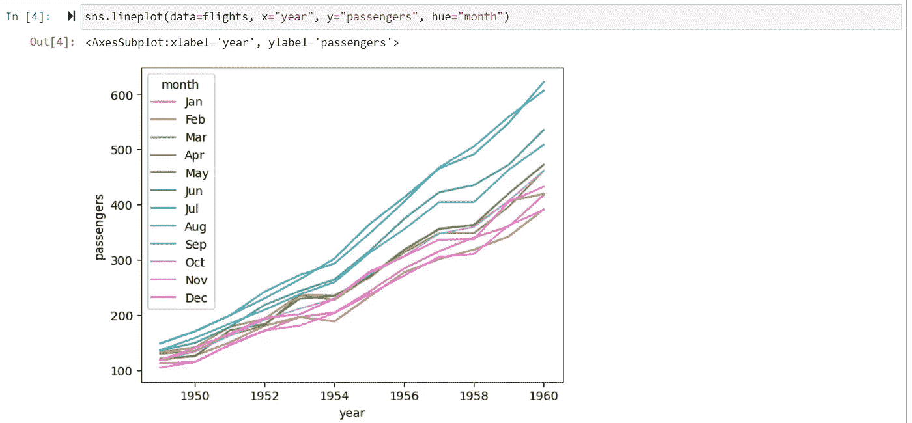

# Seaborn TypeError:输入类型不支持 ufunc“is finite”

> 原文：<https://blog.devgenius.io/seaborn-typeerror-ufunc-isfinite-not-supported-for-the-input-types-dc93270a04a3?source=collection_archive---------1----------------------->


2022 年 12 月 18 日，安大略省皮克林的西顿远足径上，玉米田被积雪覆盖

如果你只是通过尝试一些 [seaborn 情节示例](https://seaborn.pydata.org/generated/seaborn.lineplot.html)而遇到以下错误，你已经有了一个解决方案——这是 numpy 和 seaborn 版本兼容性问题。

```
TypeError: ufunc 'isfinite' not supported for the input types, and the inputs could not be safely coerced to any supported types according to the casting rule ''safe''
```

截图作为例子，它不按月绘制多条线(只有一条线)。相反，它奇怪地抱怨 np.isfinite(getdata(a))。



所以这发生在我用 Anaconda (2022.10)创建的“py38”env 中。被证实**不工作**的版本如下:

```
C:\Users\fengli>conda activate py38

(py38) C:\Users\fengli>pip list | grep numpy
numpy                      1.24.0

(py38) C:\Users\fengli>pip list | grep seaborn
seaborn                    0.12.1
```

解决方案是拥有 numpy 和 seaborn 的以下**工作版本组合**:

```
(py38) C:\Users\fengli>pip list | grep numpy
numpy                         1.21.5

(py38) C:\Users\fengli>pip list | grep seaborn
seaborn                       0.11.2
```

使用 pip install 将 seaborn 版本从 0.12.1 更改为 0.11.2 非常简单:

```
(py38) C:\Users\fengli>**pip install seaborn==0.11.2** Collecting seaborn==0.11.2
  Downloading seaborn-0.11.2-py3-none-any.whl (292 kB)
...
    Found existing installation: seaborn 0.12.1
    Uninstalling seaborn-0.12.1:
      Successfully uninstalled seaborn-0.12.1
Successfully installed scipy-1.9.3 seaborn-0.11.2
```

但是由于我的 numpy 来自 Anaconda 发行版，pip 将无法工作。我必须使用康达安装。

```
(py38) C:\Users\fengli>**conda install numpy=1.21.5**
Retrieving notices: ...working... done
Collecting package metadata (current_repodata.json): done
Solving environment: done
## Package Plan ##

  environment location: C:\Users\6119811\anaconda3\envs\py38

  added / updated specs:
    - numpy=1.21.5

The following packages will be downloaded:

    package                    |            build
    ---------------------------|-----------------
    certifi-2022.12.7          |   py38haa95532_0         148 KB
    mkl-service-2.4.0          |   py38h2bbff1b_0          51 KB
    mkl_fft-1.3.1              |   py38h277e83a_0         139 KB
    mkl_random-1.2.2           |   py38hf11a4ad_0         225 KB
    numpy-1.21.5               |   py38h7a0a035_3          25 KB
    numpy-base-1.21.5          |   py38hca35cd5_3         4.4 MB
    ------------------------------------------------------------
                                           Total:         5.0 MB

The following NEW packages will be INSTALLED:

  blas               pkgs/main/win-64::blas-1.0-mkl
  intel-openmp       pkgs/main/win-64::intel-openmp-2021.4.0-haa95532_3556
  mkl                pkgs/main/win-64::mkl-2021.4.0-haa95532_640
  mkl-service        pkgs/main/win-64::mkl-service-2.4.0-py38h2bbff1b_0
  mkl_fft            pkgs/main/win-64::mkl_fft-1.3.1-py38h277e83a_0
  mkl_random         pkgs/main/win-64::mkl_random-1.2.2-py38hf11a4ad_0
  numpy              pkgs/main/win-64::numpy-1.21.5-py38h7a0a035_3
  numpy-base         pkgs/main/win-64::numpy-base-1.21.5-py38hca35cd5_3

The following packages will be UPDATED:

  certifi                          2022.9.24-py38haa95532_0 --> 2022.12.7-py38haa95532_0

Proceed ([y]/n)? y

Downloading and Extracting Packages

Preparing transaction: done
Verifying transaction: done
Executing transaction: done
```

pip 将导致以下错误:

```
(py38) C:\Users\fengli>pip install numpy==1.21.5
Collecting numpy==1.21.5
  Downloading numpy-1.21.5-cp38-cp38-win_amd64.whl (14.0 MB)
     ---------------------------------------- 14.0/14.0 MB 14.2 MB/s eta 0:00:00
Installing collected packages: numpy
  Attempting uninstall: numpy
    Found existing installation: numpy 1.24.0
    Uninstalling numpy-1.24.0:
      Successfully uninstalled numpy-1.24.0
ERROR: Could not install packages due to an OSError: [WinError 5] Access is denied: 'C:\\Users\\fengli\\anaconda3\\envs\\py38\\Lib\\site-packages\\~umpy\\.libs\\libopenblas64__v0.3.21-gcc_10_3_0.dll'
Consider using the `--user` option or check the permissions.
```

这次你终于可以得到合适的情节了



快乐阅读！

[](https://medium.com/@fengliplatform/membership) [## 通过我的推荐链接-李冯加入媒体

### 写作帮助我们自己，分享帮助很多人。从我自己的学习笔记开始，没有要求完美的压力…

medium.com](https://medium.com/@fengliplatform/membership)