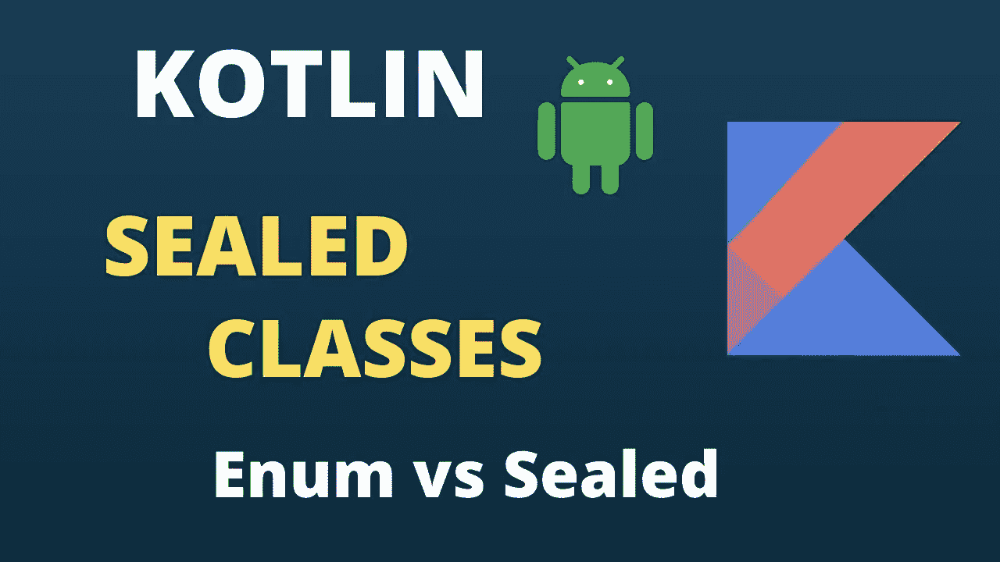

# 密封类与枚举类

> 原文：<https://blog.devgenius.io/sealed-classes-vs-enum-classes-274a0b19cde0?source=collection_archive---------0----------------------->

定义、差异和用例



本文旨在解释以下事项:

*   枚举的定义
*   枚举的需要
*   如何以及何时使用枚举？
*   向枚举添加构造函数参数
*   枚举支持的一些方法
*   枚举的项目特定性质
*   when 块中枚举的用法
*   密封类的定义
*   密封类中支持的构造函数可见性
*   展示密封类优于枚举的用例

# 枚举

当我们必须表示一组不变的可能选项时，一个经典的选择是使用枚举。如果您曾经使用不同的常量来表示一个进程的不同状态，您可能想知道为什么首先使用枚举？我们就不能用不同的字符串常量吗？

## 首先为什么是枚举？

在 StackOverflow 上有一个很好的答案解释了这个概念:【https://stackoverflow.com/a/11575421/5742365】[T2](https://stackoverflow.com/a/11575421/5742365)

上面的回答是这样说的:

假设您使用常量字符串(或`int`值——同样适用于它们):

```
// Constants for player types
public static final String ARCHER = "Archer";
public static final String WARRIOR = "Warrior";// Constants for genders
public static final String MALE = "Male";
public static final String FEMALE = "Female";
```

然后，您最终无法真正了解您的数据类型，从而导致潜在的不正确代码:

```
String playerType = Constants.MALE;
```

如果使用枚举，结果会是:

```
// Compile-time error - incompatible types!
PlayerType playerType = Gender.MALE;
```

同样，枚举给出了一组有限的值:

```
String playerType = "Fred"; // Hang on, that's not one we know about...
```

相对

```
PlayerType playerType = "Fred"; // Nope, that doesn't work. Bang!
```

此外，Java 中的枚举可以有更多的相关信息，也可以有行为。各方面都好多了。

## 如何以及何时使用枚举？

假设我们想要表示一周中的几天，我们可以如下定义一个枚举:

```
enum class Weekday
{
  MONDAY, TUESDAY, WEDNESDAY, THURSDAY, FRIDAY, SATURDAY, SUNDAY
}
```

## 枚举中的构造函数参数

我们还可以向 enum 类添加构造函数参数。假设我们需要一个 enum 类来表示一组颜色。考虑到它们的 RGB 颜色代码，每种颜色可以具有它们自己的红色、绿色和蓝色比率。看看下面的例子:

```
enum class Color(open val red: Int, val green: Int, open val blue: Int) {
    *RED*(255, 0, 0),
    *GREEN*(0, 255, 0),
    *BLUE*(0, 0, 255);
}
```

enum 类中的方法也可以由任何 enum 常量重写。在下面的代码片段中，我们覆盖了红色案例中的 getRed()方法。

```
enum class Color(open val red: Int, val green: Int, open var blue: Int) {
    *RED*(255, 0, 0) {
        override var red  = 200
        override var blue = 55

        val test: String
            get() = "Test"
    },
    *GREEN*(0, 255, 0),
    *BLUE*(0, 0, 255);
}
```

我还在 RED 中添加了一个`test`属性。但是我们无法访问该属性。如果我们尝试这样做，属性将不会被识别。这是因为在枚举情况下，我们只能覆盖类的方法或属性。我们不能定义新的方法或属性并使用它们。

每个枚举用例使用与类构造函数中定义的相同的构造函数参数集。我们不能像普通类一样实例化枚举类。举个例子，

```
val color = Color() 
```

不适用于上述枚举类。我们只能在 enum 类中使用 cases。

## 枚举类支持的一些方法

可以使用上面的枚举类，如下例所示:

```
fun main() {
    val color = Color.*BLUE
    println*(color.name)
    *println*(color.blue)

    *println*()

    *println*(Color.*RED*.red)
    *println*(Color.*RED*.blue)
    *println*(Color.*RED*.green)

    *println*()

    val colors = Color.values()

    for(c in colors)
        *println*("${c.ordinal} : ${c.name}")
}**Output**:
BLUE
255200
55
00 : RED
1 : GREEN
2 : BLUE
```

摆弄上面的例子可以更好地理解枚举。

## 枚举是特定于项目的

枚举可以保存的值总是特定于项的。举个例子，

```
val red = Color.*RED* val red2 = Color.*RED
println*(red == red2) //prints truered2.blue = 25
*println*(red.blue) //prints 25
```

## when 块中枚举的用法

在 kotlin 的`when`中可以使用枚举。`when`既可以做陈述，也可以做表达式。

```
when(color) {
    Color.*RED* -> *println*("The color is red: ${color.red}, ${color.green}, ${color.blue}")
    Color.*GREEN* -> *println*("The color is green: ${color.red}, ${color.green}, ${color.blue}")
}
```

在上面的代码片段中，when 用作语句。所以它忽略了我们错过了颜色的事实。蓝色或其他区块。

```
val answer = when(color) {
    Color.*RED* -> "The color is red: ${color.red}, ${color.green}, ${color.blue}"
    Color.*GREEN* -> "The color is green: ${color.red}, ${color.green}, ${color.blue}"
}
```

在上面的代码片段中，when 用作表达式。这次它显示了一个编译器错误，因为必须给变量`answer`赋值。`when`表达必须面面俱到。所以我们必须添加一个 else 块或者`Color.BLUE`。

```
val answer = when(color) {
    Color.*RED* -> "The color is red: ${color.red}, ${color.green}, ${color.blue}"
    Color.*GREEN* -> "The color is green: ${color.red}, ${color.green}, ${color.blue}"
    Color.*BLUE* -> "The color is blue: ${color.red}, ${color.green}, ${color.blue}"
}
*println*(answer)
```

如果我们涵盖了 when 表达式中枚举类的所有情况，我们就不需要添加 else 块。即使我们添加了，也会被编译器认为是多余的。它还警告我们- `when`是详尽的，所以`else`在这里是多余的。

# 密封类

Kotlin 中的密封类是另一个我们在 Java 中没有的新概念，它打开了另一个可能性的新世界。

一个密封的类允许你**表示受约束的层次结构，其中一个对象只能是一个给定的类型**。

也就是说，我们有一个包含特定数量子类的类。在某种意义上，密封类类似于`[enum](https://kotlinlang.org/docs/enum-classes.html)`类:枚举类型的值集也是受限制的，但是每个枚举常量只作为*单个实例*存在，而密封类的子类可以有*多个*实例，每个实例都有自己的状态。

举个例子，考虑一个库的 API。它可能包含错误类，让库用户处理它可能抛出的错误。如果这种错误类的层次结构包括在公共 API 中可见的接口或抽象类，那么没有什么可以阻止在客户端代码中实现或扩展它们。然而，这个库不知道在它之外声明的错误，所以它不能用自己的类一致地对待它们。使用错误类的密封层次结构，库作者可以确保他们知道所有可能的错误类型，并且以后不会出现其他错误类型。

每个子类可以有自己的构造函数参数集，这在枚举的情况下是不可能的。

这个差异**将允许来自密封类的对象保持状态**。这将给我们带来一些优势，我们将在下面看到。

密封一个类会限制它的类层次结构。当您将一个类标记为`sealed`时，您只能从指定的位置对其进行子类化。密封类的所有直接子类在编译时都是已知的。这允许您限制子类以进行详尽的评估。

```
**sealed** **class** Error  
**sealed** **class** IOError(): Error  // extended only in same package and module
**class** FileReadError(**val** file: File): IOError() 
**class** DatabaseError(**val** source: DataSource): IOError()  
**object** RuntimeError : Error
```

这些限制不适用于间接子类。如果密封类的直接子类没有被标记为密封的，那么它可以以其修饰符允许的任何方式进行扩展:

```
**sealed** **interface** Error // has implementations only in same package and module

**sealed** **class** IOError(): Error // extended only in same package and module
**open** **class** CustomError(): Error // can be extended wherever it's visible
```

## 密封类中构造函数的可见性

密封类的构造函数可以有两种[可见性](https://kotlinlang.org/docs/visibility-modifiers.html) : `protected`(默认)或`private`:

```
**sealed** **class** IOError {     
    **constructor**() { /*...*/ } // protected by default     
    **private** **constructor**(description: String): **this**() { /*...*/ } // private is OK     
    // public constructor(code: Int): this() {} // Error: public and internal are not allowed 
}
```

## 展示密封类优于枚举的用例

密封类的子类可以有不同的构造函数参数集。举个例子，

```
sealed class Response<out R>
class Success<R>(val value: R): Response<R>()
class Failure(val error: Throwable): Response<Nothing>()fun handle(response: Response<String>) {    
    val text = when (response) {        
        is Success -> "Success, data are: " + response.valuei
        is Failure -> "Error"    
    }    
    print(text)
}
```

就像在枚举中的`when`一样，`when`作为一个语句是不详尽的，但是`when`作为一个表达式在密封类中也是详尽的。

密封类也可以有所有的对象声明子类，当以这种方式使用时，它非常类似于枚举:

```
sealed class PaymentOption {    
     object Cash    
     object Card    
     object Transfer
}
```

虽然**我们不这样使用密封类**，因为枚举更适合这种情况。

相对于 enum，密封类的优势在于子类可以保存特定于实例的数据。例如，当我们向应用程序的另一部分通知所选择的支付选项时，我们可以传递所选择的支付类型和特定于支付的数据，这些数据是后续处理所需要的。

```
import java.math.BigDecimal sealed class Paymentdata class CashPayment(val amount: BigDecimal, val pointId: Int): Payment()data class CardPayment(val amount: BigDecimal, val orderId: Int): Payment()data class BankTransfer(val amount: BigDecimal, val orderId: Int): Payment() fun process(payment: Payment) {    
    when (payment) {        
        is CashPayment -> { 
            showPaymentInfo(payment.amount, payment.pointId) 
        }
        is CardPayment -> {            
            moveToCardPaiment(payment.amount, payment.orderId)   
        }        
        is BankTransfer -> {            
            val bankTransferRepo = BankTransferRepo()            
            val transferDetails = bankTransferRepo.getDetails()
            displayTransferInfo(payment.amount, transferDetails)
            bankTransferRepo.setUpPaymentWathcher(payment.orderId,
            payment.amount, transferDetails)        
        }    
    }
}
```

密封类的一个很好的例子是表示各种各样的事件或消息，因为我们既有事件是什么的信息，又有每个事件可以保存数据。

枚举类表示一组具体的值，而密封类表示一组具体的类。由于那些类可以是对象声明，我们可以在一定程度上使用密封类来代替枚举，但不能反过来。

枚举类的优点是它们可以被序列化和反序列化。他们有方法`values()`和`valueOf`。我们还可以使用`enumValues`和`enumValueOf`函数通过类型获取枚举值。枚举有序数，我们可以通过每一项来保存常量数据。它们非常适合表示一组恒定的可能值。

密封类的优点是它们可以保存特定于实例的数据。每个项目可以是一个类，也可以是一个对象(使用对象声明创建)。它们代表一组可选类(和类型、余积)。它们对定义替代项很有用，`Result`要么是`Success`要么是`Failure`，`Tree`要么是`Leaf`要么是`Node`，或者 JSON 值要么是列表、对象、字符串、布尔、int 或 null。它们对于定义一组可能发生的事件或消息也非常有用。

## 参考

这篇博文中的一些例子和解释摘自

[](https://kotlinlang.org/docs/sealed-classes.html#location-of-direct-subclasses) [## 密封类| Kotlin

### 密封的类和接口代表了对继承提供更多控制的受限类层次结构。所有…

kotlinlang.org](https://kotlinlang.org/docs/sealed-classes.html#location-of-direct-subclasses) 

和

[](https://blog.kotlin-academy.com/enum-vs-sealed-class-which-one-to-choose-dc92ce7a4df5) [## 枚举与密封类——选择哪一个？

### TL；DR:枚举有像 valueOf，values 或 enumValues 这样的支持函数，这使得它们更容易迭代或…

blog.kotlin-academy.com](https://blog.kotlin-academy.com/enum-vs-sealed-class-which-one-to-choose-dc92ce7a4df5) 

希望这篇文章能帮助你更好地理解枚举和密封类的不同用例。

# 快乐学习！