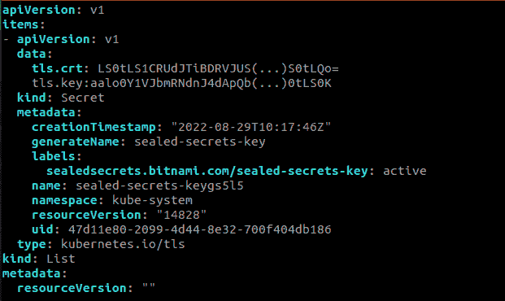
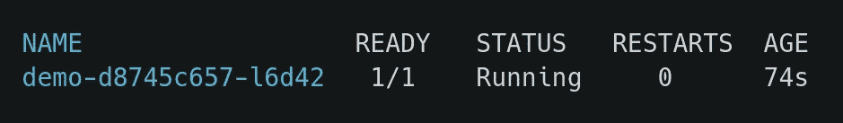

# 库伯内特斯的秘密

> 原文：<https://blog.devgenius.io/sealed-secret-in-kubernetes-d10fed2da964?source=collection_archive---------2----------------------->

# 介绍

在 Kubernetes 中，我们使用秘密在 Kubernetes 集群中存储敏感数据。但是你把它们存放在哪里呢？如果我们想把它们保存在 SCM(源代码管理)工具中，这就成了一个安全威胁。

Kubernetes 中的 Secret 用于存储敏感信息，如密码、ssh 密钥、证书、令牌等。机密以 base64 编码，不加密，当它们附加到 pod 时会自动解码。

这些数据是“唯一”编码的，因此如果用户有权访问您的机密，他可以简单地执行 base64 decode 命令来查看您的敏感数据(ku bectl get secret my-secret-o JSON path = " { . data . password } " | base64--decode)。

因为它没有被加密，所以将它们提交给你的源代码管理(SCM)是不安全的。如果我们要在单片机中存储这些秘密，就会出现安全问题。为了避免所有这些问题，我们可以使用密封机密。

# 密封的秘密

密封机密允许对您的 Kubernetes 机密进行“单向”加密，并且只能由在您的目标集群中运行的密封机密控制器解密。这种机制基于公钥加密，这是一种由公钥和私钥对组成的加密形式。一个密钥可用于加密，只有另一个密钥可用于解密加密的内容。控制器将生成密钥对，将公钥证书发布到日志中，并通过 HTTP API 请求公开它。

这些加密的秘密也可以通过使用 kubectl 等工具，使用普通的工作流部署到 Kubernetes 集群。

# 先决条件:

1.  Kubernetes 集群已经启动并运行。
2.  创建一个名称空间，您可以在其中部署您的机密。对于本教程，我们将使用“ **demo** 名称空间。

# 安装:-

我们假设您已经具备了所有的先决条件，现在可以在 Kubernetes 集群上使用 SealedSecret 了。

安装密封的秘密包含 2 个步骤:-

1.  在本地机器上安装 Kubeseal CLI。
2.  为 SealedSecret 安装自定义控制器。

# 在本地机器上安装 Kubeseal CLI。

我们使用 Kubeseal CLI 工具来生成一个公钥证书，以在一个密封的秘密中加密我们的秘密。Kubeseal 可以通过 Kubernetes API 服务器与控制器通信，并在运行时检索加密秘密所需的公钥。公钥也可以从控制器下载并保存在本地以供离线使用。

可以按照下面提到的步骤将客户端工具安装到/usr/local/bin 中

首先，我们需要通过运行以下命令下载 kubeseal tar 文件:

```
wget [https://github.com/bitnami-labs/sealed-secrets/releases/download/v0.18.0/kubeseal-0.18.0-linux-amd64.tar.gz](https://github.com/bitnami-labs/sealed-secrets/releases/download/v0.18.0/kubeseal-0.18.0-linux-amd64.tar.gz)
```

下载 tar 文件后，使用下面提到的命令提取该 tar 文件:

```
tar -xfz kubeseal-0.18.0-linux-amd64.tar.gz
```

现在我们可以在/usr/local/bin/kubeseal 位置安装 kubeseal，使用下面提到的命令:

```
sudo install -m 755 kubeseal /usr/local/bin/kubeseal
```

要检查 kubeseal 是否已安装，请运行以下命令:

```
kubeseal --version
```

# 为 SealedSecret 安装自定义控制器和 CRD

现在，我们将在 kube-system 名称空间中安装控制器和 SealedSecret 自定义资源定义。sealed secrets 控制器将在集群中启用 Sealed Secrets 的生命周期操作。

要部署 sealed-secret 控制器，请遵循以下步骤

首先，我们需要下载控制器，使用下面提到的命令下载控制器清单。

```
wget [https://github.com/bitnami-labs/sealed-secrets/releases/download/v0.18.0/controller.yaml](https://github.com/bitnami-labs/sealed-secrets/releases/download/v0.18.0/controller.yaml)
```

下载控制器后，使用下面提到的命令将其部署在 Kubernetes 集群上

```
kubectl apply -f controller.yaml
```

您可以使用以下命令检查部署的状态

```
kubectl get pods -n kube-system | grep sealed-secrets-controller
```

您可以通过运行以下命令来查看包含 YAML 格式的公钥/私钥对的秘密内容:-

```
kubectl get secret -n kube-system -l sealedsecrets.bitnami.com/sealed-secrets-key -o yaml
```

**输出:-**



现在您的控制器已经部署好了。

# 保守秘密

让我们创建一个名为 secret.yaml 的秘密文件。您可以使用下面提到的示例，也可以创建自己的 secret.yaml 文件。

```
apiVersion: v1
kind: Secret
metadata:
  creationTimestamp: null
  name: my-secret
  namespace: demo
data:
  user: YWRtaW4=
  password: TXlTZWNyZXREZW1vRmlsZQ==
```

有两种方法来创建密封的秘密:-

*   没有证书文件(在线)。
*   使用证书文件(脱机)。

1.  **在线(无证书文件)。**

现在，让我们使用这个 secret.yaml 文件通过 kubeseal 创建 SealedSecret YAML 清单。

在执行以下命令之前，请确保您能够访问目标 Kubernetes 集群，并且能够对目标 Kubernetes 集群运行 kubectl 命令。

```
kubeseal --format=yaml < secret.yaml > sealed-secret.yaml
```

成功运行该命令后，您将获得一个名为 sealed-secret.yaml 的文件

**2。脱机(使用证书文件)。**

另一种方法是从控制器获取公钥，并离线使用它来密封您的秘密。

只需要访问 Kubernetes 集群来获取 pem 文件。完成后，您可以使用该 pem 文件为目标集群密封您的秘密，防止任何安装了 kubeseal 的机器访问。

此命令将获取证书文件，并以 public-key-cert.pem 的名称将其保存在您的本地计算机中

```
kubeseal --fetch-cert > public-key-cert.pem
```

现在可以使用这个命令创建 sealed-secret.yaml

```
kubeseal --cert=public-key-cert.pem --format=yaml < secret.yaml > sealed-secret.yaml
```

该命令还将创建一个 sealed-secret.yaml 文件。

您可以检查这两个文件(secret.yaml 和 sealed-secret.yaml)

*   **Secret.yaml 文件**

```
cat secret.yaml
```

**输出** : -

```
apiVersion: v1
kind: Secret
metadata:
  creationTimestamp: null
  name: my-secret
  namespace: demo
data:
  user: YWRtaW4=
  password: TXlTZWNyZXREZW1vRmlsZQ==apiVersion: v1
kind: Secret
metadata:
  creationTimestamp: null
  name: my-secret
  namespace: demo
data:
  user: YWRtaW4=
  password: TXlTZWNyZXREZW1vRmlsZQ==
```

*   **sealed-secret.yaml**

```
cat sealed-secret.yaml
```

**输出:-**

```
apiVersion: bitnami.com/v1alpha1
kind: SealedSecret
metadata:
  creationTimestamp: null
  name: my-secret
  namespace: demo
spec:
  encryptedData:
    password: AgB/XlNUiGvhKT25K(…)bOtCIIDAid
    user: AgAI9gJiQt0NHULDqdWw4(…)SSlw==
 template:
   data: null
   metadata:
     creationTimestamp: null
     name: my-secret
     namespace: demo
```

注意，原始秘密中的密钥，即用户和密码，在 SealedSecret 中没有加密，只有它们的值被加密。

现在我们可以在我们的 Kubernetes 集群中部署密封的秘密。

```
kubectl apply -f sealed-secret.yaml
```

如果您检查在 kube-system 名称空间中运行的密封控制器的日志，您将看到刚刚部署的 SealedSecret 定制资源。

kubectl logs-n kube-system sealed-secrets-controller-7 bdbc 75d 47–5 wxvf

**输出:**

```
2022/08/30 07:54:49 Updating demo/my-secret
2022/08/30 07:54:49 Event(v1.ObjectReference{Kind:”SealedSecret”, Namespace:”demo”, Name:”my-secret”, UID:”330bcf2a-9433–4696–8784-a00190758b86", APIVersion:”bitnami.com/v1alpha1", ResourceVersion:”221612", FieldPath:””}): type: ‘Normal’ reason: ‘Unsealed’ SealedSecret unsealed successfully
```

# 测试

我们将部署一个应用程序，在这个部署中，我们将把新创建的秘密作为 **ENV** 变量传递。然后，我们将检查我们是否能够从吊舱内部访问这些秘密。

对于测试，您可以部署自己的应用程序，也可以使用下面提到的清单进行测试。

```
---
apiVersion: apps/v1
kind: Deployment
metadata:
  name: demo
  namespace: demo
spec:
  replicas: 1
  selector:
    matchLabels:
      app: demo
  template:
    metadata:
      labels:
        app: demo
    spec:
      containers:
      - name: demo
        image: sagar27/testing:latest
        ports:
        - containerPort: 80
        env:
        - name: KUBE_USER
          valueFrom:
            secretKeyRef:
              name: my-secret
              key: user
        - name: KUBE_PASS
          valueFrom:
            secretKeyRef:
              name: my-secret
              key: password
```

正如你在上面的清单中看到的，我们已经创建了两个变量**KUBE _ 用户**和**KUBE _ 通行证**，我们将使用这个 env 变量映射秘密存储的值。用名称 **deploy.yaml** 保存这个文件。

使用命令部署这个清单，

```
Kubectl apply -f deploy.yaml
```

等待几分钟，然后运行下面提到的命令。

```
kubectl get po -n demo
```

你会得到这样的输出。



通过使用下面提到的命令，复制 pod 名称并获取这个 pod 的 shell。

```
kubectl exec -it demo-d8745c657-l6d42 bash -n demo
```

现在，您可以通过运行下面提到的命令来检查变量的值。

```
root@demo-d8745c657-l6d42:/# echo $KUBE_USER
admin
root@demo-d8745c657-l6d42:/# echo $KUBE_PASS
MySecretDemoFile
```

属于 SealedSecret 的 yaml 文件 sealed-secret.yaml 可以安全地与属于其他 Kubernetes 资源(如 DaemonSets、Deployments、ConfigMaps 等)的 YAML 清单一起存储在 Git 存储库中。部署在集群中。