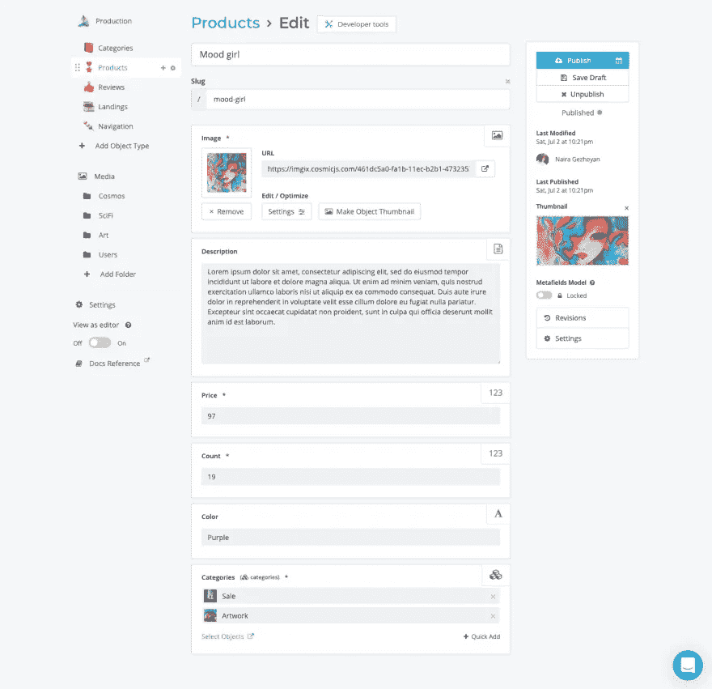

# 使用 React 钩子和一个无头 CMS 搜索和过滤数据

> 原文：<https://blog.devgenius.io/search-and-filter-data-using-react-hooks-and-a-headless-cms-806ce55de729?source=collection_archive---------12----------------------->

搜索和过滤数据是网站和应用程序的常见功能，尤其是电子商务。在本文中，我们将讨论如何使用 React 为产品构建搜索和过滤功能。产品数据将从一个[无头 CMS](https://www.cosmicjs.com/headless-cms) ( [宇宙](https://www.cosmicjs.com/))中查询，UI 即时更新。我们还将讨论去抖动技术如何使用钩子和 API 使用优化来处理状态管理。

# 安装模板演示内容

从这个例子开始，安装 [uNFT Marketplace](https://www.cosmicjs.com/apps/unft-marketplace) 模板，其中包括我们将用于搜索和过滤功能的演示内容。或者您可以跳过这一步，直接按照代码进行操作。

1.  登录你的[宇宙账号](https://app.cosmicjs.com/login)。
2.  转到 [uNFT 市场](https://www.cosmicjs.com/apps/unft-marketplace)并点击“选择模板”。
3.  按照步骤创建一个新的项目和 Bucket，并导入演示内容。
4.  查看现在安装在您的铲斗中的演示内容。
5.  转到 Products 并注意包含我们将用于 React 搜索/过滤特性的数据的元字段。

# 创建搜索/过滤反应应用程序

为了让事情变得更简单，我们已经在 [StackBlitz](https://stackblitz.com/edit/react-search-filter-cms?file=src%2FApp.js) 上构建了一个具有搜索/过滤功能的小应用。

使用 Cosmic API，我们可以根据搜索标准过滤产品结果。现在让我们看看它是如何工作的。

# 创建搜索/过滤查询

为了在我们的特性中过滤产品，我们需要向 Cosmic API 发送一个请求，以便只获取符合搜索标准的产品。我们将使用[宇宙查询](https://docs.cosmicjs.com/api-reference/queries)来做到这一点。

为了创建查询，我们创建一个对象`query`，其属性与我们正在搜索的对象元数据值相匹配，如`color`、`price`和`categories`。

下面是一个带有注释的示例，解释了每个查询属性的作用。

在我们建立我们的查询之后，我们使用`getObjects`方法将查询发送到[宇宙 NPM 模块](https://www.npmjs.com/package/cosmicjs)。我们使用`props`将响应限制为我们需要的属性。这里有一个实现的例子。

现在让我们深入了解 React 如何使用钩子处理 UI 状态更新的细节。

# 反应钩

React 使用单向数据流，将数据从父组件传递到子组件，钩子允许功能组件访问状态。对于输入字段的每次搜索和过滤更新，我们使用状态钩子`useState`向 React 应用程序添加状态。

为了在网页上显示过滤后的数据，我们映射到`filterResult`
数组，并显示适当的产品列表。

# 使用反作用自定义挂钩反作用

当用户在输入框中输入一些内容时，`search`变量的状态将会更新。为了改善搜索和过滤体验，我们将创建一个 [React 自定义钩子](https://www.w3schools.com/react/react_customhooks.asp) `useDebounce`。

此挂钩支持去抖，可清除任何快速变化的值。当在指定时间段内没有调用`useDebounce`挂钩时，去抖动值将仅反映最新值。当与`useEffect`结合使用时，您可以确保不会过于频繁地执行像 API 调用这样的昂贵操作。

下面的例子允许您搜索 Cosmic API，并使用`useDebounce`来防止 API 调用在每次击键时被触发。我们的目标只是让 API 在用户停止输入的时候调用，所以我们不会很快使用 Cosmic API。

# 结论

搜索和过滤是许多网站和应用程序的常见功能，但构建起来可能会很有挑战性。但是通过使用正确的工具和技术，最终用户可以更容易、更愉快地构建这个特性。

在本文中，我们向您展示了如何使用 Cosmic 查询、React 钩子和反跳来创建出色的搜索和过滤体验。本文中解释的例子都是 [uNFT Marketplace 应用程序模板](https://www.cosmicjs.com/articles/build-a-digital-art-marketplace-with-nextjs-cosmic-and-stripe)的一部分。你可以在这里观看完整的演示[，在你的宇宙仪表盘中安装](https://unft-marketplace-cosmicjs.vercel.app/)[应用模板](https://www.cosmicjs.com/apps/unft-marketplace)，或者克隆 [GitHub 库](https://github.com/cosmicjs/unft-marketplace)。要了解更多关于宇宙查询的信息，请访问[宇宙文档](https://docs.cosmicjs.com/api-reference/queries)。

如果你有任何关于宇宙整合和特性的问题，你可以在 [Twitter](https://twitter.com/cosmicjs) 、 [Slack](https://cosmicslack.herokuapp.com/) 上联系他们，或者关注 [YouTube 频道](https://www.youtube.com/cosmicjs)。