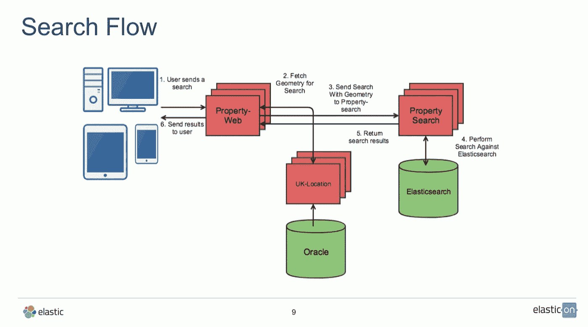

# 搜索引擎超级英雄

> 原文：<https://blog.devgenius.io/search-engine-super-hero-177da8bee?source=collection_archive---------27----------------------->

搜索引擎

嘿，读者们，希望你们都过得好！

如果你正在做一个数据库中有大量数据的项目，这篇文章值得一读。我们将讨论如何使用大量数据(这里的大量意味着真正的大量)来制作一个有用的搜索引擎。

在这里，我将分享我的弹性搜索经验，以及如何设置和使用它。

> **那么我们将从什么开始:**

E 弹性搜索可以被定义为数据中心，它以这样一种方式存储数据，即总是很容易从其中搜索和获取数据。这是通过索引和其他一些我们将在本帖中讨论的概念来完成的。

Elasticsearch 是位于弹性堆栈核心的分布式搜索和分析引擎。Logstash(服务器端数据处理管道)和 Beats(单一目的数据传输者开放平台)有助于收集、聚合和丰富您的数据，并将其存储在 Elasticsearch 中。Kibana 使您能够以交互方式探索、可视化和共享对数据的见解，并管理和监控堆栈。Elasticsearch 是索引、搜索和分析奇迹发生的地方。

Elasticsearch 为所有类型的数据提供近乎实时的搜索和分析。无论您有结构化还是非结构化的文本、数字数据或地理空间数据，Elasticsearch 都能以支持快速搜索的方式高效地存储和索引这些数据。您可以超越简单的数据检索和聚合信息，发现数据中的趋势和模式。随着您的数据和查询量的增长，Elasticsearch 的分布式特性使您的部署能够随之无缝增长。

虽然不是每个问题都是搜索问题，但 Elasticsearch 提供了在各种用例中处理数据的速度和灵活性:

*   将搜索框添加到应用程序或网站
*   存储和分析日志、指标和安全事件数据
*   使用机器学习实时自动模拟数据的行为
*   使用 Elasticsearch 作为存储引擎实现业务工作流程自动化
*   使用 Elasticsearch 作为地理信息系统(GIS)来管理、集成和分析空间信息
*   使用 Elasticsearch 作为生物信息学研究工具存储和处理遗传数据

人们使用搜索的新奇方式不断让我们感到惊讶。但是，无论您的用例是否与这些相似，或者您正在使用 Elasticsearch 解决一个新问题，您在 Elasticsearch 中处理数据、文档和索引的方式都是相同的。

使用弹性搜索的应用程序的搜索流程

我们将讨论弹性搜索的一些关键要素，以便了解弹性搜索是如何工作的:

> **节点**:

节点可以被定义为一个工作者。任何时候启动一个 Elasticsearch 实例，都是在启动一个节点。连接的节点的集合称为集群。如果您运行的是 Elasticsearch 的单个节点，那么您有一个包含一个节点的集群。

默认情况下，群集中的每个节点都可以处理 HTTP 和传输流量。传输层专门用于节点之间的通信；HTTP 层由 REST 客户端使用。

所有节点都知道群集中的所有其他节点，并且可以将客户端请求转发到适当的节点。

默认情况下，节点属于以下所有类型:

*   符合主要条件
*   数据
*   吸收
*   机器学习
*   转变。

**提示**:随着集群的增长，特别是如果您有大型机器学习作业或连续转换，请考虑将专用的符合主机条件的节点与专用的数据节点、机器学习节点和转换节点分开。

> **指数**:

用 *简单的话来说，指数可以定义为在一个或多个字段基础上对数据进行分组。*

例如:如果你在国家字段上索引你的用户数据，那么来自同一个国家的所有用户将被保存在一起。当我们在国家过滤器上搜索用户时，搜索机制直接命中该国家索引，因此搜索速度很快。

弹性搜索中索引的定义有两个概念。首先，索引是某种类型的数据组织机制，允许用户以某种方式划分数据。第二个概念与副本和碎片有关，这是 Elasticsearch 用来在集群中分发数据的机制。

最简单、最熟悉的布局复制了您对关系数据库的期望。你可以(非常粗略地)把索引想象成一个数据库。

一个 Elasticsearch 集群可以包含多个索引(数据库)，而索引又包含多个类型(表)。这些类型包含多个文档(行)，每个文档都有属性(列)。

> **映射:**

M 应用是定义文档及其包含的字段如何存储和索引的过程。例如，使用映射来定义:

*   哪些字符串字段应被视为全文字段。
*   哪些字段包含数字、日期或地理位置。
*   日期值的格式。
*   控制动态添加字段映射的自定义规则。

映射定义具有:

*   元字段:元字段用于定制如何处理文档的相关元数据。元字段的例子包括文档的 _ 索引、_id 和 _source 字段。
*   字段或属性:映射包含与文档相关的字段或属性的列表。

# 这都是理论上的，现在系好安全带，开始真人表演

**安装和设置:**

你可以在你的硬件上运行 Elasticsearch，或者在 Elastic Cloud 上使用我们托管的 Elasticsearch 服务。自动气象站和 GCP 都提供 Elasticsearch 服务。

我将解释在本地硬件上安装弹性搜索。我是 ubuntu 的人，所以我将解释把它安装到你的 ubuntu 硬件上的简单快捷的方法。

*   wget[https://artifacts . elastic . co/downloads/elastic search/elastic search-7 . 8 . 0-Linux-x86 _ 64 . tar . gz](https://artifacts.elastic.co/downloads/elasticsearch/elasticsearch-7.8.0-linux-x86_64.tar.gz)
*   wget[https://artifacts . elastic . co/downloads/elastic search/elastic search-7 . 8 . 0-Linux-x86 _ 64 . tar . gz . sha 512](https://artifacts.elastic.co/downloads/elasticsearch/elasticsearch-7.8.0-linux-x86_64.tar.gz.sha512)
*   shasum-a 512-c elastic search-7 . 8 . 0-Linux-x86 _ 64 . tar . gz . sha 512
*   tar-xzf elastic search-7 . 8 . 0-Linux-x86 _ 64 . tar . gz
*   cd 弹性搜索-7.8.0

**运行它的时间:**

*   。/bin/elasticsearch

**测试连接:**

*   在本地浏览器上点击 http://localhost:9200/

您将得到一个包含弹性搜索引擎实例细节的响应。

**如果您想将 ES 作为守护进程运行:**

*   。/bin/elasticsearch -d

**杀死它**

知道进程 id:

*   ps -aux | grep -n "弹性"

关闭 pid:

*   kill -9 pid

**获取集群运行状况:**

http://localhost:9200/_ cluster/health？等待状态=黄色&超时= 5 秒

**配置弹性搜索:**

转到 elasticsearch-7.8.0/中的配置文件夹

您会发现三个配置文件:

*   elasticsearch.yml 用于配置 elasticsearch
*   jvm .配置 Elasticsearch JVM 设置的选项
*   log4j2 .用于配置弹性搜索日志记录的属性

**启用自动创建系统索引:**

一些商业功能会在 Elasticsearch 中自动创建指数。默认情况下，Elasticsearch 被配置为允许自动创建索引，不需要额外的步骤。但是，如果在 Elasticsearch 中禁用了自动索引创建，则必须在 elasticsearch.yml 中配置 action.auto_create_index，以允许商业功能创建以下索引:action.auto_create_index:

*   action.auto_create_index:。监控*，。手表。已触发 _ 手表，。观察者-历史*，。ml*

现在我们可以玩它了

**获取节点列表:**

*   [http://localhost:9200/_ nodes](http://localhost:9200/_nodes)

**节点的详细信息:**

*   [http://localhost:9200/_ nodes/nodeid](http://localhost:9200/_nodes/nodeid)

现在我们将创建一个索引“user”来存储一些用户数据:

放[http://localhost:9200/index name](http://localhost:9200/indexname)

例如:[http://localhost:9200/user](http://localhost:9200/user)

身体

**删除一个索引:**删除[http://localhost:9200/index name](http://localhost:9200/indexname)

*   [http://localhost:9200/user](http://localhost:9200/user)

**列出所有指标:**

*   [http://localhost:9200/_ cat/indexes](http://localhost:9200/_cat/indices)

**指数详情**

*   [http://localhost:9200/_ cat/indexes/index name](http://localhost:9200/_cat/indices/indexname)

要在索引中添加数据，我们应该在索引中添加映射:

在索引中添加类型映射:PUT / <index>/_mapping</index>

例如:放置/用户/_ 映射

绘图

**将值放入指数:**

放[http://localhost:9200/index/_ doc/uuid](http://localhost:9200/index/_doc/uuid)

例如:

*   [http://localhost:9200/user/_ doc/1](http://localhost:9200/user/_doc/1)

数据体

*   [http://localhost:9200/user/_ doc/2](http://localhost:9200/user/_doc/2)

另一个数据体

**获取索引中的所有单据:**

*   [http://localhost:9200/user/_ search](http://localhost:9200/user/_search)

> *现在是测试弹性搜索超级能力的时候了*

**获取匹配单据:**

*   [http://localhost:9200/user/_ search？q=name:kamran](http://localhost:9200/user/_search?q=name:kamran)

***现在，入门就好，你可以做比我展示的多 50 倍的事情，添加数据，玩搜索功能，感受搜索的力量，一切都好！！***