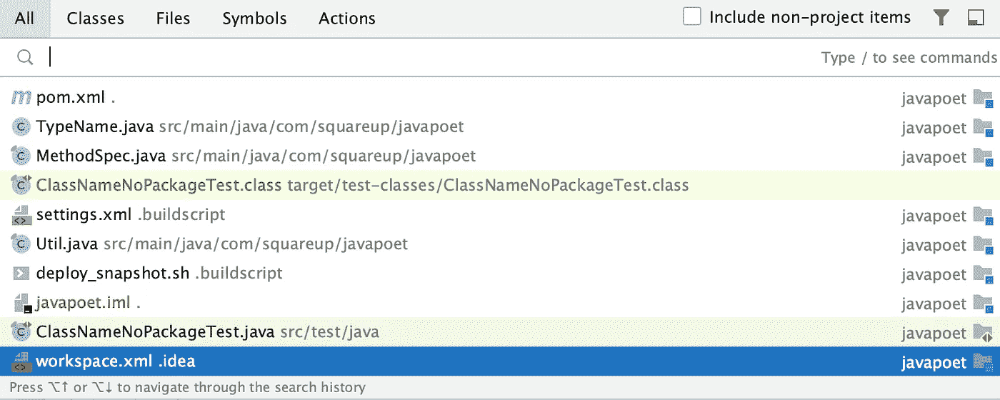
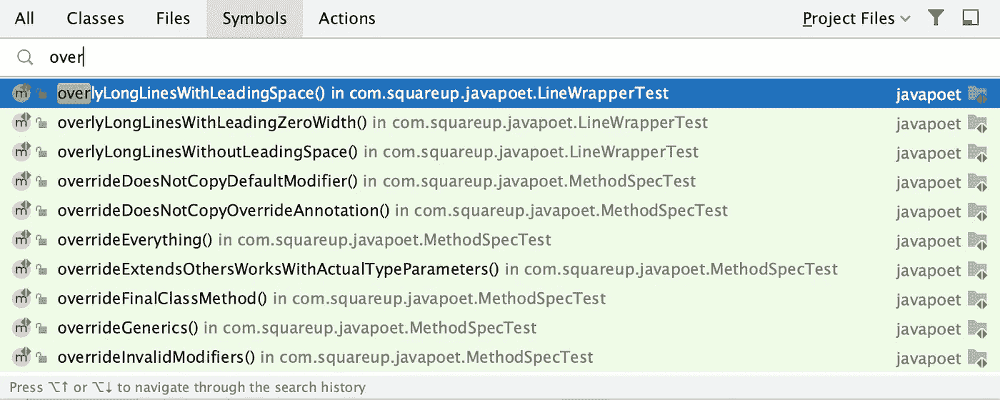

# 在 IntelliJ IDEA 中通过按两次空格键搜索任何地方和任何东西

> 原文：<https://blog.devgenius.io/search-everywhere-and-everything-by-pressing-space-twice-in-intellij-idea-2491540f59bf?source=collection_archive---------20----------------------->

由[诺勒·奥托](https://www.pexels.com/@noellegracephotos/)在[像素](https://www.pexels.com/photo/close-up-photography-of-magnifying-glass-906055/)上拍摄的原始照片。Tremaine Eto 的插图。

这一招可以在编程过程中为你节省数百个小时。

当然，这听起来像你最喜欢的网站上的侵入性广告的文字，但老实说，至少对我来说，这是真的。

在编程时限制鼠标的使用对于长期的生产力增长是非常关键的，这将使你在每次想用 IntelliJ IDEA 做一些高级的事情时不用在几个窗口中导航。

这个技巧可以让你有一个非常容易记住的快捷方式，在 IntelliJ IDEA 中到处搜索，包括所有快捷方式，所有文件，所有动作，所有…一切！

换句话说，对于 IntelliJ IDEA 中的所有可能性，它就像一个**控件+ F** 或一个**命令+ F** 。真的非常好。

你所要做的就是按两次键盘上的 **Shift** 按钮。也就是说，按一次，放开，然后再连续按一次。然后会弹出**到处搜索**窗口！

礼遇 IntelliJ。

你最近接触过的文件会首先显示出来，你可以在这些文件中进行搜索，也可以在“全部”标签中搜索所有内容。

你也可以直接进入“类”标签来搜索类，进入“文件”标签来搜索文件。“文件”是我一直使用的；假设我在找`home.css`；我只需按下 **Shift + Shift** ，然后简单地输入`home.css`，然后点击文件，在 IntelliJ IDEA 中打开它。老实说，这是我一天多次使用的操作，没有失败过。

相同的搜索功能适用于“符号”和“动作”。

礼遇 IntellIJ。

特别是“动作”,你不必真的记住特定的快捷键——只需知道你想做的事情的名字，然后搜索它。

例如，如果我不想记住重新格式化文件的快捷键，我可以按下 **Shift + Shift** ，然后搜索“重新格式化文件”，然后在那里找到我想做的事情。

IntelliJ 在他们关于这个功能的[博客文章](https://blog.jetbrains.com/idea/2020/05/when-the-shift-hits-the-fan-search-everywhere/)中做了最好的总结:“**到处搜索**可以节省你很多时间，提高你的生产力，并帮助你学习新的快捷方式。你只需要按两次**换挡**

如果你觉得这篇文章很有帮助或者只是喜欢阅读它，考虑一下[注册成为一个媒体会员](https://tremaineeto.medium.com/membership)。每月 5 美元，你可以无限制地阅读媒体上关于软件、技术等主题的报道。如果你用我的链接注册，我会得到一小笔佣金。

 [## 通过我的推荐链接加入 Medium—Tremaine Eto

### 作为一个媒体会员，你的会员费的一部分会给你阅读的作家，你可以完全接触到每一个故事…

tremaineeto.medium.com](https://tremaineeto.medium.com/membership)