# 像专业人士一样搜索谷歌

> 原文：<https://blog.devgenius.io/search-google-like-a-pro-8488ad81a225?source=collection_archive---------6----------------------->

有了这 11 个简单的提示和技巧


[凯摄](https://unsplash.com/@kai_wenzel?utm_source=medium&utm_medium=referral)在 [Unsplash](https://unsplash.com?utm_source=medium&utm_medium=referral)

谷歌上每秒钟都有大量数据被上传和更新。谷歌包含了大量的数据。如果你搜索咖啡，将会有超过一百万个结果包含一些与咖啡相关的信息。因此，在这么多数据中，如果我们想要搜索某些东西，有时会花费很多时间。有一些简单的技巧可以让我们的谷歌搜索速度提高 10 倍。

# 使用网站搜索

站点:它允许你在谷歌上搜索一个特定的站点。你也可以用这个来检查你的网站是否在谷歌搜索上。

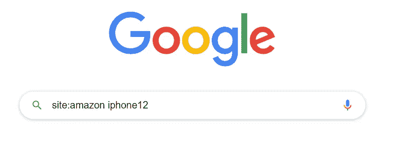

**结果:**

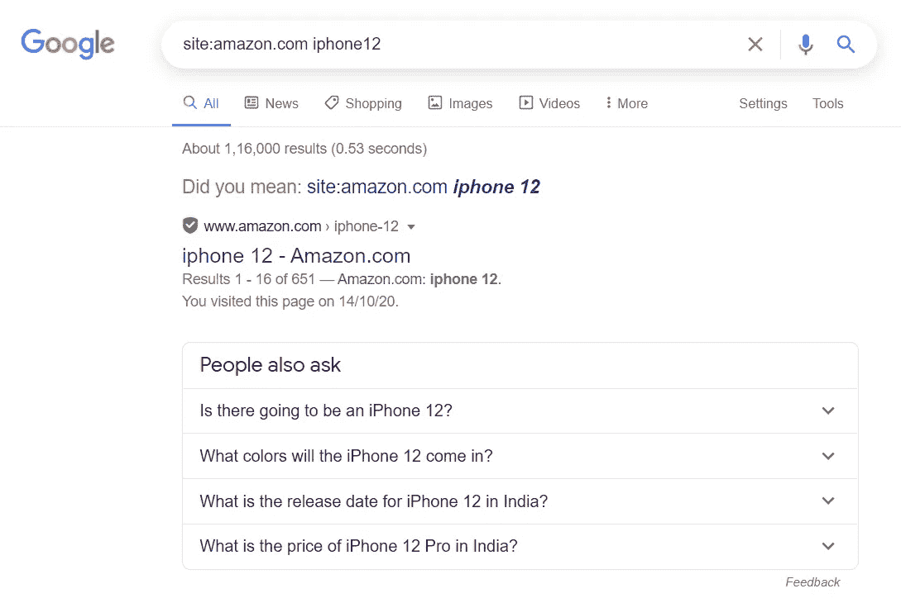

# 缺少单词或短语

你可以用*(星号)来填充遗漏的单词和短语。当你试图搜索一首歌，但不记得歌词时，这是非常有用的。

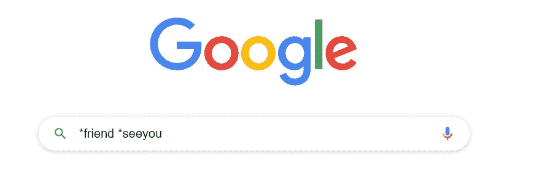

**结果:**


# 使用报价搜索

你也可以使用引号从谷歌获取内容，如下图所示。

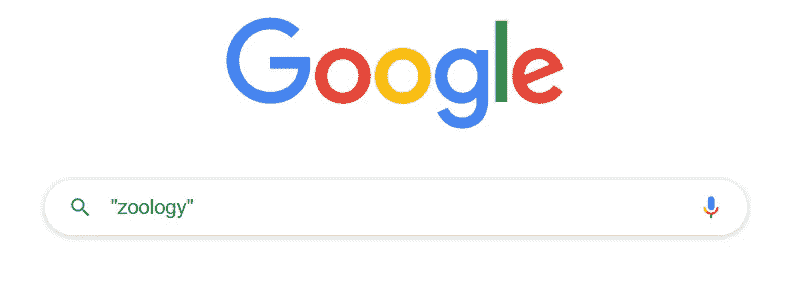

**结果:**

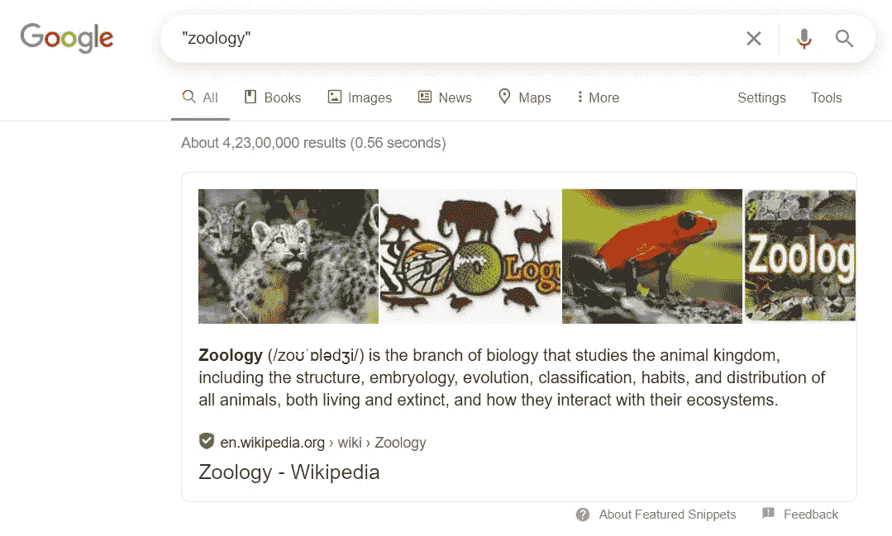

# 排除一个单词

使用“-”从搜索中排除单词和短语。结果将显示所有没有这个词的网站和链接。

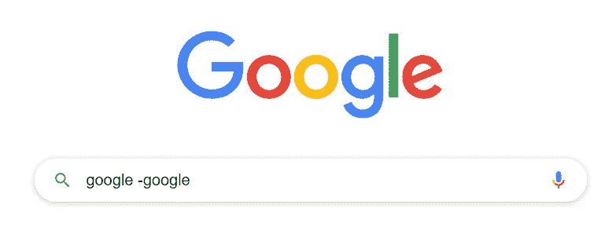

**结果:**

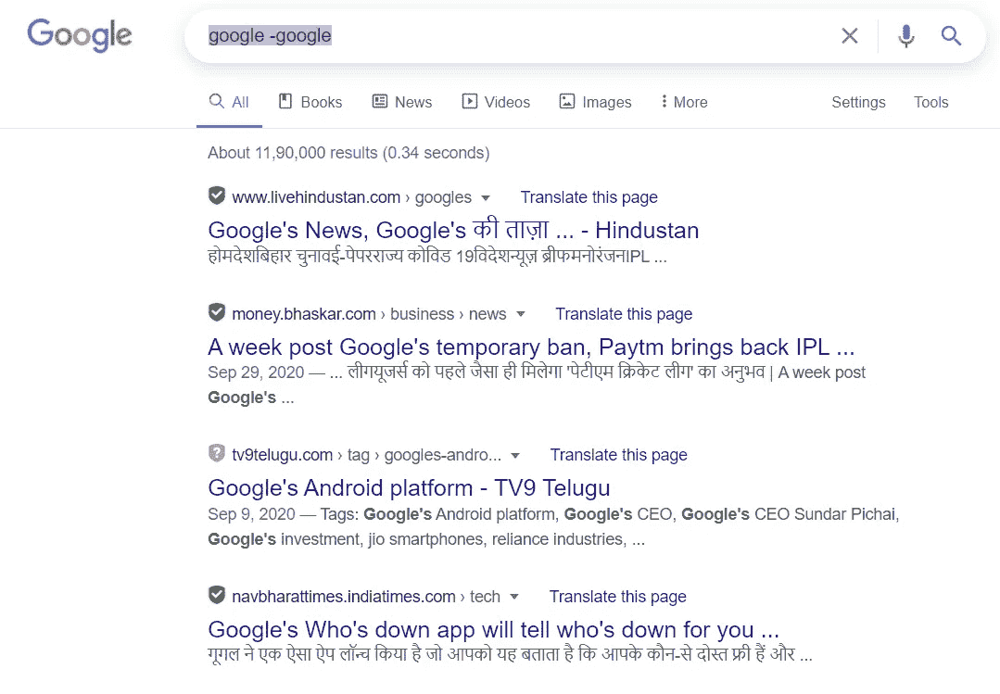

# 相关词语

使用`~`我们可以搜索相关的单词。例子`~tea`。

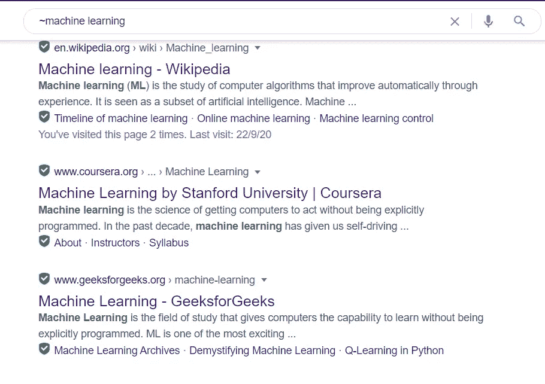

# 范围

使用范围获取特定时间的结果。

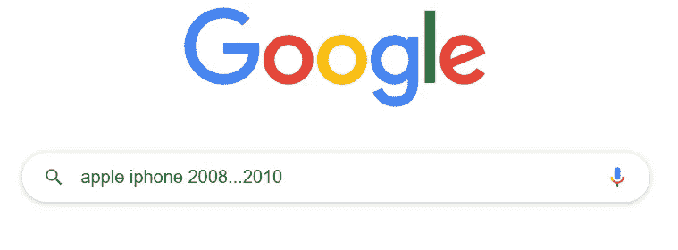

**结果:**

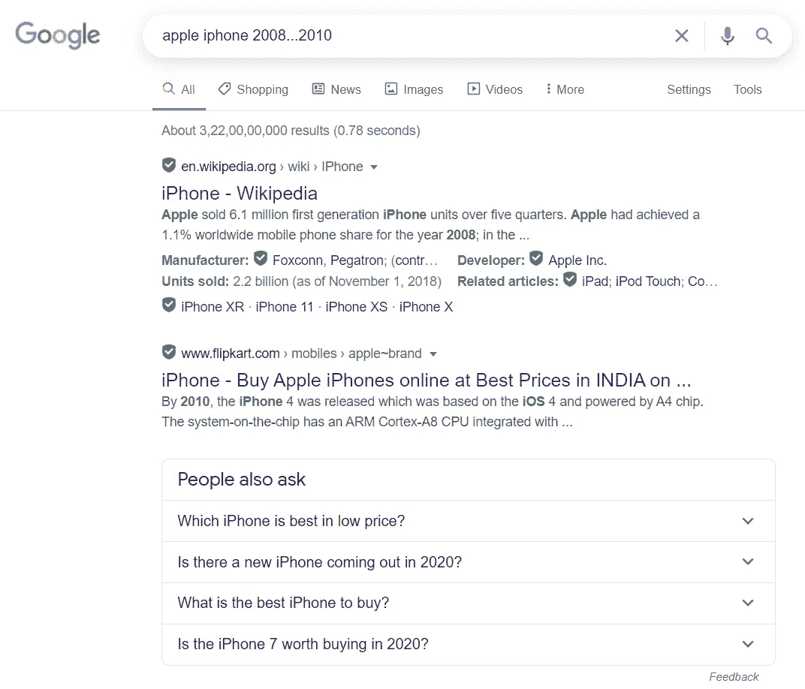

# 单词定义

我们真的不需要在谷歌上做研究，我们可以简单地用`define:word`找到任何单词的意思。示例`define:happy`

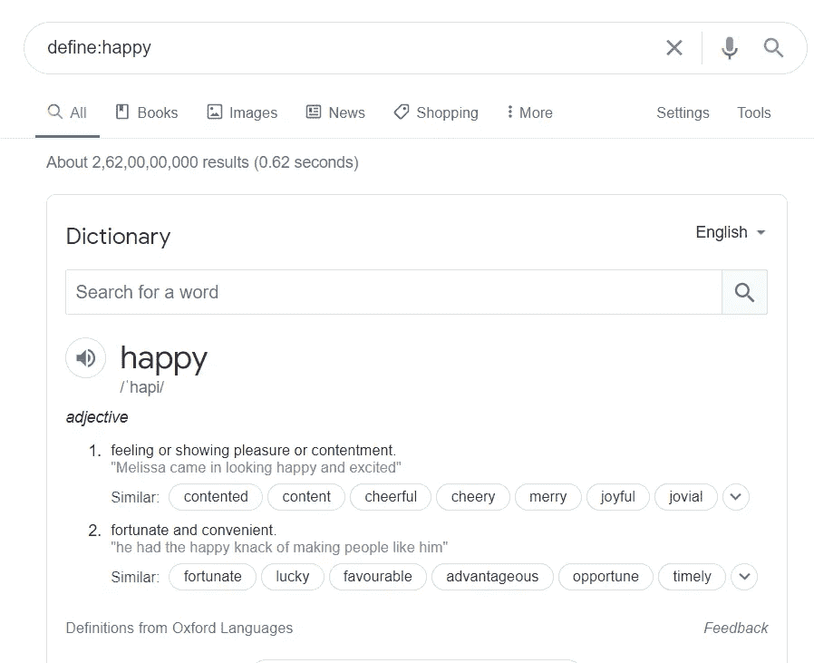

# 搜索多个短语

使用“或”在谷歌上执行多短语搜索

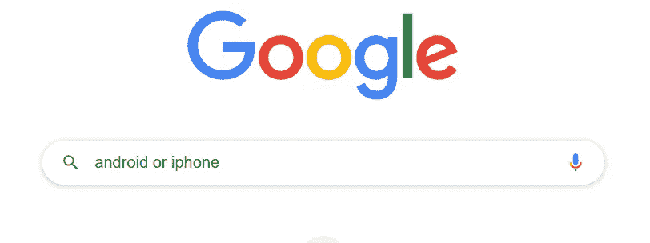

# 计算器

有了谷歌，谁还需要外部计算器呢？只要输入你的方程式，谷歌就会回答。

示例:

```
(5*6)/(3+6/3)
```

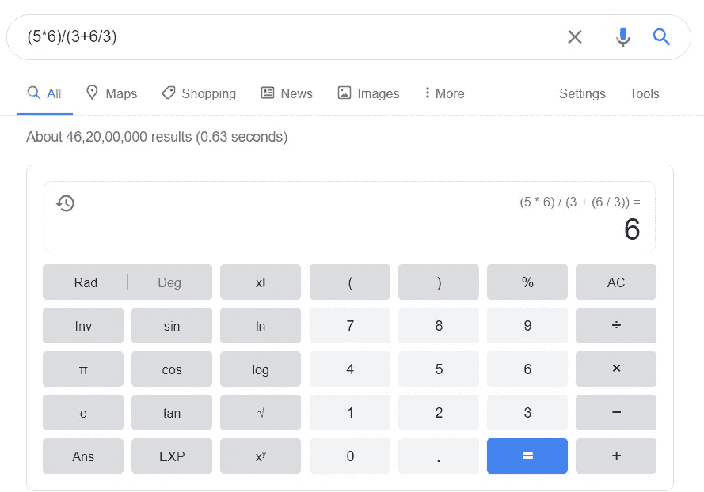

# 单位转换

谷歌不仅仅局限于简单的计算，它还可以为我们转换单位。我们试着转换一个简单的。

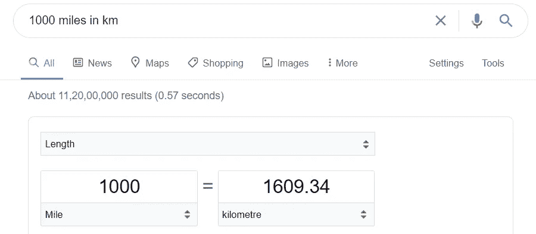

# 文件类型运算符

该操作符允许您搜索特定文件类型的文件。这是非常有用的，当你在寻找 pdf 文件。

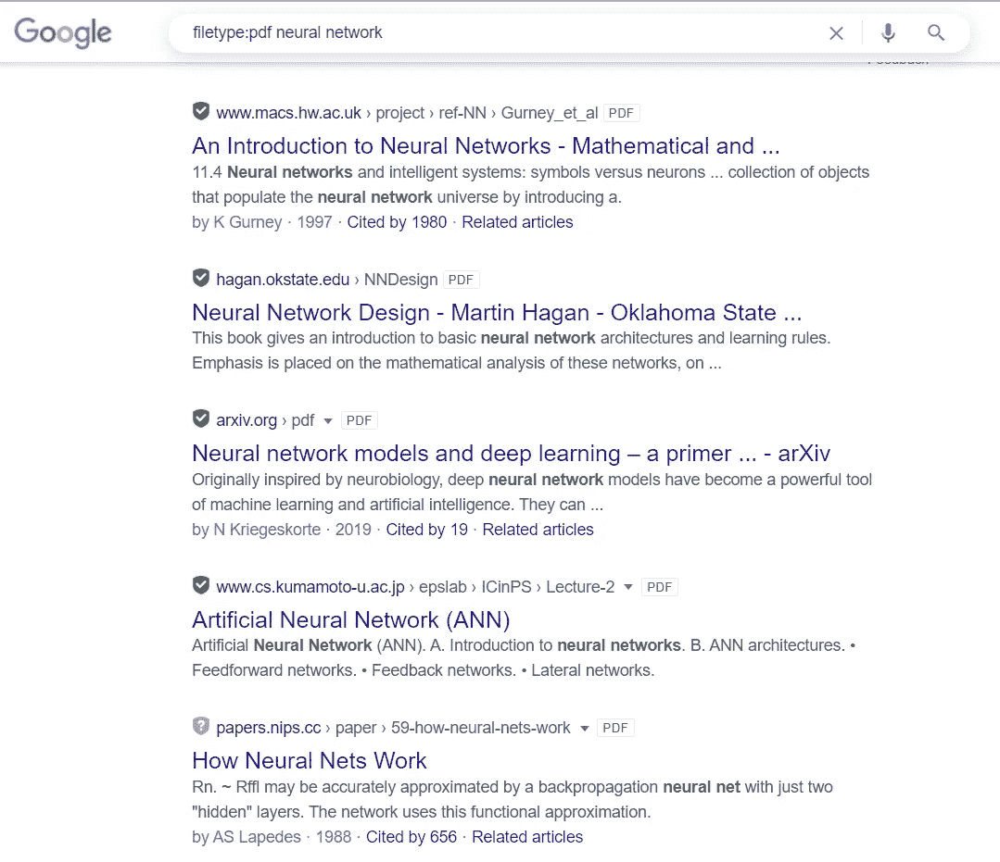

这些都是我知道的招数。如果你知道一些其他的技巧，请在评论区告诉读者。