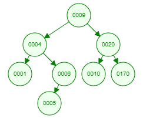
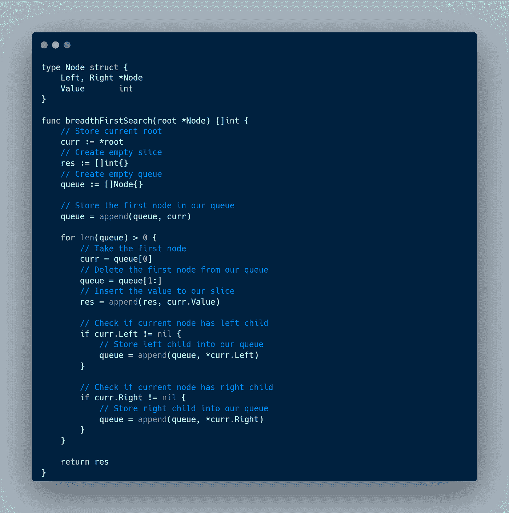
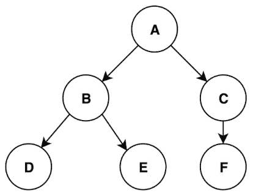
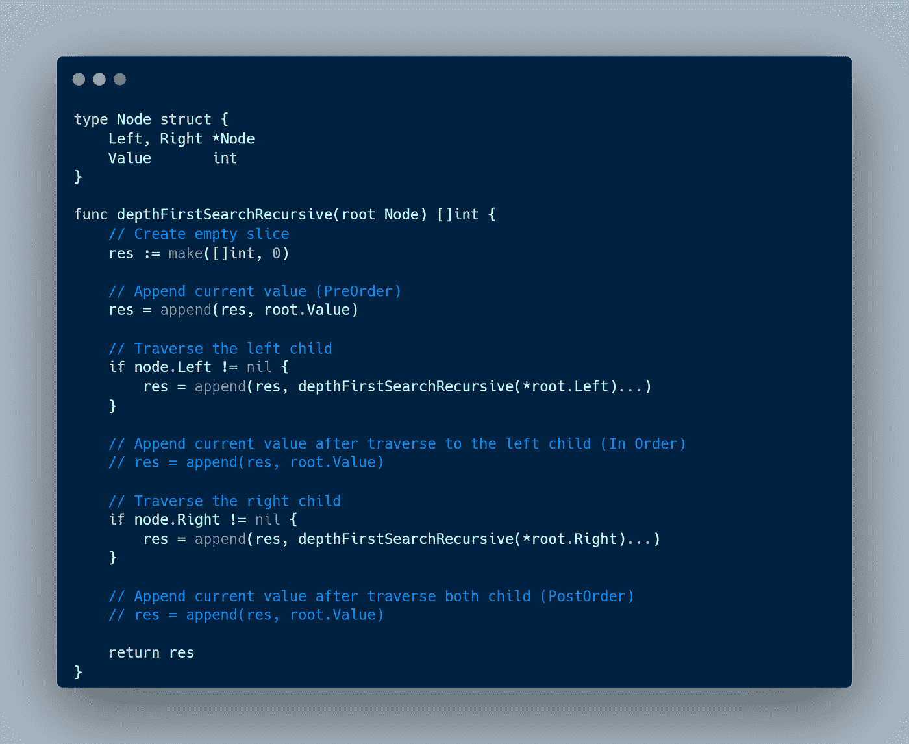
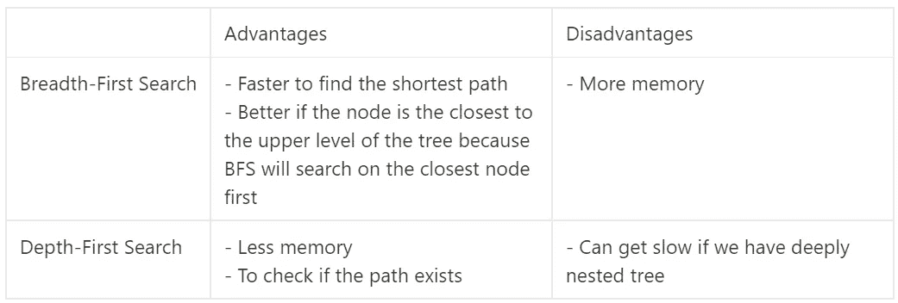

# 二叉查找树中的搜索算法:广度优先搜索(BFS)与深度优先搜索(DFS)

> 原文：<https://blog.devgenius.io/searching-algorithm-in-a-binary-search-tree-breadth-first-search-bfs-vs-depth-first-search-dfs-6ea18bf92bee?source=collection_archive---------13----------------------->

在本文中，我将讨论二叉查找树中的搜索算法，它们的区别，以及如何在二叉查找树中实现它们。让我们开始吧！

# 广度优先搜索

广度优先搜索(BFS)是一种从左到右遍历每层树的算法。BFS 用于查找最短路径，最著名的研究案例是使用谷歌地图查找到达目的地的最快路线。如果我们要找的节点接近上层，BFS 真的很快。缺点是 BFS 需要更多的内存，因为我们必须存储每一层的每个节点。

## 履行

现在，我将使用 Go 编程语言和下面的树来实现 BFS。

为了使用 BFS，我将使用一个队列来存储我们在每个节点中找到的孩子。逻辑是，我们希望存储队列中每个节点的每个孩子。由此，我们得到队列中的第一个节点来检查子节点。重复这个过程，直到我们的队列中没有节点。

如果我们在代码中实现它，上面的树的输出是

# 深度优先搜索

深度优先搜索是一种算法，它沿着树的一个分支向下搜索尽可能多的层，直到找到目标节点或到达终点。这需要较低的内存需求，因为我们不必将节点存储在数组中。当我们想要检查两个节点之间的路径是否存在时，使用该算法。DFS 的缺点是它会变得很慢，尤其是当我们有一个嵌套很深的树时。

## 履行

现在，我将使用 Go 编程语言和下面的树来实现 DFS。

有三种类型的 DFS:

*   按顺序:[1，4，5，6，9，10，20，170](一切正常)
*   预订:[9，4，1，6，5，20，10，170](当我们想要重新创建我们的树时很好)
*   后序:[1，6，4，5，10，170，20，9]

DFS 用于递归遍历每个节点。根据我们使用的 DFS 的类型(下面的情况是一个预排序)，我们想要调用相同的函数并传递子函数。下面的代码可能有点难以理解，但是当你把它和上面的动画结合起来，你就会很容易理解了。

如果我们在代码中实现它，上面的树的输出是。

# 结论

广度优先搜索和深度优先搜索是作为软件工程师需要学习的一个重要主题，因为我们通常会在实际项目或技术面试中遇到它们。两种算法各有优缺点，但都具有 O(n)时间复杂度。

