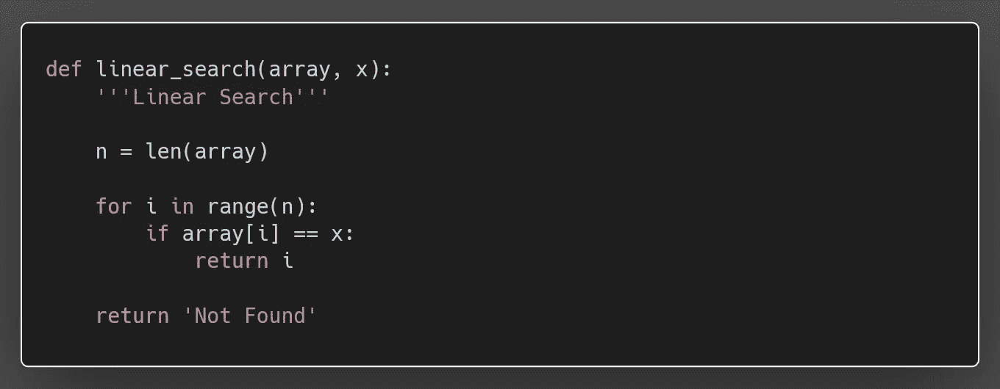
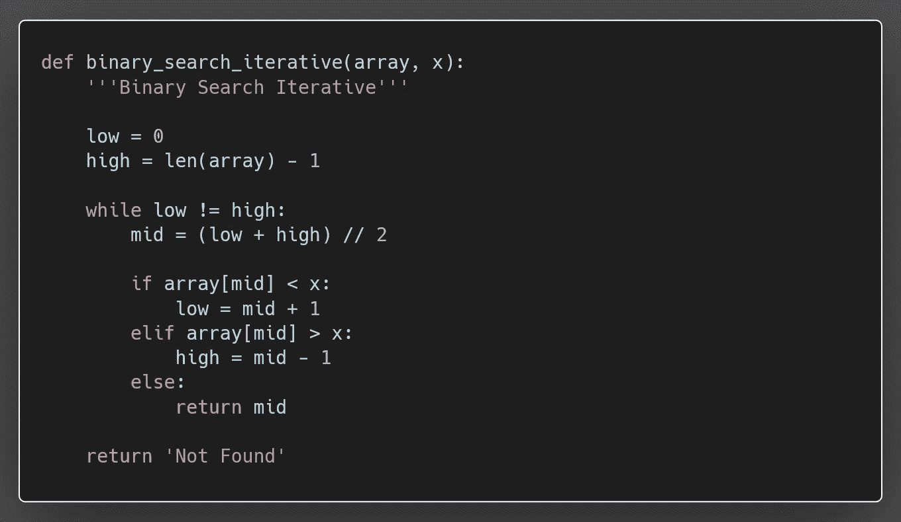
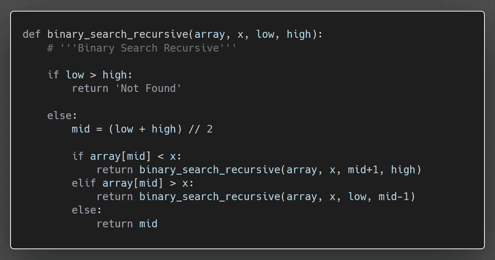

# Python 中的搜索算法

> 原文：<https://blog.devgenius.io/searching-algorithms-in-python-9f7f13680411?source=collection_archive---------13----------------------->

搜索算法用于从数据集中搜索或查找一个或多个元素。这些类型的算法用于从特定的数据结构中查找元素。


马文·迈耶在 [Unsplash](https://unsplash.com/s/photos/digital?utm_source=unsplash&utm_medium=referral&utm_content=creditCopyText) 上的照片

搜索可以是连续的，也可以不是连续的。如果数据集中的数据是随机的，那么我们需要使用顺序搜索。否则，我们可以使用其他不同的技术来降低复杂性。

搜索算法被设计为检查元素或从存储元素的任何数据结构中检索元素。基于搜索操作的类型，这些算法通常分为两类:

1.  **顺序搜索**:顺序遍历列表或数组，检查每个元素。比如:**线性搜索**。
2.  **区间搜索**:这些算法是专门为在有序数据结构中搜索而设计的。这些类型的搜索算法比线性搜索更有效，因为它们重复地以搜索结构的中心为目标，并将搜索空间分成两半。比如:**二分搜索法**。

# 线性搜索

线性搜索技术是最简单的技术。在这种技术中，逐个搜索项目。这个过程也适用于未排序的数据集。线性搜索也称为顺序搜索。它被称为线性的，因为它的时间复杂度是 n ^ O(n)量级。

```
**ALGORITHM**
Linear Search (Array A, Value x, Length n)START
Step 1: Set i to 0
Step 2: if i > n, then go to step 7
Step 3: if A[i] = x, then go to step 6
Step 4: Set i to i + 1
Step 5: Go to Step 2
Step 6: Return index (i)
Step 7: Print 'Not Found'
STOP
```



线性搜索

## 线性搜索技术的复杂性

*   时间复杂度:O(n)
*   空间复杂度:O(1)

# 二进位检索

当列表排序后，我们可以使用二分搜索法技术来查找列表中的项目。在此过程中，整个列表分为两个子列表。如果在中间位置找到该项，则返回位置，否则跳转到左侧或右侧子列表，并再次执行相同的过程，直到找到该项或超出范围。二分搜索法有两种类型:

## 1.迭代法

```
**ALGORITHM** Binary Search (Array A, Value x, Length n, low, high)Begin
   while (low != end)
   then 
      mid = low + (high - low) // 2
      if array[mid] = x then
         return mid (location)
      if array[mid] < x then
         low = mid + 1
      else when array[mid] < x then
         high = mid - 1
   else
      return 'Not Found'
End
```



二分搜索法(迭代法)

## 2.递归方法

```
**ALGORITHM** Binary Search (Array A, Value x, Length n, low, high)Begin
   if low > high then
      return 'Not Found'
   else
      mid = low + (high - low) // 2
      if array[mid] < key then
         call binary_search(array, low, mid-1, key)
      if array[mid] > key then
         call binary_search(array, mid+1, high, key)
      else when array[mid] < key then
         return mid (location)
End
```



二分搜索法(递归方法)

## 二分搜索法技术的复杂性

*   时间复杂度:O(log2 n)
*   空间复杂度:O(1)

# 结论

线性搜索算法适用于较小的列表(< 100)，因为它检查每个元素以获得所需的数字。假设有 10，000 个元素列表，并且期望的元素在最后一个位置是可用的，这将通过与列表的每个元素进行比较来消耗很多时间。

二分搜索法算法是在列表中搜索元素的最有效和快速的方法。它跳过了不必要的比较。顾名思义，搜索分为两部分。它集中在列表的一侧，接近我们正在搜索的号码。