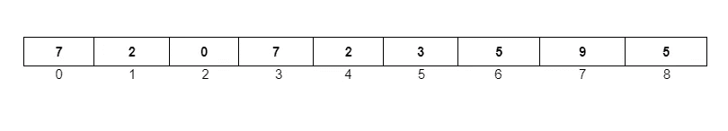

# Python 中的搜索算法。#Python 系列- 9

> 原文：<https://blog.devgenius.io/searching-algorithms-in-python-python-series-9-c58fbfe27cfd?source=collection_archive---------14----------------------->


搜索图像

到目前为止，我们已经学习了 python 的基础知识。但是，我们从未见过这些基本原理的应用。在这篇文章中，我们将看到两个简单的算法，处理搜索一个列表中的数字。如果你是一个初学者和算法新手，开始使用算法可能是相当棘手的，这篇文章为你减轻负担。让我们开始吧。


说到搜索算法，在编码界有两种算法是相当著名的(即线性搜索和二分搜索法)。

# 线性搜索

根据维基百科，线性搜索的定义是“**线性搜索**或**顺序搜索**是一种在列表中查找元素的方法。它会按顺序检查列表中的每个元素，直到找到匹配项或搜索完整个列表。

简而言之，从列表(Index-0)开始，一个一个地搜索，直到找到要搜索的元素。例如，我需要在列表中找到 3[7，2，0，7，2，3，5，9，5]



列表-1

我们从索引 0 开始，

3 是否存在于索引-0 中→否，

3 是否存在于索引-1 中→否，

3 是否存在于索引-2 中→否，

3 是否存在于索引-3 中→否，

3 是否存在于索引-4 中→否，

3 是否出现在索引-5 中→ **是。**停止返回索引号即 5

在最坏的情况下，您需要查找的号码可能不在列表中。当您到达列表的末尾时，只需返回-1。

让我们用 python 代码做同样的尝试。

```
def binary_searching(my_list, element):
    i = 0
    while i < len(my_list):
        if my_list[i] == element:
            return i
        i = i + 1
    else:
        return -1

if __name__ == "__main__":
    my_list = [7, 2, 0, 7, 2, 3, 5, 9, 5]
    element = 3
    idx = binary_searching(my_list, element)
    print(idx)
```

线性搜索的时间复杂度为 **O(n)** ，因为在最坏的情况下，它遍历整个列表。

同样的空间复杂度是 O(1) ，因为它不占用输入列表之外的任何空间。

# 二进位检索

与线性搜索相比，二分搜索法效率高且速度快，但主要缺点是为了执行二分搜索法，我们需要对列表进行排序。

二分搜索法在双指针方法中工作，我们需要两个指针在列表的两个极端索引上，比如说**开始**和**结束**。

基于开始和结束，我们找到 mid =(开始+结束)/ 2。现在，我们将 mid 索引值与要查找的元素进行比较。

**案例-1:** 如果 mid index 中的值等于 element，那么我们只返回 mid Index。

**情况-2:** 如果 mid 索引中的值大于元素，则调整 **end = mid - 1** 的值。原因是如果中间索引中的值大于元素，那么从中间索引到结尾索引的所有值都大于我们要搜索的元素。所以，我们可以忽略这些指数。

**情况-3:** 如果 mid Index 中的值小于 element，那么我们需要调整 **start = mid + 1** 的值。原因是显而易见的。如果中间指数的值较小，则中间指数以下的所有值也较小。

我们将继续这样，直到开始值小于结束值。如果它们相互交叉，那么我们就退出循环，然后说我们要搜索的元素没有通过返回-1 找到。

**二分搜索法的 Python 代码**

```
def binary_searching(my_list, element):
    start = 0
    end = len(my_list) - 1
    while start <= end:
        mid = (start + end) // 2  # Integer Division
        if my_list[mid] < element:
            start = mid + 1
        elif my_list[mid] > element:
            end = mid - 1
        else:
            return mid  # my_list[mid] == element
    else:
        return -1

if __name__ == "__main__":
    my_list = [1, 4, 6, 8, 9, 10, 14, 17, 18]
    element = 19
    ans = binary_searching(my_list, element)
    print(ans)
```

二分搜索法的时间复杂度是 **O(logn)** 对于列表中的 100 个元素，我们在循环中只迭代 6-8 个元素。这些时间复杂度有数学推导，我们将在以后的文章中介绍。

空间复杂度是 O(1)，除了变量，我们没有创建任何数据结构。

分类算法后会有期…