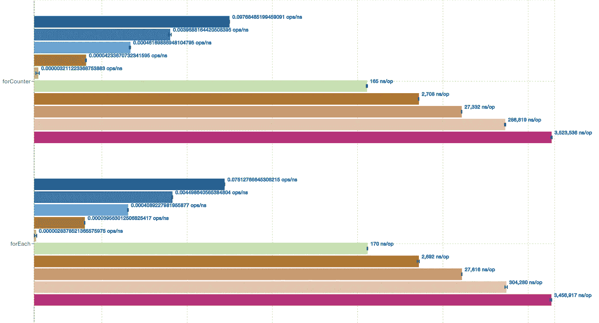
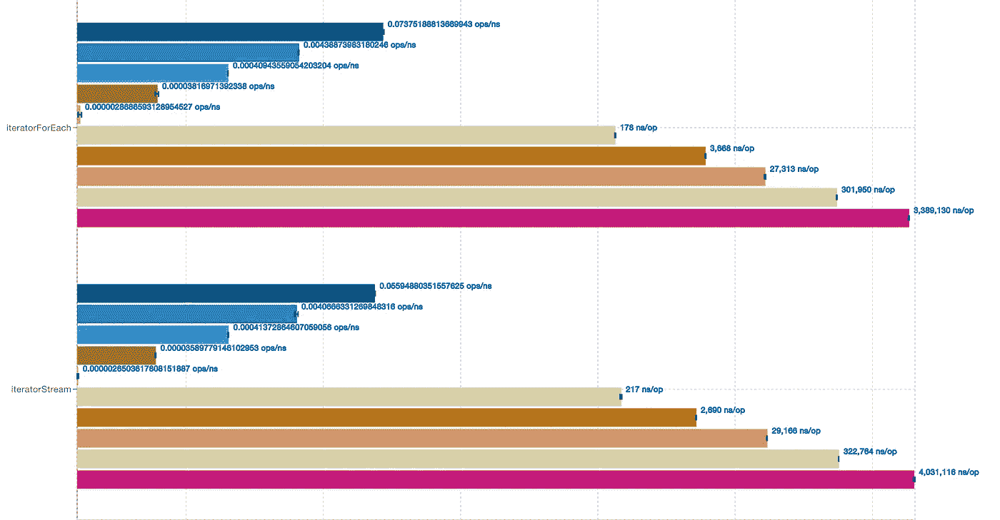
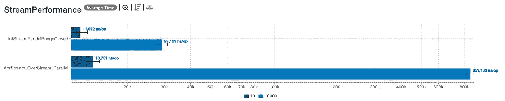
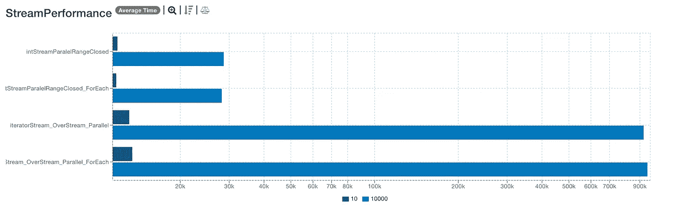
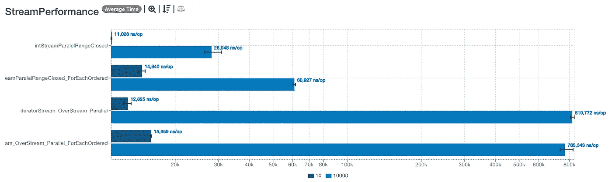
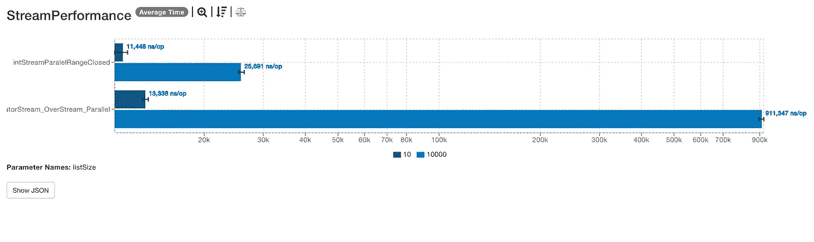

# 经验丰富的 Java 开发人员应该知道这 5 种提高并行流执行的实践

> 原文：<https://blog.devgenius.io/seasoned-java-developers-should-know-these-5-practices-to-improve-parallel-stream-execution-602cc50c9aca?source=collection_archive---------7----------------------->

## 并行流比串行流慢的 5 个原因

照片由[马体·米罗什尼琴科](https://www.pexels.com/@tima-miroshnichenko?utm_content=attributionCopyText&utm_medium=referral&utm_source=pexels)从[佩克斯](https://www.pexels.com/photo/woman-in-black-blazer-holding-white-tablet-computer-7567605/?utm_content=attributionCopyText&utm_medium=referral&utm_source=pexels)拍摄

***Java 开发者在没有更深知识的情况下，使用流和并行流。***

优秀的 Java 开发人员明白喷洒`parallel`不会提高执行效率。有时串行执行比并行执行更快。即便如此，大多数人还是忽视了这个事实。并且不考虑需要什么来获得更好的结果。

*让我们看看流与并行流的 5 种做法及其对性能的影响。*

# 1.`forEach`是否比其他可迭代选项执行得更快？

执行时间取决于 for 循环中完成的操作。尽管如此，我们可以看到，对于更多的元素，循环策略确实很重要。

我们将比较以下循环:

*   `forCounter`——带计数器的普通老式循环
*   `forEach` -以无序的方式改进
*   `iterableForEach` - `forEach`在 iterable 上，在这个例子中，它是一个数组列表
*   `iteratorStream` - `forEach`在流上完成

这些基准测试的代码来自[这就是答案](https://stackoverflow.com/a/41823317/5999670)，尽管我添加了 JMH 来改善结果。

这两个操作在吞吐量和平均时间上没有区别。

*为什么不并行列出或可迭代的流程元素？他们会违反最小惊讶原则。你不会期望`forEach`是平行的，这样做会让你大吃一惊。所以才有具体的并行方法。*

这里我们可以看到数组有一个特定的并行排序方法:`[parallelSort](https://docs.oracle.com/en/java/javase/17/docs/api/java.base/java/util/Arrays.html#parallelSort(T%5B%5D,java.util.Comparator))`。但是对于`ArrayList`或`CopyOnWriteArrayList`我们没有具体的*‘并行’*方法。

我们可以在 `[ConcurrentHashMap](https://docs.oracle.com/en/java/javase/17/docs/api/java.base/java/util/concurrent/ConcurrentHashMap.html#forEachKey(long,java.util.function.Consumer))`中[看到一个更好的例子，还有方法`forEachKey`。并行化参数在那里，所以这个方法将并行执行。](https://docs.oracle.com/en/java/javase/17/docs/api/java.base/java/util/concurrent/ConcurrentHashMap.html#forEachKey(long,java.util.function.Consumer))

让我们尝试遍历流和列表。流应该表现得更好，因为它们是无序的，而列表是有序的。*流可以从并行化中获益，但是让我们看看在什么情况下。*

# 2.`limit`会影响并行执行的性能吗？

让我们看看下面的例子。两者相似，但有一些关键的区别。

第一个是第二个基准上的`rangeClosed`。封闭范围的流有助于并行化。 ***流很容易分裂，因为大小是已知的。***

*“因为提供了流的开始和结束值，所以我们可以轻松地将流分割成子流。”* [来源](https://blogs.oracle.com/javamagazine/post/java-parallel-streams-performance-benchmark)

第二个是`limit()`。

*`*limit()*`*操作也是有状态的。这使得将值拆分成子流的过程对于并行流来说效率低下。—* [来源](https://blogs.oracle.com/javamagazine/post/java-parallel-streams-performance-benchmark)*

*这是两种情况下的结果。对于更大的流，`rangeClosed`的性能优于`limit`。*

**

# *3.`forEach`与`reduce`操作相比如何？*

*如果我们用`forEach`来还原呢？*

*没有区别，因为`forEach`是一个*无序*操作。*

**

# *4.forEachOrdered 如何影响性能？*

****并行执行取决于顺序。那么，我们可以用一个有序选项来超越性能吗？****

**`*forEach()*`*端子操作忽略相遇顺序。但是* `*forEachOrdered()*` *终端操作保留了顺序”—* [来源](https://blogs.oracle.com/javamagazine/post/java-parallel-streams-performance-benchmark)**

**因为有了`forEachOrdered`，并行性能受到了影响。*结论:强制执行某个遭遇战顺序，会有性能命中。***

****

# **5.`unordered` `stream`能提升性能吗？**

***如果指定* `*stream*` *为无序流，是否可以提高约简？***

**让我们比较一下有显式`unordered`(第二个基准)和没有显式无序(第一个基准)的那个。我们可以看到有一个微不足道的区别。**

********

***`*unordered*`*为什么不提升性能？****

**`reduce`操作[不关心](https://stackoverflow.com/a/45516389) `[unordered](https://stackoverflow.com/a/45516389)`，因为`[reduce](https://stackoverflow.com/questions/49520234/does-reduction-on-an-ordered-stream-reduce-in-order)` [按顺序](https://stackoverflow.com/questions/49520234/does-reduction-on-an-ordered-stream-reduce-in-order)处理元素。遭遇顺序本身并不是为`reduce`硬连线的，排序取决于[底层的分隔符](https://stackoverflow.com/a/61330219)。所以*如果你放`unordered`就没有洗牌*，因为那本身就是开销。**

**这意味着在这种情况下没有改善。增加`unordered`不会让*自动增加*更多的好处。性能取决于中间和终端操作。**

***分流器对平行流的良好结果很重要。Eclipse Collections 的唐纳德几年前在他的 FastList 系列中看到了这一点。他开始着手解决这个问题。***

**要点是默认的拆分器 IteratorSpliterator 导致了并行执行的性能下降。他和其他开发人员为随机存取集合提出了新的`RandomAccessSpliterator`。并添加了基准来证明他的观点。**

**你可以在 Donald 的帖子上查看这方面的基准。
[旅行之路从 Idea 一直到 OpenJDK | Medium](https://donraab.medium.com/traveling-the-road-from-idea-all-the-way-to-openjdk-fc7ae04371a5#:~:text=Java%208.%20IteratorSpliterator-,was,-woefully%20suboptimal%20for)**

**保罗[继续创造](https://bugs.openjdk.org/browse/JDK-8158365)的`RandomAccessSpliterator`。在这一改变之前，并行执行比串行执行差。**

**今天，这个分裂器改善了随机存取结构的并行执行。**

**[JDK Udiff src/Java . base/share/classes/Java/util/list . Java](http://cr.openjdk.java.net/~psandoz/jdk9/JDK-8158365-list-spliterator-rnd-access/webrev/src/java.base/share/classes/java/util/List.java.udiff.html)**

**[JDK Udiff src/Java . base/share/classes/Java/util/abstract list . Java](http://cr.openjdk.java.net/~psandoz/jdk9/JDK-8158365-list-spliterator-rnd-access/webrev/src/java.base/share/classes/java/util/AbstractList.java.udiff.html)**

# **并行操作有什么好的经验法则？**

*   **对于计算密集型操作—首选小型流。**
*   **对于计算不太密集的情况，更喜欢较大的流。**

**我想从约书亚的演讲中举一个关于这种行为的例子。第一个示例挂起，而另一个示例完成。对于计算密集型操作，最好使用小型流。约书亚使用梅森素数作为一种计算密集型运算。**

**所以在使用并行之前，要确定并行化是否有帮助。 [*NQ* 模型](https://developer.ibm.com/articles/j-java-streams-5-brian-goetz/#thenqmodel)很好地评估了并行化是否有帮助。**