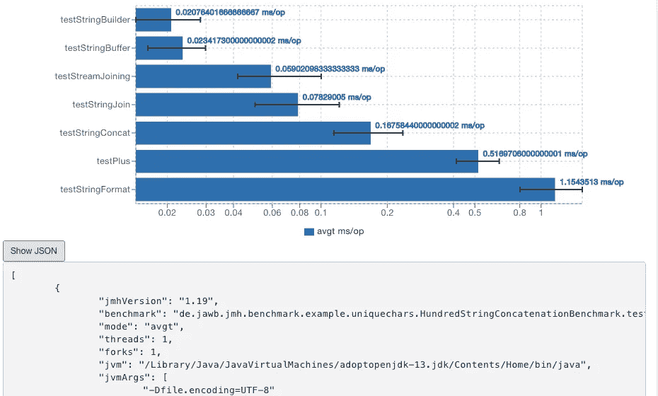
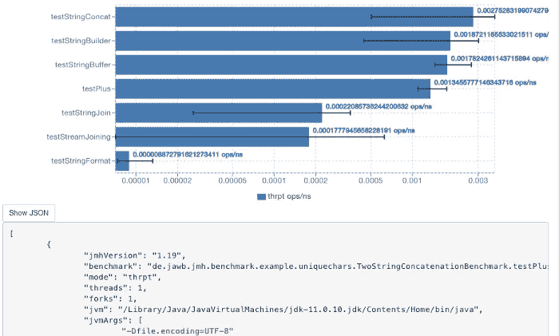

# 经验丰富的 Java 开发人员使用这 3 个简单的 Java 字符串

> 原文：<https://blog.devgenius.io/seasoned-java-developers-use-these-3-simple-java-string-quirks-7c8dc4a60c3e?source=collection_archive---------4----------------------->

## *3 种提高性能的 Java 字符串技巧*

[亚娜拉·www.freepik.com 创作的商业照片](https://www.freepik.com/photos/business)

*用* `*String#format*` *吗？您知道字符串重复数据删除的新功能吗？你想知道更多关于串联的知识吗？*

这些怪癖涵盖了以上所有。最有趣的是`String#format`方法的变化。这样一个简单的改变获得了很大的性能提升。

*下面是你应该知道的 Java* `*String*` *怪癖。*

# `String.format`变得更快了

字符串格式在所有潜在的连接方法中表现最差。

下面是我对 JDK13 的测试。最差的表现来自`String#format`这个方法。如果你使用循环来连接 100 个字符串，你最后的选择应该是`String#format`。

尽管最慢，最近对`String#format`做了一些改进。 ***一个开发者，***[***cl4es***](https://github.com/openjdk/jdk/pull/2830)， ***设法在 JDK17 中提高了这种方法的性能。***

由于大多数格式包含`%s`或`%d`，他设法为这些格式创建了一个简单的解析器。显然，最大的性能损失来自首先进行正则表达式匹配。所以他先做简单的检查。

以下是他在 17 版本以下的 Java 中对`String#format`的基准测试。

根据他的更新，我们得到了以下结果。

***依然，复杂的格式依然缓慢。但是让我们来看看简单的场景。平均而言，这一变化将时间缩短了 3 倍。***

***我们可以断定从 JDK17 开始*** `***String#format***` ***对于简单场景有更好的表现。不要为了简单的场景而回避。***

对于复杂的场景来说，还是差不多的。在我们得到[模板化字符串](https://openjdk.java.net/jeps/8273943)或字符串插值之前，我们会一直使用这个选项。

# 为什么默认情况下会关闭重复数据删除？

从 Java 8 开始，我们现在有了字符串的重复数据删除。

*[***JEP***](https://openjdk.java.net/jeps/192)***中有关于重复数据删除的详细信息。要点是大约四分之一的堆被字符串占据。其中一半是重复的字符串。****

*可以删除其中一个中的重复项。所以我们可以只占用堆的 12.5%。*

*以前这只在 G1 GC 领导下的[有效。从 Java 17 开始，重复数据删除将适用于所有 GC。](https://dzone.com/articles/usestringdeduplication)*

*尽管如此，这个功能在默认情况下是不打开的。要打开它，你需要传递下面的标志:`-XX:+UseStringDeduplication`。对于低于 17 的 Java，你也需要添加`-XX:+UseG1GC`。因为较低版本不支持其他 GC 算法。*

*我会说默认关闭它的原因是让客户来决定。另一个原因是性能下降。尽管有很多字符串，但大多数都不是重复的。另一个原因[是垃圾收集器会以任何方式清理这些副本](https://stackoverflow.com/questions/42080648/why-when-you-would-not-want-to-have-java-8-usestringdeduplication-enabled-in-jvm)。在启用重复数据删除之前进行性能测试。*

*有什么简单的重构方法可以去掉重复的字符串？用 `***EnumMap***` ***。项目中可能有重复的常量。所以让他们聚在一起`EnumMap`。****

*更快访问的优势[在这里](https://richardstartin.github.io/posts/5-java-mundane-performance-tricks#use-enums-instead-of-constant-strings)可见。此外，在 GC 中分配的对象会更少。*

# *默认`concat`变慢了？*

*在 Java 8 的早期版本中，默认的`concat`运行速度确实慢了一些。在 Java 9 和更高版本中，我们得到了很多改进。*

*Java 9 中增加了新的运行时连接策略。但是从 Java 15 开始，所有这些都被删除了。由于性能问题，[从 Java 15 开始，这些策略被删除](https://hg.openjdk.java.net/jdk/jdk/rev/d52c2e540934)。现在唯一合适的策略是`MH_INLINE_SIZED_EXACT`。*

*一些用户[在 Java 17 和 18](https://bugs.openjdk.java.net/browse/JDK-8278540) 中面临初始引导性能冲击。以前你可以退回到 Java 8 策略(`BC_SB`)，但是现在你不能了。*

*这个 bug 还表明，Java 11 在这个优化上比 Java 15+做得更好。可能是这个用例特有的，但仍然很奇怪。奇怪是因为 Java 应该是向后兼容的。*

**那么，您能做些什么来禁用这些优化呢？现在你只能在编译时禁用它们。**

*Malt [就如何完全禁用策略提出了这个解决方案](https://stackoverflow.com/a/58681713/5999670)。*

*在 Java 15 之前，您可以使用 JVM arg `-Djava.lang.invoke.stringConcat=BC_SB`来启用某些策略。现在你只能在编译时用`-XDstringConcat=inline`标志来做这件事。*

*我用[在之前的测试](https://medium.com/javarevisited/5-effective-string-practices-you-should-know-e9a75811b123#25a1)、`String#concat`中发现，拼接数量越少，效果越好。使用这种方法，没有额外的`StringBuilder`或`StringBuffer`。尽管`String.concat`不是最快的，但它在吞吐量方面胜过其他选项。*

**