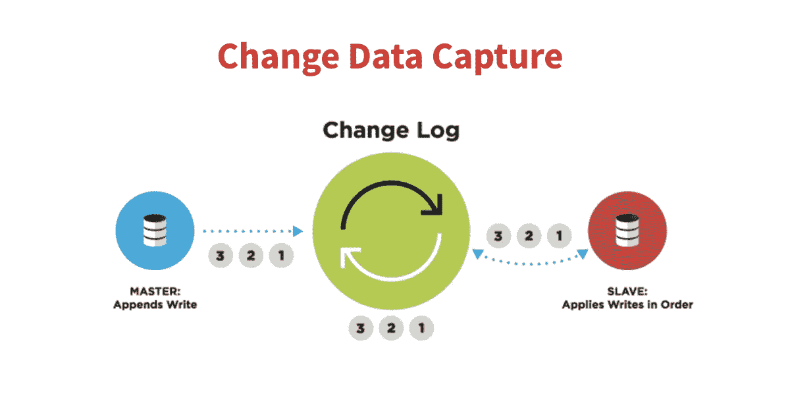
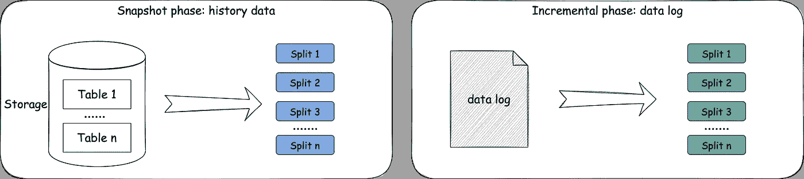

# SeaTunnel 将很快支持 CDC 功能！

> 原文：<https://blog.devgenius.io/seatunnel-will-support-cdc-soon-e97129001fe9?source=collection_archive---------3----------------------->


> *由海底隧道委员会委员李宗文撰写*

# 海底隧道 CDC-支持的背景

变更数据捕获(CDC)是指识别和捕获对数据库中的数据所做的更改，然后将这些更改实时传递给下游流程或系统的过程。



CDC 主要分为基于查询和基于 Binlog 两种方式。我们知道 MySQL 有 binlog(二进制日志)来记录用户对数据库的更改，因此使用 binlog 可以实现最简单、最高效的 CDC 实现之一，这是合乎逻辑的。当然，已经有许多开源的 MySQL CDC 实现可以开箱即用。使用 binlog 并不是实现 CDC 的唯一方式(至少对于 MySQL 来说是这样)，甚至数据库触发器也可以执行类似的功能，但在效率和对数据库的影响上可能就相形见绌了。

通常，在 CDC 捕获到对数据库的更改后，它会将更改事件发布到消息队列供消费者使用，例如 Debezium，它持久化 MySQL(还支持 PostgreSQL、Mongo 等。)对 Kafka 的修改，通过订阅 Kafka 中的事件，我们可以获得修改的内容，实现我们需要的功能。

我认为 CDC 对于数据同步至关重要，我们需要 SeaTunnel 作为一个特性来支持它。下面是 SeaTunnel 需要这个功能的原因和我对它的总体设计。希望大家能告诉我们如何以最佳方式在海底隧道中实施。

# 动机

*   支持并行读取历史数据(快速同步，数十亿大表)
*   支持读取增量数据(CDC)
*   支持心跳检测(指标、小流量表)
*   支持动态添加新表(使操作和维护更容易)

**本设计不支持**

*   多表和分片(简单配置)
*   模式进化(DDL)

# 总设计

## 基本流程



CDC 的基本流程包括:

1.  快照阶段:读取表的历史数据

*   最小分割粒度:表的主键范围数据

2.增量阶段:读取表的增量日志更改数据

*   最小分割粒度:一个表

## 快照阶段


枚举器生成一个表的多个`SnapshotSplit`并将它们分配给读取器。

```
*//  pseudo-code.* 
public class SnapshotSplit implements SourceSplit {
    private final String splitId;
    private final TableId tableId;
    private final SeaTunnelRowType splitKeyType;
    private final Object splitStart;
    private final Object splitEnd;
}
```

当一个`SnapshotSplit`读取完成时，读取器向计数器报告分割的高水位线。当所有`SnapshotSplit`报告高水位线时，计数器开始递增阶段。

```
*//  pseudo-code.* 
public class CompletedSnapshotSplitReportEvent implements SourceEvent {
    private final String splitId;
    private final Offset highWatermark;
}
```

## 快照阶段—快照拆分读取流


有 4 个步骤:

1.  日志低水位线:在读取快照数据之前获取当前日志偏移量。
2.  读取快照分割数据:读取属于分割的数据范围

*   **案例 1** :步骤 1 & 2 不能原子化(MySQL)

> 因为我们不能添加表锁，也不能基于低水位线添加区间锁，所以步骤 1 & 2 不是原子的。

*   恰好一次:使用内存表保存历史数据&从低水位线到高水位线过滤日志数据
*   至少一次:直接输出数据&使用低水位线而不是高水位线
*   **案例 2** :步骤 1 & 2 可以原子化(Oracle)

> 您可以使用`for scn`来确保这两个步骤的原子性

*   恰好一次:直接输出数据&使用低水位线而不是高水位线

3.日志高水位线:

*   `step 2 case 1 & Exactly-once`:读取快照数据后，获取当前日志偏移量。
*   `other`:使用低水位线而不是高水位线

4.如果高水位线>低水位线，读取范围日志数据

## 快照阶段— MySQL 快照读取&恰好一次


因为我们无法确定查询语句在高低水位之间的什么地方执行，为了保证数据的 exact-once，我们需要使用内存表来临时保存数据。

1.  日志低水位线:在读取快照数据之前获取当前日志偏移量。
2.  读取快照拆分数据:读取属于拆分的范围数据，并写入内存表。
3.  日志高水位线:读取快照数据后获取当前日志偏移量。
4.  读取范围日志数据:读取日志数据并写入内存表
5.  输出内存表的数据，释放内存使用。

## 增量阶段


当所有快照分割报告水位时，开始增量阶段。

组合所有快照分割和水位信息以获得`LogSplit` s。

我们希望尽量减少日志连接的数量:

*   在增量阶段，默认情况下只有一个阅读器工作，用户也可以配置选项来指定数量(不能超过阅读器的数量)
*   一个读者最多得到一个连接

```
*//  pseudo-code.* 
public class LogSplit implements SourceSplit {
    private final String splitId;
    */**
     * All the tables that this log split needs to capture.
     */*
    private final List<TableId> tableIds;
    */**
     * Minimum watermark for SnapshotSplits for all tables in this LogSplit
     */*
    private final Offset startingOffset;
    */**
     * Obtained by configuration, may not end
     */*
    private final Offset endingOffset;
    */**
     * SnapshotSplit information for all tables in this LogSplit.
     * </br> Used to support Exactly-Once.
     */*
    private final List<CompletedSnapshotSplitInfo> completedSnapshotSplitInfos;
    */**
     * Maximum watermark in SnapshotSplits per table.
     * </br> Used to delete information in completedSnapshotSplitInfos, reducing state size.
     * </br> Used to support Exactly-Once.
     */*
    private final Map<TableId, Offset> tableWatermarks;
}*//  pseudo-code.* 
public class CompletedSnapshotSplitInfo implements Serializable {
    private final String splitId;
    private final TableId tableId;
    private final SeaTunnelRowType splitKeyType;
    private final Object splitStart;
    private final Object splitEnd;
    private final Offset watermark;
}
```


**恰好一次:**

*   阶段 1:在水印数据之前使用*completedsnapshotsplitingfos*过滤器。
*   第二阶段:某个表不再需要过滤，删除*completedsnapshotsplitingfos*中属于该表的数据，因为后面的数据需要处理。

**至少一次:**不需要过滤数据，*completedsnapshotsplitingfos*不需要任何数据。

## 新表的动态发现


情况 1:发现新表时，枚举器处于快照阶段，直接分配新的 split。

情况 2:发现新表时，枚举器处于递增阶段。

**增量阶段新表的动态发现。**

1.  挂起日志拆分读取器。(如果有空闲的阅读器，我们现在需要暂停阅读器吗？)
2.  读取器执行挂起操作。
3.  读取器报告当前日志偏移。(如果不报，读者需要支持 LogSplit 的组合)
4.  将 SnapshotSplit 分配给读取器。
5.  读取器执行快照阶段读取。
6.  读者报告所有快照分割水印。
7.  为读取器分配新的日志拆分。
8.  读取器再次开始增量读取，并向枚举器确认。

**多个结构化表格**

*   优点:占用较少的数据库连接，减轻数据库压力
*   缺点:在 SeaTunnel 引擎中，多个表会在一个流水线中，容错的粒度会变大。


这个特性期望源可以支持多个结构表的读取，然后使用侧流输出与单个表流保持一致。

此外，由于这将涉及到对 DAG 和翻译模块的更改，我还希望支持定义分割器(散列和转发)。

有些功能已经实现，可以参见[**# 2490**](https://github.com/apache/incubator-seatunnel/issues/2490)

**你对这个模式有什么看法？或者如果你有兴趣加入我们的团队， ***欢迎在问题下评论加入我们:***[***https://github.com/apache/incubator-seatunnel/issues/2394***](https://github.com/apache/incubator-seatunnel/issues/2394)**

# **关于海底隧道**

**SeaTunnel(原 Waterdrop)是一个简单易用、超高性能的分布式数据集成平台，支持海量数据的实时同步，可以稳定高效地同步每天数千亿的数据。**

**我们为什么需要海底隧道？**

**SeaTunnel 竭尽所能解决你在同步海量数据时可能遇到的问题。**

*   **数据丢失和重复**
*   **任务构建和延迟**
*   **低吞吐量**
*   **从应用到生产周期长**
*   **缺乏应用程序状态监控**

****海底隧道使用场景****

*   **海量数据同步**
*   **海量数据集成**
*   **大量数据的 ETL**
*   **海量数据聚合**
*   **多源数据处理**

****海底隧道的特点****

*   **丰富的组件**
*   **高可扩展性**
*   **使用方便**
*   **成熟稳重**

****如何快速上手 SeaTunnel？****

**想快速体验海底隧道？SeaTunnel 2.1.0 只需 10 秒钟即可启动并运行。**

**[https://seatunnel.apache.org/docs/2.1.0/developement/setup](https://seatunnel.apache.org/docs/2.1.0/developement/setup)**

**我能做些什么？**

**我们邀请所有对本地开源全球化感兴趣的合作伙伴加入 SeaTunnel 贡献者大家庭，共同促进开源！**

**提交问题:**

**[https://github.com/apache/incubator-seatunnel/issues](https://github.com/apache/incubator-seatunnel/issues)**

**将代码贡献给:**

**https://github.com/apache/incubator-seatunnel/pulls**

**订阅社区发展邮件列表:**

**dev-subscribe@seatunnel.apache.org**

**开发邮件列表:**

**dev@seatunnel.apache.org**

**加入时差:**

**[https://join . slack . com/t/Apache seatunnel/shared _ invite/ZT-1 HSO 5 N2 TV-mkfkwxonc 70 heqgxtvi 34 w](https://join.slack.com/t/apacheseatunnel/shared_invite/zt-1hso5n2tv-mkFKWxonc70HeqGxTVi34w)**

**关注 Twitter:**

**[https://twitter.com/ASFSeaTunnel](https://twitter.com/ASFSeaTunnel)**

**来加入我们吧！**