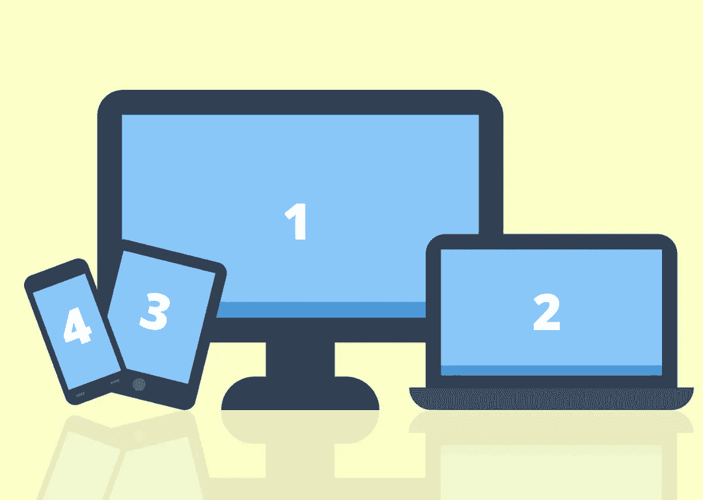

# 第二台计算机作为“第二台显示器”——使用 TMUX、SSH 和 Synergy 进行 Web 开发

> 原文：<https://blog.devgenius.io/second-computer-as-a-second-monitor-web-development-with-tmux-ssh-and-synergy-d1186a273404?source=collection_archive---------3----------------------->

大家好，感谢你们的加入！

今天，我想分享一个快速的小指南，使用第二台计算机作为 web 开发的第二台显示器(或任何目的！)

我们不打算使用 VNC/远程桌面方法来完成此类任务。相信我…我已经试过了，大部分时间都太慢了，不值得！

相反，我们将使用流行的和主要是 T2 工业标准工具的组合来模拟两台独立计算机之间的无缝多显示器开发体验！



# 前言

## 为什么不买第二台显示器呢？

我知道…在你冲到评论区说“只要买第二台显示器”之前。是的，这当然是一个很好的选择。

我喜欢能改善我的开发体验的新玩具和工具…但是我也喜欢利用旧的玩具和工具，它们仍然可以发挥作用。

使用我的旧的较慢的计算机来开发现代应用程序肯定不如以前工作得好。但它值得坐在那里积灰吗？我真的需要花钱买第二台显示器吗？

答案对你来说可能和对我来说不一样，这没关系！对我来说，我想尽可能地减少、再利用和回收——包括旧技术。

## 但是我们有远程桌面和 VNC！

没错。他们有他们的目的！不过，我发现即使有很强的无线连接，设备之间也会有明显的延迟。您可能必须处理不同的屏幕尺寸和分辨率，这些尺寸和分辨率在一台机器上看起来很棒，但在另一台机器上却很糟糕。也就是说，如果你准备使用这种方法，这是一个很好的学习`xrandr`的机会！

不管怎样，答案有很多，这只是使用第二个屏幕的一种方法。因此，如果您想使用第二台较少使用的机器，那么让我们开始吧！

# 鼠标和键盘

我们想要做的第一件事是在两台设备之间实现简单的键盘和鼠标共享。虽然有些操作系统已经内置了，但其他的，比如我的 Linux 操作系统，还没有。所以，如果你是少数拥有这种内置功能的幸运儿，请随意跳过。

[](https://symless.com/) [## 无符号——协同作用的制造者

### 出于对 KVM 交换机的不满，Synergy 在多台计算机之间共享一个鼠标和一个键盘，并且…

symless.com](https://symless.com/) 

## Synergy —一个跨平台的鼠标和键盘共享应用程序

我们可以使用应用程序，例如 [Synergy](https://symless.com/synergy) ，轻松地与远程机器的用户界面共享主机的鼠标和键盘。它非常简洁，可以跨平台工作。我还要提一下，这是我要说的唯一一个需要花钱的工具，我不怕花 30 美元来支持一家公司创造一些很酷的技术！我可以保证它工作得非常好。

所以第一步很简单——在主机上启动鼠标和键盘共享服务器，并从远程机器连接到它！

# 设置 SSH

如果您不是命令行用户，这可能看起来有点可怕，但它确实非常简单，是作为开发人员应该具备的一项常见技能。这是一个深入学习新事物的好机会。

SSH 允许您通过命令行安全地连接到另一台计算机。从远程机器连接后，您可以运行应用程序，读取、写入、创建和删除文件，就像您在主机上一样。

出于我们的目的，我们将从远程机器(第二台机器)连接到主机。

## 确保安装并启用了 SSH

奇怪的是，我的操作系统默认没有安装 SSH。我不得不手动安装和启用它。这对于每个操作系统来说都有点不同，所以如果您需要这样做，我会让您自己研究。

Mac 用户通常默认启用此功能，而 windows 用户可能需要使用一个客户端(如 Putty)来帮助创建到另一台机器的 ssh 连接。Linux 用户可能需要也可能不需要手动启用 SSH，这取决于发行版。

通过快速的谷歌搜索，这通常是一个简单、快速和容易的过程。

## 密码和密钥

当您从远程机器连接到主机时，您需要提供一个密码来访问机器，除非您事先做了一些准备工作。这一点点额外的配置将使您不必在每次连接时都提供主机的密码，从而更容易进入您的开发。

## 生成密钥

首先，从 ***远程*** 机器上，你将需要生成一个私钥和一个公钥。这比听起来容易，为了本教程的目的，我们将设置一个非常基本的关键。只要知道你可以研究如何生成一个更安全的密钥，以防你把这个系统暴露给互联网或者想要一个更安全的环境。

只需从远程机器的命令行运行命令`ssh-keygen`。

您可以选择指定要生成的密钥的目录和文件名。此外，您可以选择指定一个密码以获得更高的安全性。通常，我让计算机思考并使用默认位置和文件名——只需按 enter 键，直到完成最基本和默认的配置。

```
nickisyourfan@remote_machine:~$ ssh-keygen
Generating public/private rsa key pair.
Enter file in which to save the key (/home/nickisyourfan/.ssh/id_rsa):
Enter passphrase (empty for no passphrase): 
Enter same passphrase again: 
Your identification has been saved in /home/nickisyourfan/.ssh/id_rsa_devoyage
Your public key has been saved in /home/nickisyourfan/.ssh/id_rsa_devoyage.pub
The key fingerprint is:
SHA256:q1f4Aa1sF9+DeWfExbxYXOoqsQ7YOxMKaKxpfiYNrF4 nickisyourfan@system76
The key's randomart image is:
+---[RSA 3072]----+
|              .Oo|
|               ++|
|         .    -.o|
|        . o  o .o|
| . .   .S-.o +.. |
| o+ .  o&.+o+.+ o|
|.+oE ..o+=o... + |
|+o.+  ..+)..     |
|+O+   ...o.      |
+----[SHA256]-----+
```

## 传送公钥

生成密钥后，导航到保存密钥的文件夹并查看内容！

*注意* `*~/.ssh*` *是一个隐藏的目录，所以如果你在文件浏览器中找不到它，请确保你在操作系统中启用了查看隐藏文件夹和文件的功能。*

```
nickisyourfan@remote_machine:~$ cd .ssh
nickisyourfan@remote_machine:~/.ssh$ ls
authorized_keys  config  id_rsa  id_rsa.pub  known_hosts
```

从`ssh-keygen`命令生成的文件包括一个不被共享的私有文件，我们将其命名为`id_rsa`，以及一个公共文件，它被命名为`id_rsa.pub`，可以被共享。

将公钥传送到主机并保存到`~/.ssh`目录。一旦这个文件在主机上，您将不再需要主机的密码来通过 ssh 连接到机器。

轻松的生活是美好的。

## 对主机的 SSH

是时候了！现在，您可以从远程设备连接到主机，只需一个简单的 ssh 命令即可完成！

```
ssh HOST_USERNAME@HOST_IP
```

如果您设置了带有密码短语的公钥，系统会提示您输入密码短语。如果您设置了没有密码的密钥，那么它应该会立即连接。最后，如果你选择不设置密钥，那么你将被提示输入`HOST_USERNAME`的密码！

## 让它更简单

我是那种不想在每次需要从远程机器连接时记住主机 IP 和用户名的人…所以我设置了一些简单的配置来使它更容易！

从远程机器，在`~/.ssh`目录下创建一个配置文件。

```
touch ~/.ssh/config
```

在新的`config`文件中，添加以下内容，包括您的主机 IP、用户名以及您在上述步骤中创建的私有身份文件(私有密钥)的路径。

```
Host the_devoyage
 HostName 192.168.1.1 #PUT HOST IP HERE
 User nickisyourfan #PUT HOST USERNAME HERE
 IdentityFile ~/.ssh/id_rsa
```

现在奇迹发生了。你现在可以再次连接，但以一种更人性化的方式。

```
ssh the_devoyage
```

*注意，如果您的 IP 地址不断变化，那么这可能不是您的解决方案，因为每次 IP 地址变化时，您都必须更新* `*config*` *文件。*

## 连接端口

好了，现在我们可以使用 ssh 从远程计算机连接到主机文件系统了，这太好了！但是..如果您像我一样是 web 开发人员，您可能会托管只能从主机本身访问的开发服务器。即使您通过 ssh 连接，远程机器也无法访问这些服务器/端口。我们需要调整`ssh`命令来允许远程机器访问主机上的`localhost`端口。

再说一遍…这比听起来容易，并且可以保存到一个可重用的脚本中，以自动化连接体验。

我们将创建一个非常简单的 BASH 脚本来自动化连接体验。创建一个名为`development-mode.sh`的文件，或者任何你喜欢的带有`.sh`扩展名的名字。

```
nickisyourfan@remote_machine:~$ touch development-mode.sh
```

让我们将调整后的`ssh`命令添加到新创建文件的内容中。`-L FROM_PORT:localhost:TO_PORT`标志和参数将用一些新规则启动 ssh 连接。每当远程设备试图访问指定的端口，或者上面提到的`FROM_PORT`，它实际上会在`localhost:TO_PORT`将请求重新路由到主机。

使用下面的命令，远程机器现在将能够访问主机上端口 3000 和 5000 处的开发服务器，就像您使用主机本身一样。

将以下内容添加到新脚本中。

```
ssh -L 5000:localhost:5000 -L 3000:localhost:3000 HOST_USERNAME@HOST_IP
```

更改脚本的模式，使其可执行。

```
nickisyourfan@remote_machine:~$ chmod +x development-mode.sh
```

现在，当您想要创建 ssh 连接时，只需运行新的脚本！

```
nickisyourfan@remote_machine:~$ ./development-mode.sh
```

完成后，您现在可以从远程机器连接到主机的开发服务器。

# 与 TMUX 共享终端和日志

到目前为止，我们已经使得在两台机器之间共享单个鼠标和键盘变得容易，使得从两台机器连接和访问相同的文件系统(从终端)变得容易，使得在两台机器之间连接到开发服务器变得容易。

话虽如此..我们可以更进一步，使用 TMUX 在两台计算机之间共享终端和服务器输出日志。

TMUX 很棒！它允许您在一个终端中创建多个终端。把它想象成在一个浏览器中有标签，而不是必须打开许多不同的浏览器来一次浏览多个网站。

但它做的不止这些…你实际上可以从多个位置同时访问 TMUX 会话。在我们的例子中，我们将从远程和主机访问同一个 TMUX 会话。

确保两台计算机上都安装了 TMUX，并在主机上创建一个新的 TMUX 会话。运行几个简单的命令，并将结果显示在屏幕上来测试这一点。

```
nickisyourfan@host_machine:~/Desktop/DEV$ cd testnickisyourfan@host_machine:~/Desktop/DEV/test$ ls
index.ts  node_modules  package.json  package-lock.json  tsconfig.jsonnickisyourfan@host_machine:~/Desktop/DEV/test$ pwd
/home/nickisyourfan/Desktop/DEV/test
```

现在移动到远程机器，列出可用的会话，并连接到 TMUX 会话。

*注意，确保您有一个到主机的有效 ssh 连接！*

```
nickisyourfan@remote_machine:~$ tmux ls
0: 8 windows (created Sat May 14 11:18:04 2022)nickisyourfan@remote_machine:~$ tmux a -t 0
```

现在，您应该会在远程和主机上看到相同的终端。证据就在布丁里(那是什么意思！？)，您看到上面运行的命令的结果了吗？

现在，您可以在远程计算机和主机之间共享终端，这有一些额外的好处。

*   连接删除不会终止开发服务器。只需创建一个新的 ssh 连接，并再次连接到 tmux 服务器，从您离开的地方开始。
*   使用 TMUX 复活之类的工具来维护重启之间的 tmux 会话，这样就不必在每次关闭/终止会话时定制新的 TMUX 环境。如果你愿意的话，它甚至可以智能地重新启动开发服务器和编码环境。

# 共享您的 IDE

我们今天快结束了！最后一步是在两台机器之间共享您的 IDE。我不打算在这方面走得太远，因为这确实取决于您选择使用的 IDE。

如果你像我一样使用 Lunar Vim(或任何 Vim ),那么你真的不需要做任何特别的事情！一旦创建了 ssh 连接，就像平常一样启动 vim！您甚至可以从主机访问配置。

如果您使用的是 Visual Studio 代码之类的应用程序，那么您将需要使用扩展创建一个 SSH 连接，比如使用 [Remote-SSH](https://marketplace.visualstudio.com/items?itemName=ms-vscode-remote.remote-ssh) 扩展。

我发现，尽管在设备之间共享 IDE 非常容易，但我通常不会在多个屏幕上编码。

# 你的新班长！

或者应该说，你的旧显示器…跟新的一样~！

如果一切顺利，您现在可以通过使用两台独立的机器来模拟令人愉快的双显示器体验了！

感谢您今天的参与！我并不经常有机会后退一步来谈论编码环境，因为我花了大部分写作时间来写关于 Typescript、GraphQL、Apollo、React 和 Rust 的文章！

请稍后回来查看，我会继续提供内容！