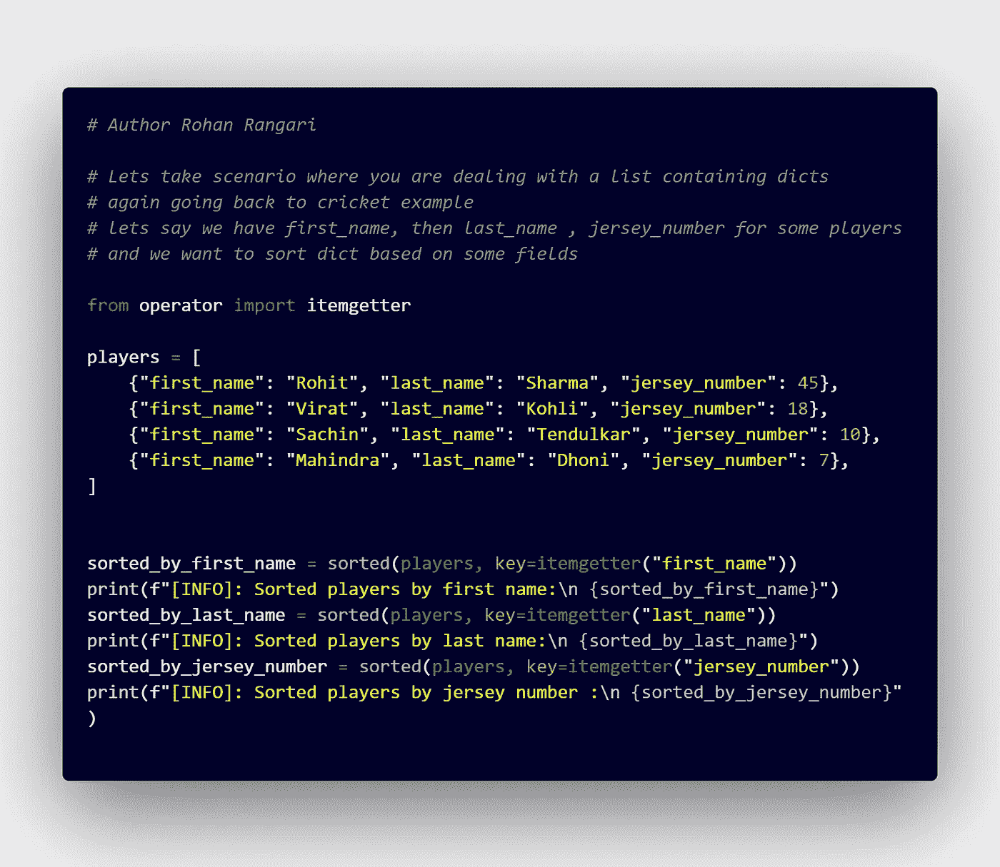

# Python 字典周围的秘密世界

> 原文：<https://blog.devgenius.io/secret-world-around-pythons-dictionary-697ba074a0ab?source=collection_archive---------16----------------------->

让我们来看看 Python 的数据结构字典&里面探索较少的东西。

## 涵盖的主题:

1.  字典默认值
2.  将关键字映射到字典中的多个值
3.  用字典计算
4.  在两本词典中寻找共同点
5.  基于某个阈值(即出现次数)过滤掉句子中的单词
6.  字典上的数学运算
7.  按公共关键字对字典列表进行排序
8.  带字典的 Switch/Case 语句

# 1.字典默认值

> 例:让我们用几个著名的印度板球运动员的球衣号码创建一个字典，其中键是球衣号码，值是运动员姓名

代码-1

运行上面的代码片段后，我们得到下面的输出:

输出-1

> 现在，如果我们试图获取一些 jersey_number，而它不在我们定义的 jersey_dict 中，那么它会给出一个 KeyError
> 
> 例如，如果我们运行上面 jersey_name=13 的代码片段；我们将得到 KeyError: 13 &同样的输出如下

> 我们不希望代码返回一个 KeyError 所以理想情况下，如果在我们定义的 jersey_dict 中找不到/不存在对应的键，我们应该能够解决这个问题
> 
> 因此，我们可以使用下面的代码更改来解决上面的 KeyError。

代码-2

输出-2

> 我们能够修复 KeyError 异常，但仍有改进的空间。如你所见，我们访问了 dict 两次，这不是一个好的编码实践&它不是 Pythonic 式的，效率也很低。
> 
> 我们可以使用 try-except 块来解决上述问题&对应的代码如下:

代码-3

输出-3

> 代码比前一个版本好，但是我们仍然可以改进代码&也许可以使用 dictionary 的 get()方法为上面的 KeyError 异常编写相同代码的更干净的版本。

代码 4

输出-4

> 现在，图中上面的代码:Code-4，使用了 dictionary 的内置方法&它更加简洁和精确&是上面讨论的所有解决方案中的最佳解决方案。

# 2.将关键字映射到字典中的多个值

> *示例:让我们为板球比赛的第一局创建一个字典，其中键是 over-number，值是包含 over 中得分的数组/列表*

代码-5

输出-5

> *如果需要，我们可以按照 first _ Burgess _ dict 中的说明获取上述表格中的数据。我们可以使用集合模块* 中的 ***defaultdict***

代码-6

输出-6

# 3.用字典计算

> 现在让我们说，我们把上面的 first _ Burgess _ dict &做所有得分的相加，并从中创建一个字典 first _ Burgess _ dict _ sum

*   我们在哪一场比赛中得分最高？
*   我们在哪一场比赛中得分最少？
*   给字典排序

代码-7

> max _ scored = max(zip(first _ Burgess _ dict _ sum . values())，first _ Burgess _ dict _ sum . keys())#我们使用 zip 同时使用值和键，对它进行最大运算，并返回最大值
> 
> 类似地，我们可以根据值对字典进行最小排序，如上面的代码所示

产出-7

# 4.在两本词典中寻找共同点

> 例如:让我们为板球比赛的第一局和第二局创建一个字典，其中键是 over-number，值是 over 中的总得分

*   在字典中查找常用关键字
*   在字典中查找常用项目
*   字典中关键字的减法
*   从整个字典中移除关键字

代码-8

输出-8

# 5.基于某个阈值(即出现次数)过滤掉句子中的单词

> 例如:*让我们来看这样一个场景:您正在处理文本&单词，您需要计算一个单词在一个句子中出现了多少次，以便根据某个阈值或最少出现次数来宣布它是重要的还是不重要的，然后再将其称为重要的*

代码-9

输出-9

# 6.字典上的数学运算

> *举例:让我们来看看你处理文本&单词的场景，在这种情况下，假设我们有两个句子&如果我们想在字典上进行一些数学运算，我们现在对每个句子进行字数统计*

代码-10

输出-10

# 7.按公共关键字对字典列表进行排序

> *例子:让我们来看一个场景，你正在处理一个包含字典的列表，回到板球的例子，假设我们有一些球员的名字，然后是姓氏，球衣号码，我们想根据一些字段对字典进行排序*

代码 11

输出-11

# 8.带字典的 Switch/Case 语句

> *示例:让我们举一个使用多个 case 语句或只说多个条件的例子。允许的操作有“加”、“减”、“乘”、“除”*

> 我们可以有一个具有如下功能的代码:

代码-12

> 与此相对应的如下:

输出-12

> 我们可以使用 dict 改进上面的代码&代码片段如下:

代码 13

输出-13

我希望这些例子和代码片段对你有用。请随意留下任何反馈和评论。谢了。

## 只是一个迷因:

哈哈的笑