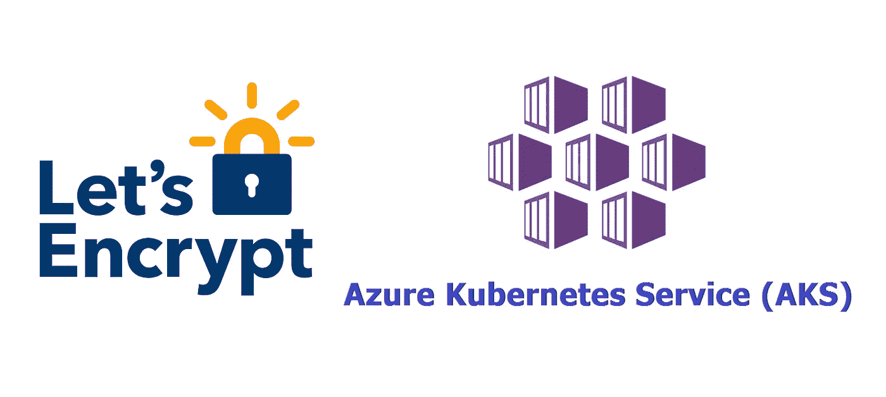
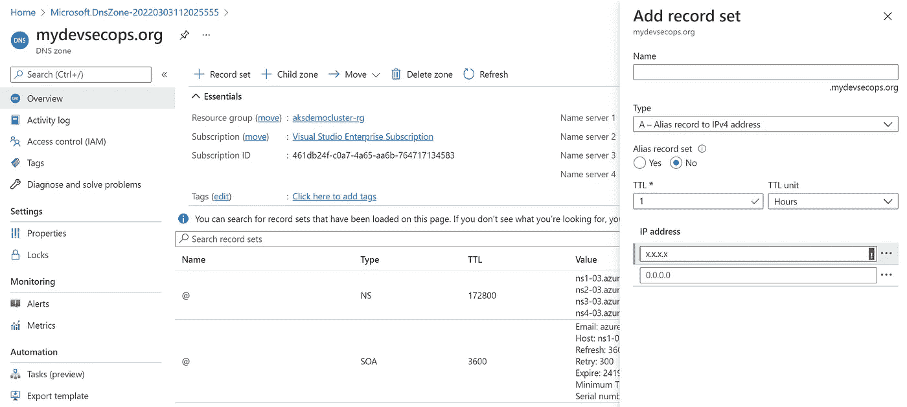

# 使用 LetsEncrypt 保护 AKS 入口

> 原文：<https://blog.devgenius.io/secure-aks-ingress-with-letsencrypt-f56f698ec6b5?source=collection_archive---------2----------------------->



本文展示了如何在 Azure Kubernetes 服务(AKS)集群中部署 NGINX 入口控制器。入口控制器在 Azure 标准负载平衡器上配置有静态公共 IP 地址。cert-manager 项目用于自动生成和配置 Let's Encrypt 证书。自定义域将与证书集成，以公开运行应用程序。

# 要执行的步骤:

*   为入口控制器创建一个名称空间 ingress-basic，其中将创建所有与入口控制器相关的资源。
*   为自定义域创建 DNS 区域和别名记录。
*   使用 Helm 在 ingress-basic 命名空间中安装 SSL 证书的 cert-manager。
*   创建用于颁发证书的 CA 群集颁发者。
*   创建第一个应用和服务。
*   创建第二个应用和服务。
*   创建入口路由，以配置将流量路由到两个应用程序之一的规则。
*   验证自动创建的证书。
*   使用自定义域测试应用程序。

# 创建入口控制器

```
# Create a namespace for ingress resources
kubectl create namespace ingress-basic

# Add the Helm repository
helm repo add ingress-nginx https://kubernetes.github.io/ingress-nginx
helm repo update

# Use Helm to deploy an NGINX ingress controller
helm install ingress-nginx ingress-nginx/ingress-nginx \
    --namespace ingress-basic \
    --set controller.replicaCount=2
```

# 创建 DNS 区域和记录

自定义域的记录将是入口控制器的公共 IP。



# 安装证书管理器

```
# Label the cert-manager namespace to disable resource validation
kubectl label namespace ingress-basic cert-manager.io/disable-validation=true# Add the Jetstack Helm repository
helm repo add jetstack https://charts.jetstack.io# Update your local Helm chart repository cache
helm repo update# Install CRDs with kubectl
kubectl apply -f https://github.com/cert-manager/cert-manager/releases/download/v1.7.1/cert-manager.crds.yaml# Install the cert-manager Helm chart
helm install cert-manager jetstack/cert-manager \
  --namespace ingress-basic \
  --version v1.7.1
```

# 创建 CA 群集颁发者

```
apiVersion: cert-manager.io/v1
kind: ClusterIssuer
metadata:
  name: letsencrypt
spec:
  acme:
    server: https://acme-v02.api.letsencrypt.org/directory
    email: shailender.choudhary@gmail.com
    privateKeySecretRef:
      name: letsencrypt
    solvers:
    - http01:
        ingress:
          class: nginx
          podTemplate:
            spec:
              nodeSelector:
                "kubernetes.io/os": linux
```

要创建发行者，请使用 kubectl 命令。

```
kubectl apply -f cluster-issuer.yaml --namespace ingress-basic
```

# 运行演示应用程序

创建一个 *aks-helloworld-one.yaml* 文件，并在以下示例中复制 yaml:

```
apiVersion: apps/v1
kind: Deployment
metadata:
  name: aks-helloworld-one
spec:
  replicas: 1
  selector:
    matchLabels:
      app: aks-helloworld-one
  template:
    metadata:
      labels:
        app: aks-helloworld-one
    spec:
      containers:
      - name: aks-helloworld-one
        image: mcr.microsoft.com/azuredocs/aks-helloworld:v1
        ports:
        - containerPort: 80
        env:
        - name: TITLE
          value: "Welcome to Azure Kubernetes Service (AKS)"
---
apiVersion: v1
kind: Service
metadata:
  name: aks-helloworld-one
spec:
  type: ClusterIP
  ports:
  - port: 80
  selector:
    app: aks-helloworld-one
```

创建一个 *aks-helloworld-two.yaml* 文件，并在以下示例中复制 yaml:

```
apiVersion: apps/v1
kind: Deployment
metadata:
  name: aks-helloworld-two
spec:
  replicas: 1
  selector:
    matchLabels:
      app: aks-helloworld-two
  template:
    metadata:
      labels:
        app: aks-helloworld-two
    spec:
      containers:
      - name: aks-helloworld-two
        image: mcr.microsoft.com/azuredocs/aks-helloworld:v1
        ports:
        - containerPort: 80
        env:
        - name: TITLE
          value: "AKS Ingress Demo"
---
apiVersion: v1
kind: Service
metadata:
  name: aks-helloworld-two
spec:
  type: ClusterIP
  ports:
  - port: 80
  selector:
    app: aks-helloworld-two
```

使用 kubectl 运行两个演示应用程序:

```
kubectl apply -f aks-helloworld-one.yaml --namespace ingress-basic
kubectl apply -f aks-helloworld-two.yaml --namespace ingress-basic
```

# 创建入口路由

入口资源配置将流量路由到两个应用之一的规则。

```
apiVersion: networking.k8s.io/v1
kind: Ingress
metadata:
  name: hello-world-ingress
  annotations:
    kubernetes.io/ingress.class: nginx
    cert-manager.io/cluster-issuer: letsencrypt
    nginx.ingress.kubernetes.io/rewrite-target: /$1
    nginx.ingress.kubernetes.io/use-regex: "true"
spec:
  tls:
  - hosts:
    - mydevsecops.com
    secretName: tls-secret
  rules:
  - host: mydevsecops.com
    http:
      paths:
      - path: /hello-world-one(/|$)(.*)
        pathType: Prefix
        backend:
          service:
            name: aks-helloworld-one
            port:
              number: 80
      - path: /hello-world-two(/|$)(.*)
        pathType: Prefix
        backend:
          service:
            name: aks-helloworld-two
            port:
              number: 80
      - path: /(.*)
        pathType: Prefix
        backend:
          service:
            name: aks-helloworld-one
            port:
              number: 80
```

使用 kubectl 创建入口资源:

```
kubectl apply -f hello-world-ingress.yaml --namespace ingress-basic
```

# 验证证书

要验证证书是否创建成功，请使用`kubectl describe certificate tls-secret --namespace ingress-basic`命令。

# 测试入口配置

打开网络浏览器，打开 Kubernetes 入口控制器的 FQDN，例如`[*https://*](https://demo-aks-ingress.eastus.cloudapp.azure.com.)mydevsecops.com/hello-world-one` 和`[*https://*](https://demo-aks-ingress.eastus.cloudapp.azure.com.)mydevsecops.com/hello-world-two`

现在，应用程序使用 TLS 证书进行保护，并且可以使用自定义域进行访问。应用程序也使用入口控制器获得基于主机的路由。