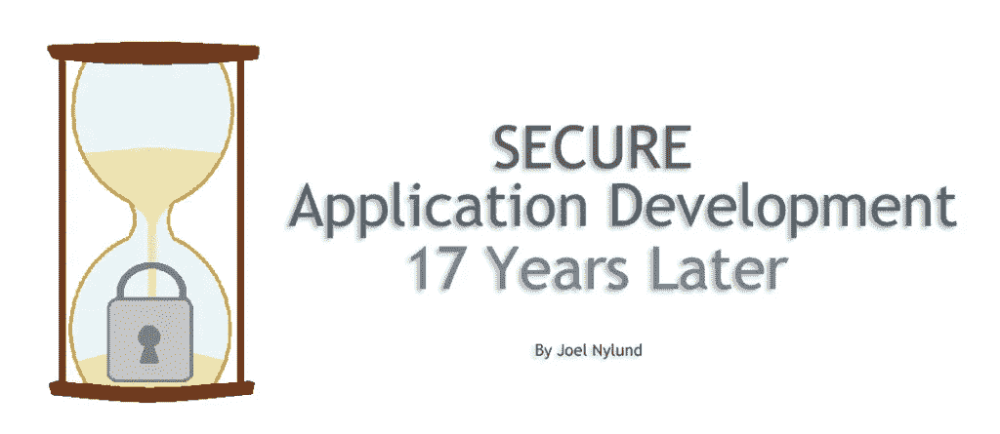
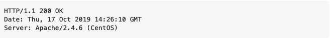
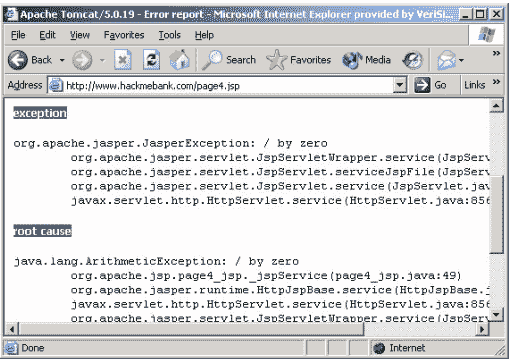
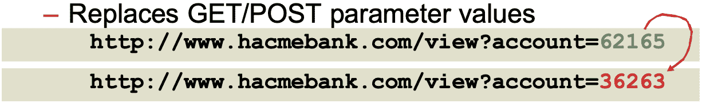
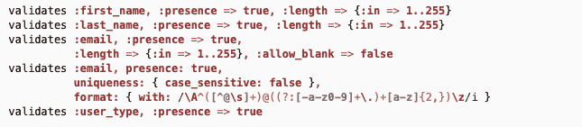
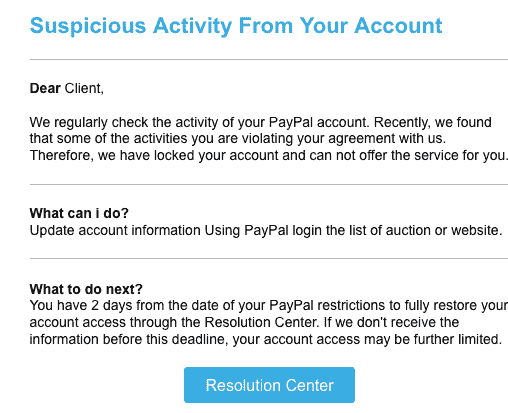
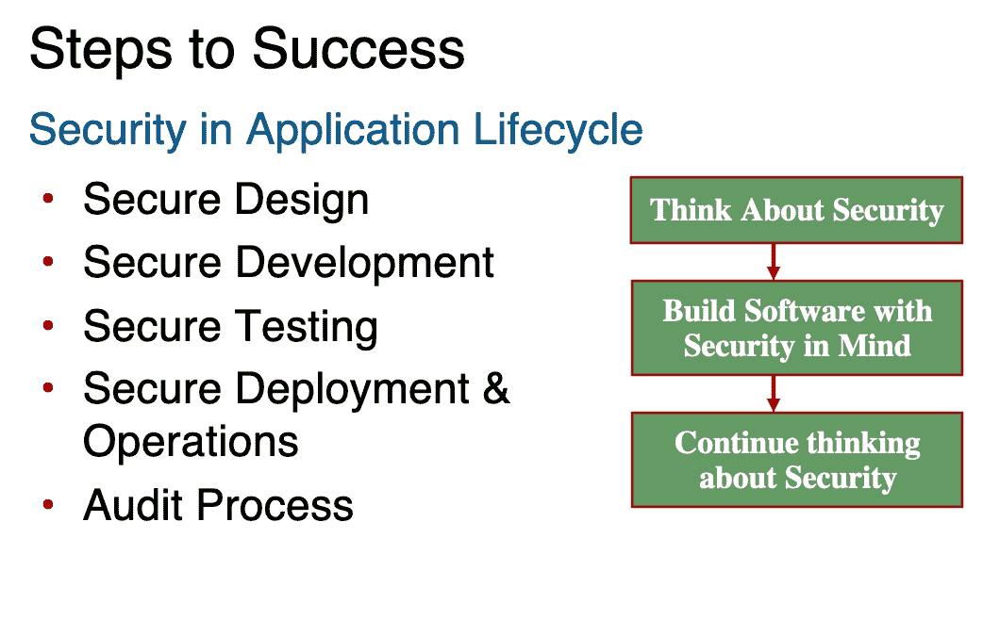
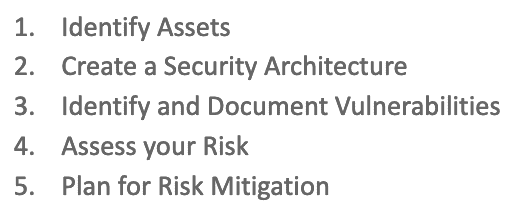

# 17 年后的安全应用开发

> 原文：<https://blog.devgenius.io/secure-application-development-17-years-later-solution-street-blog-81155c83793b?source=collection_archive---------8----------------------->

那是 2004 年。我站在旧金山莫斯康中心一年一度的 Java One 大会的舞台上。当我和我的朋友 Karthik 和 Selva 看着满满一屋子的 1000 多名与会者观看我们的演讲“你被黑了——保护你的企业 Java Web 应用的十个秘密”时，我们吓坏了我们没有意识到有一个额外的房间有另外 500 人在看。好消息是，当我们的演讲开始时，聚光灯非常亮，除了明亮的灯光，我们真的看不到任何东西，所以我们都可以放松下来，好好演讲。应用程序安全性在当时显然是一个热门话题，就像今天一样。

有大量关于安全性的文章、演讲和视频，其中大多数都关注“系统”安全性，重点是锁定网络、操作系统和 SAS 服务。

很少有人谈到构建安全应用程序的“艺术”以及如何做到这一点的过程。

今天我想重温一下我们的 Java One 谈话，回顾一下我们讨论过的内容，看看从那时起有什么变化(如果有的话)。

我们 2004 年的谈话回顾了三个关键领域:

*   互联网威胁模型
*   威胁和减轻威胁的 10 个秘密
*   安全软件开发过程和策略

在我们的谈话中，我们断言四分之三的企业网站容易受到攻击，75%的黑客攻击发生在应用程序级别。2003 年，已知的网络犯罪大约有 1 亿起。

如今，情况更加糟糕。只有 5%的公司系统得到了妥善保护( *Varonis 2019 年全球数据风险报告*)，每分钟都有近 300 万美元因网络犯罪而损失，90%的黑客攻击发生在 web 应用程序级别(*威瑞森 2020 年数据泄露调查报告*)。

2017 年，攻击者从 Equifax 窃取了数亿条记录，总成本超过 14 亿美元。黑客的最初入侵是由 Apache Struts 框架(一个类似 MVC 的框架；2017 年 3 月披露，不久后被黑)。

所以问题是巨大的！我们如何保护我们的系统免受黑客攻击？让我们回顾一下 2004 年的 10 大威胁及其对应的秘密，并讨论这些威胁的普遍性及其秘密在当今世界的相关性。在 2004 年，我们专注于 Java web 应用程序，但是所有这些威胁和秘密适用于任何类型的现代 web 应用程序，包括 Ruby on Rails、Python Django。NET，PHP/Symfony 等等。

**威胁 1** — **剖析** —黑客查看 HTML 代码中的 HTTP 协议头和注释，以判断您运行的是什么类型的系统，以及您可能会受到什么类型的漏洞的攻击。下面是显示 Apache Web 服务器版本和操作系统版本的 HTTP 头。

*显示来自 HTTP 协议报头的过多信息的示例*

**Secret 1** —从 HTTP 报头中删除不必要的信息；不要透露你的网络服务器的版本或任何其他可能被用来攻击你的信息。在部署之前移除 HTML 代码中的所有注释

威胁 1 仍然非常真实。许多[脚本小子](https://en.wikipedia.org/wiki/Script_kiddie)和其他黑客工具包通过检查 HTTP 头和 HTML 中的评论来搜索已知的漏洞，然后对这些服务器进行攻击。如今，许多应用程序都是用 JavaScript 构建的，因此黑客可以利用更多的业务逻辑来逆向工程正在发生的事情，并计划最有效的攻击。你可以[混淆](https://en.wikipedia.org/wiki/Obfuscation_(software))你的代码，但这只会降低它们的速度。

**威胁 2** — **利用不适当的错误处理** —黑客向服务器发送不期望的请求，这导致应用程序泄露堆栈跟踪(这通常对调试有用)，但在这种情况下，黑客使用这些信息来攻击您的服务器。我们可能都见过类似下图的屏幕:

*显示堆栈跟踪的失败错误处理示例*

**秘密 2** —安全失败—在生产模式下(甚至在公共测试系统中)不显示堆栈痕迹。当这种情况发生时，显示一个通用的“呼叫客户服务”类型的屏幕。

威胁 2 今天仍然非常真实。我很惊讶有多少次我在使用一个应用程序时会遇到这些屏幕。一些最大的软件供应商对此感到内疚！

**威胁 3** — **恶意输入数据** —对于这种威胁，黑客使用传递给 URL 的参数试图访问他们不应该访问的数据。出于同样的目的，他们还将更改注入隐藏字段。在某些情况下，它们能够生成一个[缓冲区溢出](https://en.wikipedia.org/wiki/Buffer_overflow)来获得正在运行的进程之外的访问。

*示例参数和隐藏字段篡改*

**秘密 3** —实践输入验证—识别所有可能的输入数据，并确保它在每个请求上都得到验证。永远不要相信你的终端用户会提供安全和正确的数据，每次都要让应用程序仔细检查。不要依赖客户端验证。许多现代框架都有“声明性”验证；利用这一点作为一个好方法来确保一切都得到验证。

*Ruby on Rails 验证示例*

威胁 3 今天仍然非常真实——我认为这是迄今为止我们所涉及的最大问题。现代框架更容易确保验证，但这项工作必须由开发人员来完成，以确保您完全被覆盖！

**威胁 4** — **代码注入** —黑客将代码作为数据传递给应用程序，试图劫持会话、注入 SQL 并向操作系统发送命令。

*举例 SQL 注入*

秘密 4——练习输出编码——我们需要从 HTML 中转义元字符以确保安全。许多框架都内置了转义 HTML 的工具(Rails html_escape 就是一个例子)。对于 SQL，使用静态或准备好的 SQL 语句并绑定变量，这样就不可能注入。将所有系统调用视为“高风险”，并确保调用本身不会因系统的任何输入而改变。

威胁 4 今天仍然是一个大问题。同样，现代 web 框架的使用很有帮助。然而，它仍然不能保证开发人员会做正确的事情，并确保所有的输出都是编码的，所有的 SQL 语句都是静态的。

**威胁 5 —盗窃和操纵数据(传输中和静态)——**黑客利用应用程序无法加密或散列数据的弱点。有时通过不加密或弱/过时的算法。

**秘密 5** —加密您的关键数据，无论是在飞行中还是在休息时，使用强大的加密算法，并定期检查。

今天，威胁 5 是一个巨大的问题。我确信你们都收到了一封来自你们使用的应用程序的电子邮件，告诉你们你们的密码被泄露了。这是因为他们要么没有[散列](https://www.wired.com/2016/06/hacker-lexicon-password-hashing/)他们的密码，要么使用了糟糕的或没有加密的方法。

**威胁 6 —破坏身份验证的利用者** —黑客使用不同的方法，包括字典攻击、暴力破解、重放等，以您的身份登录系统！

**秘密 6** —使用合适的认证模型——所有现代 web 框架都包括一个认证模型/框架——使用其中一个，不要试图发明自己的。大多数这些框架都经过了强化和实战考验。检查有多少人在使用它们，并确保有显示良好覆盖率的测试用例。 [NIST](https://pages.nist.gov/800-63-3/sp800-63b.html) 密码应遵循最佳实践。尽可能使用多因素身份认证，并确保注册安全。测试人员应确保系统中的每个页面都受到保护，方法是在未登录时尝试导航到每个页面。

如今，威胁 6 是巨大的，由于网络钓鱼攻击的扩散，威胁甚至比以前更大。这些攻击向伪装成系统所有者的用户发送邮件，并在用户试图登录“假冒”系统时收集用户的身份验证信息。

*钓鱼邮件示例*

**威胁 7——破坏授权和访问控制的利用者** —黑客通过篡改 URL、使用后退按钮、猜测 URL 和标识符来访问他们本不应该访问的数据/流程。

**秘密 7** —所有框架，Rails，Django，。NET、Java/Spring、Symfony (PHP)，都有内置或可插拔的授权模型/框架——使用它们。确保模型/方法在您的应用程序中得到一致的应用，无论是声明性的还是编程性的，或者是两者的组合。

威胁 7 今天仍然是一个问题。同样，框架在这里很有帮助，但是遵循最佳实践和良好的测试是在应用程序中保持良好授权的关键！

**威胁 8 —利用糟糕的会话管理** —黑客使用回复攻击，或 [cookie 中毒](https://searchsecurity.techtarget.com/definition/cookie-poisoning)，劫持您的会话。

**秘密 8** —实践有效的会话管理—确保使用 HTTPS 创建会话，并且标识符是随机且不可预测的。此外，注销时使会话无效。在 cookies 中加密和存储尽可能少的敏感数据。

如今，由于所有现代 web 框架都遵循最佳实践，并且很难搞砸，所以威胁 8 基本上被减轻了。开发人员仍然应该意识到潜在的问题，但是现在已经通过使用好的框架解决了这个问题。

**威胁 9 —拒绝服务攻击** s —黑客通过发送用尽系统所有可用资源的请求来阻止系统的合法使用。

**秘密 9 —** 限制分配给用户的资源—确保未经验证的用户无权执行消耗资源的操作。尽可能缓存，通过在单击和排队长时间运行的请求后禁用按钮来防止意外的拒绝服务。

云中、移动设备和家用电脑上有如此强大的处理能力，坏人可以利用这一点来协调大规模攻击，从而摧毁最好的系统。今天，这一威胁比以往任何时候都更大！

**威胁 10 —利用最薄弱的环节** —黑客利用 Dev、DevOps、Sys Admins 和 Network Admins 之间的差距，寻找系统中的漏洞。

**秘密 10** —让您的系统保持最新，并锁定您的服务器和 [Pen Test](https://en.wikipedia.org/wiki/Penetration_test) —确保只打开所需的进程和端口，并在每个主要版本上运行渗透测试，以确保您的应用程序是安全的。此外，创建一个技术路线图，以确保您正在更新所有的操作系统、数据库、库和框架。

确保您的所有进程都是使用权限尽可能低的用户运行的。许多人使用 root 来运行他们的进程并连接到他们的数据库，这在出现问题时会导致大麻烦。

最后，确保您的日志足以检测异常，并且不会暴露任何敏感数据(没有密码或信用卡号或 PII)。

我在本文开头提到的花费 Experien 这么多钱的问题是由于没有修补一个框架，所以这个问题在今天非常大，如果不是更大的话。如今互联网上有多少过时/未打补丁的系统？很多很多！

现在，我们已经回顾了威胁，让我们来谈谈流程。在我们 2004 年的演讲中，我们回顾了毁灭的七个步骤:

不幸的是，这就是 17 年后仍有多少商店在开发软件的原因！

然后我们讨论了成功的步骤:

这就是我们在 Solution Street 构建软件的方式！

作为成功步骤的一部分，“应用程序安全审查”至关重要。每个复习过程都不一样，没有一个正确的复习过程。我们认为审查至少应包括以下内容:

因此，在流程总结中，您和您开发团队应该:

*   了解应用程序安全性
*   将应用程序安全性融入您的流程
*   对每个版本进行应用程序安全审查
*   尽可能使用内部和第三方工具实现自动化
*   使用(或创建)实施安全标准的应用程序框架。

我们在 2004 年的谈话中讨论的所有这些项目今天仍然适用！

回顾过去的 17 年，世界发生了很大的变化，但问题、威胁、秘密和良好的应用程序安全流程都是一样的。我希望这份回顾有助于您更多地考虑应用程序安全性。我们都需要更加努力地工作，以确保系统健康、安全和稳定！

*原载于 2021 年 4 月 27 日 https://www.solutionstreet.com***。如需更多精彩文章，请点击* [*订阅*](https://us10.list-manage.com/subscribe?u=6a3b68411070f7dab1adb3a8b&id=f0193ac93e) *我们的简讯！**