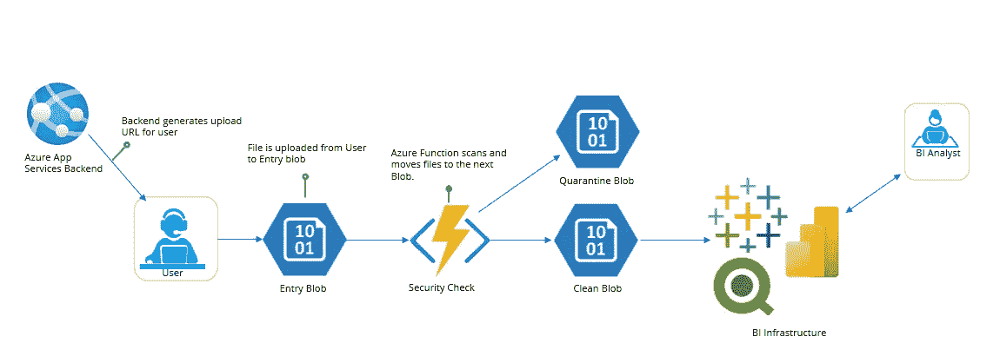

# Azure 中的安全文件上传

> 原文：<https://blog.devgenius.io/secure-file-upload-in-azure-53baee0dc71a?source=collection_archive---------7----------------------->

文件上传是现代应用程序的主要部分，保护文件上传机制是任何应用程序安全团队的首要任务。主要问题？没有标准化的方法来实现这一点。其他攻击媒介，如 SQL 注入，有一些缓解措施，如普遍有效的参数化查询和存储过程。在文件上传的情况下，诸如允许的文件类型、应用程序如何使用文件、应用程序如何存储文件以及文件内容等参数都在如何设计缓解措施中发挥作用。本文将介绍在 Azure 原生环境中实现的保护文件上传的过程。

# **背景**

接下来的用例是桌面应用程序开发过程中安全性工作的一部分。一个主要的应用程序特性是收集诊断数据的能力。这些数据是在应用程序使用过程中收集的，并被发送到应用程序创建者的 BI 基础设施。应用程序生成 XML 文件，这些文件描述了应用程序和最终用户计算机在给定时刻的诊断状态。然后，这些文件存储在应用程序创建的本地文件夹中，并批量上传到后端以供 BI 处理。

# **文章范围**

我们将探索一个应用程序子体系结构，它旨在安全地支持基于文件的数据收集。从前端(最终用户的计算机)将一批文件上传到应用程序的那一刻起，该架构就开始发挥作用，直到数据可以安全地传输到公司的 BI 基础架构。我们将从技术上深入探讨所采用的宏观和微观安全策略。

# **建筑**

清单 1

让我们概述一下清单 1 中的内容。数据按照以下时间顺序从左到右流经体系结构:

1.  后端使用 SAS(共享访问签名)生成上传 URL，并将其发送到前端。
2.  前端将使用上传 URL(有效期约为 90 秒)将 XML 数据文件上传到入口 Blob 存储帐户。
3.  安全检查 Azure 函数监控新上传的入口 Blob，并在每个新文件上传时触发。
4.  Azure 函数将对上传的文件运行安全检查，根据安全检查的结果，文件将从入口 blob 移动到干净 Blob 或隔离 Blob 存储帐户。
5.  移动到干净 Blob 的文件将由公司 BI 基础架构接收。

这种架构将允许未识别的文件上传到入口 Blob，并在干净的 Blob 周围设置安全边界。我们在架构中添加了一个隔离 Blob(而不仅仅是删除不安全的文件),以允许我们分析恶意文件，并在必要时对确定文件是否安全的标准进行调整。

清单 1 所示的子架构适合松散耦合的应用程序。该体系结构独立地支持应用特征，而不增加服务用户的应用组件的开销。以这种方式实现的文件上传功能可以很容易地从应用程序后端添加或删除，只需很少的代码更改。

# **让我们谈谈安全问题**

当映射与我们的用例相关的威胁时，这些是我们将寻求减轻的一些主要威胁。

风险:

1.  攻击者可能会滥用后端生成的 URL 来上传恶意软件文件，而不是有效的 XML 诊断数据文档。
2.  攻击者可以更改本地存储的有效 XML 诊断数据中的 XML，以包含 XML 实体(外部或内部),这可能导致诸如 XXE、十亿次大笑、SSRF 等攻击，这些攻击将攻击 BI 基础架构或流处理中的不安全 XML 解析器。
3.  未经确认的无限制文件上传可让攻击者对我们的应用程序进行“成本 DDoS ”,这意味着攻击者将向入口 Blob 上传大量文件。由于 Blob 存储可以扩展到任何存储的数据量，这种类型的攻击会极大地增加公司的云成本。

# **缓解**

我们可以立即解决风险 3——“DDoS 成本”。这里的缓解很简单，也相对容易。当生成将被发送到前端的上传 URL 时，允许本地收集的文件被上传到条目 Blob，该 URL 用共享访问签名(SAS)签名。这是 Azure storage 内置的一项功能，它授予对存储资源的“一次性、有限时间”访问权限。在我们的用例环境中，我们能够将 SAS 授予的权限设置为“仅上传”，URL 的有效时间为 90 秒，并确保权限仅授予条目 Blob。

这种上传实现将减轻“成本 DDoS”的威胁，因为攻击者只有 90 秒的时间来使用上传 URL，之后 SAS 将使 URL 无效。这个时间限制将确保从前端挖出上传 URL 的攻击者不能滥用它。

使用安全检查 Azure 功能缓解了威胁 1 和 2。

通过确保给定的文件确实是有效的 XML 文件，可以减轻威胁 1。这是通过验证文件扩展名、文件大小并确保文件被成功解析为 XML 文件来完成的。

针对威胁 2 的主要缓解措施是基于这样一个事实，即我们(应用程序)生成了要上传到入口 Blob 的 XML 文档。这使我们能够创建一个被认为是有效的和预期的 XML 标记的白名单。这是一个关键的缓解措施，因为应用程序将生成一个通用的 XML 文档，其中不包括外部实体、内部实体或 XML 变量。将上传的 XML 文件的标签与白名单中显示的值进行匹配将确保只显示已知的标签。威胁 2 的第二个缓解措施是对传递给每个标签的属性值实施黑名单。黑名单由可疑的特殊字符组合组成。没有使用 XML 变量或 URL 作为 XML 属性值，这意味着变量调用或 URL 的存在是对 XML 进行篡改的证据。

现在我们已经理解了底层策略，让我们进入技术实现。以下代码是 Azure 函数完成的安全检查。

# **代码**

清单 2

安全检查由“check_xml_file”和“main”函数组成。让我们从“主”函数开始。此函数接受' func。“InputStream”作为输入，将其命名为“myblob”。这是 azure-functions python 库提供的一个类似文件的对象。这将允许我们获取上传到条目 Blob 的文件的内容、字节长度和名称。我们将对这个对象进行安全检查，它代表了上传到入口 Blob 的最新文件，并触发了 Azure 函数的当前迭代。

第 26–38 行的 main 函数建立了它需要的到 Clean Blob 和 Quarantine Blob 存储帐户的连接。这包括从 Azure key vault 中检索连接字符串(第 28–30 行)和创建到存储帐户的连接(第 31–38 行)。

有趣的部分从第 43 行开始，我们从对文件名进行正则表达式检查开始，确保它具有. xml 扩展名，并确保文件小于 100KB。请注意，我们在第 59 行有一个对应的“else”语句，如果第 43 行的两个条件都不满足，它将把文件发送到隔离区。

接下来，我们在第 44 行有一个“try”语句，这将启动“check_xml_file”函数，将扫描 xml 标记和属性。我们在这里使用了“try-except”块，以确保如果“check_xml_file”函数中有错误，例如 xml 解析不正确，我们在第 55 行有一个“except”语句，它将确保文件被发送到隔离区。

太好了！让我们进入第 10 行的‘check _ XML _ file’函数。

这个函数遍历 XML 树结构，到达 XML 文档中的每个标签和属性。第 14 行的‘if’语句将当前迭代中树元素的标签与第 9 行的标签白名单进行匹配。如果标签不在列表中，标签被附加到第 11 行声明的' diff '数组中。

如果在第 9 行的白名单中确实找到了标签，那么第 18 行的‘elif’语句将在迭代中对树元素的属性值执行黑名单检查。如果同时存在$和，该检查会将树元素标记添加到“diff”数组中；在属性中找到(这可以指向 XML 变量调用—$ var 1；).此外，如果在属性中找到://，指向属性值中的 URI，则“diff”数组将被添加到。

最后，main 函数将接收“diff”数组的返回值(第 47 行),并在第 48 行测量数组的长度。如果返回的数组是空的(意味着在‘check _ XML _ file’的任何迭代中没有标签被添加到数组中)，则文件将被发送到 Clean Blob。在所有其他情况下，文件将被发送到隔离 Blob。

# **外卖**

确保文件上传的安全绝对是件棘手的事情。在处理用户提供的文件时，总会有大量的未知因素，这种不确定性可能是应用程序以意想不到的方式运行的地方。

大多数人将面临与本文描述的不同的文件上传用例。以下是一些有助于重建整体安全策略的提示。

1.  当实现安全检查时，总是寻找可以编译成白名单的属性。这并不总是可能的，但是我们的想法是获取尽可能多的期望值参数，并确保期望值反映在验证过程中。
2.  让攻击者的日子不好过！清单 2 第 18 行的黑名单安全检查寻找一些在 XML 中可能被误解的特殊字符。尽管我们能够在这种情况下实现高级白名单方法，但我也知道我们不希望出现某些可能表示危险的特殊字符。这些并不是 XML 识别的唯一特殊字符，攻击者还可以尝试使用其他字符，但是为什么不增加难度呢？
3.  错误≠失败——错误处理在很多情况下既是开发人员的问题，也是安全问题。对应用程序的错误请求会产生错误，但这并不意味着攻击者的恶意操作也会失败。在清单 2 的第 55 行，我们将导致错误的可疑文件发送到隔离区。如果我们在第 48 行使用了一个简单的`if len(input_file) == 0:`,没有包含在‘try-except’块中，一个没有被正确解析的潜在恶意文件将永远不会被发送到隔离区。