# 使用 ReactJS 配置 Azure AD B2C 登录

> 原文：<https://blog.devgenius.io/secure-login-in-reactjs-with-azure-ad-b2c-fc0f919db1dc?source=collection_archive---------0----------------------->

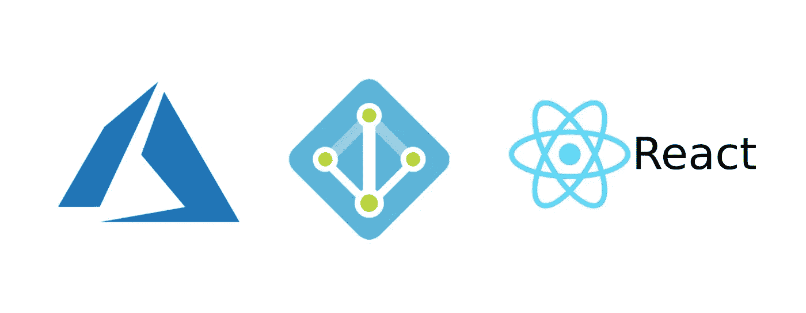

我打算写这篇文档，因为我无法找到 Cleary 提到的如何使用 Azure active Directory b2c 设置 react 前端登录的完美文档。

在学习本教程之前，我将简要讨论一下什么是 Azure active directory b2c 及其优势。Azure Active Directory B2C 提供企业对客户身份即服务。应用程序的客户可以使用他们首选的社交、企业或本地帐户来获得对您的应用程序的单点登录访问。它使用可以下拉作为主题如下。如需详细信息，请访问[https://docs . Microsoft . com/en-us/azure/active-directory-B2C/](https://docs.microsoft.com/en-us/azure/active-directory-b2c/)

*   定制品牌的身份解决方案(您可以根据需要定制登录)
*   使用用户提供的身份进行单点登录访问
*   与外部用户存储集成
*   渐进剖析
*   第三方身份验证和校对

**先决条件**

1.  拥有 Azure 帐户。如果没有，请访问 https://azure.microsoft.com/en-us/
2.  基本反应知识
3.  b2c 活动目录租户。如果你还没有一个[https://docs . Microsoft . com/en-us/azure/active-directory-B2C/tutorial-create-tenant](https://docs.microsoft.com/en-us/azure/active-directory-b2c/tutorial-create-tenant)请跟随教程？

好吧，我们开始吧，

首先使用链接[https://portal.azure.com](https://portal.azure.com/)登录你的 azure 门户，点击过滤器按钮，将目录更改为创建的 azure b2c 租户

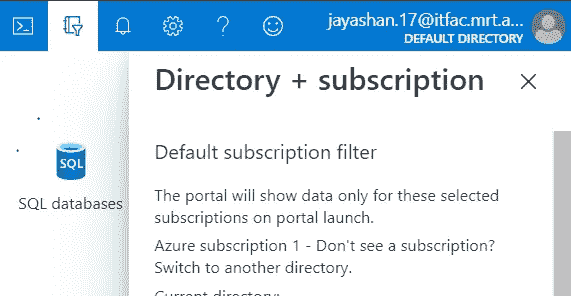

*   然后点击所有服务并搜索 **Azure AD B2C**
*   点击**应用**然后点击**添加**然后用一个唯一的名称填写表格，如下图

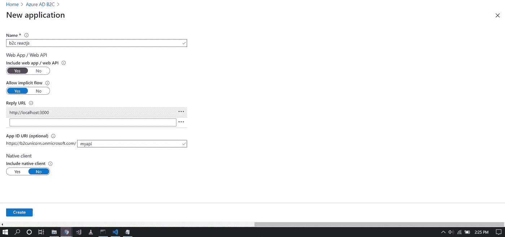

使用此 URI，您将允许您的应用程序访问您的目录中的某些功能。例如，这可能是读取用户配置文件信息。

创建应用程序后，您必须获得足够的许可，请遵循以下步骤

1.  点击**应用**标签
2.  单击您刚刚创建的应用程序。
3.  点击 **API 访问**标签
4.  点击 **+添加**
5.  从**选择 API** 下拉菜单中选择步骤 4 中的应用程序。
6.  选择“代表登录用户访问此应用程序…”
7.  点击**确定**

然后点击创建按钮

在 Azure AD B2C 的左窗格中，你可以找到名为**用户流**的标签。

然后点击 **+新用户流量**

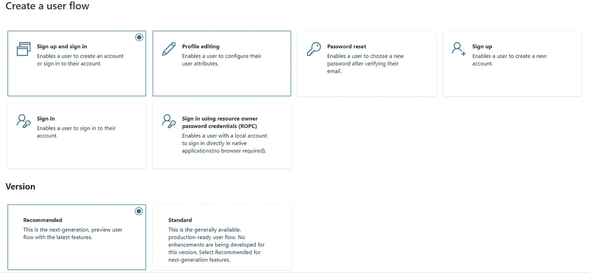

然后点击**注册并登录**然后选择版本下的**推荐**并点击**创建**

之后，给你的用户流起一个名字，勾选电子邮件注册，并在返回令牌中勾选你想要的详细信息，如下图所示

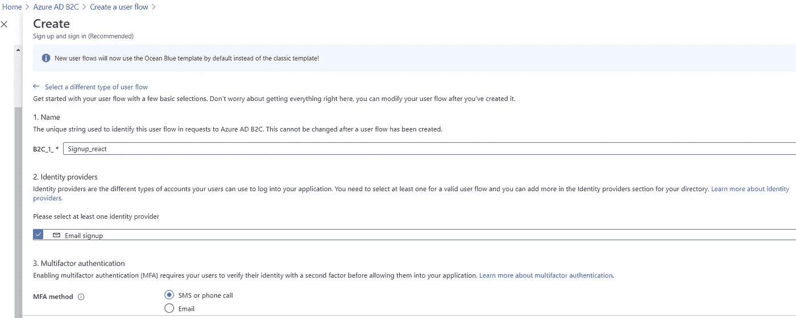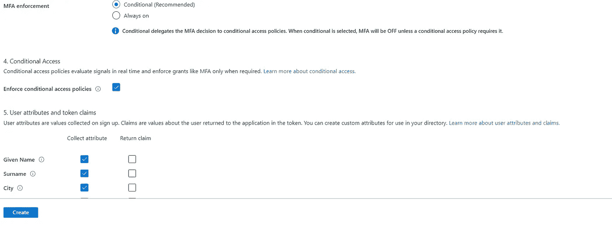

现在您可以看到创建的用户流，甚至可以使用**运行用户流**来运行用户流

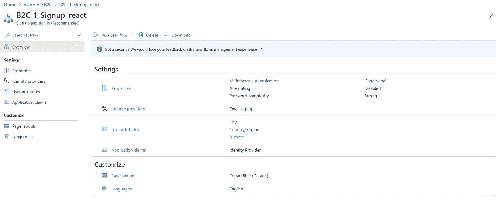

# 现在让我们从创建一个新的 ReactJS 项目开始

转到您希望创建 reactjs 应用程序的目录，键入下面的命令在 cmd opened 中创建 react。

```
$ npx create-react-app b2c-react
```

现在，通过键入以下命令导航到新创建的项目目录

```
$ cd b2c-react
```

运行 react 应用程序

```
$ npm start
```

我将讨论两种方法来实现使用 Azure Active Directory B2C 在 reactJS 应用程序中获取创建登录的目标。

# **方法一**

首先，我将访问使用微软提供的库创建的 b2c 用户流，该库使用 **msal** 库。

为此，创建一个名为 B2c.js 的新文件，并添加所提供的代码

*注意，您必须根据您创建的实例配置 msalAppConfig*

也就是说，

```
var msalAppConfig = {auth: {clientId: '<client Id>',authority:'https://<TenantSubDomain>.b2clogin.com/<Tenant>/<signInPolicy>',redirectUri: '<Redirect Url>',validateAuthority: false,postLogoutRedirectUri: 'window.location.origin'},cache: {cacheLocation: 'sessionStorage',storeAuthStateInCookie: isIE()}
```

现在需要替换 Azure AD B2C 应用程序中值的<>项。

为了获取**租户的价值，**回到你的 Azure AD B2C 目录。在概述下，复制“域名”字段中的值。

**租户**子域是 onmicrosoft.com 之前租户的第一部分。

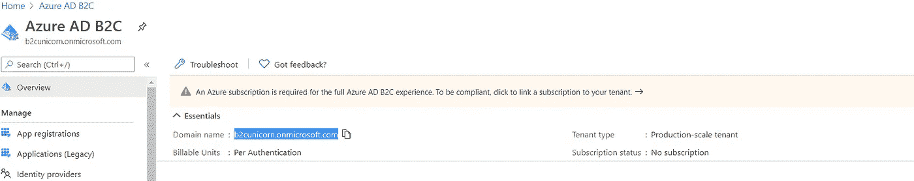

现在，要获取 **clientId** ，单击**应用程序**标签，并从新创建的应用程序中复制 Id，替换**应用程序 Id** 字段中的值。

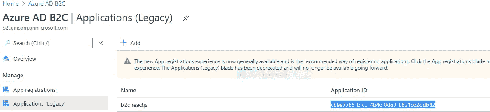

现在单击**用户流(策略)**标签，复制策略的名称并替换 **signInPolicy** 字段中的值。

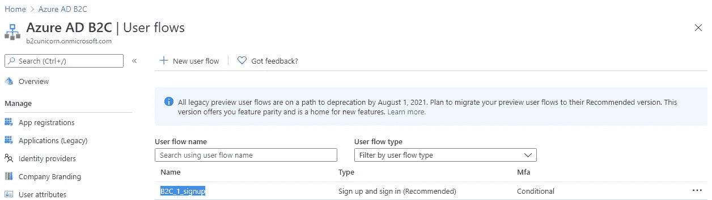

完整的 B2c.js 会是这样的

然后编辑 index.js，如下所示

# **方法二**

这是使用第三方库开发的登录 azure 活动目录 b2c。这个库很适合这个任务，如果你不需要特殊的配置，我推荐你使用它。为此，请使用以下命令安装库。

```
$ npm install react-azure-b2c --save
```

然后根据从 Azure active directory 获得的上述信息配置以下对象。

那么您的 index.js 文件应该如下所示

在方法一或方法二之后，你可以使用安全的 Azure active directory 登录。重定向的门户将如下所示。

你将能够自定义界面，如你所愿，我希望在未来写它。

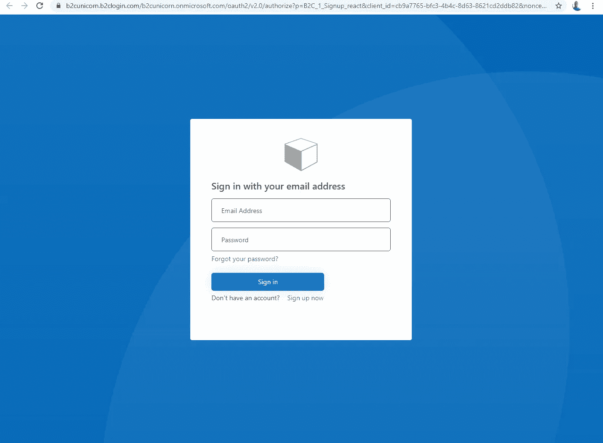

**结论**

Azure active directory 将管理用户，并以更安全的方式登录您的前端。在这篇文章中，我讨论了两种方法来实现它。我更喜欢方法二，因为它让你的生活变得简单。但是，如果你有一个问题，使用第三方库，然后微软提供的库方法一更好。