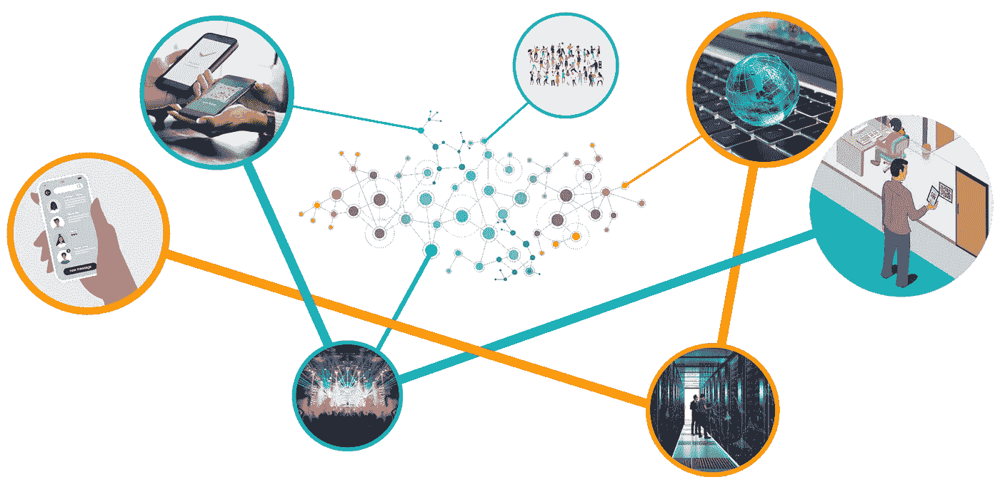

# 安全信使简单聊天 1.0 版已经发布！

> 原文：<https://blog.devgenius.io/secure-messenger-simplex-chat-v1-0-has-been-released-b0e3e7c75172?source=collection_archive---------5----------------------->

我把 Evgeny Poberezkin 发布的关于最近发布的[SimpleX Chat](https://github.com/simplex-chat/simplex-chat)v1 的资料收集到一处，感谢 [Reddit](https://www.reddit.com/r/selfhosted/comments/s2hil6/simplex_chat_v1_released_the_most_private_and/) 、 [GitHub](https://github.com/simplex-chat/simplex-chat) 和[他的个人博客](https://www.poberezkin.com/)。当前版本是稳定的、健壮的，可以在所有主要桌面平台(Linux/Mac/Win)和 Termux 中的 [Android 手机上从终端(命令行)使用！](/how-to-compile-haskell-on-termux-for-aarch64-architecture-cc15375d3595?gi=716e84ae774e)

[SimpleX](https://github.com/simplex-chat/simplex-chat) 是分布式互联网应用的新平台，在这种应用中，消息和网络的隐私最为重要。

目前还没有尊重用户隐私和保证元数据隐私的消息应用程序——换句话说，消息可能是隐私的，但第三方总是可以通过检查中央服务和连接图来查看谁在与谁通信。SimpleX 的核心是设计成真正分布式的，没有中央服务器。这允许以低成本获得巨大的可伸缩性，同时也使得窥探网络图变得几乎不可能。最简单的通信协议是这样的:

# 单一目标

*   为分布式应用程序提供消息传递基础设施。这种基础设施需要具有以下特性:
    ▴安全性针对被动和主动(中间人)攻击:各方应该具有可靠的端到端加密，并且能够检测修改、删除或添加消息的主动攻击者的存在。
    ▴隐私:防范流量关联攻击，确定用户与之通信的联系人。
    ▴可靠性:即使某些参与的网络服务器或接收客户端出现故障，消息也应被传递，并保证“至少一次”传递。
    ▴完整性:单向发送的消息按照发送方和接收方同意的方式排序；收件人可以检测邮件何时被删除或更改。异步交付:不应该要求通信双方(客户端设备、服务或应用程序)都在线才能进行可靠的消息交付。
    ▴低延迟:除底层 TCP 网络延迟外，网络引入的延迟不应高于 100ms-1s。
*   提供比其他即时消息解决方案更好的通信安全性和隐私性。特别是 SimpleX 提供了更好的元数据隐私(谁在何时与谁交谈)和更好的安全性来抵御活跃的网络攻击者和恶意服务器。
*   平衡用户体验和隐私要求，优先考虑移动设备用户的体验。

# 相比之下

单工网络的设计类似于 P2P 网络，但不同于大多数 P2P 网络，它由客户端和服务器组成，不依赖于任何集中式组件。与更传统的消息应用程序(如 WhatsApp、Signal、Telegram)相比，单工网络的主要区别在于:

*   参与者不需要全球唯一的地址来通信，相反，他们使用冗余的单向(单工)消息队列，每个联系人有一组单独的队列。
*   连接请求在带外传递，不可选择地保护密钥交换免受中间人攻击。
*   客户端使用网络服务器提供的简单消息队列来创建更复杂的通信场景，例如双工一对一通信、传输文件、没有中央服务器的群组通信以及内容/通信信道。
*   服务器不存储任何用户信息(没有用户配置文件或联系人，也没有发送的消息)，主要使用内存持久化。
*   用户可以在中断最少的情况下更换服务器，甚至在正在使用的服务器消失后，只需更改在哪些服务器上创建新队列的配置。

# **1.0 版本**

**消息加密已经过彻底重新设计，可提供前向保密性和从入侵中恢复。**

**单工聊天 v1 现在使用:**

*   [双棘轮](https://www.signal.org/docs/specifications/doubleratchet/)使用 AES-256-GCM 密码的 E2E 加密与 [X3DH 密钥协议](https://www.signal.org/docs/specifications/x3dh/)使用 2 个短暂曲线 448 密钥导出棘轮初始化的秘密。这些密钥和秘密对于每个联系人、组成员和文件传输是独立的。
*   除了双棘轮之外，每个消息队列中还有单独的 E2E 加密，使用 Curve25519 和 [NaCl 加密盒](https://nacl.cr.yp.to/index.html)进行 DH 密钥交换——添加了单独的 E2E 加密，以避免单个联系人的消息队列之间有任何共同的密文(以防止流量关联)。
*   还使用 Curve25519 DH exchange 和 NaCl 加密盒对从服务器发送到收件人的消息进行额外加密，以避免在发送和接收的流量中共享密文(同时防止流量关联)。

**改进的用户和服务器认证和传输**

SimpleX 现在使用短暂的 Ed448 密钥来签署和验证发送给服务器的客户端命令。和以前一样，这些键对于每个消息队列都是不同的，并且不代表用户的身份。

我们现在使用 TLS 1.2+代替特别加密传输，仅限于最高效和最安全的带转发保密的密码(ECD he-ECD sa-chacha 20 poly 1305-sha 256)、Curve448 组和 Ed448 密钥。

服务器身份作为 TLS 握手的一部分进行验证—离线服务器证书的指纹用作包含在服务器地址中的永久服务器身份，以防止客户端和服务器之间的 MITM 攻击。

SimpleX 还在发送给服务器的每个签名客户端命令中使用 [tls 唯一通道绑定](https://datatracker.ietf.org/doc/html/rfc5929#section-3)来防止重放攻击。

**协议编码的变化**

我们从效率低下的基于文本的低层协议编码(简化了早期开发)转向空间和性能高效的二进制编码，将协议开销从传输的应用程序消息大小的大约 15%减少到 3.7%。

# 威胁模型

**全局假设**

*   用户保护他们的本地数据库和关键资料
*   用户的应用程序是可信的，并且没有运行本地恶意软件
*   正在使用的加密原语没有被破坏
*   用户对服务器的选择与他们的身份没有直接联系，也不代表用户的区别信息。

**被动对手能够监控一个用户的流量**

***可以:***

*   识别用户何时使用单工
*   阻塞单工业务
*   确定用户与哪些服务器通信
*   观察发送了多少流量，并猜测其目的。

***不能:***

*   查看谁向用户发送消息，以及用户向谁发送消息

**被动的对手能够监控一组发送者和接收者**

***可以:***

*   确定谁在何时使用 SimpleX
*   了解哪些单工消息传递协议服务器用作哪些用户的接收队列
*   了解何时发送和接收邮件
*   针对发件人和收件人执行流量关联攻击，并关联受监控组内的发件人和收件人，因服务器上的用户数量而受挫
*   观察发送了多少流量，并猜测其目的

***不能，即使在传输协议受损的情况下:***

*   执行流量相关性攻击，效率比未受损的传输协议有所提高

**单工消息协议服务器**

***可以:***

*   了解队列收件人或发件人何时联机
*   知道有多少消息通过队列发送(尽管有些可能是噪音)
*   通过重用的传输连接、用户的 IP 地址或连接定时规则来执行队列关联(将多个队列与单个用户匹配)
*   了解用户的 IP 地址，通过他们用来访问同一队列的其他 IP 地址跟踪他们，并根据 IP 地址推断信息(例如雇主)，只要不使用 Tor。
*   丢弃所有将来插入到队列中的消息，这些消息只能在其他冗余队列中检测到
*   向接收者和/或发送者谎报队列的状态(例如，当队列状态不是挂起或删除时)。
*   向用户发送无效邮件

***不能:***

*   无法察觉地添加、复制或破坏单个邮件
*   不可检测地丢弃单个消息，只要后续消息被传递
*   了解信息的内容
*   除了通过定时规则之外，将噪声消息与常规消息区分开
*   通过主动攻击危及用户的端到端加密

**获得爱丽丝(解密)聊天数据库的攻击者**

***可以:***

*   查看 Alice 与其通信伙伴交换的所有消息的历史记录
*   查看联系人和群组的共享个人资料
*   秘密地接收通过现有队列发送给爱丽丝的新消息；直到通信队列被轮换或者双棘轮向前推进
*   阻止 Alice 接收发送给她的所有新消息—要么通过定期清空队列来秘密地接收，要么通过删除队列来公开地接收
*   将用户的消息发送给他们的联系人；只要用户发送下一条消息，接收者就会检测到它，因为前一条消息的散列不匹配(如果他们没有保留前一条棘轮密钥，就可能无法解密它们)。

***不能:***

*   模拟发件人，向数据库被盗的用户发送消息。这样做还需要在以后危及服务器(将消息放入队列，直到双棘轮向前推进，这是可能的)或用户设备(将消息放入数据库)。
*   无法察觉地与爱丽丝同时与她的联系人交流。这样做会导致联系人收到不同的重复 id 的消息。
*   当第二个订阅请求取消第一个订阅并通知第二个订阅请求时，实时监控消息队列，而不提醒用户他们正在这样做。

**一个用户的联系人**

***可以:***

*   向用户发送垃圾邮件
*   永远保留来自用户的消息

***不能:***

*   用密码向第三方证明消息来自用户(假设用户的设备没有被没收)
*   证明他们拥有的两个联系人是同一用户
*   无法与用户的另一个联系人协作来确认他们正在与同一用户通信

**攻击者观察到 Alice 向 Bob 显示介绍信息**

***可以:***

*   把鲍勃假扮成爱丽丝

***不能:***

*   把爱丽丝假扮成鲍勃

**具有互联网访问权限的攻击者**

***可以:***

*   拒绝服务单工消息服务器
*   向用户的公共“联系队列”发送连接请求

***不能:***

*   向与他们没有联系的用户发送消息
*   枚举单工服务器上的队列