# 使用 Firebase + AWS API Gateway 保护您的 API

> 原文：<https://blog.devgenius.io/secure-your-apis-with-firebase-aws-api-gateway-199b1eda1da3?source=collection_archive---------0----------------------->

## 轻松保护 API


Georg Bommeli 在 [Unsplash](https://unsplash.com?utm_source=medium&utm_medium=referral) 上的照片

A **PI** 近年来被誉为一个新的利润丰厚的渠道，许多公司通过 API 公开他们的服务来赚钱。由于数字应用和大数据的激增，API 如今在交付令人惊叹的功能方面发挥着至关重要的作用。虽然商业案例是 API 成功的关键，但是安全性是最重要的。如果没有适当的安全保护，API 将是一个灾难，导致无休止的诉讼和严重违反安全的巨额罚款。

**什么是 API？**

应用程序接口用于计算机系统之间的通信。API 本身并不能为最终用户提供价值，而是客户端应用程序使用多个 API 来提供有意义的业务功能。一般来说，移动应用程序是典型的例子，它们依靠 API 与后端系统通信，以进行数据检索和请求提交。许多创业公司提供 API 作为服务，如通过人工智能分析提供实时股市数据。

**什么问题？**

尽管安全保护很重要，但是许多 API 开发者为了节省更多的时间在业务功能上，跳过了安全控制或者仅仅构建了一个简单的保护。事实上，API 保护的实现可以简单地通过设置 API 网关和认证服务等基础设施组件来完成，而开发人员仍然可以专注于业务功能的开发。

在本文中，我将概述 API 安全的常见实践，并说明如何通过采用流行的基于云的服务来实现安全措施——Firebase 身份验证服务和 AWS API 网关。

# API 安全性一览

策略是应用多层保护—网络/ HTTP 协议层、端点保护以及身份验证和授权。

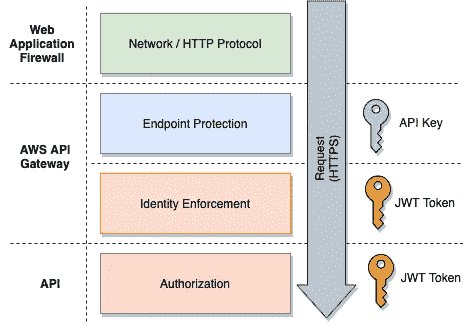

API 安全性一览

*   **加密** —所有流量都在安全的 HTTPS 通道中传输
*   **Web 应用防火墙** —对 Web 端点的全面保护
*   **端点保护** —使用 API 密钥作为标识符的节流和使用配额
*   **身份执行** —基于访问令牌验证身份
*   **授权** —根据请求细节和访问令牌，检查作为 API 逻辑一部分的访问权限

可以对私有 API 应用额外的安全控制:

*   IP 白名单
*   相互证书认证

# 端点保护

由于每个业务逻辑都可以作为一个 API 公开，所以一个应用程序可以有 20 多个 API。随着 API 数量的快速增长，如果没有适当的策略，API 管理可能是一场噩梦。这是因为在单个 API 上重复手动设置访问控制绝对是一种低效且容易出错的方法。因此，API 网关应运而生，集中管理 API。

API gateway 提供了广泛的服务，如速率限制、使用控制和身份执行。

## 节流

为了保护您的 API 免受大量传入请求的冲击，强烈建议限制速率。您可以定义每秒允许的最大请求数。如果请求速率超过最大值，API 网关拒绝请求。

## **爆裂**

尽管您允许每秒最多 5，000 个请求，但您可能不希望在 10 毫秒内涌入所有 5，000 个请求。如此巨大的流量可能会使您的底层 API 和数据存储陷入瘫痪，在更糟糕的情况下会导致服务中断。API gateway 提供了名为**突发**的特性，这样你就可以控制 API gateway 在短时间内将多少请求路由到你的后端资源。

可以在下面的 AWS API 网关配置中设置限制和突发设置:

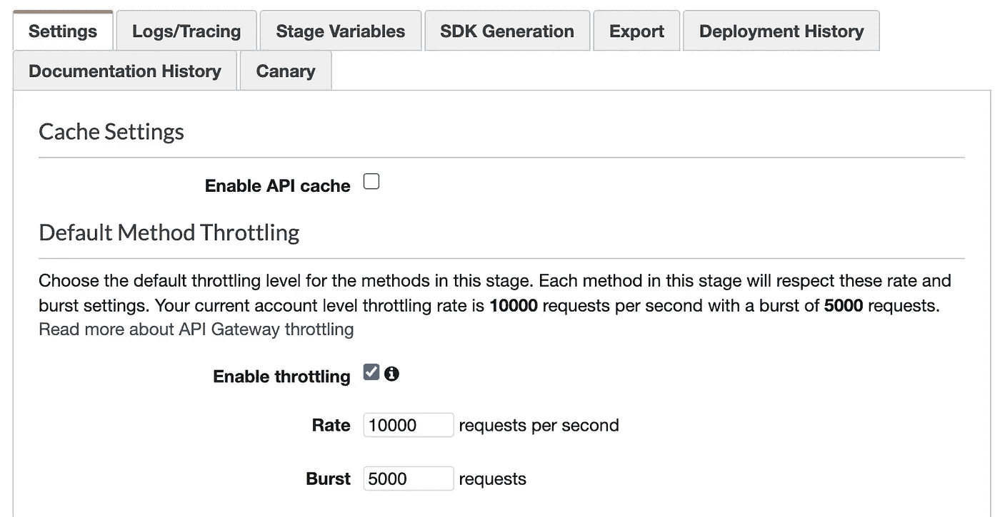

AWS API 网关—默认节流配置

## API 密钥

API 键是识别请求源的一种常用方法。例如，你同意你的客户使用你的资源。您生成一个唯一 API 密钥并分发给他们，这样 API 网关就能够识别来自特定客户端的流量，因为 API 密钥嵌入在每个请求的报头中。您可以在 AWS API 网关控制台中生成和管理 API 密钥。

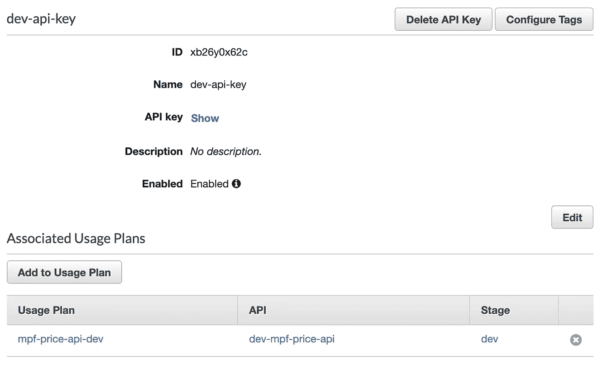

AWS API 网关— API 密钥管理

## 使用计划

通过 API 密钥设置，可以根据服务协议对每个客户端应用速率限制和使用配额。以下示例显示了 API 使用计划—最大值。每月 5000 次呼叫，100 次速率限制和 50 次突发控制。使用计划中指定的速率限制和突发控制会覆盖默认设置。

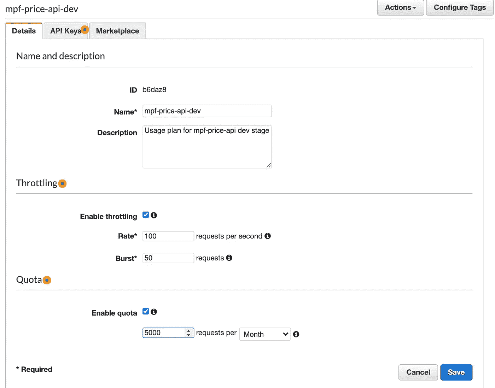

AWS API 网关—节流和使用计划

# 身份实施

API 密钥是客户端应用程序的标识符，如果不引入额外的安全措施，就无法验证最终用户的身份。建议采用 OAuth 来进一步保护您的 API，因为它提供了用户认证、令牌过期和令牌更新的解决方案。我将解释它是如何工作的，以及使用 Firebase 作为认证服务在 AWS API gateway 上的实现。

OAuth 是一种流行的开放式授权标准协议，下面的参考资料有助于您理解它是如何工作的。

[](https://www.digitalocean.com/community/tutorials/an-introduction-to-oauth-2) [## OAuth 2 |数字海洋简介

### OAuth 2 是一个授权框架，它使应用程序能够在 HTTP…

www.digitalocean.com](https://www.digitalocean.com/community/tutorials/an-introduction-to-oauth-2) 

OAuth 中的一个关键组件是认证服务，它验证用户的身份并颁发一个令牌作为身份证明。

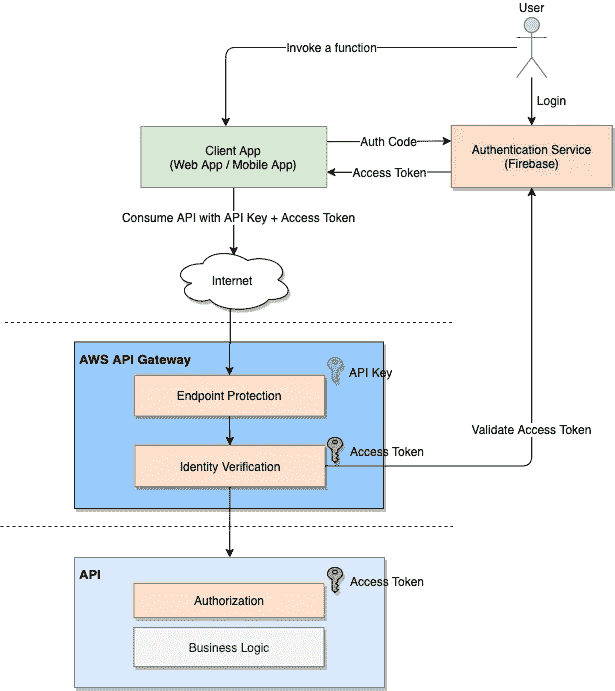

## Firebase 认证

Firebase 是一个基于云的服务，提供一整套有利于应用程序开发的服务。认证服务是其强大的功能之一。

要实现登录功能，您可以设置登录 ID 和密码，或使用众所周知的第三方服务登录，如谷歌，脸书。请参考本文的详细内容和示例代码。

[](https://medium.com/dev-genius/firebase-the-way-to-fast-track-authentication-implementation-of-your-app-2e93f42002b) [## Firebase —快速跟踪应用程序身份验证实施的方法

### Firebase 身份验证实现的演练

medium.com](https://medium.com/dev-genius/firebase-the-way-to-fast-track-authentication-implementation-of-your-app-2e93f42002b) 

一旦用户成功登录，Firebase 就会生成一对令牌:

*   **访问令牌**—一种短期令牌，用作同意资源访问的证明。(通常有效期为 15 分钟至 1 小时)
*   **刷新令牌** —用于在访问令牌过期或即将过期时，重新生成一对新的访问令牌和刷新令牌。

## API 请求中的安全令牌

当向 API 提交请求时，您将在 HTTP 头中放入两个令牌——API 密钥和访问令牌。API 密钥是关于节流和配额的第一级访问控制的标识符，而访问令牌是第二级控制，因此 API 网关确保请求是由经过身份验证的用户提交的。

下面的示例代码演示了一个 javascript 函数如何使用 Firebase SDK 生成访问令牌，并提交给一个 API，在 HTTP 头中包含 API 密钥和访问令牌

使用 API 密钥+访问令牌消费 API

# API 网关如何验证访问令牌？

在进入令牌验证之前，请花点时间了解访问令牌的基本知识。

## JSON Web 令牌(JWT)

访问令牌不仅仅是一个简单的代码，它还包括数据字段，如身份信息、有效性、完整性证明和其他用于授权检查的信息。JSON Web Token (JWT)是一个开放的标准，定义了身份信息的表示格式，支持数字签名。认证成功后，认证服务生成并签署 JWT 令牌，客户端应用程序将 JWT 令牌作为身份证明嵌入到 HTTP 请求中，以使用 API。

如果你想深入了解更多细节，这里有 JWT 规范的链接

 [## RFC 7519 - JSON Web 令牌(JWT)

### 互联网工程任务组(IETF) M. Jones 请求评论:7519 微软类别:标准跟踪 J…

tools.ietf.org](https://tools.ietf.org/html/rfc7519) 

简而言之，JWT 包含 3 个部分 BASE64 编码的报头、有效载荷和签名，由点( .)

```
***[header].[payload].[signature]***
```

如果你解码头部和有效载荷部分，你会发现它们实际上是 JSON 格式的。下面的截图显示了解码后的内容

*   **头** —描述应用于令牌的加密操作，如密钥 id 和算法
*   **有效载荷** — 包含身份和有效性，例如，发行人 id、到期时间、发行时间等。

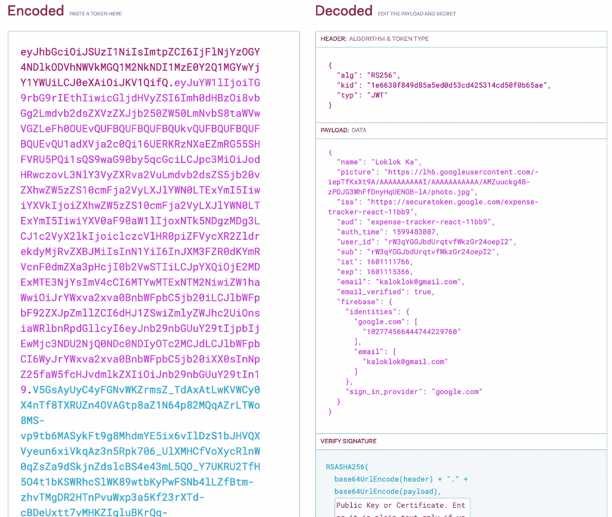

JWT 令牌—编码和解码的内容

## 访问令牌验证逻辑

记住了 JWT 结构，您就理解了令牌验证。下面是确定访问令牌是否有效的步骤:

1.  使用发行者的公钥验证签名以检查完整性
2.  解码令牌并检查有效负载，如到期时间，以验证令牌状态

别担心，你不需要从头开始写程序。由于 JWT 是一个开放标准并被广泛采用，因此我们可以使用大量的开源库来进行令牌签名和验证。只需访问 https://jwt.io/,，它会向您显示 30 多种编程语言的可用库列表。

例如， **jsonwebtoken** 和 **jose** 是节点，js 库支持 JWT 令牌的签名和验证。

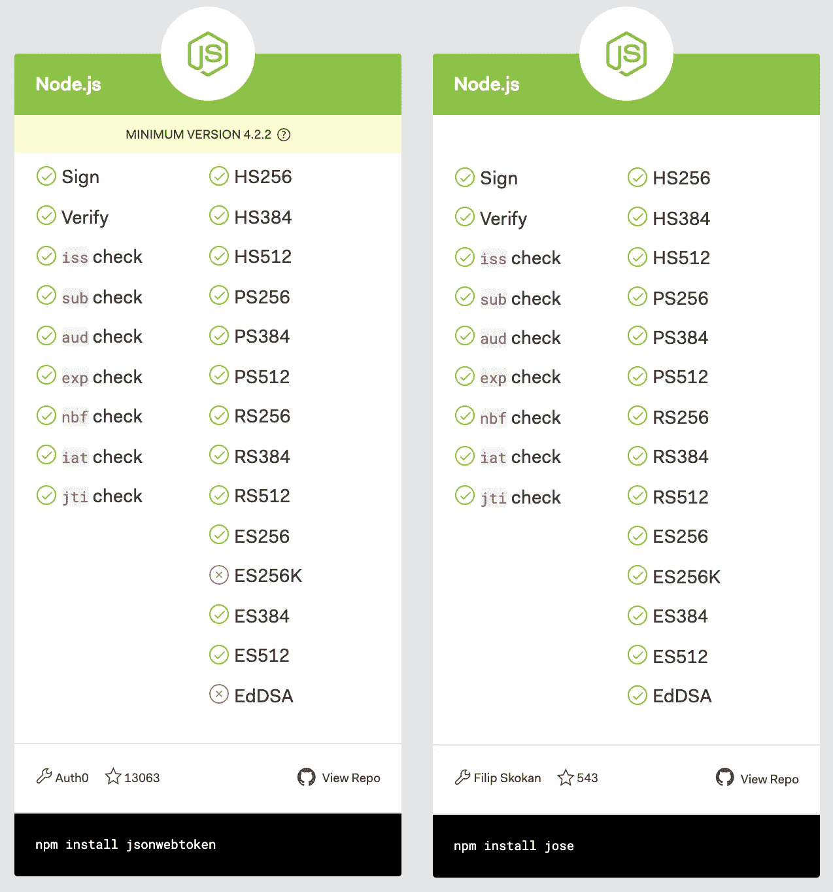

节点 JS JWT 库

下面的示例代码片段展示了如何使用 **jose** 库进行 JWT 验证。这是一个 Node.js lambda 函数，它首先从 firebase 公共端点获取公钥，然后验证 JWT。为了与 AWS API gateway 集成，它在 AWS IAM 策略 JSON 结构中构建并返回结果，该结构带有用户 id 和指示符“Allow”或“Deny”。

添加公钥缓存可以进一步改进这个示例实现，由于消除了实时依赖性 Firebase 端点，它增强了稳定性和性能。

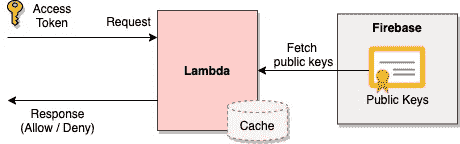

JWT 验证设计

JWT 验证 Lambda 示例代码

## 授权人(λ函数)

我们已经准备好了令牌验证逻辑，现在是时候启用对 API gateway 的检查了。AWS API gateway 让我们可以灵活地在授权器中定义自己的验证逻辑，这是一个无服务器的 lambda 函数。API gateway 调用授权器来验证所有传入的请求，lambda 函数返回检查结果。由于 lambda 函数的可伸缩性，这绝对是一个非常棒的设计，能够处理大量的请求。

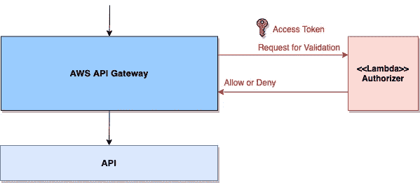

AWS API 网关-授权人

假设我们已经部署了 lambda 函数，下面是定义新授权者并将其链接到 lambda 函数的步骤:

1.  转到 AWS API 网关控制台中的菜单项“授权者”,并单击按钮创建新的授权者。
2.  将 **Lambda 函数**设置为您新创建的用于令牌验证的 Lambda 函数。
3.  告诉授权者从**令牌源**中提取访问令牌的 HTTP 头名称

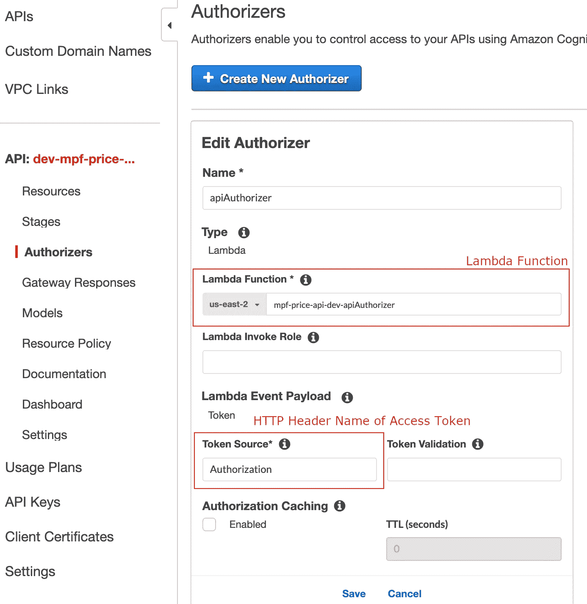

AWS API 网关-授权者定义

授权者配置是每个端点级别的，这意味着您可以为每个端点配置不同的验证逻辑。下面的例子显示了我们如何将 authorizer 应用到 API 端点。

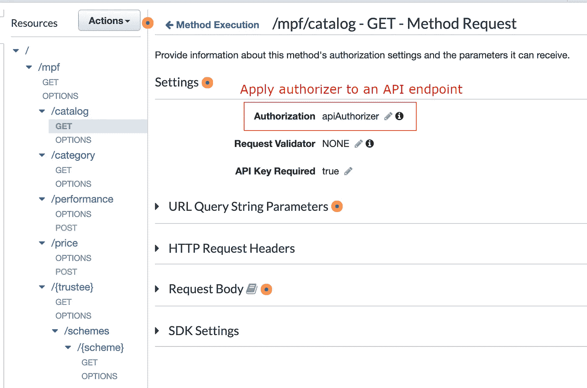

AWS API 网关—带授权器的 API 端点

# 批准

确定动作和数据类型的访问权限的逻辑与应用程序逻辑更相关，因此建议的方法是将其作为 API 逻辑的一部分来实现。当访问令牌从 API 网关传递到底层 API 时，API 逻辑可以从访问令牌中提取用户信息并执行授权规则。

# 网络应用防火墙(WAF)

最后但同样重要的是，如果您的目标是企业级保护，WAF 是必不可少的组件。它是位于 API 网关和所有其他 API 组件前面的第一道防线。您可能听说过许多已知的漏洞和攻击，如 SQL 注入、bot 攻击、DDoS、OWASP top 10 等，防火墙是防范这些风险的完美解决方案。

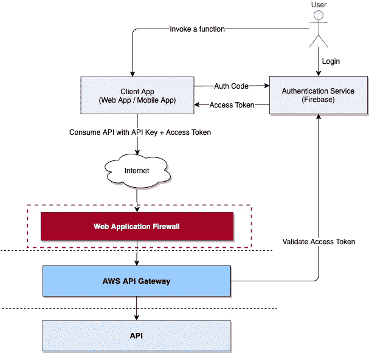

Web 应用防火墙

与传统防火墙类似，WAF 基于安全规则列表过滤流量。它不是在 TCP/IP 层过滤流量，而是专门查看 HTTP 协议中的流量，这意味着您可以根据 HTTP 报头、URI 路径、HTTP 正文等来确定是允许还是阻止流量。AWS 提供友好的用户界面，让您设置自己的安全规则。

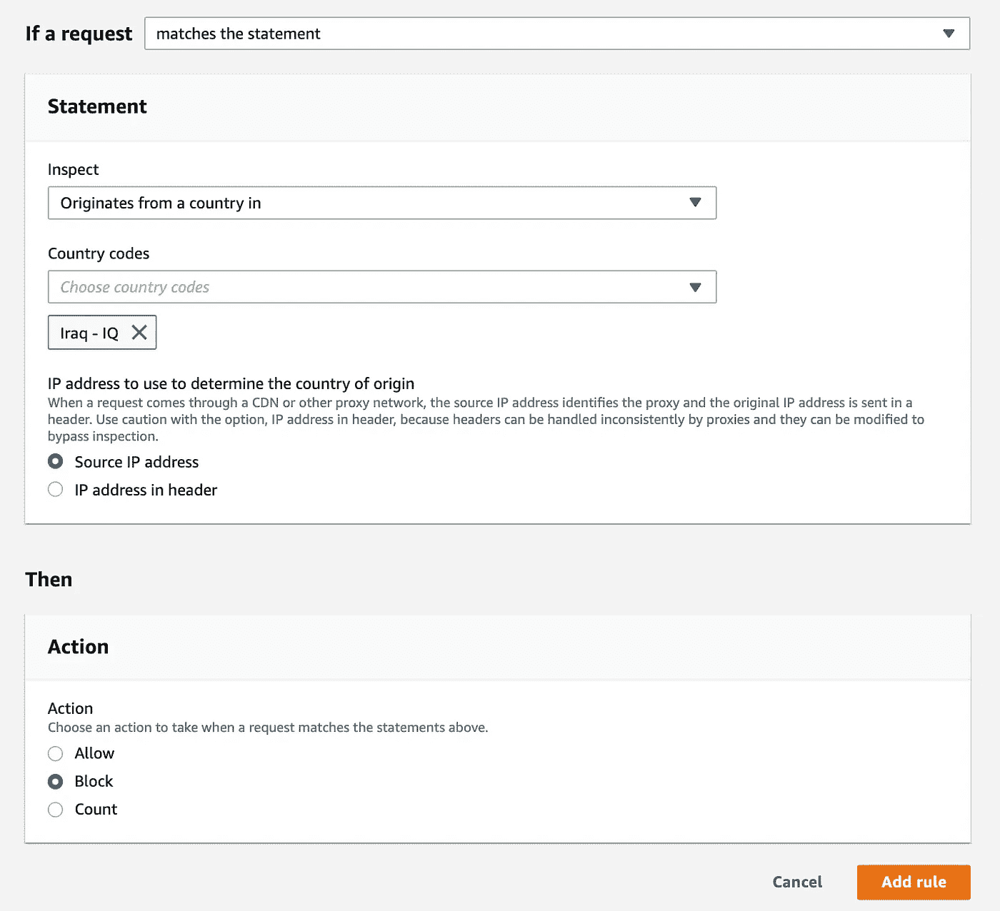

AWS Web 应用程序防火墙—规则配置

## 服务提供商的托管规则

与自己创建规则不同，订阅托管规则可以快速让您的 WAF 做好准备。许多著名的 WAF 服务提供商，如 F5、Fortinet 和 Imperva，都按月收费(20-30 美元)提供托管安全规则。

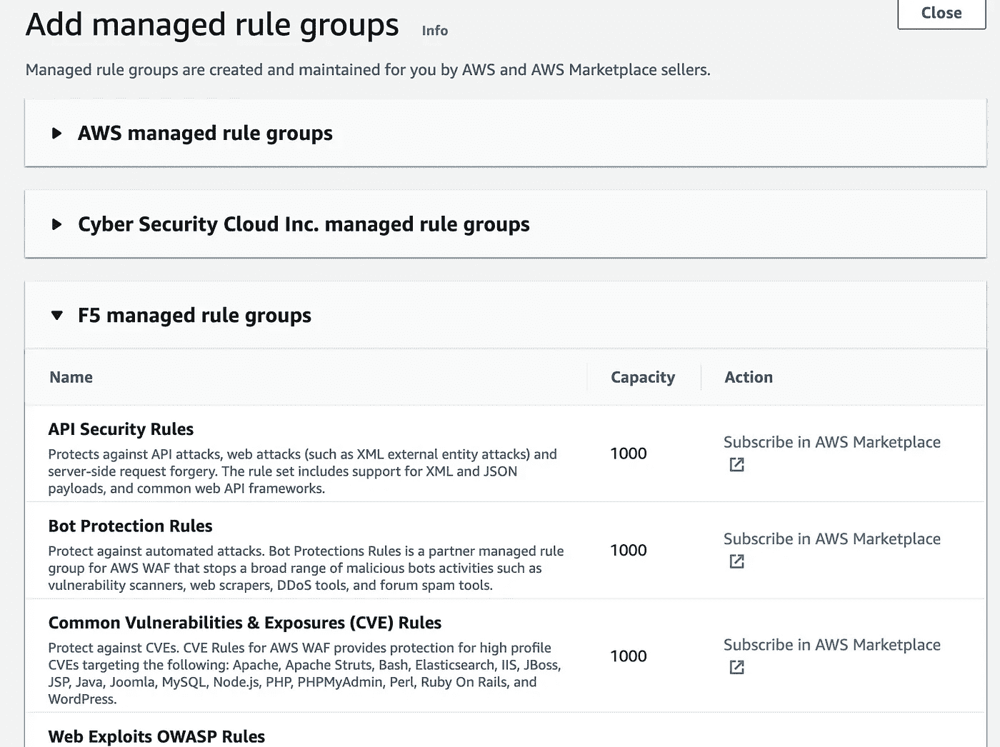

AWS Web 应用程序防火墙—受管规则

# 最后的想法

API 保护至关重要，应该作为 API 开发的一部分给予高度重视。强烈建议采用 API 网关架构模式和 OAuth 与 JWT 的开放标准等最佳实践。然而，如果我们从头开始构建一切，实现可能会很有挑战性。由于 AWS 和 Firebase 等基于云的服务，通过在基于云的组件上进行配置和部署 lambda 功能，可以轻松保护 API。