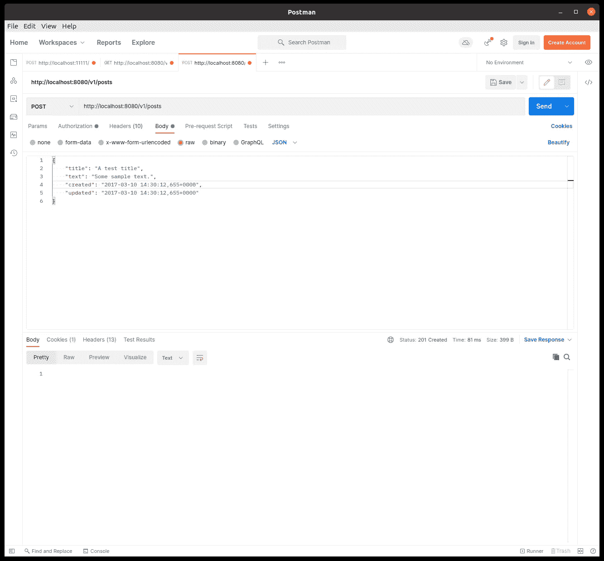
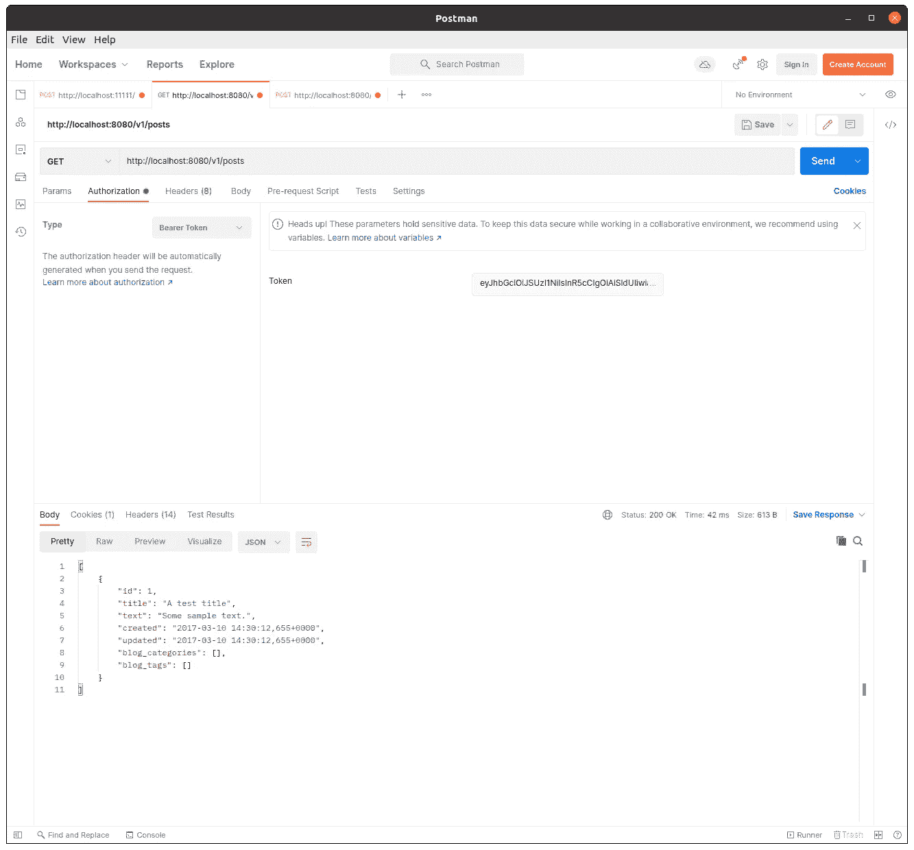

# 使用 Keycloak 保护您的 Spring Boot 应用程序

> 原文：<https://blog.devgenius.io/secure-your-spring-boot-application-using-keycloak-8c63e0530089?source=collection_archive---------0----------------------->


使用 Spring Boot 并在没有安全层的情况下公开我们的 API 端点并不是一个好主意。在本指南中，我们将介绍如何使用 **Keycloak** 设置 **Spring Security** ，因此我们需要在实际调用端点 API 之前对 Keycloak 服务进行认证。作为以前的 Spring Boot 教程，我们将在这里使用博客 api 的例子。

我们将首先克隆这个库:【https://github.com/mjovanc/medium-spring-keycloak】T4，然后使用 *IntelliJ* 或更好的 IDE/编辑器打开这个项目。确保您已经用 PostgreSQL 设置了数据库。查看这里的教程了解如何设置它:[https://mjovanc . com/spring-boot-with-PostgreSQL-and-hibernate-26dc 00 de 27 e](https://mjovanc.com/spring-boot-with-postgresql-and-hibernate-26dc00de27e)

因此，当我们可以在本地启动项目并且一切正常时，我们现在需要做的是添加对 Keycloak 和 Spring 安全性的依赖:

```
// Security
implementation group: 'org.keycloak', name: 'keycloak-spring-boot-starter', version: '16.1.0'
implementation group: 'org.keycloak.bom', name: 'keycloak-adapter-bom', version: '16.1.0', ext: 'pom'
implementation group: 'org.springframework.boot', name: 'spring-boot-starter-security', version: '2.6.2'
```

将此代码放入依赖块中的 **build.gradle** 中，然后按现在出现的 gradle 按钮 **Load Gradle Changes** 或按 **CTRL+SHIFT+O** 将依赖项下载到项目中。

现在我们已经有了依赖项，我们将开始创建一个名为**安全**的新包，其中有包*控制器*、*模型*、服务和*存储库*。我们创建一个名为**SecurityConfig.java**的新类，并将以下代码放入其中:

```
package com.mjovanc.blog.security;

import org.keycloak.adapters.springboot.KeycloakSpringBootConfigResolver;
import org.keycloak.adapters.springsecurity.KeycloakSecurityComponents;
import org.keycloak.adapters.springsecurity.authentication.KeycloakAuthenticationProvider;
import org.keycloak.adapters.springsecurity.config.KeycloakWebSecurityConfigurerAdapter;
import org.springframework.beans.factory.annotation.Autowired;
import org.springframework.context.annotation.Bean;
import org.springframework.context.annotation.ComponentScan;
import org.springframework.context.annotation.Configuration;
import org.springframework.http.HttpMethod;
import org.springframework.security.config.annotation.authentication.builders.AuthenticationManagerBuilder;
import org.springframework.security.config.annotation.web.builders.HttpSecurity;
import org.springframework.security.config.annotation.web.configuration.EnableWebSecurity;
import org.springframework.security.core.authority.mapping.SimpleAuthorityMapper;
import org.springframework.security.core.session.SessionRegistryImpl;
import org.springframework.security.web.authentication.session.RegisterSessionAuthenticationStrategy;
import org.springframework.security.web.authentication.session.SessionAuthenticationStrategy;

@Configuration
@EnableWebSecurity
@ComponentScan(basePackageClasses = KeycloakSecurityComponents.class)
public class SecurityConfig extends KeycloakWebSecurityConfigurerAdapter {

    @Autowired
    public void configureGlobal(AuthenticationManagerBuilder auth) throws Exception {
        KeycloakAuthenticationProvider keycloakAuthenticationProvider
                = keycloakAuthenticationProvider();
        keycloakAuthenticationProvider.setGrantedAuthoritiesMapper(
                new SimpleAuthorityMapper());
        auth.authenticationProvider(keycloakAuthenticationProvider);
    }

    @Bean
    public KeycloakSpringBootConfigResolver KeycloakConfigResolver() {
        return new KeycloakSpringBootConfigResolver();
    }

    @Bean
    @Override
    protected SessionAuthenticationStrategy sessionAuthenticationStrategy() {
        return new RegisterSessionAuthenticationStrategy(
                new SessionRegistryImpl());
    }

    @Override
    protected void configure(HttpSecurity http) throws Exception {
        super.configure(http);
        http
                .authorizeRequests()
                .antMatchers(HttpMethod.*POST*).hasAnyRole("maintainer", "admin")
                .antMatchers(HttpMethod.*PATCH*).hasAnyRole("maintainer", "admin")
                .antMatchers(HttpMethod.*DELETE*).hasAnyRole("maintainer", "admin")
                .antMatchers(HttpMethod.*PUT*).hasAnyRole("maintainer", "admin")
                .antMatchers("/v1/posts").hasAnyRole("user", "maintainer", "admin")
                .antMatchers("/v1/categories").hasAnyRole("user", "maintainer", "admin")
                .antMatchers("/v1/tags").hasAnyRole("user", "maintainer", "admin")
                .anyRequest().permitAll();
    }
}
```

我们在这里配置的最重要的部分是在名为**配置**的方法中。我们使用 **HttpSecurity** 对象，并将其配置为将 *POST* 、 *PATCH* 、 *DELETE* 和 *PUT* 的使用仅限于维护者和管理员角色。我们定义的其他端点，用户角色以及维护者和管理员也可以通过执行 *GET* 请求来访问:

```
.authorizeRequests()
.antMatchers(HttpMethod.*POST*).hasAnyRole("maintainer", "admin")
.antMatchers(HttpMethod.*PATCH*).hasAnyRole("maintainer", "admin")
.antMatchers(HttpMethod.*DELETE*).hasAnyRole("maintainer", "admin")
.antMatchers(HttpMethod.*PUT*).hasAnyRole("maintainer", "admin")
.antMatchers("/v1/posts").hasAnyRole("user", "maintainer", "admin")
.antMatchers("/v1/categories").hasAnyRole("user", "maintainer", "admin")
.antMatchers("/v1/tags").hasAnyRole("user", "maintainer", "admin")
.anyRequest().permitAll();
```

配置这个非常简单。所以现在我们将添加一些配置到我们的 **application.yml** 属性文件中:

```
spring:
  datasource:
    url: jdbc:postgresql://${POSTGRESQL_HOSTNAME:localhost}:${POSTGRESQL_PORT:5432}/${POSTGRESQL_DB_NAME:blogdb_dev}
    username: ${POSTGRESQL_DB_USER:postgres}
    password: ${POSTGRESQL_DB_PASSWORD:test1234}
  jpa:
    hibernate:
      ddl-auto: update

keycloak:
  auth-server-url: http://${KEYCLOAK_HOSTNAME:localhost}:${KEYCLOAK_PORT:11111}/auth
  realm: BlogAPIKeycloak
  resource: login-app
  public-client: true
  bearer-only: true
```

我们设置了 Keycloak 将监听的 **auth-server-url** ，我们将使用哪个**领域**名称，**资源**名称，使用**公共客户端**，并且我们将只使用**承载令牌**而不是通过 GUI 登录。

现在，让我们通过运行以下命令，使用 *Docker* 来设置 Keycloak 服务:

```
docker run --name keycloak -e KEYCLOAK_USER=admin -e KEYCLOAK_PASSWORD=admin -p 11111:11111 jboss/keycloak -Djboss.http.port=11111
```

这将下拉图像并为我们运行 Docker 容器，我们将发送两个环境变量 **KEYCLOAK_ADMIN** 和 **KEYCLOAK_ADMIN_PASSWORD** ，我们将使用它们登录到管理区域，以便为 KEYCLOAK 设置配置。现在我们转到 URL:[http://localhost:11111/auth](http://localhost:11111/auth)，我们将看到这样一个页面:


我们已经成功地在本地计算机上设置了 Keycloak 服务。这种设置**不应该在生产**中使用，还有很多事情需要考虑，超出了本教程的范围。

因此，我们现在需要做的是使用运行容器时设置的凭据登录，然后我们创建一个新领域，如下图所示:


按“添加领域”按钮创建一个新领域

我们将输入我们在之前的 **application.yml** 中定义的名称，**blogapikeyclook**。然后，我们前往左侧面板的**客户端**并创建一个新客户端。客户端名称应该是我们之前定义的资源名称， **login-app** 。现在，当我们按保存时，我们需要选择名为**的字段，访问类型**到**机密**。我们还必须向字段**有效重定向 URIs** 添加一个值:

```
http://localhost:8080/*
```

然后前往标签**凭证**和**生成密码**并在此复制以备后用。按保存。

现在我们转到左侧面板的**角色**。我们将在这里创建三个角色:**用户**、**维护者**和**管理员**。然后我们转到**用户**并创建两个用户:

> 用户名:mjovanc
> 密码:test1234
> 
> 用户名:admin
> 密码:test1234

创建这些用户后，我们将设置密码并为每个用户添加一个角色。我们按下“查看所有用户”以显示我们创建的用户，进入每个用户，首先通过转到**凭证**选项卡设置密码，并输入两次密码，不要忘记取消选中**临时**，否则将无法进行身份验证。然后我们转到选项卡**角色映射**，我们将**用户**添加到 mjovanc，并将**管理员**添加到 admin，这是显而易见的。

不错！我们现在已经完成了 Keycloak 中的配置。实际上，我们已经完成了所有的实现，所以是时候测试这是否真的可行了。

让我们打开 *Postman* 并尝试验证和获取不记名令牌！

粘贴网址[http://localhost:11111/auth/realms/BlogAPIKeycloak/protocol/OpenID-connect/token](http://localhost:11111/auth/realms/BlogAPIKeycloak/protocol/openid-connect/token)。注意，这里我们指定了我们用来认证的 **BlogAPIKeycloak** 领域。填写以下信息:


这里我们看到一堆东西。我们选择执行一个 **POST** 请求，因为我们将向 Keycloak 服务发送一些数据。我们选择以 **x-www-form-urlencoded** 类型发送主体数据，并添加一些键值对，其中包含数据，如 **client_id** 、**用户名**、**密码**、 **grant_type** 和 **client_secret** 。

我们在下面的响应区域看到的是我们从 Keycloak 收到的数据，例如访问令牌，它是**持有者**令牌。我们在这里也得到一堆其他的东西，但是我们现在不讨论它的含义。

现在我们已经验证了自己，让我们从 API 请求一些东西。我们复制已经收到的访问令牌，并将其粘贴到此处，如屏幕截图所示:


在这里，我们粘贴获得的访问令牌，我们需要选择类型作为不记名令牌

显然，我们还没有向数据库中添加任何东西，但是我们得到了一个响应，表明它可以工作，因为我们得到了一个空列表。如果它不起作用，我们将得到一个**401**未授权的错误。

让我们现在做一个 *POST* 请求来添加一篇博客文章，但是首先我们需要将自己认证为 admin，因此我们为 admin 放置凭证并获取访问令牌。然后，我们在*邮递员*中添加一个新的*帖子*请求，并添加以下内容:



发送带有 JSON 对象数据的 POST 请求

这里，我们像以前一样将访问令牌添加到**授权**中，然后我们将 *JSON* 对象数据添加到**主体**部分中。正如我们可以看到的，我们从创建了的 API **201 得到了一个响应。所以它创建了一个新的对象！**

现在让我们再做一次*获取*所有博文的请求:



太好了！我们得到了我们在数组中创建的对象。所以现在我们有了一个全功能的 Keycloak 身份验证服务，它是用 Spring Boot 实现的，供开发使用。你可以用 Keycloak 配置很多东西，但是我们现在就用这个简单的例子。

我希望这个教程对你有用。如果你这样做了，请留下你的评论或关注我，以便在我写新文章时了解最新消息。