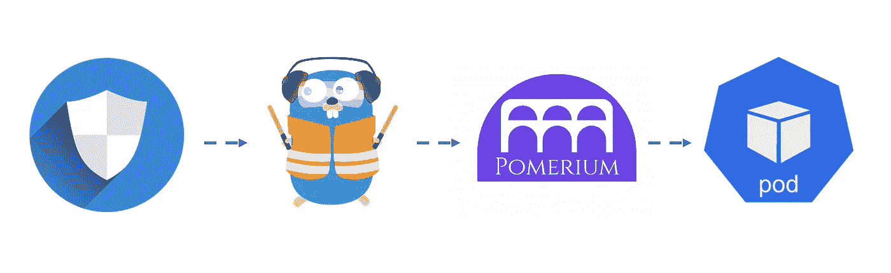
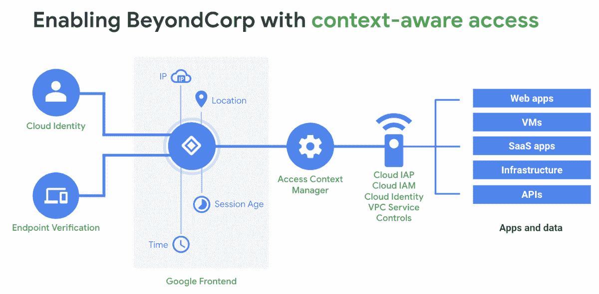
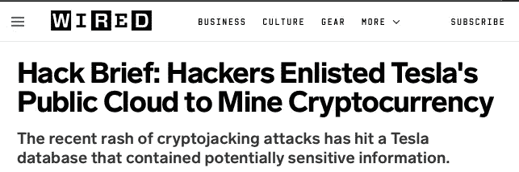
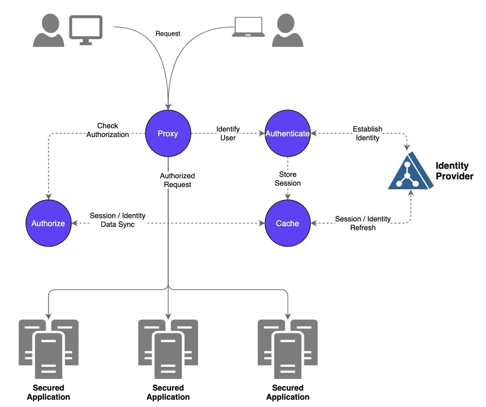
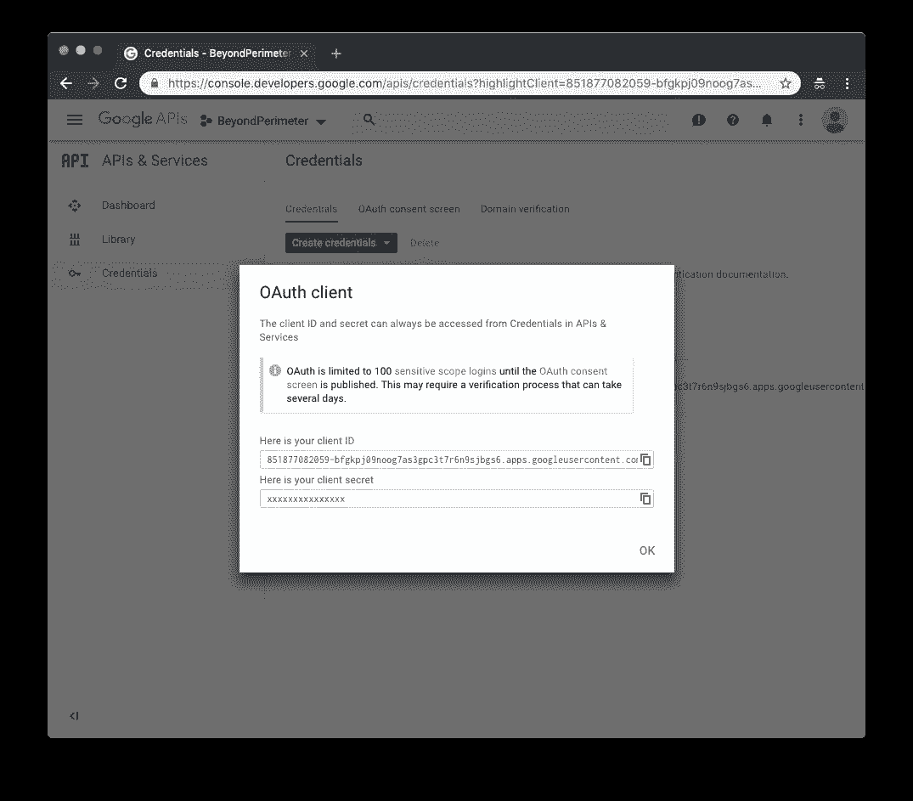
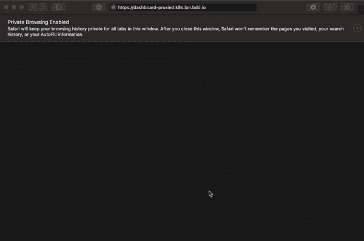

# 用 Pomerium 固定 EKS 上的 Kubernetes 仪表板

> 原文：<https://blog.devgenius.io/securing-kubernetes-dashboard-on-eks-with-pomerium-e98c47610e2f?source=collection_archive---------1----------------------->

使用 Pomerium 和 Traefik 通过身份识别访问代理保护 Kubernetes 应用程序访问。



Traefik + Pomerium 确保对 Kubernetes 应用程序的访问

身份识别代理(IAP)是一种安全的方法，可以在不使用 VPN 的情况下提供对内部应用程序的访问。这种零信任安全模式建立在谷歌的 [BeyondCorp](https://cloud.google.com/beyondcorp/) 实现的基础上，将安全从网络边界转移到个人用户，根据用户的上下文确定访问。



图片来源:[谷歌安全博客](https://security.googleblog.com/2019/10/how-google-adopted-beyondcorp-part-4.html)

在 Google Cloud 上，这可以通过 [Cloud IAP](https://cloud.google.com/iap/) 轻松实现(参见[在 GKE](https://medium.com/google-cloud/practical-monitoring-with-prometheus-grafana-part-iv-d4f3f995cc78) 保护 Grafana 的示例部署)。在 GCP 之外，有两个很好的开源解决方案:

*   [梨果](https://github.com/pomerium/pomerium)
*   [奥里·奥茨基珀](https://github.com/ory/oathkeeper)

使用 Pomerium 等 IAP 的一个常见用例是保护对内部应用程序/工具的访问(例如 Kubernetes dashboard、ArgoCD、Kibana)。尤其是 Kubernetes dashboard，它是 Pomerium 的绝佳选择，因为除了 GKE 之外，没有任何 Kubernetes 服务提供托管仪表板。不安全的 Kubernetes 仪表盘在 2018 年成为头条新闻，当时黑客在特斯拉的云实例上安装了[加密挖掘恶意软件](https://redlock.io/blog/cryptojacking-tesla)，通过仪表盘获得访问权限。默认安装现在大大限制了访问，但让用户在使用`kubectl proxy`后输入令牌仍然是一个繁琐的过程。



图片来源:[有线](https://www.wired.com/story/cryptojacking-tesla-amazon-cloud/)

本文将通过 Pomerium 和 Traefik 的一个示例设置向 Kubernetes 仪表板添加身份验证和授权。用户可以通过身份提供商(例如 Google、Github、Okta)进行身份验证，而不是发布`kubectl proxy`，从而轻松访问仪表盘。

# 先决条件

*   Kubernetes 集群(例如 EKS、阿拉斯加)
*   头盔 v3
*   DNS 提供商(例如 Cloudflare)
*   入口控制器(如 Traefik)
*   证书管理员(例如证书管理员)

***注*** *:您可以用自己选择的入口控制器(如 nginx、envoy、ambassador)替换 Traefik。根据需要部署入口控制器，并替换入口注释。所有代码也托管在 Github 上:*

[](https://github.com/Yitaek/pomerium-iap-traefik) [## Yitaek/pomerium-iap-traefik

### 身份识别代理(IAP)是一种安全的方法，可以在不使用 VPN 的情况下提供对内部应用程序的访问。的…

github.com](https://github.com/Yitaek/pomerium-iap-traefik) 

# 高层架构

Pomerium 由四个逻辑组件组成:

*   **代理服务**:指导用户建立身份的主代理
*   **认证服务** (AuthN):通过身份提供者(IdP)验证身份
*   **授权服务** (AuthZ):决定权限
*   **缓存服务**:存储和刷新 IdP 访问和令牌



图片来源:[石榴文件](https://www.pomerium.io/docs/)

虽然 Pomerium 也可以充当[转发身份验证提供者](https://www.pomerium.io/reference/#forward-auth)(将每个请求的身份验证和授权委托给 Pomerium)，但我们将把重点放在使用 Pomerium 作为独立的身份感知代理，因为我们的目标是使对 Kubernetes 仪表板的访问变得简单和安全。

# 部署指南

假设一个准系统 EKS 安装，让我们从部署`metrics-server`和`kubernetes-dashboard`开始。

## Kubernetes 仪表板

安装`metrics-server`:

```
$ kubectl apply -f [https://github.com/kubernetes-sigs/metrics-server/releases/download/v0.3.7/components.yaml](https://github.com/kubernetes-sigs/metrics-server/releases/download/v0.3.7/components.yaml)
```

安装`kubernetes-dashboard`:

```
$ kubectl apply -f [https://raw.githubusercontent.com/kubernetes/dashboard/v2.0.3/aio/deploy/recommended.yaml](https://raw.githubusercontent.com/kubernetes/dashboard/v2.0.3/aio/deploy/recommended.yaml)
```

在部署这些组件的同时，创建一个`eks-admin`服务帐户和集群角色绑定，用一个令牌连接到仪表板:

应用服务帐户和群集角色绑定:

```
$ kubectl apply -f eks-admin-service-account.yaml
```

现在让我们验证我们可以登录:

1.  启动`kubectl proxy`:

```
$ kubectl proxy
```

2.抓住令牌:

```
$ kubectl -n kube-system get secret $(kubectl -n kube-system get secret | grep eks-admin | awk '{print $1}') --template={{.data.token}} | base64 -D | pbcopy
```

3.打开链接并粘贴令牌:

```
[http://localhost:8001/api/v1/namespaces/kubernetes-dashboard/services/https:kubernetes-dashboard:/proxy/#!/login](http://localhost:8001/api/v1/namespaces/kubernetes-dashboard/services/https:kubernetes-dashboard:/proxy/#!/login)
```

# 特拉菲克

本指南将在高可用性(HA)中部署 Traefik v2，并使用 [cert-manager](https://github.com/jetstack/cert-manager) 来生成和管理 TLS 证书。如果不需要 HA，您也可以选择使用 Traefik CRDs 来集成 Let's Encrypt。要深入了解该设置，请查看:

*   [在 Kubernetes 上为 HA 设置 Traefik v2](https://medium.com/dev-genius/setup-traefik-v2-for-ha-on-kubernetes-20311204fa6f)
*   [Kubernetes 上 Traefik v2 的快速入门](https://medium.com/dev-genius/quickstart-with-traefik-v2-on-kubernetes-e6dff0d65216)

首先，创建`traefik`名称空间:

```
$ kubectl create namespace traefik
```

使用 3 个副本部署 Traefik，并在 AWS 上使用 NLB:

```
$ helm repo add traefik https://containous.github.io/traefik-helm-chart$ helm install -n traefik traefik traefik/traefik -f traefik/traefik-values.yaml 
```

# 证书管理器

此示例使用 Cloudflare 来完成 DNS 挑战，但是可以随意使用任何其他[支持的配置](https://cert-manager.io/docs/configuration/acme/)来与 cert-manager/Let's Encrypt 一起工作。

创建`cert-manager`名称空间:

```
$ kubectl create namespace cert-manager
```

部署证书管理器:

```
$ helm repo add jetstack https://charts.jetstack.io$ helm install \
  cert-manager jetstack/cert-manager \
  --namespace cert-manager \
  --version v0.16.0 \
  --set installCRDs=true
```

cert-manager 启动并运行后，使用 Cloudflare 创建一个颁发者。首先，创建一个具有区域-DNS-Edit、区域-区域-Read 权限的新 API 令牌，并将其作为一个秘密装载。配置适当的 DNS 区域，让我们加密电子邮件:

```
$ kubectl create secret generic cloudflare-token --from-literal=dns-token=<my-api-token> -n cert-manager$ kubectl apply -f cert-manager/cluster-issuer.yaml 
```

现在为该域创建一个通配符证书:

```
$ kubectl apply -f cert-manager/wildcard-cert.yaml 
```

验证证书已经颁发:

```
$ kubectl describe certificate wildcard-cert
```

# 身份提供者

现在，我们需要配置一个身份提供者来确定用户访问。 [Pomerium 支持](https://www.pomerium.io/docs/identity-providers/) Azure AD、AWS Cognito、GitHub、GitLab、Google / GSuite、Okta、OneLogin。在这个例子中，我将使用 Google，但是根据您的提供商的需要进行配置:

1.  登录谷歌云，进入[API&服务](https://console.developers.google.com/projectselector/apis/credentials?pli=1)。选择一个项目来生成 OAuth 令牌。
2.  点击左侧菜单上的`Credentials`，点击`Create credentials`->-T3
3.  配置`Consent Screen`，选择`Internal`，设置支持邮箱
4.  创建一个 OAuth 客户端 ID，将`Web application`设置为应用程序类型
5.  在`Authorized redirect URIs`下输入以下内容:`https://authenticate.<my-domain>/oauth2/callback`(用您为其生成通配符证书的域替换 my-domain)
6.  点击`Create`并记下`client ID`和`client secret`



图片来源:[梨树](https://www.pomerium.io/docs/identity-providers/google.html)

# 梨木属

最后，我们可以配置 Pomerium 作为 IAP 来访问 Kubernetes 仪表板。将上面的 clientID 和 clientSecret 添加到`idp`部分。生成`sharedSecret`和`cookieSecret`:

```
$(head -c32 /dev/urandom | base64)
```

将`rootDomain`配置为我们为其生成通配符证书的域。值得注意的是，我们将`generateTLS`设置为**假**并将`insecure`设置为**真**，以允许 Traefik 进行 SSL 终止，并允许 Pomerium 接受 Kubernetes dashboard 的自签名证书。

将从第一步开始为访问 Kubernetes 仪表板而生成的 EKS 令牌添加到授权头中。更新值文件后，通过 Helm 部署 Pomerium:

```
$ helm repo add pomerium https://helm.pomerium.io$ helm install pomerium pomerium/pomerium -f pomerium/pomerium-values.yaml
```

# DNS 设置

Pomerium pods 运行并创建入口后，获取 Traefik 创建的 NLB 的 URL。将子域`authenticate`的 CNAME 和用于仪表板的名称指向 NLB。

现在，一旦您点击仪表板的 URL，您将被重定向到身份提供商的登录页面(在我们的例子中是 Google)。如果用户在我们的域中并成功登录，Pomerium 会将无记名令牌转发到仪表板，用户无需输入令牌就可以访问仪表板。



视频致谢:[梨木](https://www.pomerium.io/guides/kubernetes-dashboard.html#conclusion)

您可以使用 Pomerium 来保护其他内部应用程序。根据使用案例，将 Pomerium 配置为 IAP 或 forward-auth 提供商，并为没有 VPN 的用户安全地公开内部工具。