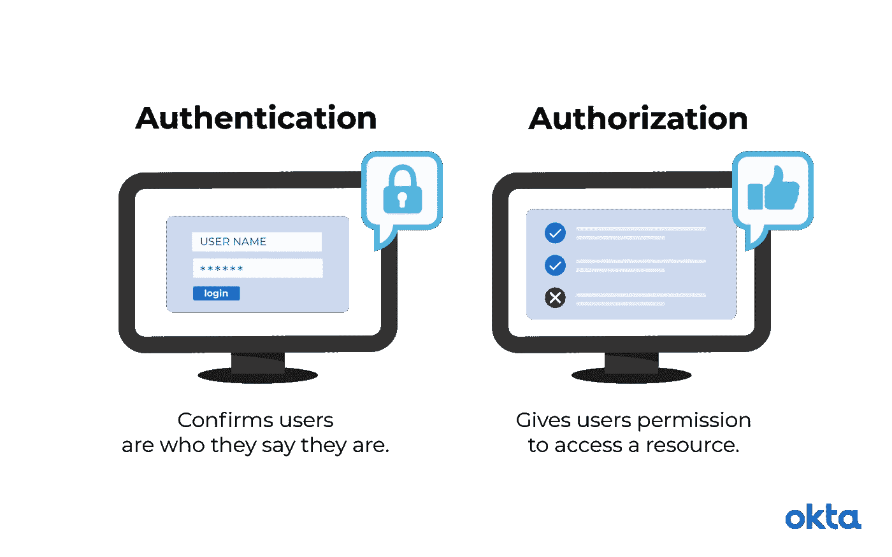
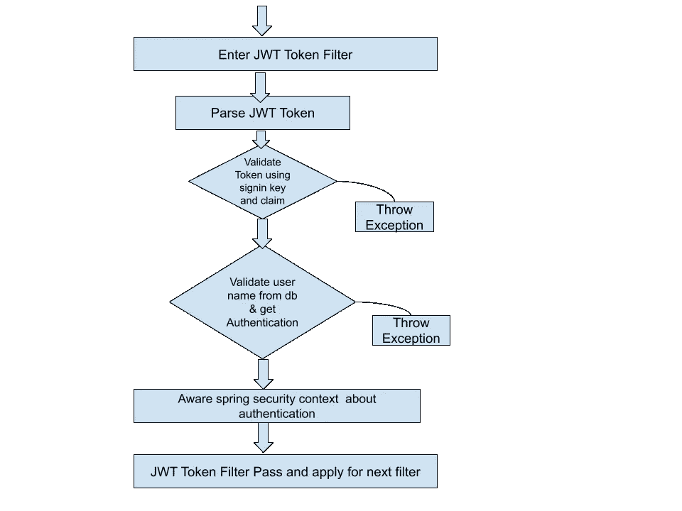
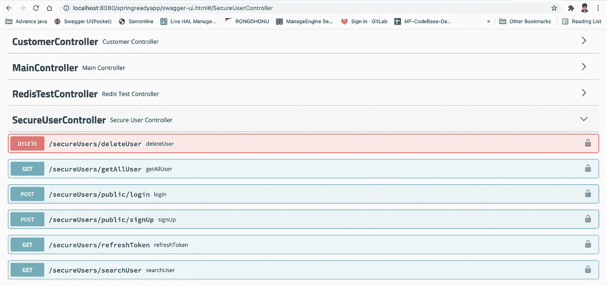
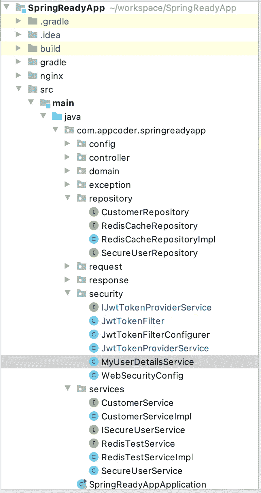
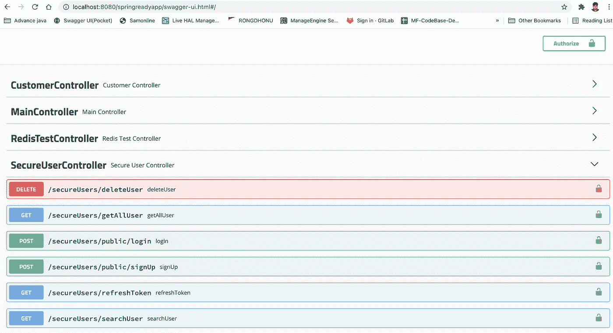

# 用 Spring Security、JWT 和 JPA 保护 REST API

> 原文：<https://blog.devgenius.io/securing-spring-boot-rest-api-with-spring-security-jwt-and-jpa-64ec45fb25e0?source=collection_archive---------2----------------------->

## Spring Security 是一个强大且高度可定制的认证和访问控制框架。它是保护基于 **Spring** 的应用程序的事实上的标准。 **Spring Security** 是一个专注于为 **Java** 应用程序提供认证和授权的框架。


约翰·萨尔维诺在 [Unsplash](https://unsplash.com?utm_source=medium&utm_medium=referral) 上拍摄的照片

**今天我们将讲述以下事情**

1.  API 和应用程序安全性的重要性
2.  术语认证和授权的详细信息
3.  春天安全的细节
4.  JWT 的细节
5.  spring 安全和 JWT 的实际实施
6.  源代码描述

**先决条件** 在开始本教程之前，你必须了解关于 spring boot 和 JPA 的细节。要了解这一点，你可以阅读我的贝娄媒体文章。
Spring boot 和 JPA:为此，你可以阅读 [**本教程**](https://mesukcse08.medium.com/spring-data-jpa-a-to-z-6c957ed17a66)

1.  **API 和应用安全的重要性**

*   企业使用 API 来连接服务和传输数据，因此被黑客攻击的 API 会导致数据泄露。
*   多种类型的数据可以通过不同的 API 进行传输。任何 API 安全性的实现都需要特定于您的 API 和正在传输的数据。
*   您需要适当的身份验证、授权、访问权限等，以确保只有被允许的客户端才能使用该接口，并且只能执行被允许的操作。
*   您需要确保您的应用程序端点(用于访问接口的 URL)不容易受到通过接口或绕过接口的攻击。

**2。对资源的访问受到认证和授权的双重保护。如果你不能证明你的身份，你将不会被允许进入资源。即使您可以证明您的身份，如果您没有获得该资源的授权，您仍然会被拒绝访问。**



图片来自[www.okta.com](http://www.okta.com)

**认证**

*   密钥的形式，授予拥有适当凭证的用户
*   要求用户验证凭据(例如，通过密码、安全问题答案或面部识别)
*   通常在授权前完成。首先，我们验证用户，然后检查其他东西。
*   例如，公司的员工在访问他们公司的电子邮件之前需要通过网络进行身份验证

**授权**

*   确定用户可以访问和不可以访问的内容
*   以权限的形式。在这个术语中，仅表示验证访问权限。
*   验证是否通过策略和规则允许访问
*   通常在成功认证后完成
*   例如，一旦进入，该人可以进入酒店的客房。也可以被授权进入公共洗手间和看电视。如果没有适当的文件，这个人可能没有使用电梯进入房间的许可。

**3。spring security 的细节** *spring Security 是一个框架，它使程序员能够通过 JEE 组件对基于 Spring 框架的 Web 应用程序施加安全限制。简而言之，它是一个可以使用的库，可以根据程序员的需要进行扩展和定制。因为是同一个 Spring 家族的成员，所以和 Spring Web MVC 的携手非常顺利。它的主要操作领域是在 Web 请求级别和方法调用级别处理身份验证和授权。也许吧。这个框架最大的优点是它功能强大，而且在实现中高度可定制。尽管它遵循 Spring 在配置方面的惯例，但程序员可以在默认条款或根据自己的需要定制条款之间进行选择。*

要启用 spring 安全和 JWT，我们必须在 build.gradle 文件中使用 bellow 依赖项。

要配置 spring 安全性，我们必须编写一个配置类。下面给出了一个示例类

批注 *@EnableWebSecurity* 启用 Web 安全；否则，它默认保持禁用状态。我们扩展了*WebSecurityConfigurerAdapter*,这样扩展 Adapter 类的好处是，我们可以通过只覆盖我们感兴趣的部分来配置 Web 安全性，其他部分可以保持默认形式。 *PasswordEncoder* 是 Spring 安全框架提供的一个服务接口，用于对密码进行编码。
此外，我们添加了*AuthenticationManager*bean 以供进一步使用。

在这个配置类中，我们正在配置以下内容:
a . HTTP Security
**void configure(HTTP Security HTTP)**
b . Web Security
**configure(Web Security Web)**

这个简单的方法可以确保 HTTP 请求是安全的。

```
**protected void** configure(HttpSecurity http) **throws** Exception {

    http.csrf().disable()
    .sessionManagement().sessionCreationPolicy(SessionCreationPolicy.***STATELESS***);

    *// Entry points* http.authorizeRequests()
            .antMatchers(**"/main/**/"**).permitAll()
            .antMatchers(**"/customer/**/"**).permitAll()
            .antMatchers(**"/secureUsers/public/**/"**).permitAll()
            .antMatchers(**"/redisTest/**/"**).permitAll()
            .antMatchers(**"/h2-console/**/**"**).permitAll()
            .anyRequest().authenticated();

    *// If a user try to access a resource without having enough permissions* http.exceptionHandling().accessDeniedPage(**"/accessDeniedPage"**);

    *// Apply JWT* http.apply(**new** JwtTokenFilterConfigurer(**jwtTokenProviderService**));
}
```

*   禁用 csrf
*   会话创建策略是无状态的
*   提供一些不安全的 URL 模式。这些 URL 不需要外部身份验证和授权。例如，我们可能需要公开**注册**和**登录** API。除了那些提到的 API，其他的都需要认证。
*   对于异常处理，如果用户对所请求的 API 没有足够的权限，则重定向到默认的拒绝访问页面
*   最后添加了安全配置过滤器 JWT。我们将展示这方面的细节

**b .网络安全** 在这一节中，我们提到了一些不需要通过安全层的 URL。

```
**public void** configure(WebSecurity web) **throws** Exception {
    *// Allow swagger to be accessed without authentication* web.ignoring().antMatchers(**"/v2/api-docs"**)*//* .antMatchers(**"/swagger-resources/**"**)*//* .antMatchers(**"/swagger-ui.html"**)*//* .antMatchers(**"/configuration/**"**)*//* .antMatchers(**"/webjars/**"**)*//* .antMatchers(**"/public"**)

            *// Un-secure H2 Database (for testing purposes, H2 console shouldn't be unprotected in production)* .and()
            .ignoring()
            .antMatchers(**"/h2-console/**/**"**);;
}
```

这里，我们忽略了来自安全层的大摇大摆的 URL 和 h2 控制台 UI。

现在 **Spring 安全框架**下面已经有了 ***UserDetails*** 投影类。它具有以下**属性**

这里重要的字段是 ***用户名*** 和 ***密码*** 。我们将使用这些字段来验证我们的用户。

现在 **spring 安全框架**也有了另一个名为***userdailsservice****的接口/服务类，用于验证用户。它被给出如下*

*此***loaduserbysusername***仓库方法通过用户名加载用户。**这里两个类都是 spring 安全框架的默认方法**。我们将在我们的系统中使用这些类。*

*我们的域类是 ***用户*** ，其代码如下*

*这里，我们有基于 Spring 安全框架 ***UserDetails*** 类的*用户名*和*密码*字段。在注册过程中，我们将用户的数据存储到这个表中。现在，我们的用户域的存储库类如下所示:*

*这里，***SecureUserRepository***是简单的 JpaRepository，用于简单的查询用户。*

***4。详细介绍 JWT** *JWT 主要用于认证。用户登录到应用程序后，应用程序将创建一个 JWT 并发送给用户。用户的后续请求将包括 JWT。令牌告诉服务器允许用户访问哪些路由、服务和资源。JWT 可以轻松地跨多个域使用，因此它们通常用于单点登录。**

***重要提示:**此部分为**从官方[抄袭](https://jwt.io/introduction#:~:text=The%20header%20typically%20consists%20of,as%20HMAC%20SHA256%20or%20RSA.&text=Then%2C%20this%20JSON%20is%20Base64Url,first%20part%20of%20the%20JWT.)**jwt . io 链接 *

# *JWT 结构*

*JWT 令牌的样本如下*

> *eyJhbGciOiJIUzI1NiJ9。**eyjzdwiioijtzxn 1 ayisimf 1dg giolt 7 IMF 1 dghvcml 0 ESI 6 iljptevfqurnsu 4 if v0 simlhdci 6 mtyxnzm 1 mte 1 mswizzhwijoxnje 3 mzu 0 nzuxfq**. lpqsdninetcwlyyvmcydsejzmprfuygil 7 xn 6 srnm*

*它由三部分组成。
**1。标头:**标头通常由两部分组成:令牌的类型(JWT)和使用的哈希算法(如 HMAC SHA256 或 RSA)。例如*

*{
"alg": "HS256 "，
"typ": "JWT"
}*

*然后，这个 JSON 被 Base64Url 编码，形成 JWT 的第一部分。*

***2。Payload:** 令牌的第二部分是 Payload，它包含声明。声明是关于实体(通常是用户)和附加数据的声明。债权有三种类型:*登记的*、*公开的*和*私人的*债权。*

*   ***注册声明**:这是一组预定义的声明，不是强制性的，而是推荐性的，目的是提供一组有用的、可互操作的声明。其中有 **iss** (发行人) **exp** (到期时间) **sub** (主体) **aud** (受众)，其他。*

> *请注意，索赔名称只有三个字符长，因为 JWT 是为了简洁。*

*   *[**公开声明**](https://tools.ietf.org/html/rfc7519#section-4.2) :这些可以由使用 jwt 的人随意定义。但是为了避免冲突，应该在 IANA JSON Web 令牌注册中心中定义它们，或者将其定义为包含抗冲突名称空间的 URI。*
*   *[**私人声明**](https://tools.ietf.org/html/rfc7519#section-4.3) :这些是为在同意使用它们的各方之间共享信息而创建的自定义声明，既不是*注册的*也不是*公开的*声明。*

*有效载荷的例子可以是:*

```
*{   "sub": "1234567890",   "name": "John Doe",   "admin": true }*
```

*然后对有效负载进行 **Base64Url** 编码，形成 JSON Web 令牌的第二部分。*

> **请注意，对于已签名的令牌，此信息虽然受到保护，不会被篡改，但任何人都可以读取。除非加密，否则不要将机密信息放在 JWT 的有效载荷或报头元素中。**

***3。签名** 为了创建签名部分，你必须接受编码的报头、编码的有效载荷、秘密、报头中指定的算法，并对其进行签名。*

*例如，如果您想使用 HMAC SHA256 算法，签名将以如下方式创建:*

```
*HMACSHA256(   base64UrlEncode(header) + "." +   base64UrlEncode(payload),   secret)*
```

*签名用于验证消息在传输过程中未被更改，对于用私钥签名的令牌，它还可以验证 JWT 的发送者就是它所说的那个人。*

# *把所有的放在一起*

*输出是由点分隔的三个 Base64-URL 字符串，可以在 HTML 和 HTTP 环境中轻松传递，同时与 SAML 等基于 XML 的标准相比更加紧凑。*

*下面显示了一个 JWT，它编码了前一个报头和有效载荷，并且用一个秘密进行了签名。*

**

*如果你想玩玩 JWT，把这些概念付诸实践，你可以使用 [jwt.io 调试器](https://jwt.io/#debugger-io)来解码、验证和生成 jwt。*

***JSON Web 令牌是如何工作的？** JWT 的生命周期/工作流程如下*

1.  *生成 JWT
    成功登录后，我们生成 JWT 并将其作为响应发送回去。这个令牌有一定的有效期。超过该时间后，令牌将不起作用*
2.  *获得令牌后，客户端必须将其存储在安全存储中。并且在每个进一步的请求中，它们必须将其作为授权头发送*
3.  *在服务器端对于受限 API 服务器必须检查基于业务的令牌。如果令牌有效并且他们有权限，那么他们将获得访问该资源的权限。*

*每当用户想要访问受保护的路由或资源时，用户代理应该发送 JWT，通常在使用**承载**模式的**授权**报头中。标题的内容应该如下所示:*

```
*Authorization: Bearer <token>*
```

*如果令牌是在`Authorization`报头中发送的，跨源资源共享(CORS)不会成为问题，因为它不使用 cookies。*

***JWT 令牌过滤器工作流程***

**

*下面是每个请求的流程:*

1.  *解析请求中的令牌。如果失败，则抛出禁止访问*
2.  *使用 secretKey 作为签名密钥和令牌作为声明来验证令牌。如果验证失败，则抛出*
3.  *然后，我们从用户表中验证*用户*，并使用*用户名*验证*用户详细信息*投影。如果失败，那么抛出。*
4.  *在这个阶段之后，我们通知 spring 安全上下文这个角色签名。*

*下面给出了相关的代码*

***5。spring security 和 JWT** 的实际实现在我们的实现中，我们添加了下面的 API 作为示例。在这里，您必须遵循以下步骤*

**

1.  ***用户注册(公共 API)***

*在这里，通常你可以使用用户名、密码和电子邮件地址注册。在这里，您有两个角色: ***角色 _ 管理员*** *和* ***角色 _ 客户端*** 请求和响应如下*

***2。会员登录(公共 API)
POST API** 正常情况下需要输入用户名和密码才能登录。作为回应，您将获得一个 JWT 令牌作为访问令牌。请求和响应如下所示*

***3。访问受保护的资源[受保护的]***

*   *两种特权 API
    在这里，我们的存储库中有一个管理员和客户端特权 API。在这里，只有两个特权登录用户可以查看。未登录的用户将得到一个 403 错误。其请求和响应如下*

*   ***管理员特权 API** 这里，我们的存储库中有一个管理员特权 API。在这里，只有管理员特权登录用户可以查看。非登录用户或非管理员特权用户将得到一个 403 错误。其请求和响应如下*

*6。源代码描述
所有的源代码都在 [**这个 GitHub**](https://github.com/mesuk/SpringReadyApp) 库中。
**控制器名称**:SecureUserController
**服务名称**:SecureUserService
**仓库名称** : SecureUserRepository，JwtTokenProviderService，MyUserDetailsService*

***Swagger 网址**:[**http://localhost:8080/springreadyapp/Swagger-ui . html #/secureuser controller**](http://localhost:8080/springreadyapp/swagger-ui.html#/)*

****

*提前感谢:)*