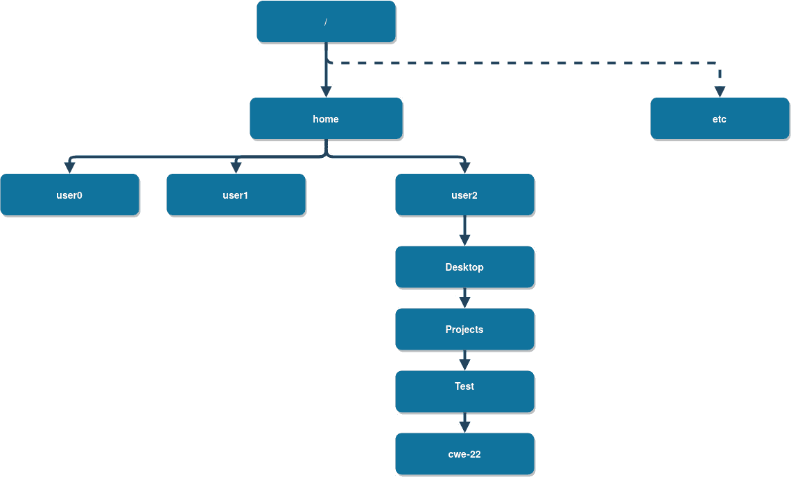
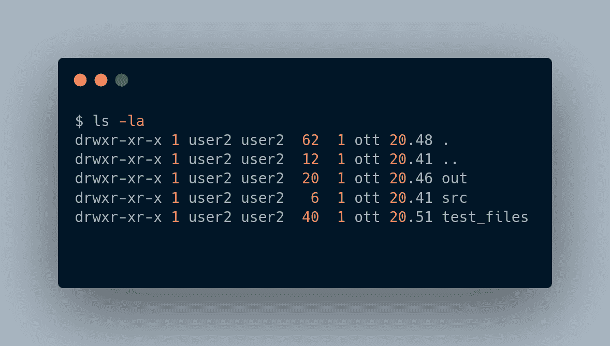
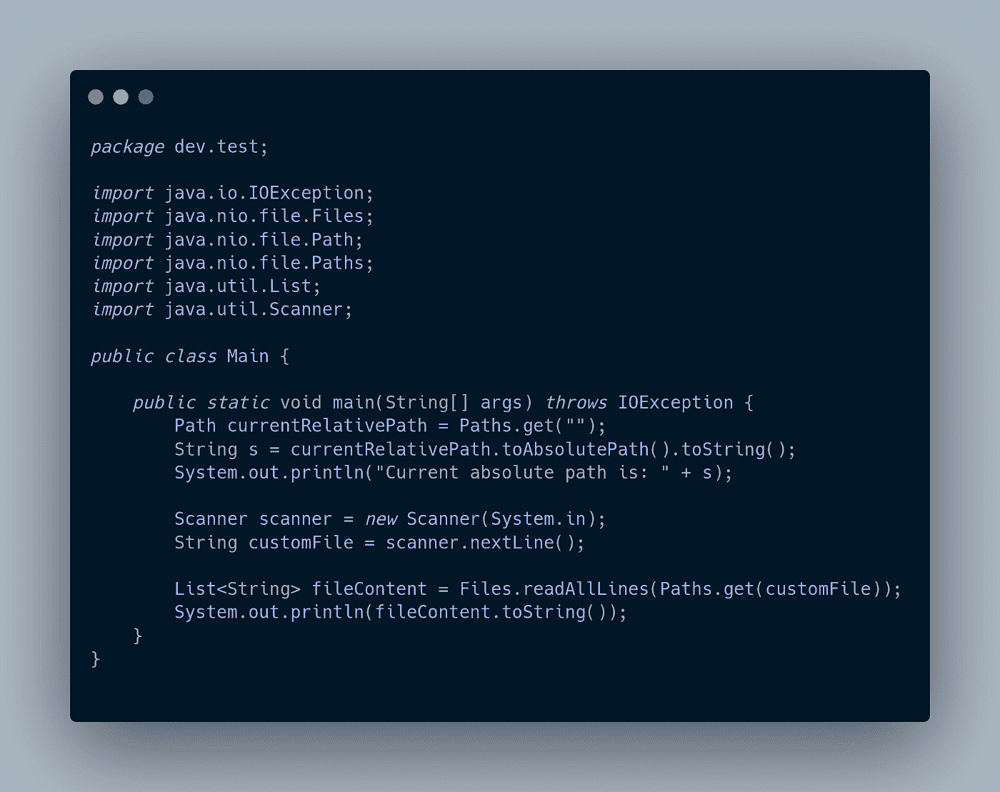
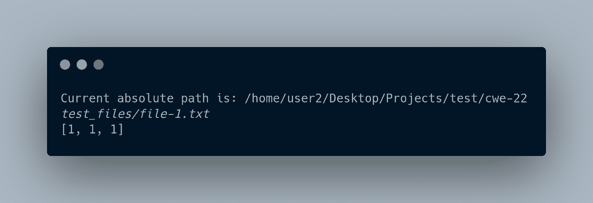
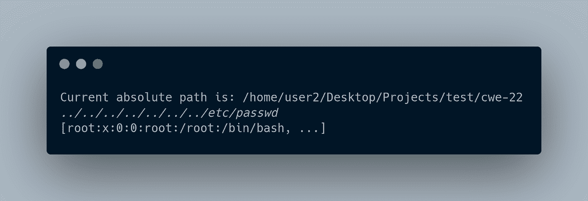
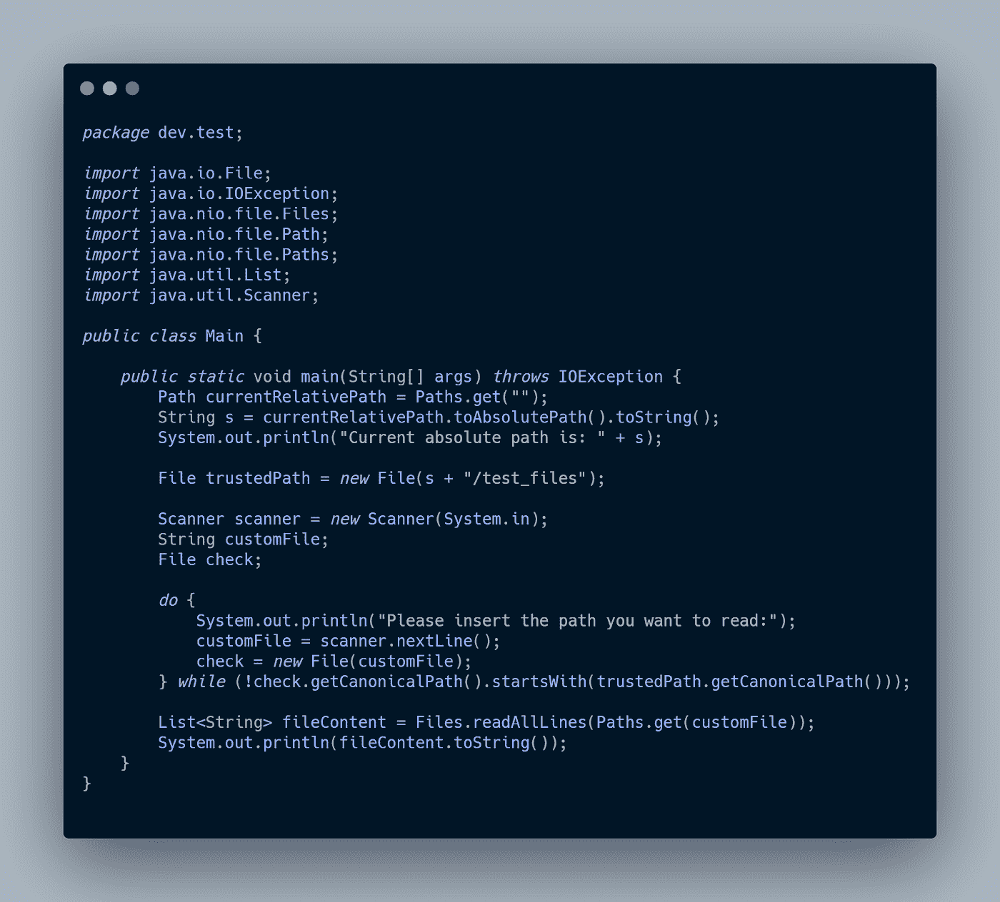
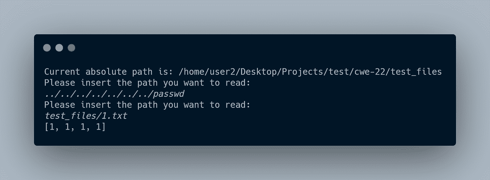
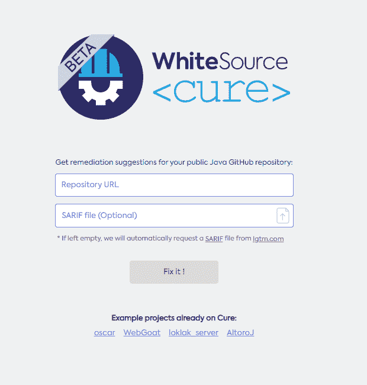
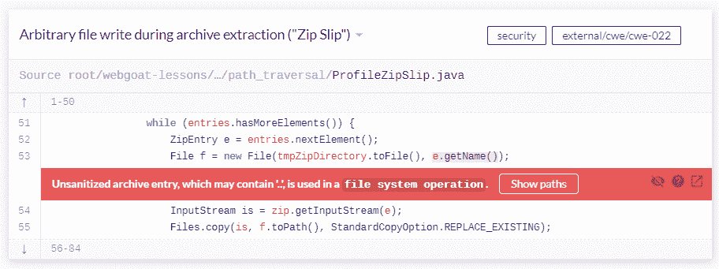
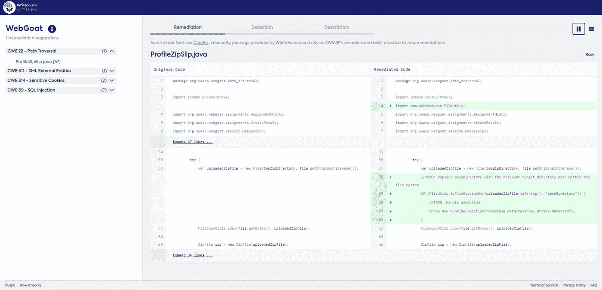

# Java 安全 101:CWE-22 路径遍历

> 原文：<https://blog.devgenius.io/security-101-for-java-cwe-22-path-traversal-4177cff9ddad?source=collection_archive---------1----------------------->

杰斯温·托马斯在 [Unsplash](https://unsplash.com?utm_source=medium&utm_medium=referral) 上的照片

当你是编码新手时，一切都很好。你写啊写，参加新的课程，看别人努力提高自己，不断探索新的框架、模式、语言等等。

但是如果你有一个好的导师或者参加一个更专注的课程，他们会教给你重要的一课——在改变语言、接近模式或者探索框架之前，你应该知道在开发解决方案时会遇到的基础知识和常见问题。你显然不可能知道编码时可能出现的每一个问题或 bug。但是，通过探索解决方案、与他人交流以及使用正确的工具，你可以取得巨大的进步。

我的 CWE-22 故事开始于几年前，当时我必须开发一个 Java 软件来数字化医疗诊所，这是我大学软件工程课程的一部分。

这个软件需要是一个简单的演示，因为考试的目的是正确地设计软件，然后尝试使用正确的原则实现软件的重要部分。我的一些同事没有意识到的是，并不是所有的信息都是可信的。

该软件的特点之一是对一些文件的动态管理。您可以使用一个方便的界面将它们存档，并在以后通过询问您选择的路径来取回它们。事情就是这样——魔鬼藏在细节后面！

# 缺陷、漏洞和升级

让我们摘下窃听器的面具，看看它是什么。当有人次优地处理相对路径时，路径遍历是一个常见的问题。它包括使用相对点放置一个路径，以到达文件系统中的另一个路径。如果你想得到一个更正式的定义，你可以查看关于它的 [OWASP 基础页面](https://owasp.org/www-community/attacks/Path_Traversal)。我会在这里保持轻松。

想象一下，您的系统中有一个名为 user2 的用户，其目录结构如下:

目录结构

这是 Linux 发行版的常见目录结构。如果你是 Windows 用户，除了“/home/user2”变成“C:\Users\user2”之外，它看起来会很相似。

运行 list 命令会给你文件夹中的文件。

[代号](https://carbon.now.sh/?bg=rgba%28171%2C+184%2C+195%2C+1%29&t=night-owl&wt=none&l=application%2Fx-sh&ds=true&dsyoff=20px&dsblur=68px&wc=true&wa=true&pv=56px&ph=56px&ln=false&fl=1&fm=Hack&fs=14px&lh=133%25&si=false&es=2x&wm=false&code=%2524%2520ls%2520-la%250Adrwxr-xr-x%25201%2520user2%2520user2%2520%252062%2520%25201%2520ott%252020.48%2520.%250Adrwxr-xr-x%25201%2520user2%2520user2%2520%252012%2520%25201%2520ott%252020.41%2520..%250Adrwxr-xr-x%25201%2520user2%2520user2%2520%252020%2520%25201%2520ott%252020.46%2520out%250Adrwxr-xr-x%25201%2520user2%2520user2%2520%2520%25206%2520%25201%2520ott%252020.41%2520src%250Adrwxr-xr-x%25201%2520user2%2520user2%2520%252040%2520%25201%2520ott%252020.51%2520test_files%250A%250A)

查看列表时，您会注意到两个特殊的文件，'.'和'..'。它们分别指这个文件夹和上面的文件夹。所以，如果你进入`./test_files`，它会打开 test_files 文件夹，但是如果你进入'..'，它将移动到项目外的文件夹中。

这意味着，如果用户输入一个路径，而该路径没有被正确检查，他们可以进入他们不应该访问的文件夹，如“etc ”,通过遍历文件夹到禁止的目的地。例如，从项目目录到 etc 文件夹，用户应该遍历`../../../../../../../etc`。

让我们通过一些代码来更好地理解这一点。

[代号](https://carbon.now.sh/?bg=rgba%28171%2C+184%2C+195%2C+1%29&t=night-owl&wt=none&l=text%2Fx-java&ds=true&dsyoff=20px&dsblur=68px&wc=true&wa=true&pv=56px&ph=56px&ln=false&fl=1&fm=Hack&fs=14px&lh=133%25&si=false&es=2x&wm=false&code=package%2520dev.test%253B%250A%250Aimport%2520java.io.IOException%253B%250Aimport%2520java.nio.file.Files%253B%250Aimport%2520java.nio.file.Path%253B%250Aimport%2520java.nio.file.Paths%253B%250Aimport%2520java.util.List%253B%250Aimport%2520java.util.Scanner%253B%250A%250Apublic%2520class%2520Main%2520%257B%250A%250A%2520%2520%2520%2520public%2520static%2520void%2520main%28String%255B%255D%2520args%29%2520throws%2520IOException%2520%257B%250A%2520%2520%2520%2520%2520%2520%2520%2520Path%2520currentRelativePath%2520%253D%2520Paths.get%28%2522%2522%29%253B%250A%2520%2520%2520%2520%2520%2520%2520%2520String%2520s%2520%253D%2520currentRelativePath.toAbsolutePath%28%29.toString%28%29%253B%250A%2520%2520%2520%2520%2520%2520%2520%2520System.out.println%28%2522Current%2520absolute%2520path%2520is%253A%2520%2522%2520%252B%2520s%29%253B%250A%250A%2520%2520%2520%2520%2520%2520%2520%2520Scanner%2520scanner%2520%253D%2520new%2520Scanner%28System.in%29%253B%250A%2520%2520%2520%2520%2520%2520%2520%2520String%2520customFile%2520%253D%2520scanner.nextLine%28%29%253B%250A%250A%2520%2520%2520%2520%2520%2520%2520%2520List%253CString%253E%2520fileContent%2520%253D%2520Files.readAllLines%28Paths.get%28customFile%29%29%253B%250A%2520%2520%2520%2520%2520%2520%2520%2520System.out.println%28fileContent.toString%28%29%29%253B%250A%2520%2520%2520%2520%257D%250A%257D%250A)

在这段代码中，按照开发人员的要求，用户应该只能访问`test_files`文件夹，编写文件的正确路径，如下所示。

输出

这是正确的。该文件包含三行，每行一个“1”。

但是如果用户更有想象力，他们可以输入遍历路径到 passwd 文件，例如。

横向输出

伤害已经造成了。“..”导致它遍历根目录并获取 passwd 文件。攻击者可能会对 [*passwd*](https://en.wikipedia.org/wiki/Passwd) 文件做些什么？

# 通过修复变得更安全

幸运的是，这个错误可以通过简单地检查用户要去哪里来修复。如果你知道用户应该只“沿着特定的路径”移动，为什么你会让他们向上爬呢？更简单的做法是检查用户输入的路径是否是可信路径。

[代码](https://carbon.now.sh/?bg=rgba%28171%2C+184%2C+195%2C+1%29&t=night-owl&wt=none&l=text%2Fx-java&ds=true&dsyoff=20px&dsblur=68px&wc=true&wa=true&pv=56px&ph=56px&ln=false&fl=1&fm=Hack&fs=14px&lh=133%25&si=false&es=2x&wm=false&code=package%2520dev.test%253B%250A%250Aimport%2520java.io.File%253B%250Aimport%2520java.io.IOException%253B%250Aimport%2520java.nio.file.Files%253B%250Aimport%2520java.nio.file.Path%253B%250Aimport%2520java.nio.file.Paths%253B%250Aimport%2520java.util.List%253B%250Aimport%2520java.util.Scanner%253B%250A%250Apublic%2520class%2520Main%2520%257B%250A%250A%2520%2520%2520%2520public%2520static%2520void%2520main%28String%255B%255D%2520args%29%2520throws%2520IOException%2520%257B%250A%2520%2520%2520%2520%2520%2520%2520%2520Path%2520currentRelativePath%2520%253D%2520Paths.get%28%2522%2522%29%253B%250A%2520%2520%2520%2520%2520%2520%2520%2520String%2520s%2520%253D%2520currentRelativePath.toAbsolutePath%28%29.toString%28%29%253B%250A%2520%2520%2520%2520%2520%2520%2520%2520System.out.println%28%2522Current%2520absolute%2520path%2520is%253A%2520%2522%2520%252B%2520s%29%253B%250A%250A%2520%2520%2520%2520%2520%2520%2520%2520File%2520trustedPath%2520%253D%2520new%2520File%28s%2520%252B%2520%2522%252Ftest_files%2522%29%253B%250A%250A%2520%2520%2520%2520%2520%2520%2520%2520Scanner%2520scanner%2520%253D%2520new%2520Scanner%28System.in%29%253B%250A%2520%2520%2520%2520%2520%2520%2520%2520String%2520customFile%253B%250A%2520%2520%2520%2520%2520%2520%2520%2520File%2520check%253B%250A%250A%2520%2520%2520%2520%2520%2520%2520%2520do%2520%257B%250A%2520%2520%2520%2520%2520%2520%2520%2520%2520%2520%2520%2520System.out.println%28%2522Please%2520insert%2520the%2520path%2520you%2520want%2520to%2520read%253A%2522%29%253B%250A%2520%2520%2520%2520%2520%2520%2520%2520%2520%2520%2520%2520customFile%2520%253D%2520scanner.nextLine%28%29%253B%250A%2520%2520%2520%2520%2520%2520%2520%2520%2520%2520%2520%2520check%2520%253D%2520new%2520File%28customFile%29%253B%250A%2520%2520%2520%2520%2520%2520%2520%2520%257D%2520while%2520%28%21check.getCanonicalPath%28%29.startsWith%28trustedPath.getCanonicalPath%28%29%29%29%253B%250A%250A%2520%2520%2520%2520%2520%2520%2520%2520List%253CString%253E%2520fileContent%2520%253D%2520Files.readAllLines%28Paths.get%28customFile%29%29%253B%250A%2520%2520%2520%2520%2520%2520%2520%2520System.out.println%28fileContent.toString%28%29%29%253B%250A%2520%2520%2520%2520%257D%250A%257D%250A)

您可以看到修复非常简单，但是让我们深入了解一下。首先改变的是一个可信路径的初始化，它将在以后用于我们的“安全检查”。我们希望通过将相对路径转换为绝对路径来“规范化”作为输入给出的所有路径。进行这种转换可以让我们检查给定的绝对路径是否与可信路径具有相同的起始部分。

我们的可信路径将类似于`/home/user2/Desktop/Projects/test/cwe-22/test_files`。所以，一旦我们输入了我们的错误路径，它将被翻译成/etc/passwd，除了与我们的可信路径相同的首字母'/'之外，它什么也没有。这将使 while 条件为真，程序将要求一个干净的路径。

修复后输出

这是项目运行后的输出。如您所见，错误已被纠正，漏洞已不复存在！

# 连续固定

CWE-22 很容易修复，但是像 [CWE-502](https://cwe.mitre.org/data/definitions/502.html) 这样的东西呢——不可信数据的反序列化。你可能甚至没有听说过这个 CWE，可能也不知道它会在什么时候以什么方式袭击你。这就是两个伟大的免费工具的用武之地:GitHub 和 WhiteSource Cure。

许多开发者把他们的代码放在 [GitHub](http://github.com) 上，但是并不是每个人都知道 GitHub 的所有特性。它有许多很酷的工作流程，如 CI/CD 和问题管理，可以让您的生活更轻松。

白源<cure>主页</cure>

另一方面，WhiteSource Cure 通过修复 GitHub 库中的错误来帮助你。你怎么把两者联系起来？你用的是萨里夫文件。

[SARIF](https://sarifweb.azurewebsites.net/) 代表静态分析结果交换格式。这是一个文件，静态分析工具将它作为输出提供给你，以传达带有附加元数据的扫描结果。为您提供这个 SARIF 文件的流行静态分析器是 PVS-Studio 和 detekt。你也可以使用持续的安全工具，如 LGTM。当你有了 SARIF 文件，你只需要打开 WhiteSource Cure，看看你的 bug 以及如何修复它们。

界面非常直观。如果您没有使用 LGTM，请输入您的存储库 URL 和 SARIF 文件，然后单击“修复它！”。

但是让我们来看看为什么它在一个稍微大一点的项目中如此重要。如果你看一下白山羊在 LGTM 的页面，你会发现很多错误，包括 CWE-22。

[CWE-22 在 LGTM 网页上](https://lgtm.com/projects/g/WebGoat/WebGoat/?mode=list)

当您有效地知道如何修复每个 bug 时，这是非常有用的。当然，你可以花很多时间去研究修复影响你项目的每一个 bug 和 CWE。但是，在你决定之前，把你的注意力转移到 WhiteSource Cure 的同一个[项目页面](https://cure.whitesource.io/#/report/c4646a5eeef511ebbaa60242ac110002/cwe/22/nodeId/1/runId/64)。

该页面显示了与 CWE-22 相关的同一个错误，但有一个主要的不同:他们提供了一个快速的方法来修复右边的错误。

WhiteSource WebGoat 页面

他们的修复程序使用他们自己的库 CureKit，可以在 Apache 2.0 许可下在 GitHub 上获得。听起来很棒，不是吗？

# 远离不安全感

我们目前生活在一个网络安全成为我们日常生活一部分的时代。我见过许多关于数据泄漏、代码泄漏、bug 和许多其他问题被不良攻击者用来谋取私利的故事。但是，如果你每天都在学习更多的网络安全知识，并使用正确的工具来发现和修复你的漏洞，互联网将成为一个更加安全的地方！