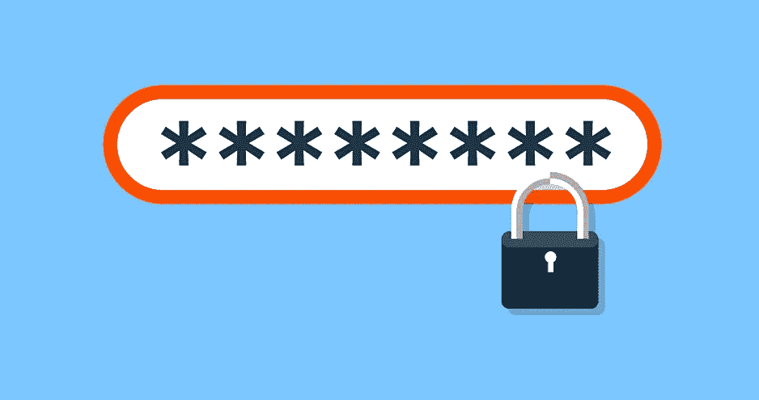
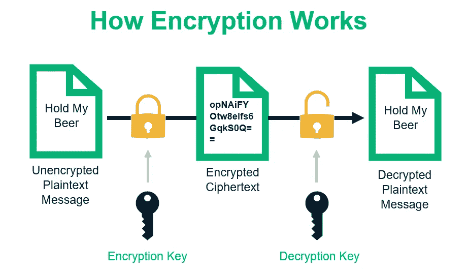
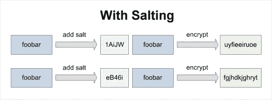

# 作为前端工程师的安全性和身份验证

> 原文：<https://blog.devgenius.io/security-and-authentication-as-a-frontend-engineer-7ebd69813e8d?source=collection_archive---------4----------------------->

我们生活在数据驱动的时代。互联网是众多需要客户数据的服务的支柱。作为一名前端工程师，我现在正在扩展他的技能，包括数据库管理和后端开发，我开始意识到我对整个事情是多么的天真和健忘。是的，我知道我必须实现 gitIgnore 来保护我的 API 密钥之类的东西，但是我对保护用户数据了解多少呢？

在我过渡到全栈工程(MERN)的过程中，这是那些打开了我的眼界，让我看到超越 web 开发的东西的模块之一。现在我知道在我的网站上至少要实现 6 个级别的认证(我喜欢基于项目的学习，所以我用 React 和 tailwind 创建了一个简单的健身房网站，我将为数据库和后端添加 MongoDB 和 Node.js)。我现在知道的 6 个级别是:

1.  用用户名和密码注册用户
2.  数据库加密
3.  哈希密码
4.  腌制和哈希
5.  Cookies 和会话
6.  OAuth 2.0

一级

这包括为用户创建一个帐户，并将用户名和密码存储在数据库中，这样当他们下次再来时，就可以对照密码检查他们的用户名。

这种认证方式的问题在于，黑客只需要染指我的数据库文档，仅此而已。如果我有数百万用户，并且我的密码都是明文的，黑客可能会过一个**hooge**感恩节。所以如果我要做一个网站，我不会以纯文本的形式存储我客户的个人信息。这让我们想到

第二级

加密。打乱明文，让人分不清原来的样子。有点像丹·雷诺斯(想象龙主唱)说“想象龙”是原文的变位词。我数不清我进行了多少次迭代和排列，然后试图找出最初的单词 lol，在最初的 25 次尝试后我放弃了。这就是加密的作用，它让你质疑“你试图获取的这些信息值得吗？真的真的值得吗？”这种策略有时可能会奏效，但随着高清 GPU 的出现，破解复杂加密代码所需的时间大大减少了。你都不知道。无论是凯撒密码还是英格玛机，都存在缺陷，在我们的世界中，利用这些缺陷所需的工具掌握在那些知道如何使用它们的人手中，可悲的是，他们不站在你这边，他们想要个人信息，解密对一些人来说是在公园里散步。所以这个高度不是安全着陆区，我们必须向高处移动。如果我想在这里休息，npm 包“mongose-encryption”已经完成了。继续前进

第三级

散列法试图通过引入散列函数(一种只向前发展的数学方程)来消除解密的可能性。假设我问你“377 除了 1 和 377 还有哪些因子？”当然，你有一些信息可以利用，但是你花了多长时间才弄明白？(答案，13 和 29)。一个类似的问题是“你能把 13 乘以 29 吗？”。向前移动(13 x 29 得到 377)显然比向后移动(找到 377 的因子)容易，这就是哈希函数的基本工作方式。这使得将代码解密回明文变得困难且耗时，但开发代码和加密却非常容易。

因此，当我们的用户在我们的网站上注册时，我们对密码进行哈希处理，并将哈希存储在我们的数据库中。然后，当他们试图登录时，我们对输入密码进行哈希处理，并将其与我们数据库中的哈希值进行比较。在整个过程中，我们从未接触过明文密码，唯一知道密码的人是用户。" **md5** "是一个有效的哈希算法包。但是要注意几件事:当你在同一个字符串上运行散列时，创建的散列总是相同的。

这应该是我们的极乐世界，天堂，安息之地但不是，你一提出问题，黑客就想出解决方案。提示下一关

加盐😂

撇开盐裴的笑话不谈，盐是一个非常聪明的把戏。如果一个黑客进入了我们的数据库，复制一个散列密码并搜索它的值(如果所说的密码是一个普通或流行的短语)是不费吹灰之力的。这就是为什么我们被建议生成非字典密码，它增加了哈希的崩溃时间(可怕的统计数据，使用最新的 GPU，黑客每秒可以轻松通过 20，000，000，000 个 md5 哈希函数)。这就是“ **bcrypt** ”进入对话的地方。最新的 GPU 每秒可以计算大约 17，000 个 bcrypt 哈希，就像这样，即使用 md5 破解也需要几分钟或几秒钟的东西，突然需要几个月才能破解，谁有那个时间？所以盐析基本上可以用这个图来解释

同一个字，不同的盐，不同的哈希值。Bcrypt 还引入了 salt rounds:在从第一次散列和加盐过程中获得散列后，重复你认为合适的次数。有了这个解释，我们就进入了过度认证的领域。

现在，这就是事情变得非常私人的地方。最简单的形式是，一个饼干就像一个幸运饼干，里面有一个信息，可以被传递和打破来揭示信息。我总是看到网站上写着“我们使用 cookies”之类的话，然后我会看到“接受或拒绝”的选项。我不知道饼干是什么意思，但现在，它就像一层面纱从我的眼睛上揭开，我现在可以看得很清楚了。这个话题真的真的很深刻，所以，总结一下:

一、会话是指从你登录一个站点到你关闭它的这段时间，重点是关闭。

二。会话数据存储在 cookie 中

三。cookies 帮助客户在每次离开和回到我的网站时重新开始。

四。浏览网页后，请务必清除/删除网页。

在 web 开发术语中，我们感兴趣的 cookiess 是那些建立和维护会话所需的 cookie。这意味着当您登录时，会用您的凭据创建一个 cookie，cookie 会说，“该用户已登录，并已成功通过身份验证”。所以在这段时间内，你浏览一个网站，你不会被要求再次登录。cookie 会保持您的身份验证，直到您注销并且 cookie 被销毁。npm 包“ **Passport** ”有助于实现。它有助于本地身份验证策略。它还有助于自动加盐和散列(**护照-本地-猫鼬**)。

OAuth，一个基于令牌授权的开放标准，就像是把我们网站的认证外包给了顶级安全的高科技公司。例如登录谷歌、脸书和其他网站。

这些公司采用了广泛的安全功能和程序(胡椒和加密整个数据库，等等)，因此客户可以放心，我们无法访问他们的个人信息，并且信息保持完整。每当他们想要登录我们的网站时，我们会将他们定向到第三方应用程序，这些应用程序使用他们自己的安全方法对他们进行身份验证，一旦完成，他们就会被重定向回我们，从而减少我们的责任。

我个人在过去很难相信网站上有我的个人信息，尤其是当我被引导到“登录谷歌，我仍然需要输入我的密码”时，我不知道这可能是当今最安全的认证方式之一。

我猜做后端工程师的好处包括清晰。