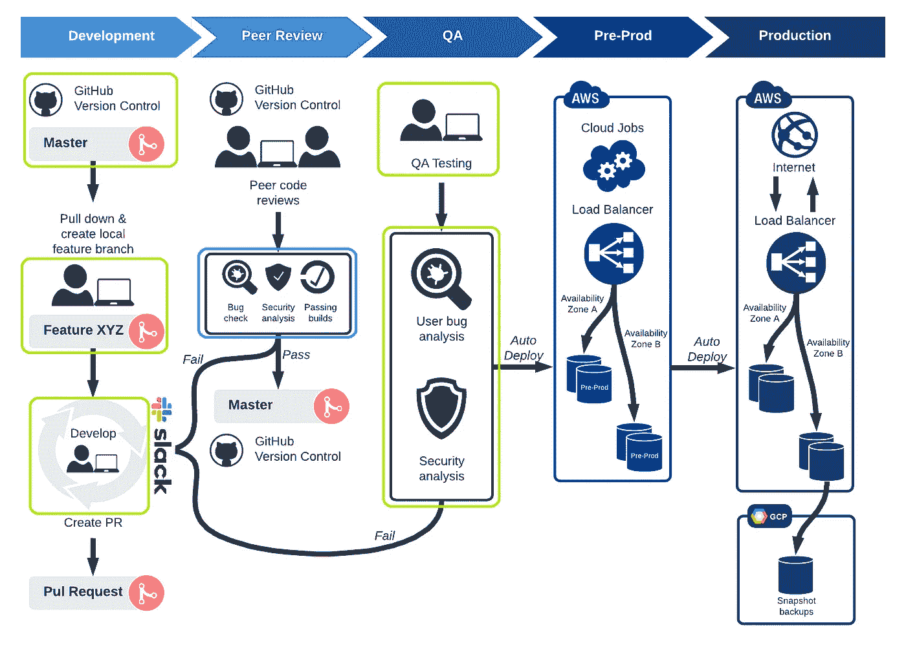
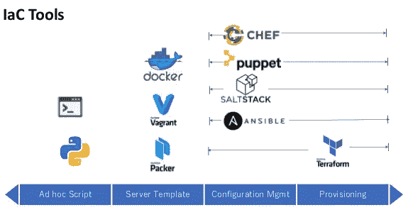
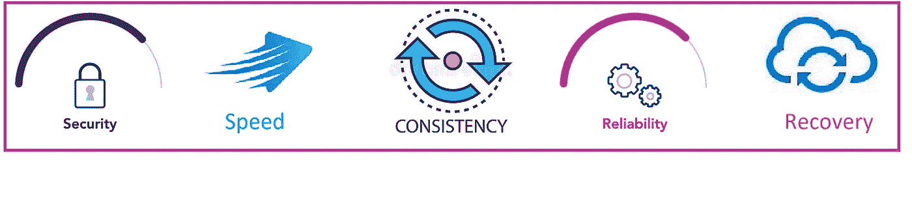
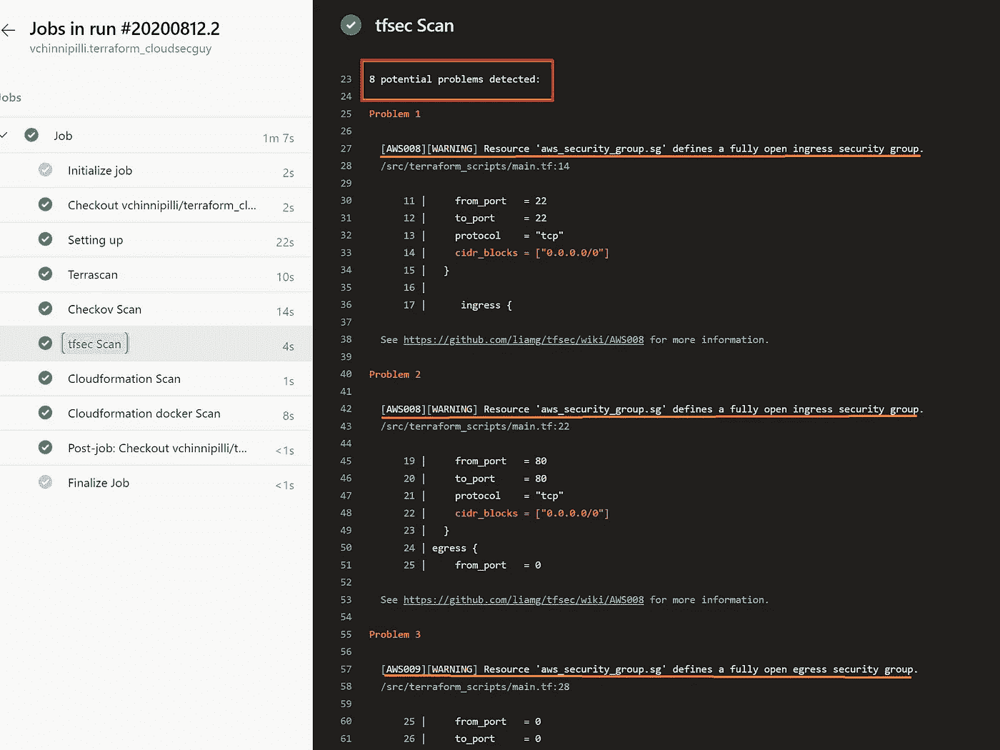
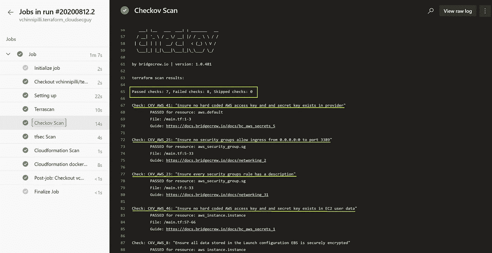
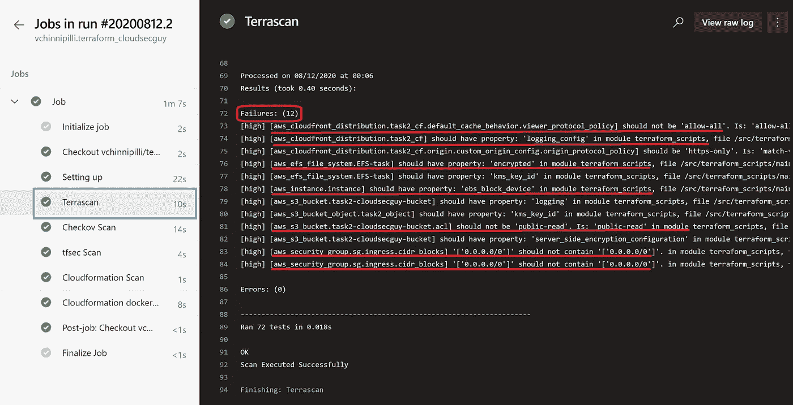
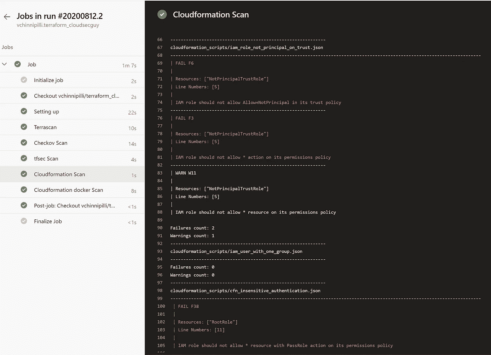
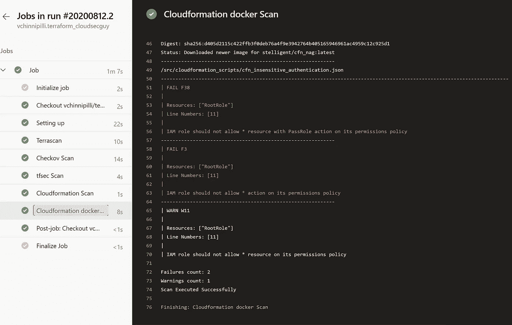

# IaC 的安全自动化

> 原文：<https://blog.devgenius.io/security-automation-for-iac-a3256be8cd32?source=collection_archive---------5----------------------->

随着 DevOps 的出现， [](https://geekflare.com/infrastructure-as-code-intro/) ***IaC*** ( *基础设施即代码*)策略的采用在 IT 领域迅速升温，以更快的速度、更低的成本和最少的人为错误开发和部署可扩展和可重复的云实施。



IT 基础设施的指数级增长以及持续集成和持续部署(CI/CD)管道的兴起推动了对一致且可扩展的自动化的需求。

# IaC 有哪些不同的类型？

IaC 工具可以分为两类。

***编排工具* :** 有助于供应、组织和管理基础架构组件的工具(例如，CloudFormation、Terraform、ARM、Pulumi 等)。

***配置管理工具* :** 另一方面，这些工具用于安装、更新和管理基础设施组件中正在运行的软件(例如 Ansible、Chef、Puppet 和 SaltStack)。



IaC 工具的类型

# **为什么 *IaC* 这么快被采用？**

***IaC*** 帮助您以可重复、一致的方式自动化基础架构部署流程，这有很多好处。好处是如此强大，以至于我们开始看到公司在其 IT 环境中非常迅速地采用这种方法。



IaC 的一些好处

以下是采用 IaC 模型的一些好处。

*   *****速度*******→***IaC 的目标是通过消除人工流程，消除流程中的懈怠，让事情变得更快。基于代码的方法更容易做到事半功倍。***
*   ******一致性→*** IaC 完全标准化了基础设施的设置，因此减少了任何错误或偏差的可能性。这将降低基础设施出现任何不兼容问题的可能性，并帮助您的应用程序更平稳地运行。***
*   ******可靠性→*** IaC 完全标准化了基础设施的设置，因此减少了任何错误或偏差的可能性。这将降低基础设施出现任何不兼容问题的可能性，并帮助您的应用程序更平稳地运行。***
*   ******恢复→*** 迁移或重建已经在代码中定义的基础设施很快就变成了一项琐碎的任务。系统的代码已经在那里了，你只需要重新部署它，然后一切又都在那里了。***

***但是，通过 IaC 保持与 CI/CD 实践的同步会带来一些挑战，并且会给我们带来管理安全风险的巨大责任。***

> ***这篇博客文章试图向您介绍静态分析工具，这些工具可以在您部署基础设施之前自动检测基础设施中的问题，包括安全漏洞，并利用 IaC 的内置优势将可伸缩性和可预测性的价值转移到基础设施安全中。***

# ***使用开源工具实现 IaC 的安全自动化***

1.  *****tfsec** *tfsec* 使用对您的 terraform 模板的静态分析，在您投入生产之前发现潜在的安全问题和错误配置，并帮助您修复它们。***

*****安装:*****

```
*Install with brew/linuxbrew:
brew tap liamg/tfsec
brew install liamg/tfsec/tfsecInstall with Chocolatey:
choco install tfsecInstall with Go:
go get -u github.com/liamg/tfsec/cmd/tfsecUse with Docker:
docker run — rm -it -v “$(pwd):/src” liamg/tfsec /src*
```

******

***tfsec 的扫描输出***

*****2。Checkov** *Checkov*是一个针对基础设施即代码的静态代码分析工具。***

***它扫描使用 [Terraform](https://terraform.io/) 、 [Cloudformation](https://aws.amazon.com/cloudformation/) 、 [Kubernetes](https://kubernetes.io/) 、 [Serverless](https://www.serverless.com/) 或 [ARM 模板](https://docs.microsoft.com/en-us/azure/azure-resource-manager/templates/overview)配置的云基础架构，并检测安全性和合规性错误配置。***

*****安装**:***

```
*Install with PIP
pip install checkovInstall with homebrew
brew tap bridgecrewio/checkov [https://github.com/bridgecrewio/checkov](https://github.com/bridgecrewio/checkov)
brew update
brew install checkovUse with Docker:
docker run -t -v /user/tf:/tf bridgecrew/checkov -d /tf*
```

******

***CheckOV 的扫描输出***

*****3。terras can** *terras can*将对您的 terraform 模板执行静态代码分析，以确保您的 IAC 遵循安全性和最佳实践。***

*****安装**:***

```
*Install with PIP:
pip install terrascanUse with Docker:
docker run accurics/terrascan*
```

******

***Terrascan 的扫描输出***

***4.cfn-nag
*cfn-nag* 解析一组云信息模板，并应用规则来发现*可能*导致不安全基础设施的代码模式。该工具的结果包括违反资源的逻辑资源标识符和违反了什么规则的解释。***

*****安装**:***

```
*Install with gem:
gem install cfn-nagInstall with brew:
brew install ruby brew-gem
brew gem install cfn-nagRun with Docker:
docker build -t stelligent/cfn_nag .*
```

******

***使用 cfn-nag cli 扫描输出***

******

***使用 cfn_nag docker 图像扫描输出***

***如果您想尝试这些开源工具，可以使用这个易受攻击的代码片段进行测试。***

# ***结论:***

***如果处理得当，基础设施即代码安全性既可以解决开发过程中配置错误的 IaC 文件，又可以将运行时安全性问题转化为构建时治理。但是，要使基础设施即代码安全有价值并取得成功，它必须***

***1)自动化，2)按代码交付，3)连续工作流程的一部分。***

# *****参考文献:*****

***【https://github.com/liamg/tfsec
[https://github.com/bridgecrewio/checkov](https://github.com/bridgecrewio/checkov) [https://github.com/accurics/terrascan](https://github.com/accurics/terrascan) https://github.com/stelligent/cfn_nag***