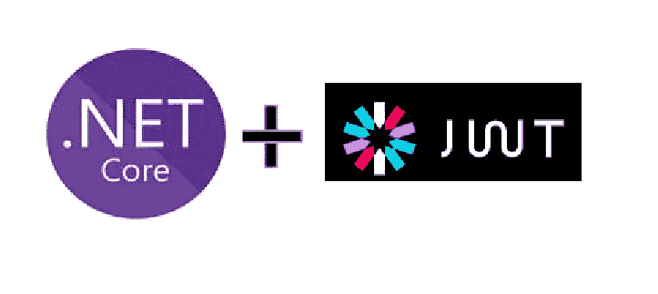
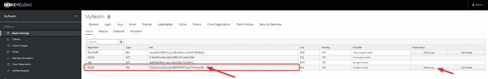
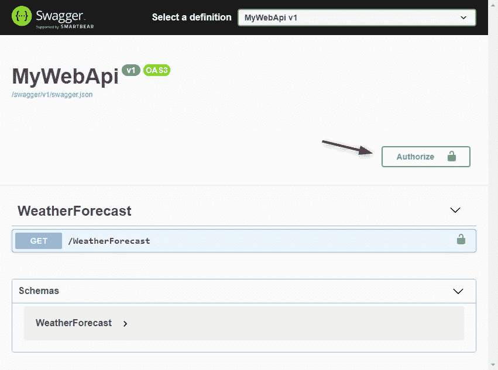
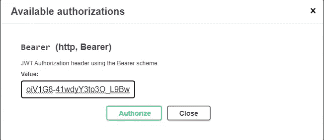
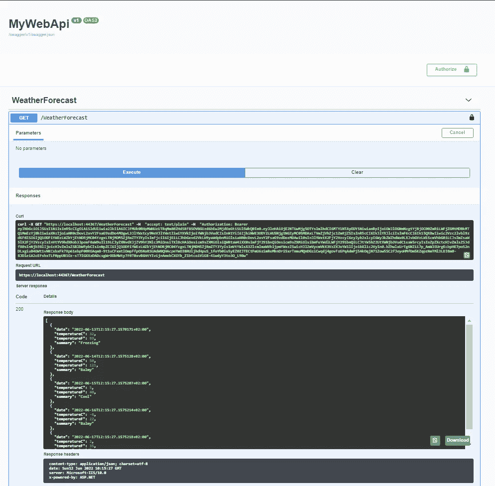
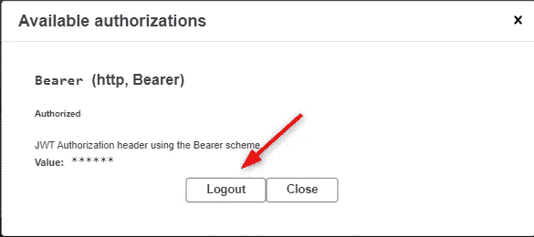

# 第三部分:React 和 WebApi 在 ASP.NET Core C #中的安全性

> 原文：<https://blog.devgenius.io/security-in-react-and-webapi-in-asp-net-core-c-with-authentification-and-authorization-by-keycloak-f890d340d093?source=collection_archive---------0----------------------->

## 第三部分:用 JWT 认证保护 ASP.NET 核心 C # REST Web API
版本 1.0
日期 2022/06/12
作者 Nicolas Barlatier



如果你错过了第一部分:
[第一部分:用 Docker 和 Administration 安装 key cloak](https://medium.com/p/1d076777a979)

如果您错过了第二部分:
[第二部分:保护前端 React 应用程序](/security-in-react-and-webapi-in-asp-net-core-c-with-authentification-and-authorization-by-keycloak-89ba14be7e5a)

最后第四部分:
[第四部分:从 React SPA 调用受保护的 Web API，使用访问 JWT 令牌载体授权](https://medium.com/@barlatiernicolas/part-four-security-in-react-and-webapi-in-asp-net-b6dffd3b7624)

如果你需要了解更多关于 RS256 JWT 验证的知识:
[第 1 部分:密码学。NET Core 5.0:关于 RSA 和 RS256 签名和验证您需要知道的一切。](https://systemweakness.com/part-1-cryptography-in-net-c0f78cfa9326)

要在 Docker 中使用**前端 React 应用程序，您可以阅读:**

[第一部分在 Windows 10 上用 NodeJS 和 NGINX 对 TypeScript React App 和 WSL2 Alpine Linux 进行 dockering](https://medium.com/@barlatiernicolas/dockerizing-the-typescript-react-app-with-nodejs-vs-nginx-with-wsl2-alpine-linux-on-windows-10-8dddd447f43a)

包含 React 和 Web API 项目的 GitHub 存储库

*   **用类型脚本对 18.1.0 版做出反应**
*   【ASP.NET 核心 5.0 的 T21 网络应用编程接口

[](https://github.com/nicoclau/reactwebapiaspnetcorekeycloak) [## GitHub—nicoclau/reactwebapiaspnetcorekeycloak:React 和 REST 受 keycloak 保护的 Web API 与…

### React 和 REST Web API 由带有授权代码流和 JWT 令牌的 Keycloak 保护— GitHub …

github.com](https://github.com/nicoclau/reactwebapiaspnetcorekeycloak) 

您有两个提交:


第一次提交包含:

*   由 keycloak 服务器保护的 React SPA
*   Web API 由访问令牌保护，使用来自 keycloak 服务器的公钥进行验证

这两个应用程序还没有通信，它们只是受到保护。

第二次提交包含:

*   React SPA 使用 JWT 令牌与 Web API 通信，并处理 CORS 策略

# 介绍

到目前为止，我们已经看到了如何使用 Keycloak 来保护我们的 **SPA 应用程序**。

现在，如果没有任何**服务**反馈**信息和**数据**数据**，那么 **SPA 应用**将会变得毫无用处。这里我们将关注一种类型的服务:Rest Web API。我们需要保护它。

> 用户与 SPA/移动应用/桌面应用/Web 应用/CLI/…进行交互，并将使用 **OpenID Connect(授权码授予)**进行身份验证。授权服务器将发出一个`id_token`(由应用程序用来**认证用户**)和一个`access_token`(由应用程序用来代表用户调用 API **。)**

所以 SPA 收到了两个带有 OpendConnectID 协议的令牌:ID 令牌和访问令牌。我们将看到,**访问令牌**将用于访问我们的受保护资源:REST API。因为这个令牌将包含关于授权的声明。

此外，我们将使用服务是外部服务的架构；它将作为外部 REST API 托管。

这是什么意思？这意味着 REST API 将托管在不同的机器/虚拟机/网络上，并且可以通过与用于访问 SPA 的域不同的域中的 URI 进行访问。

下面是 SPA、外部 REST API 和 Keycloak 之间的完整工作流:


SPA Keycloak 和外部 REST API 之间的流程

我们已经详细了解了步骤 1、2 和 3

在这里，我们将详细说明步骤:4 和 5。

SPA 将在步骤 4 中访问外部 REST API。
REST API 将受到**承载认证方法**的保护。

在 9 月 5 日，响应将返回 CORS 头，因为 REST API 托管在不同于 React SPA 使用的域中。

为什么使用这种方法进行载体认证？

**承载认证**(也称**令牌认证**)是一种 [HTTP 认证方案](https://developer.mozilla.org/en-US/docs/Web/HTTP/Authentication)，涉及**安全令牌**称为**承载令牌**。名称“载体认证”可以理解为“给予该令牌的载体访问权”承载令牌是一个加密字符串，通常由服务器生成以响应登录请求。当向受保护的资源发出请求时，客户端必须在`Authorization`报头中发送该令牌:

*   `Authorization: Bearer <token>`

承载认证方案最初是作为 [RFC 6750](https://tools.ietf.org/html/rfc6750) 中 [OAuth 2.0](https://swagger.io/docs/specification/authentication/oauth2/) 的一部分创建的，但有时也单独使用。承载身份验证应仅用于 HTTPS (SSL)。

在我们的例子中，将使用什么令牌？**访问令牌**确实！为什么？因为它是在 **OAuth 2.0** 中使用的令牌！令牌还包含所有**需要的声明**，以确保请求被授权或不到达我们的**受保护资源**:这里是 REST API。SPA 应用程序使用访问令牌代表用户调用 API。

在这篇博客中，我们将让我们的 REST API 得到完全的保护。对任何方法的任何访问都需要授权。

**创建我们的 REST Web Api**

让我们创建我们的项目。这里用的是 **Visual Studio 2019** 。我倾向于为前端 React SPA 使用**可视代码**，为所有后端解决方案使用 **Visual Studio 2019** 。

点击“ASP。NET Core Web API”然后接下来


创建 ASP.NET 核心 Web API 项目

让我们提供“项目名称”和“位置”


项目名称和位置

让我们单击“下一步”，我们将看到构建项目前最重要的步骤:


目标框架和 HTTPS

我们先用 Visual Studio 2019 选择最近的一个来设置目标框架:。NET 5.0


。NET 5.0

让我们单击“为 HTTPS 配置”,这样我们就可以确保将发送到 Web API 的“访问令牌”将受到 TLS 的保护。

让我们选中“启用 OpenAPI 支持”,以便启用 Swagger。


HTTPS 和斯瓦格

点击“创建”

我们得到以下解决方案:


MyWebApi 解决方案

Visual Studio 2019 默认创建了一个 REST Web API，它有一个控制器，可以返回随机的天气预报。

这将足以满足我们的需要。

我们在调试模式下运行 REST API，方法是单击 F5:

将运行 IIS Express


IIS 快速通知

我们可以看到我们的应用程序 MyWebApi 的 URL:


MyWebApi Urls

而且 Visual Studio 会用一个随机端口自动打开我们的 Chrome 浏览器:


它将公开招摇，非常方便地发现服务。

让我们点击“获取”

我们将详细了解如何调用该方法


点击“试用”，然后点击“执行”

我们得到了回应。


Swagger 是发现我们的 REST Web API 的一个非常方便的标准。

但是我将通过使用 HTTP GET 方法和发送带有值 text/plain 的头:accept 来再次使用失眠症


失眠:天气预报控制器 HTTP GET 请求和响应

因此，现在我们确保我们有一个 REST Web API，它运行平稳，但它完全不受保护！

让我们继续下一部分:

**保护我们的 REST Web Api**

在更新我们的代码库之前，我们需要了解:我们的 web api 将如何通过使用 JWT 访问令牌进行授权而得到**保护？它**将如何验证**我们的 **JWT 访问令牌**，该令牌将由我们的 SPA React 应用程序在名为**授权**的标头中发送，其值为
**无记名** <令牌>**

一开始真的很混乱，但最后确实很简单。

首先，我们需要了解 JWT 访问令牌的结构、格式和数据。

还记得我们从失眠中直接得到的表征吗:


让我们获取访问令牌:

> eyjhbgcioijsuzi 1 niis INR 5 ccigoiaislduiiwia 2 KIA 6 icjfmuk 0 rhpmwhuzutrqmm 80 zhdsrfbsovbguzd 6 be w2 mdoagtisu l5 wkq 0 in 0 . eyjlheioje 2 ntq 1 ntexmzusimlhdci 6 mt y1 NDU 1 MDG znswianrpijoidgyotcymgyttu 0 ms 0n TQ 3 ltgytzt TN zu 4 yjewymiy g3ii wiaxnzijoia HR 0 CDO v2 vy 2 fsag 90

让我们用 JWT 网站来解码。我们把 ***3 部分用“.”隔开***

例如:


要了解 JWT，最好的文章是:

[](https://arielweinberger.medium.com/json-web-token-jwt-the-only-explanation-youll-ever-need-cf53f0822f50) [## JSON Web Token (JWT) —您需要的唯一解释

### JSON Web 令牌正在改变世界。一劳永逸，

arielweinberger.medium.com](https://arielweinberger.medium.com/json-web-token-jwt-the-only-explanation-youll-ever-need-cf53f0822f50) 

在我们的令牌中，我们得到:


***第一部分***
中的红色表头我们有:


```
{
 “alg”: “RS256”,
 “typ”: “JWT”,
 “kid”: “E1I4DzLXu3Q4j2o4dwRDPR9PFS7zlL627NhkbIIyZD4”
}
```

我们有:

*   算法:RS256
*   **键 ID(kid)**:E1 i4 dzlxu 3 q 4j 2 o 4 dwrdpr 9 PFS 7 zll 627 nhkbiiyzd 4

这个 **kid** 信息将引导我们获得正确的**公钥**来验证 REST Web API 中的访问令牌。

在 Keycloak 中找到**公钥**转到“领域设置”,然后在“密钥”选项卡上，确保你在“活动”子选项卡上，然后你看适当的算法:我们寻找 RS256，你可能有两行，然后你看孩子，你看到它是最后一行。现在点击“公钥”按钮



如何用好的算法和孩子找到合适的线


如何获得公钥

现在我们知道哪个**公钥**将用于验证客户端(比如我们的 SPA)发送给任何受保护资源的 **JWT 访问令牌**:这里是我们的 REST API。

***第二部分***

它是主要的有效载荷:

我们已经看到了这一点，我们在这里将重点关注声明:

[https://www.rfc-editor.org/rfc/rfc7519#section-4](https://www.rfc-editor.org/rfc/rfc7519#section-4)

*   **ISS**:“ISS”(发行人)索赔确定了发行
    JWT 的委托人。这是我们 Keycloak 服务器的 URI
*   **aud**:“aud”(受众)声明标识了 JWT 的目标接收者。
*   **sub**:“sub”(subject)索赔标识了作为 JWT 的
    主体的委托人。必须是独一无二的。
*   **typ:** 由[ [JWS](https://www.rfc-editor.org/rfc/rfc7519#ref-JWS) ]和[ [JWE](https://www.rfc-editor.org/rfc/rfc7519#ref-JWE) ]定义的“typ”(类型)头参数被 JWT 应用程序使用
    来声明媒体类型[ [IANA。这是一个完整的 JWT。这里是“不记名”，所以我们可以使用它](https://www.rfc-editor.org/rfc/rfc7519#ref-IANA.MediaTypes)

Keycloak 添加了与用户和 ClientId 相关联的角色

*   resource _ Access/**MyApp**/Roles[Admin]

这里我们只有一个管理员。但是我们可以有几个。

此外，我们可以看到**clientId**:**MyApp**。

所以我们在 REST API 中需要的是我们的客户端 id MyApp 的角色声明

***第三部分***

这只是为了确保主要有效载荷(第二部分)没有被篡改。

jwt 可以使用秘密(使用 **HMAC** 算法)或使用 **RSA** 的公钥/私钥对进行签名

因为 keycloak 使用的是 RSA。

> 签名= **RSA** (
> 
> ***SHA-256***(
> base 64 urlencode(header)+“.”+ base64UrlEncode(有效负载))
> 
> ，**私钥**

我们有两个步骤:

1)用 SHA-256 散列报头和有效载荷

我们用 SHA-256 散列:“base64 header.base64 payload”(注意。作为分隔符)

2)签名:使用私钥通过 RSA 算法对散列进行编码

然后，我们通过使用 RSA 算法用私钥对散列进行编码来制作签名。

然后当我们的受保护资源:REST API 将使用**公钥**验证令牌。

现在我们将看到如何使用授权方案:Bearer 来保护我们的 REST API。

如何在我们的 ASP.NET 核心 Web API 中添加 JWT 熊授权?**?**

现在是时候了解如何在我们的 ASP.NET 核心 Web Api 应用程序中使用授权了。
我们将看到如何保护我们的 API 端点。

首先，为了帮助我们添加适当的服务和中间件，以便在我们的应用程序中使用 JWT 载体认证，让我们安装:

> 微软。AspNetCore . authentic ation . jwtbearer

在 nuget 的帮助下:

[](https://www.nuget.org/packages/Microsoft.AspNetCore.Authentication.JwtBearer) [## 微软。AspNetCore . authentic ation . jwtbearer 6 . 0 . 5

### ASP。NET 核心中间件，使应用程序能够接收 OpenID 连接承载令牌。这个包是建立在…

www.nuget.org](https://www.nuget.org/packages/Microsoft.AspNetCore.Authentication.JwtBearer) 

我们需要安装与兼容的 nuget。net 5.0。

下面我们找到了所有的版本和统计数据

 [## Microsoft 的软件包下载。AspNetCore . authentic ation . jwtbearer

### 编辑描述

www.nuget.org](https://www.nuget.org/stats/packages/Microsoft.AspNetCore.Authentication.JwtBearer?groupby=Version) 

我们将使用这个链接[https://www.nuget.org/packages/Microsoft.AspNetCore.Authentication.JwtBearer/5.0.17](https://www.nuget.org/packages/Microsoft.AspNetCore.Authentication.JwtBearer/5.0.17)

使用命令在我们的项目中安装

安装包微软。AspNetCore . authentic ation . jwtbearer-版本 5.0.17

```
Install-Package Microsoft.AspNetCore.Authentication.JwtBearer -Version 5.0.17
```

或者，如果您喜欢使用 Visual Studio 界面，请转到解决方案，右键单击并选择管理解决方案的 Nuget 包…


管理解决方案的 NuGet 包

确保您启用了 Nuget 源[https://api.nuger.org/v3/index.json](https://api.nuger.org/v3/index.json):


[https://api.nuger.org/v3/index.json](https://api.nuger.org/v3/index.json)

键入 JwtBearer 并选择 Microsoft。AspNetCore . authentic ation . jwtbearer


选择好的版本 5.0.17 和我们的项目 MyWebApi


点击安装


点击我接受


它更新了 csproj 文件:


现在我们准备用 JwtBearer 来保护我们的应用程序。

下面是关于如何从微软源代码中添加 JWT 载体认证的示例代码。

[](https://github.com/dotnet/aspnetcore/blob/02c6de4ba6022025fcda7581415f310f8c73cdc3/src/Security/Authentication/JwtBearer/samples/JwtBearerSample/Startup.cs#L46) [## aspnetcore/startup . cs at 02 c 6 de 4 ba 6022025 fcda 7581415 f 310 F8 c 73 CDC 3 dot net/aspnetcore

### 此文件包含双向 Unicode 文本，其解释或编译可能与下面显示的不同…

github.com](https://github.com/dotnet/aspnetcore/blob/02c6de4ba6022025fcda7581415f310f8c73cdc3/src/Security/Authentication/JwtBearer/samples/JwtBearerSample/Startup.cs#L46) 

但是我们将用简单的步骤展示如何做到这一点:

**如何添加 JWT 认证和授权？**

有两个步骤:

*   **注册所有必要的认证服务**以便认证可以正常工作。这些服务将被添加到 DI 容器中
*   ****调用 UseAuthorization 在我们的管道**中添加授权中间件，这个中间件将使用来自 DI 容器的**认证服务**。**

> **认证中间件将在请求到达控制器之前被调用，这个中间件将设置请求安全上下文。如果安全上下文与我们的控制器方法的安全需求不匹配，请求将被拒绝，并带有***HTTP 401 unauthorized***状态响应。**

**我们还记得 ASP.NET 核心 Web Api 管道中的中间件，请求通过所有中间件，直到到达负责返回响应的最后一个中间件。
响应将以相反的顺序通过中间件链返回。**

> **我们将在中间件**微软之间的适当管道位置添加认证中间件。AspNetCore . routing . endpointroutingmiddleware**负责路由，最后一个中间件叫做**微软。AspNetCore . routing . endpoint middleware**负责处理带有控制器的端点。**

****

**我们先创建一个名为“**认证**”的专用文件夹。实际上，通过检查声明，它实际上是一种授权，但是 nuget 使用了术语身份验证。**

****

**让我们创建一个名为**configureserviceauthenticationextension**的静态助手类。这个类将包含一个名为 **ConfigureJWT** 的扩展方法**

**该扩展方法将在启动类的 ConfigureServices 方法中使用，该方法用于将我们的服务添加到 ASP.NET 核心应用程序的内置 DI(依赖注入)容器中。**

**此服务将设置身份验证。**

**我们的服务将在启动时添加。使用 IServiceCollection 集合配置服务。**

**这里启动类**先于**我们的修改:**

**我们将调用我们的扩展方法 ConfigureJWT，它将通过注入将必要的身份验证服务添加到具有 IWebHostEnvironment 的 DI 容器中，并将 RSA JWT 令牌的公钥直接插入到代码中(以避免分心)。然后我们将看到如何把公钥放在配置文件中，以及如何使用它。**

```
services.ConfigureJTWT(_currentEnvironment.IsDevelopment(), "MIIBIjANBgkqhkiG9w0BAQEFAAOCAQ8AMIIBCgKCAQEAp3CVbF+TZDrO6IjeFIsbWhi4vjxkLrPy2ygWBbXse7ycd2daJrFXzKmlWECrSw7wbBcv4KO0PFVtb9s5PCJGmDZOZR02xY8DgUauU+S1EWEjmEdjeC8puEOPoM/YauNWWqAtJt8146WNTN07/UsvH7YZogKcmrl7PgmEMQtHhHYCWuoe+/27Mm4UffaIWIWrdVw970SFQ2PPAYns8j9NxWHMXUQZFewEKn1mw7RrByiP99PIOMoS7GtvnkWSls9VEXrsYelVjTEaXKiaKHYX6trzP4Zg9odOTMlULmeRLYs4lVCBC/lAg/BzM+3h/3I/1xLWy9S0sfwj3YCTboBL5wIDAQAB");
```

**我们称我们的 ConfigureJWT 方法为 passing:**

*   **用于检查我们是否在开发环境中的布尔值**
*   **公钥，因此我们可以验证或不验证在 RSA 算法中由私钥签名的 JWT 令牌。**

**我们现在将了解如何配置服务以使用 JWT 载体身份验证。**

**为此，我们为 **IServiceCollection** 服务使用静态类**AuthenticationServiceCollectionExtensions**的标准扩展方法 **AddAuthentication** 。**

****AddAuthentication** 注册认证服务所需的服务，并且**配置**Microsoft . aspnetcore . authentic ation .**认证选项**，我们将使用这些选项来告诉。NET 核心使用 JWT 承载认证模式。**

**AuthenticationServiceCollectionExtensions**

**你可以在这里看到 ASP.NET 核心 5.0.17 的这个扩展方法的源代码**

**[](https://github.com/dotnet/aspnetcore/blob/v5.0.17/src/Security/Authentication/Core/src/AuthenticationServiceCollectionExtensions.cs) [## 5.0.17 版的 aspnetcore/authenticationservicecollectionextensions . cs

### 此文件包含双向 Unicode 文本，其解释或编译可能与下面显示的不同…

github.com](https://github.com/dotnet/aspnetcore/blob/v5.0.17/src/Security/Authentication/Core/src/AuthenticationServiceCollectionExtensions.cs) 

我们将使用以下扩展方法 add authentic ation with Action<authenticationoptions>configure options:</authenticationoptions>

它将调用扩展方法 AddAuthentication，然后用我们的配置选项配置它。

在 AddAuthentication 扩展方法的源代码下面

我们可以看到它调用了 **AddAuthenticationCore** 方法，在这里我们可以看到添加的服务:

```
services.TryAddScoped<IAuthenticationService, AuthenticationService>();services.TryAddSingleton<IClaimsTransformation, NoopClaimsTransformation>(); // Can be replaced with scoped ones that use DbContext services.TryAddScoped<IAuthenticationHandlerProvider, AuthenticationHandlerProvider>(); services.TryAddSingleton<IAuthenticationSchemeProvider, AuthenticationSchemeProvider>();
```

稍后我们将看到 **IClaimsTransformation** 对于获取由 Keycloak 生成的 JWT 令牌中为客户端添加的用户角色非常有用。

现在让我们配置选项，以便身份验证中间件将使用 JWT 载体身份验证。

**配置 JWT 承载认证的选项**

我们将设置以下选项来使用 ***JWT 承载认证方案*** :

*   认证选项。**DefaultAuthenticateScheme**:微软默认使用的方案。AspNetCore . authentic ation . iauthenticationservice . authenticateasync(微软。AspNetCore.Http.HttpContext，System。字符串)。
*   认证选项。 **DefaultChallengeScheme** :微软默认使用的方案。AspNetCore . authentic ation . iauthenticationservice . challenge easync(微软。AspNetCore.Http.HttpContext，System。字符串，微软。AspNetCore . authentic ation . authenticationproperties)。
*   认证选项。**默认方案**

下面的链接解释了不同之处

[](https://github.com/aspnet/announcements/issues/262) [## Auth 2.0 更改/迁移问题#262 aspnet/Announcements

### 摘要:旧的 1.0 身份验证堆栈不再有效，在 2.0 中已经过时。所有与认证相关的…

github.com](https://github.com/aspnet/announcements/issues/262) 

我们将把它们都设置为 JwtBearerDefaults。身份验证方案

```
public const string AuthenticationScheme = "Bearer";
```

AddAuthentication 添加了必要的服务，并将身份验证方案的选项更改为 JWT 载体。我们得到一个 AuthenticationBuilder。

使用此 AuthenticationBuilder，我们现在可以设置 JWT 令牌验证。

我们将使用微软的 Nuget M。AspnetCore . authentic ation . jwtbearer 并调用静态类 **JwtBearerExtensions** 的 **AddJwtBearer** 扩展方法来扩展 **AuthenticationBuilder**

```
**AuthenticationBuilder.AddJwtBearer(...)**
```

**AddJwtBearer** 将参数

动作<jwtbeareroptions>配置选项</jwtbeareroptions>

在此操作中，我们将设置 JwtBearerOptions 的以下属性:

*   **TokenValidationParameters**:包含一组微软使用的参数。identity model . tokens . securitytokenhandler。identity model . tokens . security Token(这里是一个 JWT 令牌)。在这里，我们设置**公钥**来验证令牌签名、我们可以接受的**有效颁发者**以及其他参数。
*   JwtBearerEvents :指定微软。AspNetCore . authentic ation . jwtbearer . jwtbearerhandler 调用以使开发人员能够控制身份验证过程。它是我们决定当令牌被验证时、当身份验证得到一个异常被抛出时、当身份验证失败时等等做什么的地方


我们可以使用的事件列表

首先，我们需要一个 helper 方法来从我们的 JWT 公钥构建 RSA 安全密钥，它是一个字符串:

你可以找到一篇关于这个加密部分的好文章

 [## 在中导入和导出 RSA 密钥格式。网络核心 3

### NET Core 3.0 引入了十几个新的 API 来导入和导出不同格式的 RSA 密钥。他们中的许多人…

vcsjones.dev](https://vcsjones.dev/key-formats-dotnet-3/) 

如果您需要了解 RS256 JWT 验证的更多信息，我还写了一篇非常详细的文章:

[](https://systemweakness.com/part-1-cryptography-in-net-c0f78cfa9326) [## 第 1 部分中的密码学。网

### 第 1 部分:RSA 和 RS256 签名和验证

systemweakness.com](https://systemweakness.com/part-1-cryptography-in-net-c0f78cfa9326) 

> 公钥有一种自我描述密钥算法的格式，称为主题公钥信息(Subject Public Key Info，SPKI ),在 X509 和许多其他标准中大量使用。PEM 头是“BEGIN PUBLIC KEY ”,而`ImportSubjectPublicKeyInfo`是导入它们的正确方式。
> 
> 总结每个 PEM 标签和 API 配对:
> 
> "开始 RSA 私钥" => `[RSA.ImportRSAPrivateKey](https://docs.microsoft.com/en-us/dotnet/api/system.security.cryptography.rsa.importrsaprivatekey?view=netcore-3.0)`
> 
> 【开始私钥】=> `[RSA.ImportPkcs8PrivateKey](https://docs.microsoft.com/en-us/dotnet/api/system.security.cryptography.rsa.importpkcs8privatekey?view=netcore-3.0)`
> 
> "开始加密私钥" => `[RSA.ImportEncryptedPkcs8PrivateKey](https://docs.microsoft.com/en-us/dotnet/api/system.security.cryptography.rsa.importencryptedpkcs8privatekey?view=netcore-3.0)`
> 
> "开始 RSA 公钥" => `[RSA.ImportRSAPublicKey](https://docs.microsoft.com/en-us/dotnet/api/system.security.cryptography.rsa.importrsapublickey?view=netcore-3.0)`
> 
> ***【开始公钥】= >*** `[***RSA.ImportSubjectPublicKeyInfo***](https://docs.microsoft.com/en-us/dotnet/api/system.security.cryptography.rsa.importsubjectpublickeyinfo?view=netcore-3.0)`

我们需要我们的公钥中 Keycloak 使用的最后一个“BEGIN PUBLIC KEY”。我认为首先我们需要`[*RSA.ImportRSAPublicKey*](https://docs.microsoft.com/en-us/dotnet/api/system.security.cryptography.rsa.importrsapublickey?view=netcore-3.0)`，但是它失败了，出现了一个异常。

我发誓这是代码库中不太清楚的部分，我花了一段时间才弄清楚。所以有困惑也不要为难自己:-)吧

现在让我们在动作<jwtbeareroptions>中设置 JwtBearerOptions 的选项，该动作将被**service collection:IServiceCollection**的方法 **Configure** 调用</jwtbeareroptions>

在 ServiceCollection 的源代码下面

[](https://github.com/dotnet/runtime/blob/v5.0.17/src/libraries/Microsoft.Extensions.DependencyInjection/src/ServiceCollection.cs) [## 5.0.17 版的 runtime/ServiceCollection.cs

### 此文件包含双向 Unicode 文本，其解释或编译可能与下面显示的不同…

github.com](https://github.com/dotnet/runtime/blob/v5.0.17/src/libraries/Microsoft.Extensions.DependencyInjection/src/ServiceCollection.cs) 

甚至在我们接受服务之前。ConfigureJWT 调用，我们可以看到 DI 已经包含了认证的所有服务，但是它们是默认设置。


例如，他们没有任何认证方案


现在，我们将在静态 JwtBearerExtensions 类的 **AuthenticationBuilder 中添加带有扩展方法 AddJwtBearer 的 JWT 承载方案**

[](https://github.com/dotnet/aspnetcore/blob/v5.0.17/src/Security/Authentication/JwtBearer/src/JwtBearerExtensions.cs) [## 5.0.17 版的 aspnetcore/jwtbearerextensions . cs

### 此时您不能执行该操作。您已使用另一个标签页或窗口登录。您已在另一个选项卡中注销，或者…

github.com](https://github.com/dotnet/aspnetcore/blob/v5.0.17/src/Security/Authentication/JwtBearer/src/JwtBearerExtensions.cs) 

我们可以看到，使用 call AddScheme 将 JWT 承载方案添加到了服务 AuthenticationService 中。

让我们看看如何使用 **AddJwtBearer**

我们还可以看到:


现在

我们可以在 AddJwtBearer 中看到两个部分:

*   TokenValidationParameters:用于告诉如何验证我们的 JWT 令牌
*   Events:用于告诉在令牌被验证时(我们只是将它记录到控制台)，在身份验证获得异常时(我们返回 HTTP 500 并仅在 dev 模式下添加细节)，如何对特定事件做出反应

在 TokenValidationParameters 中，我们验证这里硬编码的 JWT 令牌**颁发者**(该值在 JWT 令牌的“ **iss** ”声明中，并且是 Keycloak 服务器中我们领域的 URI)，我们用 RsaSecurityKey 验证令牌的签名，最后我们验证令牌的生存期。

现在，我们已经准备好保护我们的端点，请记住，在启动时，我们已经在应用程序的配置方法中。UseAuthorization()。此方法将 Microsoft . aspnetcore . authorization .**授权中间件中间件**添加到指定的 Microsoft . aspnetcore . builder .**IApplicationBuilder**中，从而启用授权功能。

> 当授权使用端点路由选择路由的资源时，这个调用
> 必须出现在对 app 的调用之间。UseRouting()和 app。使用端点(…)使中间件正常工作。

见下文:

因此，我们现在要做的就是添加 AuthorizeAttribute 属性，将 AuthenticationSchemes 设置为“Bearer ”,如下所示:

```
[Authorize(AuthenticationSchemes = JwtBearerDefaults.AuthenticationScheme)]
```

我们可以向控制器添加 AuthorizeAttribute 属性，这样所有方法都受到授权的保护。

现在让我们在没有授权的情况下测试我们受保护的 Web API。我们发送没有 JWT 令牌的请求:


我们得到预期的 HTTP 401 未授权代码作为响应。我们再也够不到我们的 Web API 了。

让我们更新我们的 swagger 代码，以便我们可以轻松使用我们的 JWT 令牌:

本文有助于:

[](https://dev.to/eduardstefanescu/aspnet-core-swagger-documentation-with-bearer-authentication-40l6) [## ASP。NET Core Swagger 文档，带有载体认证

### 原载于 https://eduardtefenescu . dev 2022 年 1 月 15 日。在上一篇文章中，我们添加了 Swagger…

开发到](https://dev.to/eduardstefanescu/aspnet-core-swagger-documentation-with-bearer-authentication-40l6) 

我们得到以下代码:

我们现在可以大摇大摆地使用我们的 JWT 代币了:



我们点击授权链接


我们复制 JWT 代币的价值，然后点击授权。

最后，我们可以使用我们的 web api:)

让我们试试:

从失眠中复制我们的访问令牌，它将在 300 秒后过期:5 分钟。


以招摇的形式粘贴它:



点击授权。我们得到以下确认。


我们可以稍后随时注销。单击关闭以保留令牌。

我们得到以下窗口


让我们再试一次天气预报和成功！我们的 Web API 验证了 JWT 令牌，我们得到了 HTTP 200 代码和预期的响应。



让我们注销，首先再次点击授权


然后注销



我们拿回表格


单击关闭，然后重试 Web API:


我们再次得到 HTTP 401 代码。

这是一篇很好的文章，可以更详细地了解 JWT 载体认证中间件是如何工作的

[](https://andrewlock.net/a-look-behind-the-jwt-bearer-authentication-middleware-in-asp-net-core/) [## ASP.NET 核心中 JWT 承载认证中间件的背后

### 这是关于 ASP.NET 核心认证和授权系列文章的下一篇。在我们收到的第一封邮件中…

andrewlock.net](https://andrewlock.net/a-look-behind-the-jwt-bearer-authentication-middleware-in-asp-net-core/) 

**JWT 授权和角色**

我们差不多完成了，我们需要通过角色来限制访问。

目前，任何拥有有效 JWT 令牌的用户都可以访问我们的 Web API。
Keycloak 为我们的客户端 MyApp 在 JWT 令牌中添加了用户角色，但是还没有被我们的 Web API 利用。

让我们现在就做吧！

告诉我们的身份验证中间件检查 JWT 令牌中的角色实际上非常简单，我们只需要通过添加如下角色来更新我们的 Authorize 属性:

```
[Authorize(AuthenticationSchemes = "Bearer", Roles = "Admin")]
```

让我们再次启动我们的 web api。

然后让我们用 Swagger 再试一次，记住我们的用户是管理员角色。
我们再次添加新生成的 JWT 令牌，并尝试会发生什么:


我们没有得到任何回应，但是得到了 **HTTP 403:禁止代码**的回应。

因此，Web API 似乎禁止我们使用 JWT 令牌，因为角色不匹配。但是我们确信我们的 JWT 令牌具有管理员角色…

让我们看看:


是的，我们可以在主有效负载中看到 JWT 令牌，我们为客户端 MyApp 设置了角色:Admin。

> 问题是 Keycloak 在一个位置添加了客户端角色。net 核心框架不找。我们需要简化 resource_access，因为 Microsoft 身份模型不支持嵌套声明

我们需要添加一个 ClaimsTransformer，它将查看嵌套的声明，并将缺少的**声明**添加到当前经过身份验证的用户的**声明中。**

我们需要两个名称空间:

*   系统。证券.标准**债权本金**债权
*   微软。AspNetCore .接口的身份验证 **IClaimsTransformation**

我们需要 nuget newtonsoft.json 来解析 json 对象，该对象包含 JSON 格式的角色声明。


我们最后只安装了 3 个 nu get。

我们创建一个声明转换器，它将获取角色并将它们添加到用户 ClaimsPrincipal 中。

我们确保通过将声明转换器作为 IClaimsTransformation 实例添加到服务 DI 容器中来使用它:

```
services.AddTransient<IClaimsTransformation, ClaimsTransformer>()
```

> **请注意**我在零件中硬编码了客户 id“MyApp”。应该在 appsettings.json 中使用它。同样，我想让源代码尽可能简单。这根本不是一个生产就绪的代码库！

```
content["MyApp"]["roles"]
```

请在此处找到有关如何映射、自定义或转换声明的 microsoft 官方文档:

[](https://docs.microsoft.com/en-us/aspnet/core/security/authentication/claims?view=aspnetcore-6.0#extend-or-add-custom-claims-using-iclaimstransformation) [## 在 ASP.NET 核心中映射、定制和转换索赔

### 由 Damien Bowden 声明可以从任何用户或身份数据中创建，这些数据可以使用可信身份发布…

docs.microsoft.com](https://docs.microsoft.com/en-us/aspnet/core/security/authentication/claims?view=aspnetcore-6.0#extend-or-add-custom-claims-using-iclaimstransformation) 

现在让我们再次启动 Web Api 并进行测试！

而且效果很好:)


当然，我们可以等待 5 分钟，再试一次，一旦 JWT 到期，你会看到一个新的错误将被返回。我们需要:

*   刷新我们的 JWT 令牌并使用它
*   从头开始重建一个新的 JWT 令牌

**结论**

我们看到了如何使用 JWT 令牌通过身份验证和载体授权来保护我们非常基本的 WebApi。

在第四部分的最后，我们将看到如何从 React SPA 应用程序中使用我们的访问 JWT 令牌来调用我们的 Web API。我们将通过 React SPA、受保护资源 Web API 和我们的 JWT 令牌发行者 Keycloak 转换完整的授权代码流！

最后，它不是一个生产就绪的代码库！它是一个代码库，可以帮助您在非常庞大的安全主题中找到自己的方向。

请给我一些意见，反馈。

干杯！

最后第四部分:
[第四部分:用访问 JWT 令牌持有者授权从 React SPA 调用受保护的 Web API](https://medium.com/@barlatiernicolas/part-four-security-in-react-and-webapi-in-asp-net-b6dffd3b7624)

**推荐人:**

[](https://sandrino.dev/blog/aspnet-core-5-jwt-authorization) [## ASP.NET 核心 5 的 JWT 承载认证和授权

### 2020 年 11 月 10 日微软发布。NET 5 和更新的 ASP.NET 核心平台，其中包括一长串…

sandrino.dev](https://sandrino.dev/blog/aspnet-core-5-jwt-authorization) [](https://andrewlock.net/a-look-behind-the-jwt-bearer-authentication-middleware-in-asp-net-core/) [## ASP.NET 核心中 JWT 承载认证中间件的背后

### 这是关于 ASP.NET 核心认证和授权系列文章的下一篇。在我们收到的第一封邮件中…

andrewlock.net](https://andrewlock.net/a-look-behind-the-jwt-bearer-authentication-middleware-in-asp-net-core/) [](https://docs.microsoft.com/en-us/aspnet/core/security/authentication/claims?view=aspnetcore-6.0#extend-or-add-custom-claims-using-iclaimstransformation) [## 在 ASP.NET 核心中映射、定制和转换索赔

### 由 Damien Bowden 声明可以从任何用户或身份数据中创建，这些数据可以使用可信身份发布…

docs.microsoft.com](https://docs.microsoft.com/en-us/aspnet/core/security/authentication/claims?view=aspnetcore-6.0#extend-or-add-custom-claims-using-iclaimstransformation)**