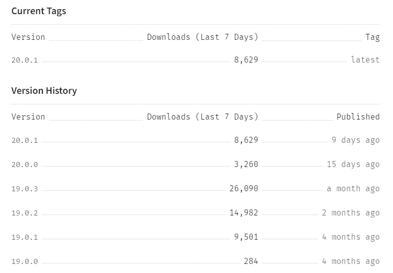

# Vuejs 3.0 中通过 KeyCloak 第 1 部分进行身份验证和授权的安全性

> 原文：<https://blog.devgenius.io/security-in-vuejs-3-0-with-authentication-and-authorization-by-keycloak-part-1-ae884889fa0d?source=collection_archive---------0----------------------->

**第 1 部分保护前端 Vuejs 3.0 应用**
**第 2 部分在登录组件**
中添加密钥锁查看如何使用访问令牌转到[第 2 部分在登录组件中添加密钥锁](/security-in-vuejs-3-0-with-authentication-and-authorization-by-keycloak-part-2-b660e709450f)


# 介绍

我已经写了一篇关于用 Keycloak 保护 react 应用程序的完整文章。

今天我们将看到如何使用另一个前端框架:Vuejs 3.0 来实现这一点！

这篇文章只是一步一步的指导，如果你需要阅读一篇完整的文章，请点击[这里](https://medium.com/dev-genius/security-in-react-and-webapi-in-asp-net-core-c-with-authentification-and-authorization-by-keycloak-89ba14be7e5a)

还可以看到下一部分:[https://medium . com/dev-genius/security-in-vue js-3-0-with-authentic ation-and-authorization-by-key cloak-part-2-b660e 709450 f](https://medium.com/dev-genius/security-in-vuejs-3-0-with-authentication-and-authorization-by-keycloak-part-2-b660e709450f)

# 创建我们的 Vuejs 3.0 前端演示

让我们转到我们的目录并创建一个新项目:

```
C:\Tutorial\keycloak (main -> origin)
λ mkdir vuejs3webapikeycloak

C:\Tutorial\keycloak (main -> origin)
λ cd vuejs3webapikeycloak\

C:\Tutorial\keycloak\vuejs3webapikeycloak (main -> origin)
λ
```

我们将使用 cli 工具，并通过以下 npm 命令将其作为全局工具与 npm 一起安装

```
npm install -g @vue/cli
```

```
C:\Tutorial\keycloak\vuejs3webapikeycloak (main -> origin)
λ npm install -g @vue/cli
[..................] / fetchMetadata: sill resolveWithNewModule yallist@4.0.0 checking installable status
```

这需要一点时间，所以喝杯咖啡或热饮:)

我们得到以下结果:

```
C:\Tutorial\keycloak\vuejs3webapikeycloak (main -> origin)
λ npm install -g @vue/cli
npm WARN deprecated subscriptions-transport-ws@0.11.0: The `subscriptions-transport-ws` package is no longer maintained. We recommend you use `graphql-ws` instead. For help migrating Apollo software to `graphql-ws`, see https://www.apollographql.com/docs/apollo-server/data/subscriptions/#switching-from-subscriptions-transport-ws    For general help using `graphql-ws`, see https://github.com/enisdenjo/graphql-ws/blob/master/README.md
npm WARN deprecated urix@0.1.0: Please see https://github.com/lydell/urix#deprecated
npm WARN deprecated resolve-url@0.2.1: https://github.com/lydell/resolve-url#deprecated
C:\Users\nbarlatier\AppData\Roaming\npm\vue -> C:\Users\nbarlatier\AppData\Roaming\npm\node_modules\@vue\cli\bin\vue.js

> @apollo/protobufjs@1.2.6 postinstall C:\Users\nbarlatier\AppData\Roaming\npm\node_modules\@vue\cli\node_modules\@apollo\protobufjs
> node scripts/postinstall

+ @vue/cli@5.0.8
added 833 packages from 492 contributors in 159.069s

   ╭───────────────────────────────────────────────────────────────╮
   │                                                               │
   │      New major version of npm available! 6.14.4 -> 9.1.1      │
   │   Changelog: https://github.com/npm/cli/releases/tag/v9.1.1   │
   │               Run npm install -g npm to update!               │
   │                                                               │
   ╰───────────────────────────────────────────────────────────────╯

C:\Tutorial\keycloak\vuejs3webapikeycloak (main -> origin)
```

现在，让我们通过获取以下版本来检查我们是否可以使用 CLI:

```
λ vue -V
@vue/cli 4.5.13
```

我们准备好创建我们的项目了！

```
C:\Tutorial\keycloak\vuejs3webapikeycloak (main -> origin)
λ vue create front-end
```

我们得到:

```
λ vue create front-end

Vue CLI v4.5.13
┌─────────────────────────────────────────────┐
│                                             │
│    New version available 4.5.13 → 5.0.8     │
│   Run yarn global add @vue/cli to update!   │
│                                             │
└─────────────────────────────────────────────┘

? Please pick a preset: (Use arrow keys)
> Default ([Vue 2] babel, eslint)
  Default (Vue 3) ([Vue 3] babel, eslint)
  Manually select features
```

我将手动选择功能

```
Vue CLI v4.5.13
┌─────────────────────────────────────────────┐
│                                             │
│    New version available 4.5.13 → 5.0.8     │
│   Run yarn global add @vue/cli to update!   │
│                                             │
└─────────────────────────────────────────────┘

? Please pick a preset:
  Default ([Vue 2] babel, eslint)
  Default (Vue 3) ([Vue 3] babel, eslint)
> Manually select features
```

按向下箭头并输入

```
? Please pick a preset: Manually select features
? Check the features needed for your project:
 (*) Choose Vue version
 (*) Babel
>(*) TypeScript
 ( ) Progressive Web App (PWA) Support
 ( ) Router
 ( ) Vuex
 ( ) CSS Pre-processors
 (*) Linter / Formatter
 ( ) Unit Testing
 ( ) E2E Testing
```

我选择 TypeScript，我们可以添加其他功能，但对于我们的演示，我们不需要它们，请按 Enter。

然后，我选择 Vuejs 3.0 并按 enter 键:

```
? Please pick a preset: Manually select features
? Check the features needed for your project: Choose Vue version, Babel, TS, Linter
? Choose a version of Vue.js that you want to start the project with (Use arrow keys)
  2.x
> 3.x
```

然后，我们对演示中的类样式组件说不。

```
? Please pick a preset: Manually select features
? Check the features needed for your project: Choose Vue version, Babel, TS, Linter
? Choose a version of Vue.js that you want to start the project with 3.x
? Use class-style component syntax? (y/N)N
```

然后我们选择 Yes 来同时使用 Typescript 和 Babel

```
? Please pick a preset: Manually select features
? Check the features needed for your project: Choose Vue version, Babel, TS, Linter
? Choose a version of Vue.js that you want to start the project with 3.x
? Use class-style component syntax? No
? Use Babel alongside TypeScript (required for modern mode, auto-detected polyfills, transpiling JSX)? (Y/n)
```

然后，我们为 ESLint 选择默认选项:

```
? Please pick a preset: Manually select features
? Check the features needed for your project: Choose Vue version, Babel, TS, Linter
? Choose a version of Vue.js that you want to start the project with 3.x
? Use class-style component syntax? No
? Use Babel alongside TypeScript (required for modern mode, auto-detected polyfills, transpiling JSX)? Yes
? Pick a linter / formatter config: (Use arrow keys)
> ESLint with error prevention only
  ESLint + Airbnb config
  ESLint + Standard config
  ESLint + Prettier
  TSLint (deprecated)
```

我们再次选择默认选项

```
 ? Please pick a preset: Manually select features
? Check the features needed for your project: Choose Vue version, Babel, TS, Linter
? Choose a version of Vue.js that you want to start the project with 3.x
? Use class-style component syntax? No
? Use Babel alongside TypeScript (required for modern mode, auto-detected polyfills, transpiling JSX)? Yes
? Pick a linter / formatter config: Basic
? Pick additional lint features: (Press <space> to select, <a> to toggle all, <i> to invert selection)
>(*) Lint on save
 ( ) Lint and fix on commit
```

然后我们选择 package.json 来获得 Babel、ESLint 等的配置

```
? Please pick a preset: Manually select features
? Check the features needed for your project: Choose Vue version, Babel, TS, Linter
? Choose a version of Vue.js that you want to start the project with 3.x
? Use class-style component syntax? No
? Use Babel alongside TypeScript (required for modern mode, auto-detected polyfills, transpiling JSX)? Yes
? Pick a linter / formatter config: Basic
? Pick additional lint features: Lint on save
? Where do you prefer placing config for Babel, ESLint, etc.?
  In dedicated config files
> In package.json 
```

然后，我们可以保存我们的设置，如果我们想要的，但这里让我们跳过它:

```
? Please pick a preset: Manually select features
? Check the features needed for your project: Choose Vue version, Babel, TS, Linter
? Choose a version of Vue.js that you want to start the project with 3.x
? Use class-style component syntax? No
? Use Babel alongside TypeScript (required for modern mode, auto-detected polyfills, transpiling JSX)? Yes
? Pick a linter / formatter config: Basic
? Pick additional lint features: Lint on save
? Where do you prefer placing config for Babel, ESLint, etc.? In package.json
? Save this as a preset for future projects? (y/N)
```

我们得到:

```
? Please pick a preset: Manually select features
? Check the features needed for your project: Choose Vue version, Babel, TS, Linter
? Choose a version of Vue.js that you want to start the project with 3.x
? Use class-style component syntax? No
? Use Babel alongside TypeScript (required for modern mode, auto-detected polyfills, transpiling JSX)? Yes
? Pick a linter / formatter config: Basic
? Pick additional lint features: Lint on save
? Where do you prefer placing config for Babel, ESLint, etc.? In package.json
? Save this as a preset for future projects? No

Vue CLI v4.5.13
✨  Creating project in C:\Tutorial\keycloak\vuejs3webapikeycloak\front-end.
⚙️  Installing CLI plugins. This might take a while...

yarn install v1.22.4
info No lockfile found.
[1/4] Resolving packages...
⠁ safe-buffer@^5.1.1
```

我们需要等一会儿。

```
Vue CLI v4.5.13
┌─────────────────────────────────────────────┐
│                                             │
│    New version available 4.5.13 → 5.0.8     │
│   Run yarn global add @vue/cli to update!   │
│                                             │
└─────────────────────────────────────────────┘

? Please pick a preset: Manually select features
? Check the features needed for your project: Choose Vue version, Babel, TS, Linter
? Choose a version of Vue.js that you want to start the project with 3.x
? Use class-style component syntax? No
? Use Babel alongside TypeScript (required for modern mode, auto-detected polyfills, transpiling JSX)? Yes
? Pick a linter / formatter config: Basic
? Pick additional lint features: Lint on save
? Where do you prefer placing config for Babel, ESLint, etc.? In package.json
? Save this as a preset for future projects? No

Vue CLI v4.5.13
✨  Creating project in C:\Tutorial\keycloak\vuejs3webapikeycloak\front-end.
⚙️  Installing CLI plugins. This might take a while...

yarn install v1.22.4
info No lockfile found.
[1/4] Resolving packages...
[2/4] Fetching packages...
info fsevents@2.3.2: The platform "win32" is incompatible with this module.
info "fsevents@2.3.2" is an optional dependency and failed compatibility check. Excluding it from installation.
info fsevents@1.2.13: The platform "win32" is incompatible with this module.
info "fsevents@1.2.13" is an optional dependency and failed compatibility check. Excluding it from installation.
[#################################################################################################################################################################################################################################] 1152/1152[3/4] Linking dependencies...
[########################################################################################################################################################-----------------------------------------------------------------------] 16410/[#####

success Saved lockfile.
info To upgrade, download the latest installer at "https://yarnpkg.com/latest.msi".
Done in 171.56s.
�  Invoking generators...
�  Installing additional dependencies...

yarn install v1.22.4
[1/4] Resolving packages...
⠂ @typescript-eslint/eslint-plugin@^4.18.0
```

我每次都对依赖前端框架的数量感到印象深刻和困惑！

差不多用了 3 分钟！

```
Vue CLI v4.5.13
✨  Creating project in C:\Tutorial\keycloak\vuejs3webapikeycloak\front-end.
⚙️  Installing CLI plugins. This might take a while...

yarn install v1.22.4
info No lockfile found.
[1/4] Resolving packages...
[2/4] Fetching packages...
info fsevents@2.3.2: The platform "win32" is incompatible with this module.
info "fsevents@2.3.2" is an optional dependency and failed compatibility check. Excluding it from installation.
info fsevents@1.2.13: The platform "win32" is incompatible with this module.
info "fsevents@1.2.13" is an optional dependency and failed compatibility check. Excluding it from installation.
[#################################################################################################################################################################################################################################] 1152/1152[3/4] Linking dependencies...
[########################################################################################################################################################-----------------------------------------------------------------------] 16410/[#####

success Saved lockfile.
info To upgrade, download the latest installer at "https://yarnpkg.com/latest.msi".
Done in 171.56s.
�  Invoking generators...
�  Installing additional dependencies...

yarn install v1.22.4
[1/4] Resolving packages...
[2/4] Fetching packages...
info fsevents@2.3.2: The platform "win32" is incompatible with this module.
info "fsevents@2.3.2" is an optional dependency and failed compatibility check. Excluding it from installation.
info fsevents@1.2.13: The platform "win32" is incompatible with this module.
info "fsevents@1.2.13" is an optional dependency and failed compatibility check. Excluding it from installation.
[3/4] Linking dependencies...
[4/4] Building fresh packages...

success Saved lockfile.
Done in 54.80s.
⚓  Running completion hooks...

�  Generating README.md...

�  Successfully created project front-end.
�  Get started with the following commands:

 $ cd front-end
 $ yarn serve
```

在运行之前，让我们先看看带有 VS 代码的项目！

```
λ cd front-end\

C:\Tutorial\keycloak\vuejs3webapikeycloak\front-end (main -> origin)
λ code .
```

我们看到:


我们信任我们的代码，我们看到以下项目:


这里我们不关注 Vuejs 3.0 的项目结构，我们只需要知道在哪里添加我们的 Keycloak 客户端，这样我们就可以为我们的 Vuejs 演示添加安全性！

我们将打开 main.ts 文件:

```
import { createApp } from 'vue'
import App from './App.vue'

createApp(App).mount('#app')
```

这将是我们可以添加键盘锁的地方！

但是首先，我们需要确保我们的应用程序可以正常运行！

让我们使用以下命令将我们的应用程序托管在开发服务器中:

```
yyyy@xxx MINGW64 /c/Tutorial/keycloak/vuejs3webapikeycloak/front-end (main)
$ yarn serve
yarn run v1.22.4
$ vue-cli-service serve
 INFO  Starting development server...
98% after emitting CopyPlugin

 DONE  Compiled successfully in 5569ms                                                                                   15:59:11

  App running at:
  - Local:   http://localhost:8080/
  - Network: http://xxx:8080/

  Note that the development build is not optimized.
  To create a production build, run yarn build.

No issues found.
```

让我们运行调试会话，并选择 chrome 作为我们的浏览器


然后


我们创建了 launch.json 文件:


最后，我们运行我们的调试:


我们看到了我们的 chrome 和我们的应用！


现在我们需要将 Keycloak 添加到我们的 Vuejs 3.0 项目中！

我们可以看到之前启用的 3 个 CLI 插件:


及其各自的链接:

*   [巴别塔插件](https://github.com/vuejs/vue-cli/tree/dev/packages/@vue/cli-plugin-babel)
*   [打字稿插件](https://github.com/vuejs/vue-cli/tree/dev/packages/@vue/cli-plugin-typescript)
*   [eslint 插件](https://github.com/vuejs/vue-cli/tree/dev/packages/@vue/cli-plugin-eslint)

现在让我们用 npm 安装 **Keycloak-js** :

我们可以在以下链接中找到所有可用版本:

[](https://www.npmjs.com/package/keycloak-js?activeTab=versions) [## keycloak-js

### 键盘锁适配器。最新版本:20.0.1，最后发布时间:6 天前。通过以下方式开始在您的项目中使用 key cloak-js…

www.npmjs.com](https://www.npmjs.com/package/keycloak-js?activeTab=versions) 

我们将使用 Docker 运行最新的稳定版 Keycloak 19.0.3:

```
λ docker run -p 8081:8080 -e KEYCLOAK_ADMIN=admin -e KEYCLOAK_ADMIN_PASSWORD=admin quay.io/keycloak/keycloak:19.0.3 start-dev
Updating the configuration and installing your custom providers, if any. Please wait.
2022-11-19 14:15:11,742 INFO  [io.quarkus.deployment.QuarkusAugmentor] (main) Quarkus augmentation completed in 22124ms
2022-11-19 14:15:15,287 INFO  [org.keycloak.quarkus.runtime.hostname.DefaultHostnameProvider] (main) Hostname settings: Base URL: <unset>, Hostname: <request>, Strict HTTPS: false, Path: <request>, Strict BackChannel: false, Admin URL: <unset>, Admin: <request>, Port: -1, Proxied: false
2022-11-19 14:15:17,112 INFO  [org.keycloak.common.crypto.CryptoIntegration] (main) Detected crypto provider: org.keycloak.crypto.def.DefaultCryptoProvider
2022-11-19 14:15:19,865 WARN  [org.infinispan.CONFIG] (keycloak-cache-init) ISPN000569: Unable to persist Infinispan internal caches as no global state enabled
2022-11-19 14:15:19,988 WARN  [org.infinispan.PERSISTENCE] (keycloak-cache-init) ISPN000554: jboss-marshalling is deprecated and planned for removal
2022-11-19 14:15:20,029 INFO  [org.infinispan.CONTAINER] (keycloak-cache-init) ISPN000556: Starting user marshaller 'org.infinispan.jboss.marshalling.core.JBossUserMarshaller'
2022-11-19 14:15:20,550 INFO  [org.infinispan.CONTAINER] (keycloak-cache-init) ISPN000128: Infinispan version: Infinispan 'Triskaidekaphobia' 13.0.9.Final
2022-11-19 14:15:21,011 INFO  [org.keycloak.connections.infinispan.DefaultInfinispanConnectionProviderFactory] (main) Node name: node_425607, Site name: null
2022-11-19 14:15:22,808 INFO  [org.keycloak.quarkus.runtime.storage.legacy.liquibase.QuarkusJpaUpdaterProvider] (main) Initializing database schema. Using changelog META-INF/jpa-changelog-master.xml
2022-11-19 14:15:26,821 INFO  [org.keycloak.services] (main) KC-SERVICES0050: Initializing master realm
2022-11-19 14:15:30,627 INFO  [io.quarkus] (main) Keycloak 19.0.3 on JVM (powered by Quarkus 2.7.6.Final) started in 18.773s. Listening on: http://0.0.0.0:8080
2022-11-19 14:15:30,627 INFO  [io.quarkus] (main) Profile dev activated.
2022-11-19 14:15:30,627 INFO  [io.quarkus] (main) Installed features: [agroal, cdi, hibernate-orm, jdbc-h2, jdbc-mariadb, jdbc-mssql, jdbc-mysql, jdbc-oracle, jdbc-postgresql, keycloak, logging-gelf, narayana-jta, reactive-routes, resteasy, resteasy-jackson, smallrye-context-propagation, smallrye-health, smallrye-metrics, vault, vertx]
2022-11-19 14:15:31,254 INFO  [org.keycloak.services] (main) KC-SERVICES0009: Added user 'admin' to realm 'master'
2022-11-19 14:15:31,265 WARN  [org.keycloak.quarkus.runtime.KeycloakMain] (main) Running the server in development mode. DO NOT use this configuration in production.
2022-11-19 14:21:35,079 WARN  [org.keycloak.events] (executor-thread-6) type=LOGIN_ERROR, realmId=cf173a2d-6041-4aaf-83fd-58fba4180d1d, clientId=vuejs, userId=null, ipAddress=172.17.0.1, error=invalid_redirect_uri, redirect_uri=http://localhost:8080/
```

完成后，我们只需要更改配置选项，以便使用您企业的生产 Keycloak 实例。

我们在主机上使用端口 8081，因为 Vuejs 已经使用了端口 8080。

我们得到:


我们使用管理员帐户登录:


让我们添加一个领域“vue”和一个客户端“vuejs”:


这里我们有 OpenId 连接的配置:

*   客户端身份验证关闭:这定义了 OIDC 客户端的类型。打开时，OIDC 类型设定为机密访问类型。关闭时，设置为**公共访问类型。我们把它留给公共访问类型。**
*   授权是关闭的:启用/禁用对客户端的细粒度授权支持和禁用，我们在这里不需要它。仅当我们使用机密访问类型时，此选项才可用。由于我们的 vue 应用程序是一个带有 javascript 的前端应用程序，我们不能信任它使用带有秘密的机密访问类型，所以我们使用公共访问类型。
*   在身份验证流程中，我们必须选中“标准流程”:这将启用带有授权代码的标准 OpenID Connect 基于重定向的身份验证。就 OpenID Connect 或 OAuth2 规范而言，这实现了对此客户端的“授权代码流”的支持。
*   直接访问授权:我们必须禁用它，因为它提供了针对用户名/提供者的令牌。此选项支持直接访问授权，这意味着客户端可以访问用户的用户名/密码，并直接与 Keycloak 服务器交换访问令牌。就 OAuth2 规范而言，这支持该客户端的“资源所有者密码凭证授权”。

现在，让我们单击“保存”。


我们现在将重点关注访问设置部分

# 访问设置


我们将重点关注:

*   有效重定向 URIs:浏览器在成功登录后可以重定向到的有效 URI 模式。允许使用简单通配符，如“http://example.com/*”。也可以指定相对路径，例如/my/relative/path/*。相对路径是相对于客户端根 URL 的路径，如果没有指定，则使用身份验证服务器根 URL。对于 SAML，如果您依赖于登录请求中嵌入的消费者服务 URL，则必须设置有效的 URI 模式。在我们的例子中，我们将使用我们的 vuejs 开发 URL: http://localhost:8080/*
*   有效的注销后重定向 URIs:浏览器在成功注销后可以重定向到的有效 URI 模式。值“+”将使用有效重定向 uri 的列表。允许使用简单通配符，如“http://example.com/*”。也可以指定相对路径，例如/my/relative/path/*。相对路径是相对于客户端根 URL 的路径，如果没有指定，则使用身份验证服务器根 URL。对于 SAML，如果您依赖于登录请求中嵌入的消费者服务 URL，则必须设置有效的 URI 模式。我们将只输入: [http://xxx:80](http://localhost:80) 80，其中 xxx 是我们的 ip
*   网络起源:允许 CORS 起源。要允许有效重定向 URIs 的所有来源，请添加“+”。但是这不包括通配符' * '。若要允许所有来源，请显式添加“*”。我们将使用 [http://xxx:8080](http://localhost:8080) 和 [http://xxx:8080](http://localhost:8080) /*


我们按下“保存”

现在让我们创建用户和角色。

# 用户


让我们只添加用户名。


点击“创建”

让我们添加一个密码:


我们关闭“临时”

现在让我们创建应用程序的角色。

# 应用程序的角色


我们向我们的客户端“vuejs”添加了一个简单的角色“admin”。

让我们将这个角色与我们的用户相关联:


点击“分配角色”


点击“分配”

我们检查我们拥有客户端“vuejs”的角色“admin”:


现在我们完成了 Keycloak 管理。

让我们回到我们的 vuejs 应用程序，用 keycloak-js 包保护它。

让我们先检查一下 keycloak 服务器版本:


我们使用 19.0.3 版本。

所以还是拿同版本的 keycloak-js npm 包吧。

# Keycloak js npm

[](https://www.npmjs.com/package/keycloak-js) [## keycloak-js

### 键盘锁适配器。最新版本:20.0.1，最后发布时间:9 天前。通过以下方式开始在您的项目中使用 key cloak-js…

www.npmjs.com](https://www.npmjs.com/package/keycloak-js) 

这些版本位于以下链接:

[](https://www.npmjs.com/package/keycloak-js?activeTab=versions) [## keycloak-js

### 键盘锁适配器。最新版本:20.0.1，最后发布时间:9 天前。通过以下方式开始在您的项目中使用 key cloak-js…

www.npmjs.com](https://www.npmjs.com/package/keycloak-js?activeTab=versions) 

我们将使用主要版本 **19.0.3** 的最新次要版本

[](https://www.npmjs.com/package/keycloak-js/v/19.0.3) [## keycloak-js

### 键盘锁适配器。最新版本:20.0.1，最后发布时间:10 天前。通过以下方式开始在您的项目中使用 key cloak-js…

www.npmjs.com](https://www.npmjs.com/package/keycloak-js/v/19.0.3) 

它给了我们命令:

```
npm i keycloak-js@19.0.3
```

现在让我们在 VS 代码终端上完成它


```
C:\Tutorial\keycloak\vuejs3webapikeycloak\front-end>npm i keycloak-js@19.0.3
npm WARN deprecated @hapi/topo@3.1.6: This version has been deprecated and is no longer supported or maintained
npm WARN deprecated @hapi/hoek@8.5.1: This version has been deprecated and is no longer supported or maintained
npm WARN deprecated @hapi/bourne@1.3.2: This version has been deprecated and is no longer supported or maintained
npm WARN deprecated @hapi/address@2.1.4: Moved to 'npm install @sideway/address'
npm WARN deprecated request@2.88.2: request has been deprecated, see https://github.com/request/request/issues/3142
npm WARN deprecated har-validator@5.1.5: this library is no longer supported
npm WARN deprecated uuid@3.4.0: Please upgrade  to version 7 or higher.  Older versions may use Math.random() in certain circumstances, which is known to be problematic.  See https://v8.dev/blog/math-random for details.
npm WARN deprecated urix@0.1.0: Please see https://github.com/lydell/urix#deprecated
npm WARN deprecated resolve-url@0.2.1: https://github.com/lydell/resolve-url#deprecated
npm WARN deprecated querystring@0.2.0: The querystring API is considered Legacy. new code should use the URLSearchParams API instead.
npm WARN deprecated chokidar@2.1.8: Chokidar 2 will break on node v14+. Upgrade to chokidar 3 with 15x less dependencies.        
npm WARN deprecated fsevents@1.2.13: fsevents 1 will break on node v14+ and could be using insecure binaries. Upgrade to fsevents 2.
npm WARN deprecated eslint-loader@2.2.1: This loader has been deprecated. Please use eslint-webpack-plugin
npm WARN deprecated html-webpack-plugin@3.2.0: 3.x is no longer supported

> yorkie@2.0.0 uninstall C:\Tutorial\keycloak\vuejs3webapikeycloak\front-end\node_modules\yorkie
> node bin/uninstall.js

husky
uninstalling Git hooks
done

npm WARN rm not removing C:\Tutorial\keycloak\vuejs3webapikeycloak\front-end\node_modules\.bin\rimraf.cmd as it wasn't installed 
by C:\Tutorial\keycloak\vuejs3webapikeycloak\front-end\node_modules\rimraf
npm WARN rm not removing C:\Tutorial\keycloak\vuejs3webapikeycloak\front-end\node_modules\.bin\rimraf as it wasn't installed by C:\Tutorial\keycloak\vuejs3webapikeycloak\front-end\node_modules\rimraf
npm WARN rm not removing C:\Tutorial\keycloak\vuejs3webapikeycloak\front-end\node_modules\.bin\uuid.cmd as it wasn't installed by C:\Tutorial\keycloak\vuejs3webapikeycloak\front-end\node_modules\uuid
npm WARN rm not removing C:\Tutorial\keycloak\vuejs3webapikeycloak\front-end\node_modules\.bin\uuid as it wasn't installed by C:\Tutorial\keycloak\vuejs3webapikeycloak\front-end\node_modules\uuid
npm WARN rm not removing C:\Tutorial\keycloak\vuejs3webapikeycloak\front-end\node_modules\.bin\semver.cmd as it wasn't installed 
by C:\Tutorial\keycloak\vuejs3webapikeycloak\front-end\node_modules\semver
npm WARN rm not removing C:\Tutorial\keycloak\vuejs3webapikeycloak\front-end\node_modules\.bin\semver as it wasn't installed by C:\Tutorial\keycloak\vuejs3webapikeycloak\front-end\node_modules\semver
npm WARN rm not removing C:\Tutorial\keycloak\vuejs3webapikeycloak\front-end\node_modules\.bin\json5.cmd as it wasn't installed by C:\Tutorial\keycloak\vuejs3webapikeycloak\front-end\node_modules\json5
npm WARN rm not removing C:\Tutorial\keycloak\vuejs3webapikeycloak\front-end\node_modules\.bin\json5 as it wasn't installed by C:\Tutorial\keycloak\vuejs3webapikeycloak\front-end\node_modules\json5

> yorkie@2.0.0 install C:\Tutorial\keycloak\vuejs3webapikeycloak\front-end\node_modules\yorkie
> node bin/install.js

setting up Git hooks
can't find .git directory, skipping Git hooks installation

> core-js@3.26.1 postinstall C:\Tutorial\keycloak\vuejs3webapikeycloak\front-end\node_modules\@vue\babel-preset-app\node_modules\core-js
> node -e "try{require('./postinstall')}catch(e){}"

Thank you for using core-js ( https://github.com/zloirock/core-js ) for polyfilling JavaScript standard library!

The project needs your help! Please consider supporting of core-js:
> https://opencollective.com/core-js 
> https://patreon.com/zloirock 
> bitcoin: bc1qlea7544qtsmj2rayg0lthvza9fau63ux0fstcz 

Also, the author of core-js ( https://github.com/zloirock ) is looking for a good job -)

> ejs@2.7.4 postinstall C:\Tutorial\keycloak\vuejs3webapikeycloak\front-end\node_modules\ejs
> node ./postinstall.js

Thank you for installing EJS: built with the Jake JavaScript build tool (https://jakejs.com/)

npm notice created a lockfile as package-lock.json. You should commit this file.
npm WARN optional SKIPPING OPTIONAL DEPENDENCY: fsevents@~2.3.2 (node_modules\watchpack\node_modules\chokidar\node_modules\fsevents):
npm WARN notsup SKIPPING OPTIONAL DEPENDENCY: Unsupported platform for fsevents@2.3.2: wanted {"os":"darwin","arch":"any"} (current: {"os":"win32","arch":"x64"})
npm WARN optional SKIPPING OPTIONAL DEPENDENCY: fsevents@^1.2.7 (node_modules\chokidar\node_modules\fsevents):
npm WARN notsup SKIPPING OPTIONAL DEPENDENCY: Unsupported platform for fsevents@1.2.13: wanted {"os":"darwin","arch":"any"} (current: {"os":"win32","arch":"x64"})
npm WARN optional SKIPPING OPTIONAL DEPENDENCY: fork-ts-checker-webpack-plugin-v5@npm:fork-ts-checker-webpack-plugin@^5.0.11 (node_modules\@vue\cli-plugin-typescript\node_modules\fork-ts-checker-webpack-plugin-v5):
npm WARN notarget SKIPPING OPTIONAL DEPENDENCY: No matching version found for fork-ts-checker-webpack-plugin-v5@5.2.1.
npm WARN optional SKIPPING OPTIONAL DEPENDENCY: vue-loader-v16@npm:vue-loader@^16.1.0 (node_modules\@vue\cli-service\node_modules\vue-loader-v16):
npm WARN notarget SKIPPING OPTIONAL DEPENDENCY: No matching version found for vue-loader-v16@16.8.3.

+ keycloak-js@19.0.3
added 96 packages from 38 contributors, removed 76 packages, updated 1252 packages and audited 1362 packages in 112.25s

119 packages are looking for funding
  run `npm fund` for details

found 13 vulnerabilities (2 low, 2 moderate, 7 high, 2 critical)
  run `npm audit fix` to fix them, or `npm audit` for details

   ╭───────────────────────────────────────────────────────────────╮
   │                                                               │
   │      New major version of npm available! 6.14.4 -> 9.1.1      │
   │   Changelog: https://github.com/npm/cli/releases/tag/v9.1.1   │
   │               Run npm install -g npm to update!               │
   │                                                               │
   ╰───────────────────────────────────────────────────────────────╯

C:\Tutorial\keycloak\vuejs3webapikeycloak\front-end>
```

相当重，有将近 100 个包裹！

现在我们准备添加将使用 js 适配器的代码库。

# 添加钥匙锁

当我们添加 keycloak-js 时，我们可以在依赖项中看到它:

```
{
  "name": "front-end",
  "version": "0.1.0",
  "private": true,
  "scripts": {
    "serve": "vue-cli-service serve",
    "build": "vue-cli-service build",
    "lint": "vue-cli-service lint"
  },
  "dependencies": {
    "core-js": "^3.6.5",
    "keycloak-js": "^19.0.3",
    "vue": "^3.0.0"
  },
  "devDependencies": {
    "@typescript-eslint/eslint-plugin": "^4.18.0",
    "@typescript-eslint/parser": "^4.18.0",
    "@vue/cli-plugin-babel": "~4.5.13",
    "@vue/cli-plugin-eslint": "~4.5.13",
    "@vue/cli-plugin-typescript": "~4.5.13",
    "@vue/cli-service": "~4.5.13",
    "@vue/compiler-sfc": "^3.0.0",
    "@vue/eslint-config-typescript": "^7.0.0",
    "eslint": "^6.7.2",
    "eslint-plugin-vue": "^7.0.0",
    "typescript": "~4.1.5"
  },
  "eslintConfig": {
    "root": true,
    "env": {
      "node": true
    },
    "extends": [
      "plugin:vue/vue3-essential",
      "eslint:recommended",
      "@vue/typescript/recommended"
    ],
    "parserOptions": {
      "ecmaVersion": 2020
    },
    "rules": {}
  },
  "browserslist": [
    "> 1%",
    "last 2 versions",
    "not dead"
  ]
}
```

现在我们可以在应用程序中导入 keycloak js 适配器特性。为此，我们将通过创建带有接口的服务来享受 Typescript。

它将使在任何地方使用它和改变它的实现变得更加容易。

首先，让我们为我们的 keycloak 服务创建一个名为“security”的文件夹，这个服务实例将使我们在 React 项目中的任何地方使用它变得更加容易。

让我们添加名为“KeycloakService.ts”的 ts 文件


我们添加以下代码:

*   首先，我们从 keycloak js 中导入 Keycloak 类
*   我们创建一个**实例** keycloakInstance
*   我们创建一个**函数**登录，如果用户通过了身份验证，就调用这个函数。这里，该函数将显示 React 应用程序的主要组件。
    要理解这一部分，请查阅链接
    [https://www . key cloak . org/docs/latest/securing _ apps/index . html # JavaScript _ adapter](https://www.keycloak.org/docs/latest/securing_apps/index.html#_javascript_adapter)

非常重要的是要记住，文档说在[https://www . key cloak . org/docs/latest/securing _ apps/index . html # _ JavaScript _ implicit _ flow](https://www.keycloak.org/docs/latest/securing_apps/index.html#_javascript_implicit_flow)

> *默认情况下，JavaScript 适配器使用* [*授权码*](https://openid.net/specs/openid-connect-core-1_0.html#CodeFlowAuth) *流。*

**因此，我们确保客户端可以通过使用授权代码流与服务器端通信，默认情况下，Keycloak Javascript 适配器使用我们在 Keycloak 服务器配置上为客户端“MyApp”启用的授权代码流**

我们不必对代码流做任何事情。

现在我们已经准备好确保它能够工作:)在我们的应用程序被呈现之前，我们的 **main.ts** 文件中

```
import Keycloak from "keycloak-js";

const keycloakInstance = new Keycloak();

interface CallbackOneParam<T1 = void, T2 = void> {
  (param1: T1): T2;
}
/**
 * Initializes Keycloak instance and calls the provided callback function if successfully authenticated.
 *
 * @param onAuthenticatedCallback
 */
const Login = (onAuthenticatedCallback: CallbackOneParam) => {
  keycloakInstance
    .init({ onLoad: "login-required" })
    .then(function (authenticated) {
      authenticated ? onAuthenticatedCallback() : alert("non authenticated");
    })
    .catch((e) => {
      console.dir(e);
      console.log(`keycloak init exception: ${e}`);
    });
};

const KeyCloakService = {
  CallLogin: Login,
};

export default KeyCloakService;
```

让我们使用 **main.ts** 中的服务密钥:

```
import { createApp } from "vue";
import App from "./App.vue";
import KeyCloakService from "./security/KeycloakService";

const renderApp = () => {
  createApp(App).mount("#app");
};

KeyCloakService.CallLogin(renderApp);
```

很简单吧？

我们需要添加的最后一件事是 keycloak 配置文件:keycloak.json，位于 public:


```
{
  "realm": "vue",
  "auth-server-url": "http://localhost:8081/",
  "ssl-required": "external",
  "resource": "vuejs",
  "public-client": true,
  "confidential-port": 0
}
```

因此，我们可以更改 keycloak 服务器的 URL，并给出客户机的领域和类型。

现在让我们转到我们的 Vue 应用程序。

# 在 Keycloak 中登录

当我们从 VS.Code 打开浏览器时:

[http://xxx:8080/](http://10.7.7.11:8080/)

用 xxx 你的 ip 地址

我们回到 keycloak，而不是 vue 应用程序！


我们登录吧！

我们回来了


恭喜你。我们设法使用 Keycloak 来保护我们与 JWT 的 vue 演示！

我们可以在 chrome 网络开发工具中看到 JWT:


我们看到两个标志:

*   访问令牌
*   id 令牌

另一个我们可以用来刷新令牌的令牌。

```
access_token
: 
"eyJhbGciOiJSUzI1NiIsInR5cCIgOiAiSldUIiwia2lkIiA6ICJZbUt1RjU4aGhtOE9xYWd0T2lqTThhQzlyY00yUmlOU091RWg2SVhSYUJrIn0.eyJleHAiOjE2Njg4NzU4NDYsImlhdCI6MTY2ODg3NTU0NiwiYXV0aF90aW1lIjoxNjY4ODc1NDM4LCJqdGkiOiI5NWEzY2NmYy0yMzIxLTRhMTItOTk4OC05NWZkZmQzNTk1OGIiLCJpc3MiOiJodHRwOi8vbG9jYWxob3N0OjgwODEvcmVhbG1zL3Z1ZSIsImF1ZCI6ImFjY291bnQiLCJzdWIiOiI0NGQ5MWU5OC00NWQ5LTQwZTItYWQxZC04NTc1NDUxYTZkYjAiLCJ0eXAiOiJCZWFyZXIiLCJhenAiOiJ2dWVqcyIsIm5vbmNlIjoiZmZhMDMzNTEtODlhMC00YWVkLTgwNGQtZGM3OWVhYmIxYjVjIiwic2Vzc2lvbl9zdGF0ZSI6ImM2ODdkZmY5LTNiY2ItNGMzZi05MTY1LWNkMjcwMjI4MTkxMiIsImFjciI6IjAiLCJhbGxvd2VkLW9yaWdpbnMiOlsiaHR0cDovLzEwLjcuNy4xMTo4MDgwLyoiLCJodHRwOi8vMTAuNy43LjExOjgwODAiXSwicmVhbG1fYWNjZXNzIjp7InJvbGVzIjpbImRlZmF1bHQtcm9sZXMtdnVlIiwib2ZmbGluZV9hY2Nlc3MiLCJ1bWFfYXV0aG9yaXphdGlvbiJdfSwicmVzb3VyY2VfYWNjZXNzIjp7InZ1ZWpzIjp7InJvbGVzIjpbImFkbWluIl19LCJhY2NvdW50Ijp7InJvbGVzIjpbIm1hbmFnZS1hY2NvdW50IiwibWFuYWdlLWFjY291bnQtbGlua3MiLCJ2aWV3LXByb2ZpbGUiXX19LCJzY29wZSI6Im9wZW5pZCBwcm9maWxlIGVtYWlsIiwic2lkIjoiYzY4N2RmZjktM2JjYi00YzNmLTkxNjUtY2QyNzAyMjgxOTEyIiwiZW1haWxfdmVyaWZpZWQiOmZhbHNlLCJwcmVmZXJyZWRfdXNlcm5hbWUiOiJ2dWV1c2VyIiwiZ2l2ZW5fbmFtZSI6IiIsImZhbWlseV9uYW1lIjoiIn0.FaIasGuW4k4scAJWaCiLveUXWVQDqktV_7Hz3d2PMMlvdgiRInWbXLgrK4zEU7kI6fQAspm8UdXxX3FEmab8SAIGRFlkhOWE4H3fb29dh5qd93p4e7FDSNqHncdwtas4uzqBRYwN23fX7DdiQTJ2Qxk3L6uDo3eMowXhQIjv3otTFs2lYSGk7AXUHqGy63w0fE2j5eBZm0DUOKW4BWWVIfNJamspw6A5lovqKc3ps9sUoPgojDzWLh3uHbZHfhEdLP1xi3HsbfBBUhdSLJbTSUCTwwKLwe-vnvqKpKiCx_ZgGDzcHoIoFynrlT4Snme1x9W7_ABmIn5WolWnxUw5Fw"
expires_in
: 
300
id_token
: 
"eyJhbGciOiJSUzI1NiIsInR5cCIgOiAiSldUIiwia2lkIiA6ICJZbUt1RjU4aGhtOE9xYWd0T2lqTThhQzlyY00yUmlOU091RWg2SVhSYUJrIn0.eyJleHAiOjE2Njg4NzU4NDYsImlhdCI6MTY2ODg3NTU0NiwiYXV0aF90aW1lIjoxNjY4ODc1NDM4LCJqdGkiOiJhYmUyNGY0MS0wOGZlLTQwMTgtYWEyZi0wOTk0YmY4OWM5MDUiLCJpc3MiOiJodHRwOi8vbG9jYWxob3N0OjgwODEvcmVhbG1zL3Z1ZSIsImF1ZCI6InZ1ZWpzIiwic3ViIjoiNDRkOTFlOTgtNDVkOS00MGUyLWFkMWQtODU3NTQ1MWE2ZGIwIiwidHlwIjoiSUQiLCJhenAiOiJ2dWVqcyIsIm5vbmNlIjoiZmZhMDMzNTEtODlhMC00YWVkLTgwNGQtZGM3OWVhYmIxYjVjIiwic2Vzc2lvbl9zdGF0ZSI6ImM2ODdkZmY5LTNiY2ItNGMzZi05MTY1LWNkMjcwMjI4MTkxMiIsImF0X2hhc2giOiI2LVZQNHFuU3NuOXNNRzhWbjNFZ2Z3IiwiYWNyIjoiMCIsInNpZCI6ImM2ODdkZmY5LTNiY2ItNGMzZi05MTY1LWNkMjcwMjI4MTkxMiIsImVtYWlsX3ZlcmlmaWVkIjpmYWxzZSwicHJlZmVycmVkX3VzZXJuYW1lIjoidnVldXNlciIsImdpdmVuX25hbWUiOiIiLCJmYW1pbHlfbmFtZSI6IiJ9.AmfzboyfYrNT916xW3iro0YbUkqH0Gx2wfRIvn2e9HuWA2oEIKG6Gqa-P-Obzk8aoxZ6QInqpCwNATYtH19zIjB5i86cJB0NFznDttacupDsI3EPWRJ4vG5kX6YUpQuJLq-vunWAkZxC2Swd6AyrTgAVnfvEh0y1UbdnfBF8GbDIglUlYBkwOC8B3PpRqbyfFRIksLfl-PTuRGIfbK5Dm3mVY99sQyl_mOFnL__6E7g3F1y_YcXluzGethHtVJ8hcoMR6xWzO2GY7Ny3ZoqewRr5-iwf-_vaCXW6iF67E-aX69JRBaZBXH8egrgAo5c9yyXDFU_2T9m6Ry6wq8ysXA"
not-before-policy
: 
0
refresh_expires_in
: 
1800
refresh_token
: 
"eyJhbGciOiJIUzI1NiIsInR5cCIgOiAiSldUIiwia2lkIiA6ICJlMWQ1ZWM0ZC0yZmQwLTQxNDAtYTIzZi05Mjg1YzBiZmIyY2QifQ.eyJleHAiOjE2Njg4NzczNDYsImlhdCI6MTY2ODg3NTU0NiwianRpIjoiZDgxMjM0MmEtNTgyZi00N2JjLTg1NzMtYjliZWZkNzI5ZmNlIiwiaXNzIjoiaHR0cDovL2xvY2FsaG9zdDo4MDgxL3JlYWxtcy92dWUiLCJhdWQiOiJodHRwOi8vbG9jYWxob3N0OjgwODEvcmVhbG1zL3Z1ZSIsInN1YiI6IjQ0ZDkxZTk4LTQ1ZDktNDBlMi1hZDFkLTg1NzU0NTFhNmRiMCIsInR5cCI6IlJlZnJlc2giLCJhenAiOiJ2dWVqcyIsIm5vbmNlIjoiZmZhMDMzNTEtODlhMC00YWVkLTgwNGQtZGM3OWVhYmIxYjVjIiwic2Vzc2lvbl9zdGF0ZSI6ImM2ODdkZmY5LTNiY2ItNGMzZi05MTY1LWNkMjcwMjI4MTkxMiIsInNjb3BlIjoib3BlbmlkIHByb2ZpbGUgZW1haWwiLCJzaWQiOiJjNjg3ZGZmOS0zYmNiLTRjM2YtOTE2NS1jZDI3MDIyODE5MTIifQ.bgIrYLbu1TiK5I1dV09YjXHJW3RUYTZMETYh6jf1Gr4"
scope
: 
"openid profile email"
session_state
: 
"c687dff9-3bcb-4c3f-9165-cd2702281912"
token_type
: 
"Bearer"
```

# 注意

如果您在运行 Vue 应用程序时遇到以下问题，并显示以下消息:

```
ERROR in ./src/main.js 3:0-57
Module not found: Error: Can't resolve './security/KeycloakService' in 'xxxx'.
```

请从您的终端运行以下命令:

```
npm i
```

确保所有依赖项都已正确安装。

您甚至可以先删除文件夹 node_modules


并运行以下命令:

```
npm i
```

# 结论

第一部分到此结束。

我们学习了如何在开发模式下使用 Keycloak，并将 keycloak js 适配器添加到我们的 vuejs 演示应用程序中。

我们将在第 2 部分中看到如何注销并使用我们的 JWT 令牌:id 令牌来获取用户名和访问令牌，以查看声明和角色。

在第 3 部分中，我们将看到如何将 JWT 访问令牌发送到我们的安全 ASP.NET 核心 Web API，该 API 将使用我们的访问令牌并对其进行验证。

如果您喜欢本教程，请订阅，不要犹豫鼓掌或提问。我会在 24 小时内回复。干杯！