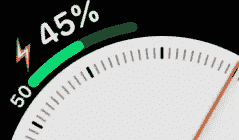
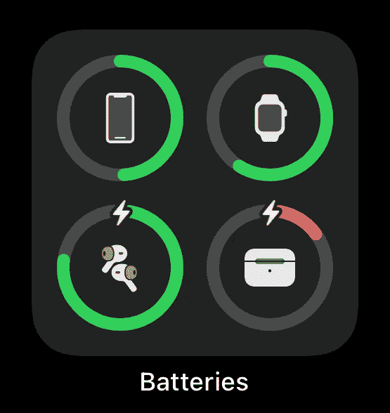
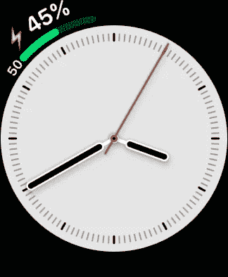

# 在 Apple Watch 上查看 iPhone 电池电量

> 原文：<https://blog.devgenius.io/see-iphone-battery-level-on-apple-watch-88b88e540b64?source=collection_archive---------3----------------------->

[**果汁手表**](https://apps.apple.com/app/apple-store/id1485101937?pt=111573815&ct=medium-level&mt=8) 在一个复杂功能中显示你的 iPhone 和 Apple Watch 电池电量。

Apple Watch 上内置的**电池**复杂功能非常受欢迎，如果你在 [r/AppleWatch](https://www.reddit.com/r/AppleWatch/) 上浏览 peoples ' watch face 截图，你就可以看到这一点。

iOS 14 上的电池 widget。

在 iOS 14 中引入的**电池**小工具，在配对的 Apple Watch、AirPods 和 iPhone 主屏幕上的更多电池的当前电池水平下，提供了比以往任何时候都更容易访问的外观。

不过还有一个缺失的部分:**如果你想从 Apple Watch 上查看手机的电池电量呢？**

虽然从 Apple Watch 上看配对 iPhone 的电池电量似乎很明显，但这从来没有包括在 watchOS 中。

所以我才创造了 [**果汁手表**](https://apps.apple.com/app/apple-store/id1485101937?pt=111573815&ct=medium-level&mt=8) 。

该应用的主要特点是**一个显示你的 iPhone 电池电量的复杂功能**。

看到 iPhone 和 Apple Watch 水平在同一个复杂功能上，有一个充电指示灯。

这使得一整天都可以很容易地看到手机的电池电量，如果电量低了，就插上电源。

复杂功能的一些样式可选地让您**包括充电状态**，因此您可以看到一个螺栓指示器，如果 iPhone 正在充电(或者更重要的是，知道充电是否由于某种原因而中断)。

此外，你可以在同一个复杂功能上**包括 Apple Watch 的电池电量，这样你就可以同时看到两个功能，而不用占用一个以上的复杂功能插槽。**

[**在 App Store 获得果汁手表**](https://apps.apple.com/app/apple-store/id1485101937?mt=8)