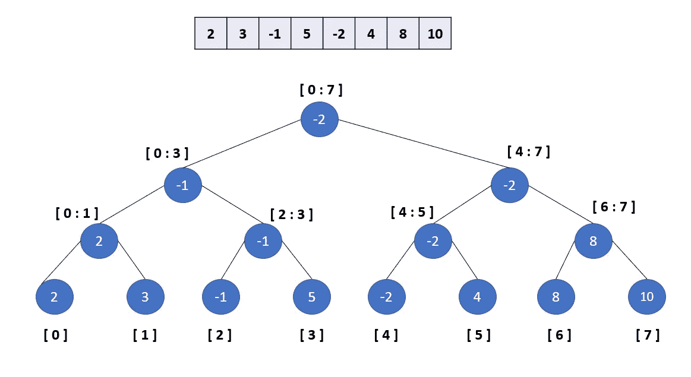
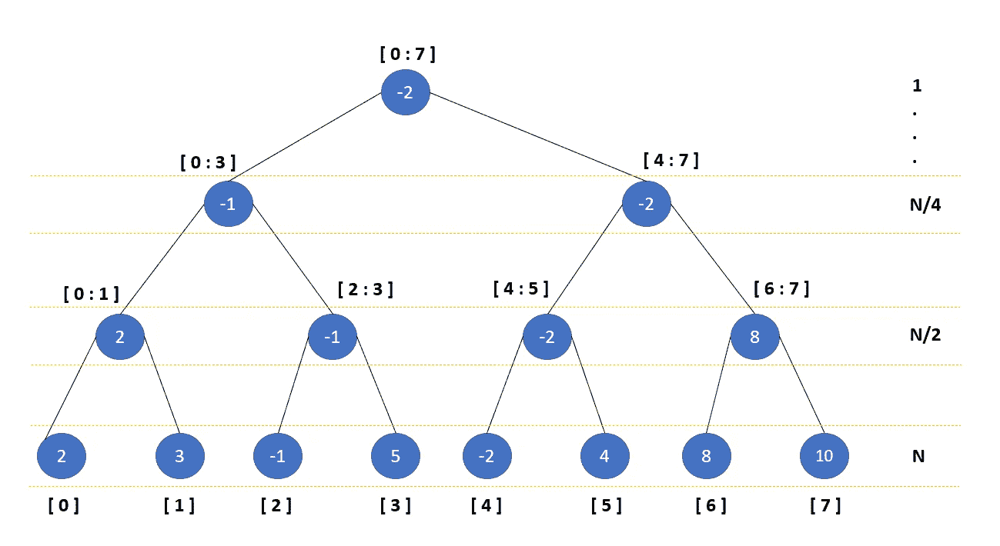
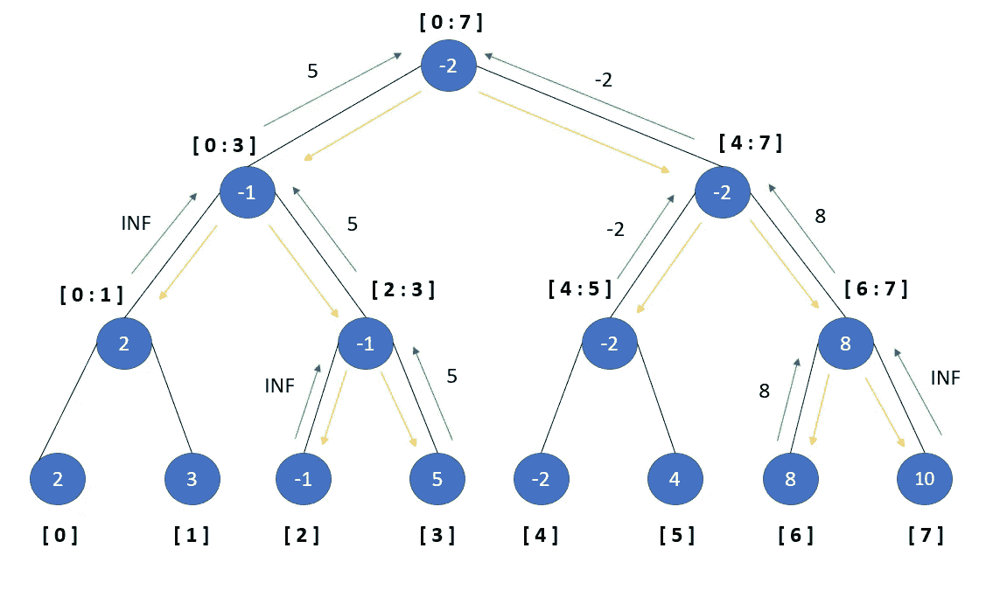
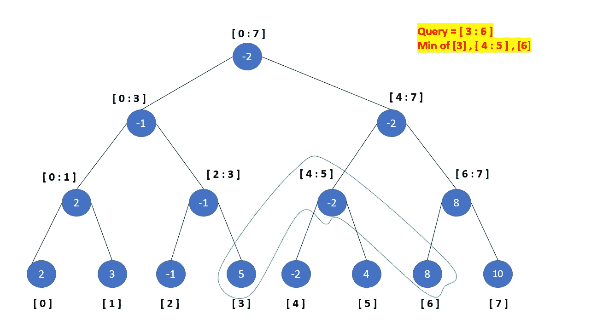
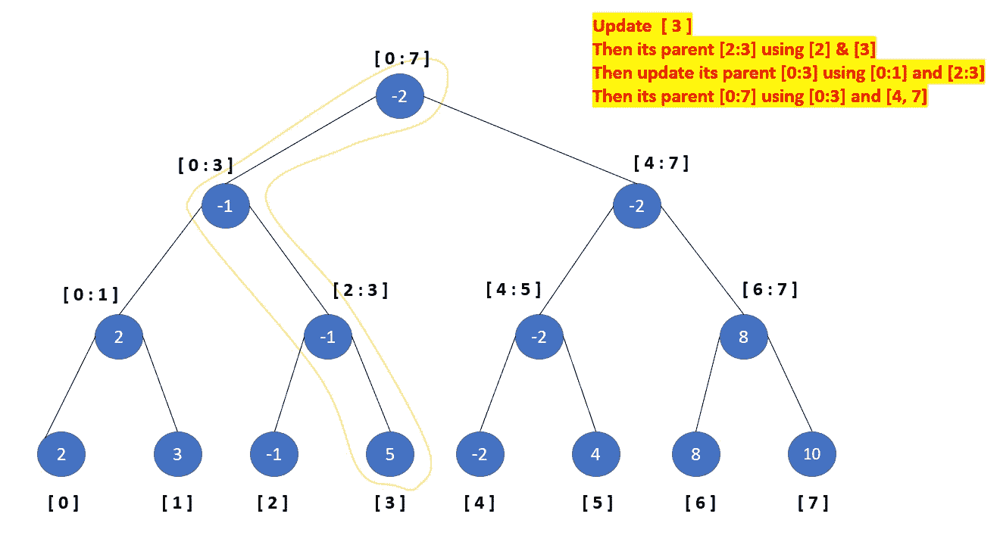

# 细分树-未展开

> 原文：<https://blog.devgenius.io/segment-tree-unravelled-370f4754b074?source=collection_archive---------17----------------------->


[动物园 _ 猴子](https://unsplash.com/@zoo_monkey?utm_source=unsplash&utm_medium=referral&utm_content=creditCopyText)在 [Unsplash](https://unsplash.com/s/photos/bamboo?utm_source=unsplash&utm_medium=referral&utm_content=creditCopyText) 上的照片

更快的范围查询

段树是一种灵活的基于树的数据结构，允许有效地回答数组上的范围查询。它还允许修改数组。这种数据结构采用了两种好的算法策略 1。预计算所需的查询 2。分而治之。它在输入的较小部分上计算期望的结果。

假设我们有一个数组:2，3，-1，5，-2，4，8，10。

## 构建树

为了构建树，我们通过将范围减半来连续构建左右树。当我们到达范围的开始和结束相同的叶节点时，我们将节点的值设置为数组索引值(A[start])。然后我们回到父节点，将其值设置为子节点的 min。



上图显示了用于查找各种范围最小值的段树。它有 2N-1 个节点，N 是数组的大小。



## 询问

为了查询，我们遍历树并寻找重叠的区间。那里有三个箱子:

1.  重叠→我们左右遍历
2.  外部→回到父级
3.  完全在范围内→取节点的值并返回到父节点



分段树查询遍历

查询的参与者节点



## 更新

为了更新索引，我们继续遍历或索引所在的一半，并继续直到我们到达范围具有单个元素的地方(start == end)。一旦我们读取了这个节点，我们就更新了那个引导节点的值。遍历回父节点，根据其子节点值更新节点值。



问题:

给定一个大小为 **N** 的整数数组 **A** 。您必须执行两种类型的查询，在每个查询中，您会得到三个整数 x、y 和 z。如果 **x = 0** ，则更新 **A[y] = z** 。如果 **x = 1** ，则输出数组 **A** 中索引 **y** 和 **z** 之间的最小元素。查询由大小为 M x 3 的二维 T21 数组表示，其中 B[i][0]表示 x，B[i][1]表示 y，B[i][2]表示 z

```
A = [1, 4, 1]
B = [[1, 1, 3], [0, 1, 5], [1, 1, 2]] 
OP =  [1, 4]
```

代码实现(使用数组)

```
import math
class Solution:
    # [@param](http://twitter.com/param) A : list of integers
    # [@param](http://twitter.com/param) B : list of list of integers
    # [@return](http://twitter.com/return) a list of integers
    def buildSegmentTree(self, A, idx, s, e):
        if s == e:
            self.seg_tree[idx] = A[s]
        else:
            mid = (s+e)//2
            l = idx*2+1
            r = idx*2+2
            self.buildSegmentTree(A, l, s, mid)
            self.buildSegmentTree(A, r, mid+1, e)
            self.seg_tree[idx] = min(self.seg_tree[l], self.seg_tree[r])

    def update(self, idx, s, e, index, val):
        if s == e:
            self.seg_tree[idx] = val
            return

        mid = (s+e)//2
        l = idx*2+1
        r = idx*2+2
        lc, rc = self.seg_tree[l], self.seg_tree[r]
        if index <= mid:
            self.update(l, s, mid, index, val)
            lc = self.seg_tree[l]
        else:
            self.update(r, mid+1, e, index, val)
            rc = self.seg_tree[r] self.seg_tree[idx] = min(lc, rc)

    def getMin(self, idx, s, e, l,  r):
        if (l <= s and r >=e):
            return self.seg_tree[idx]
        if (l>e or r<s):
            return math.inf
        mid = (s+e)//2
        lc = 2*idx+1
        rc = lc+1
        return min(self.getMin(lc, s, mid, l, r), self.getMin(rc, mid+1, e, l, r)) def solve(self, A, B):
        n = len(A)
        self.seg_tree = [0] * (4*n)
        self.buildSegmentTree(A, 0, 0, n-1)
        res = [] for x, y, z in B:
            if x == 0:
                self.update(0, 0, n-1, y-1, z)
            else:
                z -= 1
                res.append(self.getMin(0, 0, n-1, y-1, z))
        return res
```

我们使用 4*n 大小的数组。为了得到这个上限，观察树的高度是⌈log2n⌉，深度 h 的水平上最右边的节点位于数组中的位置 2^(h+1-1。这是使用以下等式推导出来的。

s(n)≤(2 ^(⌈log2n⌉+1))−1
<2⋅(2^⌈log2n⌉)
=4⋅2^(⌈log2n⌉−1)
≤4⋅2^(⌊log2n⌋)
≤4n

此外，树的数组表示使用(idx*2+1)和(idx*2+2)来存储索引(idx)处的节点的子节点。

编码快乐！！