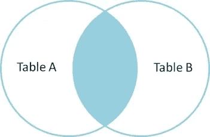

# 选择* …成本太高！！！

> 原文：<https://blog.devgenius.io/select-too-costly-2ac99ad41cae?source=collection_archive---------4----------------------->


在*软件开发*的环境中，主要用于存储数据的*数据库*是非常重要的组件。 ***MySQL*** 作为最*基础的数据库技术*，初学程序员一般都很清楚*基础*和一些*高级* ***SQL*** 查询。***SELECT * FROM TABLE***是最基本的 ***SQL*** *查询*，它返回那个*特定表*中的所有*行*(完整数据)*。但是使用 ***选择**** 并不是*推荐的* *练习*，在这篇短文中我们将看到其背后的原因。*

## *表演*

**

****SELECT **** 是一个 ***SQL*** 查询，基本上*检索指定表中所有*行(元组)*的所有*列*。在该查询期间执行了完整的*表扫描*，其结果是*不需要的*列*对于*应用特定的*需求*也被获取，这是*非常低效的*。*大量*数据*通过*网络*从*数据库服务器*传输*到*应用服务器*或*客户端*从而导致*不必要的开销*。这最终导致*增加* *数据库访问时间*，从而影响*性能*。**

## 连接中的问题



在*高级数据库查询*期间，需要在各种*表*之间执行*连接*，并以特定格式显示数据。一个 ***SELECT **** 查询在一个 ***JOIN*** 中导致*冲突*当*参与 *join* 的多个表*有一个*公共属性(列)*名称，从而导致*检索*列*的*

## *代码可读性*

**

**维护可读代码*非常重要*，因为许多团队成员和新加入者为了获得*良好的逻辑理解*或者为了以更好的方式优化它而频繁地经历它。使用 *SELECT ** 查询来检索*不必要的列*，对于一个正在检查或*审查代码*的人来说会产生疑问，并且很容易从*逻辑*的*实际流程*中误导他/她，因此被认为是*不良实践*。**

## **结论**

**与具有*大量*数据*的*企业应用数据库*相比，通过使用*选择** 对*性能*的*影响可以非常小，因为*影响*更*显著*。****

**

*因此，*最佳实践*是通过 ***SELECT SQL*** 查询明确指定您实际打算从表中检索的列。例如，让我们假设我们有一个名为*雇员*的表，其中有列(属性)*姓名、年龄、地址*和*薪水*。*

*在这种情况下，如果我们只想检索姓名和薪水，我们的查询应该是:*

```
*//Recommended
SELECT name, salary FROM Employee;//Not recommended
SELECT * FROM Employee;*
```

*所以要*小心*并指定*列中的*列表，在 ***中选择查询*** 比使用****通配符选择*** 。**

> **一个轻松的说法是，我的一个学长总是说做一个 SELECT *来获取所有的列，然后只使用几个必需的列，就像邀请所有人吃饭，然后只提供几个必需的！！！**