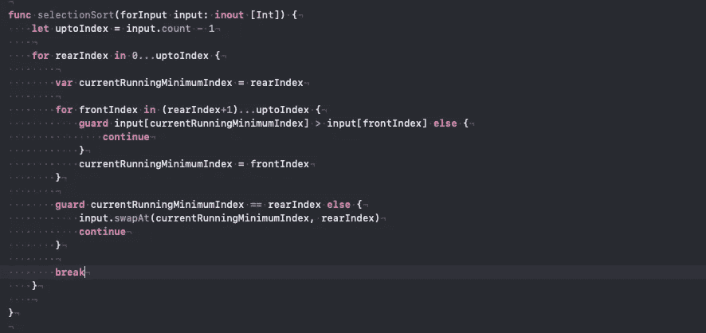

# 选择排序

> 原文：<https://blog.devgenius.io/selection-sort-ddcd3c422699?source=collection_archive---------3----------------------->

[在计算机科学中，**选择排序**是一种原地比较排序算法。它有 O( *n* 2)的时间复杂度，这使得它在大型列表上效率很低，并且通常比类似的插入排序性能差。选择排序以其简单性而著称，并且在某些情况下，特别是在辅助存储器有限的情况下，比更复杂的算法具有性能优势。](https://en.wikipedia.org/wiki/Selection_sort)

选择排序:

```
**var** unOrderArray = [4,2,6,10,8]
Suppose we have array of unordered numbers(In this case even number, subset of natural numbers)
We have two option to sort this.
1\. Ascending order.
2\. Descending order.
```



选择排序(升序)

感谢阅读。如果您有任何疑问或建议，请告诉我

roshankumar350@gmail.com
罗山·库马尔·萨。