# Azure DevOps 上的自托管 Linux 代理只需 5 分钟！！

> 原文：<https://blog.devgenius.io/self-hosted-linux-agent-on-azure-devops-in-5-minutes-2e43b4f26f69?source=collection_archive---------3----------------------->

## 是啊！您不必为 Microsoft 托管的代理付费，也不必购买新的服务器来工作/实践。用自己的 Linux 机器代替！

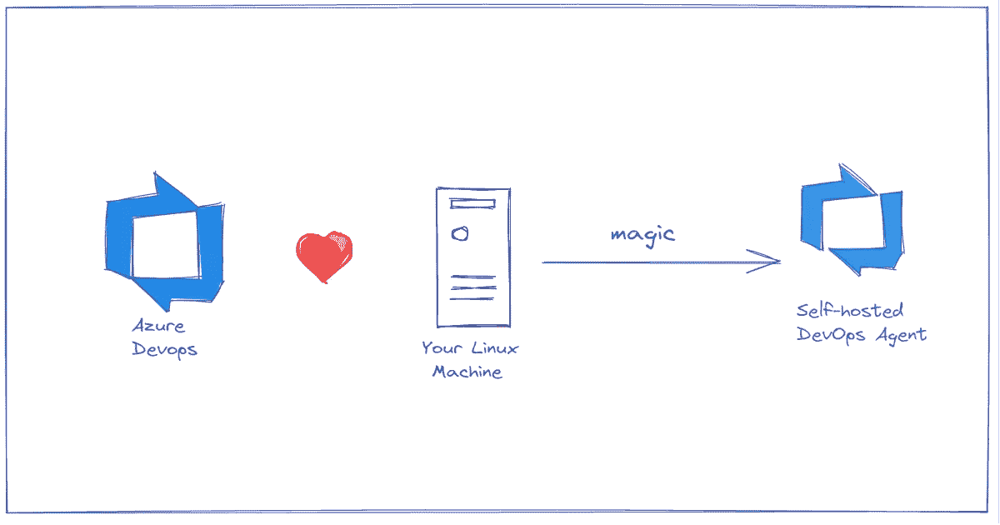

Azure Devops +你的 Linux 机器

如果你像我一样，想学习 Azure DevOps，你需要一台机器来构建代码，执行发布等。但是你说我租不到服务器？你不需要我的朋友。

如果你在 Azure、Azure VMSS 或任何 Linux 机器上有一个 VM，并且想在你的 Azure DevOps 中使用它作为代理，过程是相同的。

让我们看看我们能做些什么。

先决条件:

*   一台 Linux 机器
*   Azure DevOps 帐户。

# 1.设置代理池

转到您的 Azure DevOps 帐户->组织设置，然后转到管道中的代理池

点击添加池

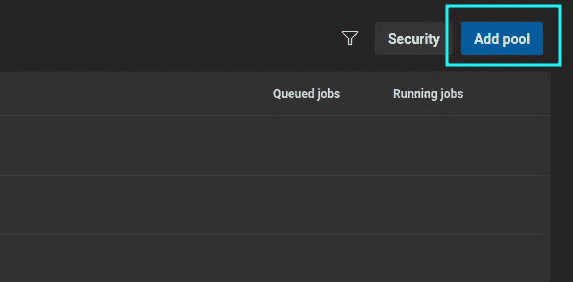

选择自托管，并为其命名和描述

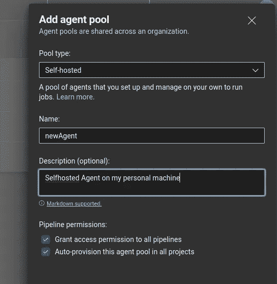

您也可以选择授予对特定管道的访问权限。如果需要，取消选中该选项。

打开创建的代理池，单击“代理”，然后单击“新建代理”

选择 Linux 和“x64 ”,这是目前许多人使用的。如果需要，还可以选择 RHEL6 或其他 ARM 架构

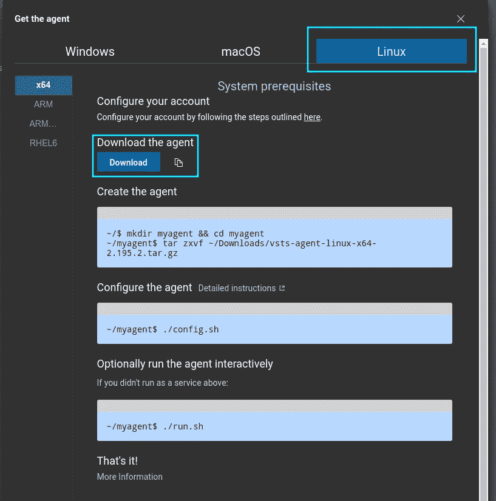

# 2.安装代理

检查文件的下载位置，以确保万无一失。我在下载里有我的

使用终端中的`cd Downloads`将您的工作目录更改为下载目录，然后创建一个新目录，并使用`mkdir myagent && cd myagent`将该目录更改为下载目录

使用`tar zxvf ~/Downloads/vsts-agent-linux-x64-2.195.2.tar.gz`检查版本。相反，你可以使用 Azure DevOps 提供的命令

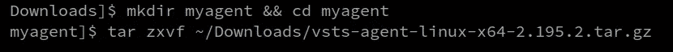

检查完协议后运行`./config.sh`和`Y`。

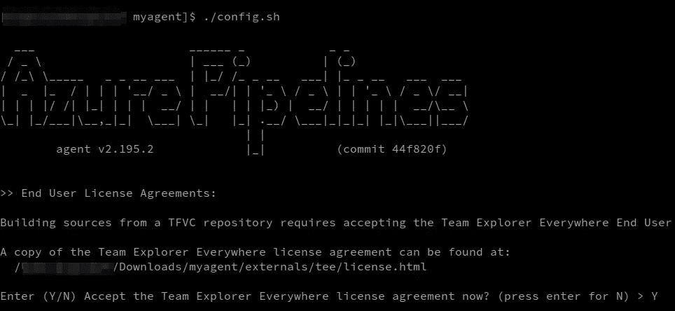

服务器网址是[dev.azure.com/YourOrganizationName](https://dev.azure.com/YourOrganizationName)在你的 Azure DevOps 上找到它

按“Enter ”,因为我们将使用 PAT 令牌进行身份验证。

# 3.生成 PAT 令牌

要获取 PAT 令牌，请转到您的 Azure DevOps 帐户

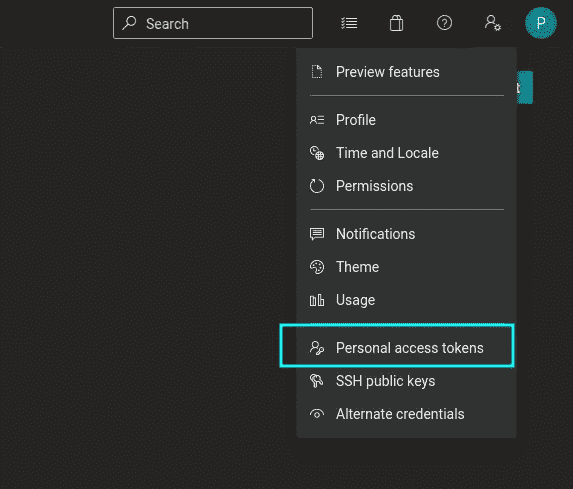

单击“新令牌”

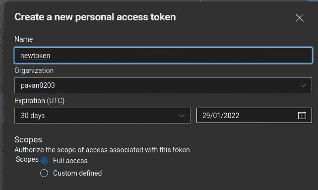

给令牌一个名称和完全访问权限。如果您知道不需要什么，可以选择自定义范围。

创建新令牌。**此令牌一旦消失，以后就无法找回。所以确保你复制它以防你以后需要它。**

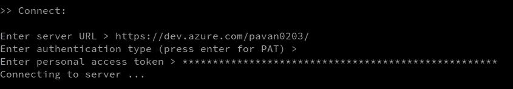

# 4.最后的步骤

输入代理池名称，对我来说是“newAgent ”,对您的代理来说是一个名称。对我来说是 R2D2。

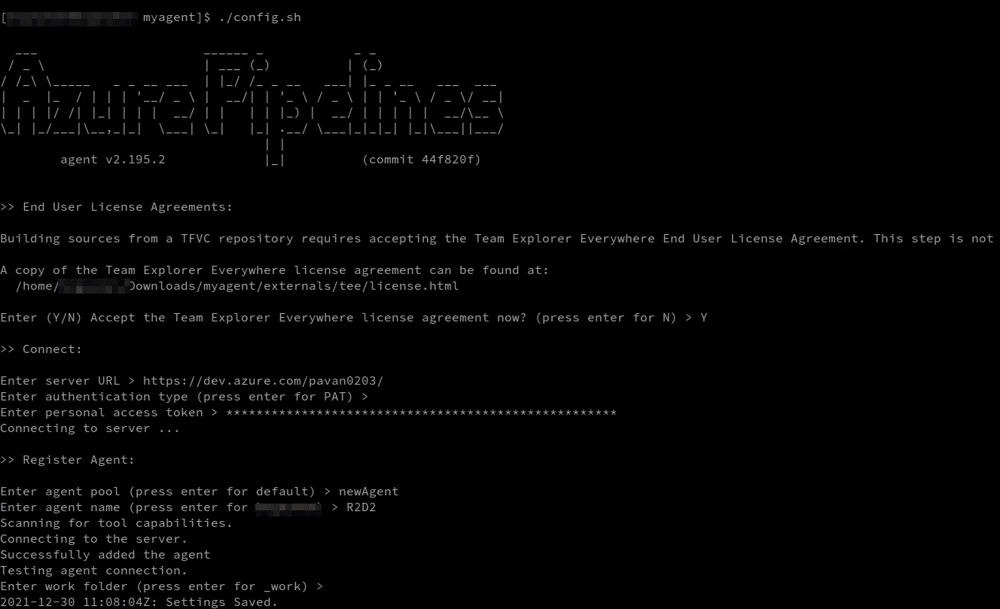

下一次运行`./run.sh`

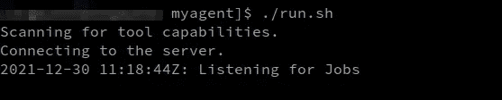

# 5.尽情享受吧！

现在检查您的代理，我们有它，我们的新代理开始运行

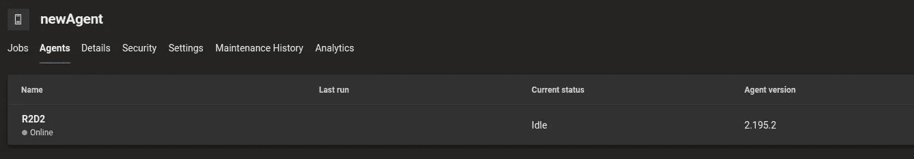

感谢您的阅读您可以在 [Twitter](https://twitter.com/pavangudiwada_) 上找到我，或者在 [Hashnode](https://pavangudiwada.hashnode.dev/) 和 [Medium](https://pavangudiwada.medium.com/) 上阅读我的博客