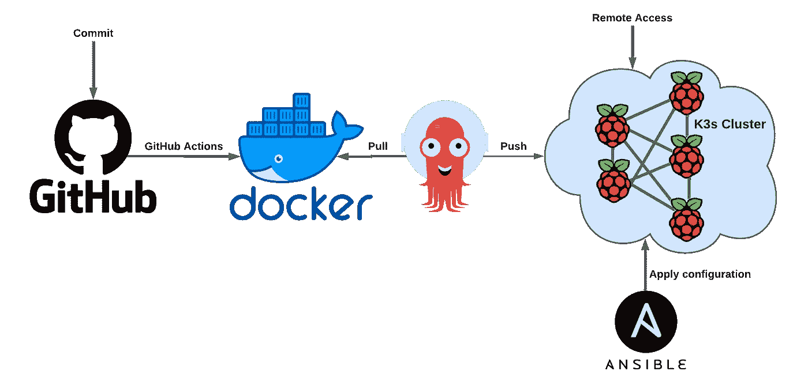
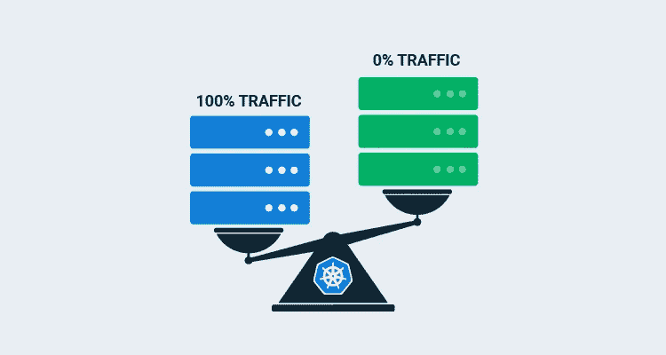

# 自托管 Web 抓取场

> 原文：<https://blog.devgenius.io/self-hosting-a-web-scraping-farm-699c12bfd138?source=collection_archive---------2----------------------->

在过去的半年里，我从事了一个非常数据密集型的项目，目标是从网络上抓取数据，对其进行预处理，用它训练深度学习模型，并将其部署到生产中。这些都是需要手工重复完成的繁重任务，所以我们的目标是尽可能自动化这个过程。

先把事情说清楚， ***网页抓取是一个*** ***程序，它抓取网页并从中抓取数据。它提取底层的 HTML 代码，然后可以在其他地方复制整个网站内容。用于各种依赖数据收集的数字业务，如:***

*   **从网站上抓取数据**，分析其内容，然后进行排名
*   **自动获取联盟卖家网站的价格和产品描述**
*   **从论坛和社交媒体中提取数据**用于营销中的情感分析

这很好，可能你们大多数人已经知道了所有这些事情。但是这篇文章的主要目的是给你一个高层次的架构概述，使所有这一切自动化。我说的是**自我封装你的代码**，**可靠地运行你的网页抓取脚本**，**轻松部署新的软件版本**，**跟踪补丁**，**维护你的自托管农场**，等等。

完整的架构

# 物理设置

众所周知，有很多很棒的网络文章可以构建你自己的 **Raspberry Pi 集群**，而不是在云中购买虚拟机或类似的东西。你不仅会得到一堆很酷的机器和所有这些在你房间里闪烁的很酷的发光二极管，而且你还会学到很多东西。这确实有它的缺点，但那是有趣的部分开始的地方——你需要有一点创造性来使你的生活更容易。

如果您已经有了集群设置，那就再好不过了。矿山集群由以下部分组成:

*   8 端口 PoE 交换机
*   6x CAT5 电缆
*   5x Raspberry Pis 4，带 2GB 内存
*   5x PoE 树莓皮帽子

**只要你有一个功能集群，有两个以上的树莓 pi，你就会和这个教程相处的很好。您也可以继续使用少于两个的集群，但是请记住，对于您来说，没有高可用性集群这样的东西，同时您仍然可以模拟其余的任务。**

> 但是为什么会有这么多(覆盆子)馅饼呢？🤔

实际上，我最初确实只从一个 Raspberry Pi 开始，它连接到运行 cronjob 的 web。但是我从事的项目有严格的要求。不仅我不能在 Raspberry Pi 失败的情况下丢失任何数据，而且每个连续的文件都需要以固定的时间间隔生成，并以升序存储。在这个项目中，我不仅遇到了许多与 Raspberry Pi 故障相关的问题，而且根据我的经验，我知道 Pi 平均每 2-3 周就会下降一次。给你一点背景，我认为问题实际上在于 SD 卡，我可能会使用更可靠的驱动器，但让我们把这个谜留到其他时候。

# K3s 高可用性(HA)群集

因此，我们使用多个 pi 进行操作，为了让它们像一个一样工作，我在它上面部署了一个****HA 集群**，它构建了一个多个主节点和从节点的层次结构，其中**主节点委托任务，而从节点通常是执行任务的节点**。我说通常是因为 masters 也能够执行任务——这可以在 Kubernetes 配置中进行不同的调整。重要的是要认识到，如果所有的主节点都关闭了，那么集群就无法正常工作，因为没有人能够委派任务。这也是我部署多个服务器的原因，也是它被称为高可用性的原因。**

# **刮痧从未如此简单**

**哦，我说到哪里了…网络抓取对吗？通常，从 web 上抓取数据的脚本由一个事件触发，或者以固定的时间间隔触发。这里需要强调的一点是**您不希望过于频繁地运行脚本，因为您可能会耗尽存储空间**，但是不运行可能也是您不希望的。最终，这一切都归结为问题的本质。**

**除此之外，**将你的脚本自封装到一个容器中**也很重要。这样，您不仅可以在所有支持这个容器原语的机器上执行它，还可以确保您的代码与所有的依赖项打包在一起。我**将脚本包装在 Docker 容器中，主服务器每 3 分钟在可用的从服务器上执行一次**。**

****

## **现在有趣的部分来了…**

*   **我如何**在“没有”的时间内，几乎不费力地将 web 抓取脚本的新版本部署到 Kubernetes 集群**？**
*   **如何判断出**哪个 Kubernetes 节点出现故障并重启它**，潜在地在 SD 卡上闪存一个新的映像并配置它立即运行所需的软件？**
*   **我不在集群附近，但是**我想测试集群是否正常工作，任务是否成功执行****
*   **如果**新的软件补丁破坏了集群上运行的最新 Docker 镜像怎么办？**如何恢复更改？如何防止这影响我的 Kubernetes 集群性能？**

# **最完美的自动化**

**伟大的事情伴随着巨大的挑战。关于其中一个半简单的方法，我在之前的一篇文章中已经广泛地讨论过了。这是**确定哪个树莓派不好用的基本问题**。当你只有一个覆盆子酱的时候，问自己这个问题是愚蠢的，但是当你有多个覆盆子酱的时候，这个问题比你想象的要复杂一些。想象一下，无论是 Kubernetes 集群还是通过其他一些监控工具，您都被告知带有 IP X.X.X.X 的 Raspberry Pi 宕机了。您无法通过 SSH 重启，因此您必须手动重启，或者通过 PoE 交换机重启(如果您可以这么做的话)。我的问题来了——**

> ****如何直观的知道哪个树莓派有 IP X.X.X.X？**👀**

**有几个选项—您可以为每个 Pi 设置静态 IP，并在上面贴一个带有 IP 的标签，或者您可以以某种方式给它们着色并相应地配置主机名(例如，bluepi、redpi 等。).但是你可以做一件更简单的事情——看看它。**

** [## 你如何直观地确定在一群树莓中哪个树莓被关闭了

### 这篇文章将会非常简短，但是我认为它可以帮助很多人管理他们的…

tp4348.medium.com](https://tp4348.medium.com/aliveness-check-pi-cluster-using-ansible-688f98bc1e8f)** 

**另一个我想简单提一下的是关于**自动配置新添加的节点或重新配置停滞的节点**，因此只需将电源线插入 Raspberry Pi 并将其连接到网络，就可以启动并运行。为此，我创建了一个 [Ansible playbook](https://github.com/tp4348/K3sansible/blob/master/InitialSetup/playbook.yml) ，其中设置主机名和安装一些 apt 包，还为 K3s 配置了 [NFS](https://en.wikipedia.org/wiki/Network_File_System) 。**

**因为我真的很懒，所以不是这样。我真的很想达到这样一种状态，即**我只需要在我的 GitHub** 上提交更改，在接下来的几分钟内，我应该已经看到新版本的软件在我的 Kubernetes 集群上运行了。听起来不错，对吧？**

**嗯，这是可以做到的，实际上也没那么复杂。该解决方案由两个步骤组成:**

*   **[**GitHub 动作**](https://github.com/features/actions)**——*运行单元测试，构建 Docker 映像，并将其推送到 DockerHub*****
*   ****[**ArgoCD**](https://argo-cd.readthedocs.io/en/stable/)——*检查新的 Docker 映像，并将它们部署到集群*****

****一般来说，这通常被称为[**【CI/CD】**](https://docs.aws.amazon.com/codepipeline/latest/userguide/concepts-continuous-delivery-integration.html)**。很明显，我们只是触及了冰山一角，但你已经明白了。******

****在开始的时候，我也提到了新的 Docker 图像可能会失败——*不是吧夏洛克*。为了应对这种情况，我们需要利用 Kubernetes 的力量，即 [**蓝/绿部署**](https://en.wikipedia.org/wiki/Blue-green_deployment) ，它会逐渐将流量重定向到新的软件版本，并且在容器执行失败的情况下，流量会很容易地重定向回旧版本。****

********

****来源:八达通部署****

# ****像在隔壁一样访问它****

****我想我不必强调，作为一个人，你应该四处走动——当集群出现问题时，你不会总是在场。你可能只是好奇你的网络抓取任务发生了什么，你想登录到你的集群。基本上，您需要设置远程访问。要么是 VPN，要么是[**端口转发**](https://en.wikipedia.org/wiki/Port_forwarding) 方法——这种方法将使您能够调试您的服务器场正在发生的事情，并采取相应的行动。****

# ******还有吗？******

****我实际上还没有完成，但我会在这里称之为结束。实际上，我可以写的东西还有很多，仅举几个例子:****

*   ****在你自己托管的 Kubernetes 上运行 GitHub 操作,以防你的免费时间用完****
*   ****停止使用 SD 卡和 **Netboot 你的树莓 Pi 集群******

**** [## 使用 Ubuntu 20.04 操作系统的 Netboot Raspberry Pi

### 在这篇文章中，我将给出如何使用 Ubuntu 20.04 引导你的 Raspberry Pi 的详细步骤说明。我…

tp4348.medium.com](https://tp4348.medium.com/netboot-raspberry-pi-using-ubuntu-20-04-os-cb3973ff65b0) 

*   **如果出现故障**并且无法通过 SSH 连接到 Raspberry Pi，则从远程重启 Raspberry Pi，这在您可以访问 PoE 交换机配置的情况下是可能的
*   **使用串行控制台**调试您的 Raspberry Pi，以防出现与引导相关的问题

 [## Raspberry Pi 的串行控制台

### 想象一个场景，当你没有显示器和键盘来插入你的 RPi，但你需要调试什么…

tp4348.medium.com](https://tp4348.medium.com/serial-to-raspberry-pi-da635122b4d0) 

*   通过**在您的电脑上模拟 Raspberry Pi**，轻松将更改应用到您的 Raspberry Pi 基本图像

 [## 在你的电脑上模拟树莓派

### 将您的电脑虚拟化，成为树莓派

tp4348.medium.com](https://tp4348.medium.com/run-disk-image-os-locally-121fcedea45b) 

> 感谢阅读！😎如果你喜欢这篇文章，点击下面的按钮👏
> 
> 对我来说意义重大，也有助于其他人了解这个故事。在 [Linkedin](https://www.linkedin.com/in/teodor-janez-podobnik/) | [Twitter](https://twitter.com/TeodorJanez) 上问好
> 
> 要不要开始读 Medium 上的独家故事？使用此[推荐链接](https://medium.com/@tp4348/membership)🔗
> 
> 如果你喜欢我的帖子，你可以[给我买个热狗](https://www.buymeacoffee.com/tp4348)🌭
> 
> 你是一个热情的工程师，但缺乏能力来编写引人注目和鼓舞人心的技术内容吗？雇用我做升级工作[🛠️](https://www.upwork.com/freelancers/~0179a118d727f15420?viewMode=1)
> 
> 在 Teodor J. Podobnik，@dorkamotorka 上查看我的其他内容，并关注我的更多内容，干杯！****