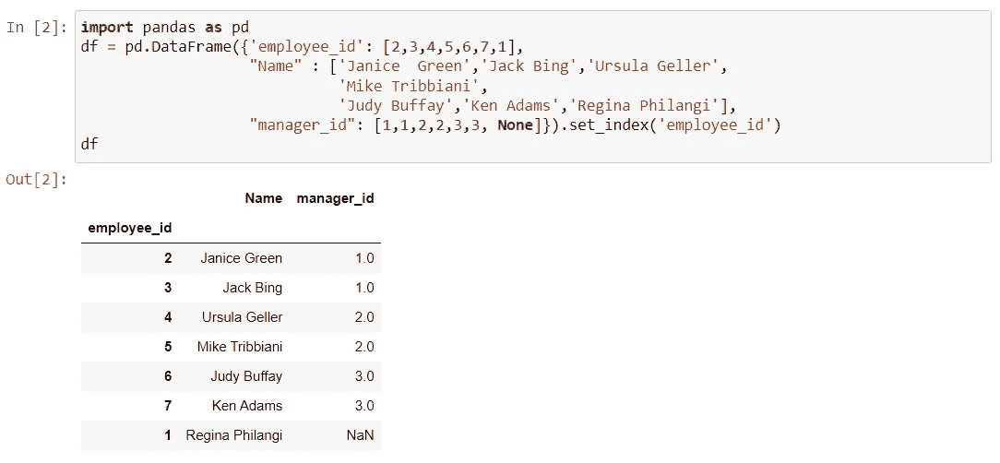
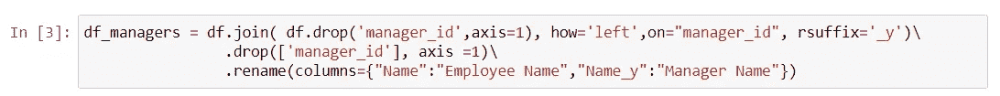
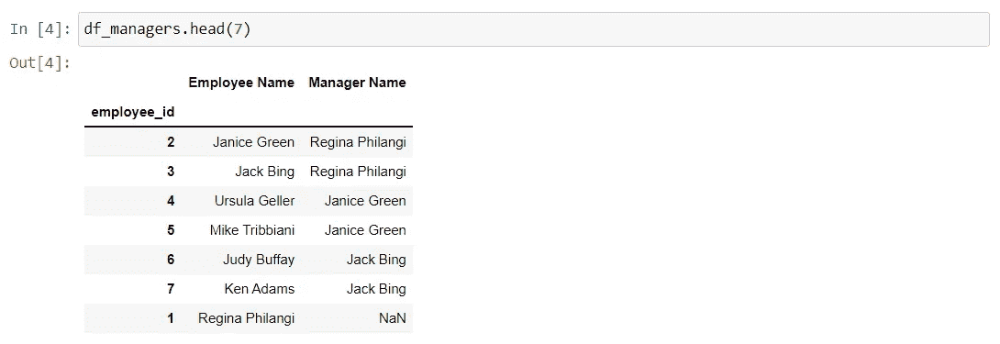
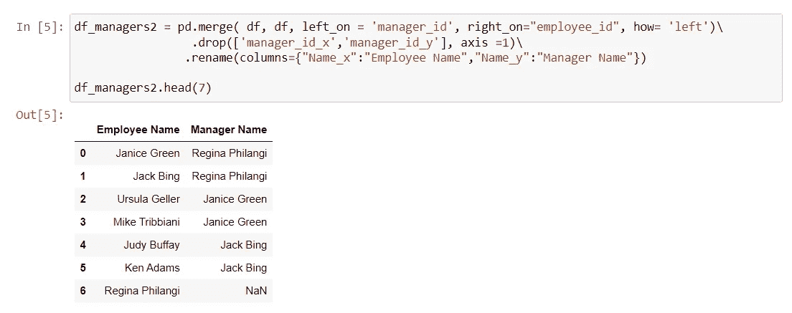
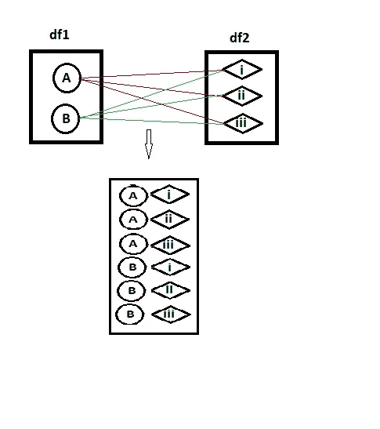
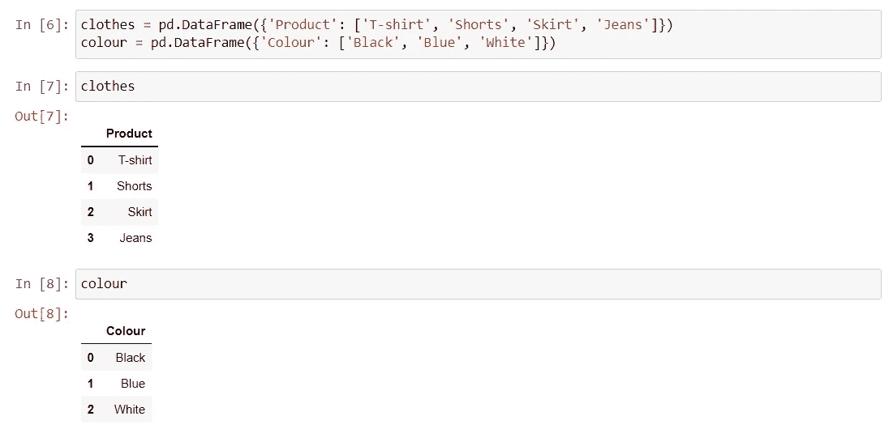
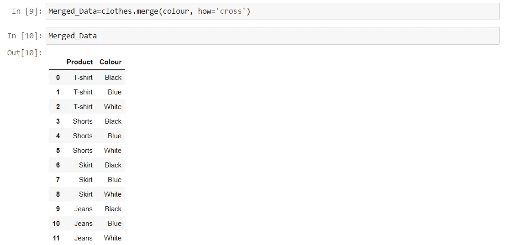
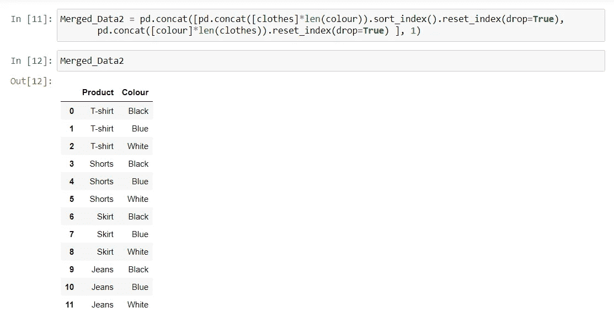

# Pandas 数据框架中的自连接和交叉连接

> 原文：<https://blog.devgenius.io/self-join-and-cross-join-in-pandas-dataframe-b30bfbc0e52a?source=collection_archive---------1----------------------->

照片由 [Anastasia Zhenin](https://unsplash.com/s/photos/anastasia-zhenin) 在 [Unsplash](https://unsplash.com/) 上拍摄

继上一篇关于使用[合并函数](https://medium.com/dev-genius/pandas-dataframe-combine-function-b0278f8f9d7)合并数据帧的教程之后，我们将着眼于鲜为人知的连接形式。

SQL 中最流行的一个`JOIN`，用于根据相关的列或索引组合两个或更多表中的行/列。然而，有不同种类的连接，pandas 提供了各种轻松组合系列或数据帧的方法。以下是连接的类型:

*   内部连接
*   完全连接
*   左连接
*   右连接
*   自连接
*   交叉连接

如前所述，本教程将关注**自连接**和**交叉连接**以及它们在 Pandas DataFrame 中的执行。

对用于连接的各种 Pandas 函数的语法和参数描述的细节。熊猫。数据帧合并、连接、连接和比较广泛涵盖了 Pandas 中的大部分功能。

# 自连接

自联接是将数据帧联接到自身的常规联接。自联接通常用于查询分层数据集或比较同一数据帧中的行。

## 示例 1:查询分层数据框架

假设我们有下表，它代表了一个公司的组织结构。`manager_id`列引用了`employee_id`列。这显示了谁对一个员工负责，或者一个员工向哪个经理报告。

为了获得雇员向谁报告，我们可以使用`Self-join`来查询该表。

我们首先将新的数据帧命名为`df_managers`。然后，我们将`df_managers`数据帧连接到自身。第二次连接的`manager_id`被删除，以便使用`pandas.DataFrame.join()`功能。

使用`how='left'`来捕获最高层管理人员的详细信息。她的`manager_id`是个`NaN`。然而，如果我们想要一个不包括最顶层管理器的数据帧，我们可以将其更改为`how='inner'`。

最终输出如下所示。Regina Philangi 没有经理，也就是说，她不向任何人汇报。她是最高管理者。

或者，可以使用`pandas.merge()`函数在 Pandas 中执行自加入，如下所示。`df_manager`的输出与`df_manager2`的输出相同。

# 交叉连接

`Cross Join`是一种连接类型，允许您在两个或多个表中生成行的笛卡尔乘积。换句话说，它将第一个表中的行与第二个表中的每一行组合起来。下表说明了当将表 **df1** 连接到另一个表 **df2** 时`Cross Join`的结果。

## 示例 2:创建独特产品的库存

这个例子的目标是为一个服装店创建一个库存，这个库存根据衣服的颜色正确地获取衣服。我们从建立数据集开始。

对于我们的数据集，没有连接两个数据帧的索引。因此使用`pandas.merge()`功能很方便。这将在下面演示。

我们也可以使用`pandas.concat()`函数，如下所示。这给出了与`pandas.merge()`功能相同的结果。

# 结论

在本教程中，我们学习了鲜为人知的连接，以及它们是如何在 Pandas DataFrame 中执行的。熊猫有各种功能可以达到同样的效果。