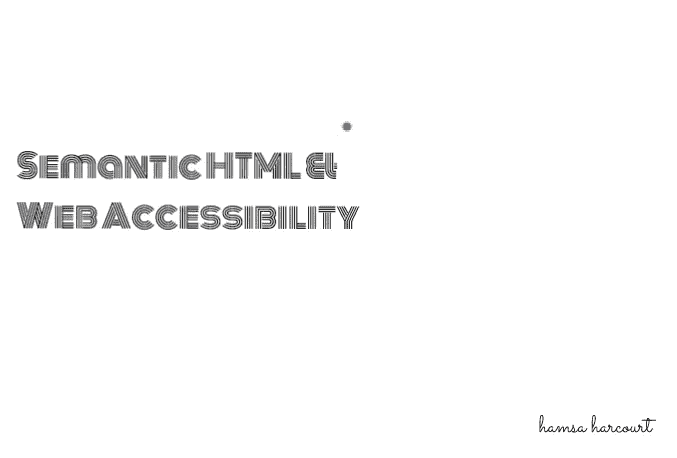
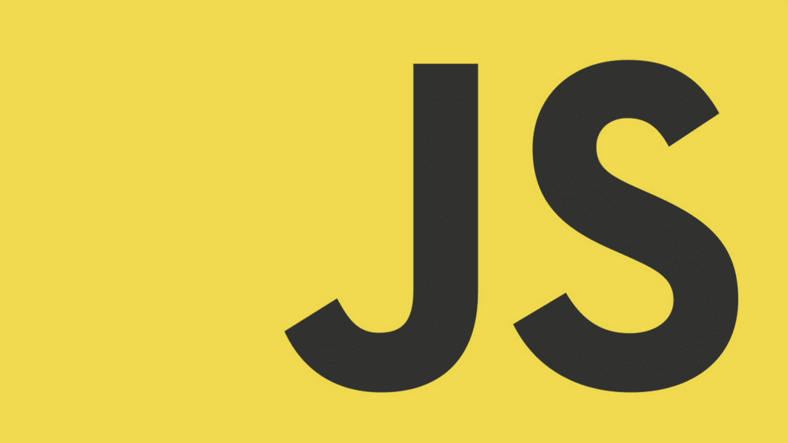

# 语义 HTML 和可访问性

> 原文：<https://blog.devgenius.io/semantic-html-and-accessibility-6a4f3eba78a9?source=collection_archive---------13----------------------->



许多开发者(包括我自己)很容易得出结论，我们的应用可以被每个人使用。大多数时候，情况通常不是这样。

据[世卫组织](https://www.who.int/)报道，在全球范围内，至少有 22 亿人患有本可以预防或尚未解决的视力障碍。

作为开发人员，我们应该提供解决方案，而不是增加问题。在这篇文章中，我将讨论语义 html、web 可访问性、web 可访问性提示和 web 可访问性工具。

# 什么是语义 HTML？

> 语义 HTML 是使用 HTML 标记来加强网页和 web 应用程序中信息的语义或意义，而不仅仅是定义其表示或外观。

语义元素清楚地描述了它对浏览器和开发者的意义。换句话说，它们是具有人类可读名称的 HTML 元素。

语义 HTML 元素的一些例子是:

*   页眉
*   航行
*   页脚
*   非语义 HTML 元素的一些例子是:
*   差异
*   a
*   跨度
*   如果你从项目开始就一直这样做，语义 HTML 不会比非语义(坏的)标记花费更多的时间。更好的是，除了可访问性之外，语义标记还有其他好处:
*   更容易开发——如上所述，您可以免费获得一些功能，而且可以说它更容易理解。
*   在移动设备上更好——语义 HTML 可以说比非语义的意大利面条式代码文件更小，也更容易响应。
*   对 SEO 有好处——搜索引擎更重视标题、链接等中的关键词。非语义中包含的关键词等。，这样客户就更容易找到您的文档。

# 什么是网页可访问性？

> 在人机交互中，可访问性意味着使网络可访问，并具有几乎每个人都可以操作的功能，包括所有形式的残疾、限制和条件。

# 网页可及性指南

> 网页内容可访问性指南(WCAG) 2.0 是由网页可访问性专家整理的一套指南和最佳实践，以系统的方式阐述了“可访问性”的含义。

参见[网页内容无障碍指南(WCAG) 2.0](https://www.w3.org/TR/WCAG20/) 网站。

# 网页可访问性提示

*   用户界面控件

所谓 UI 控件，我们指的是用户与之交互的应用程序的每一部分。一个好的做法是在表单中使用

```
<form>
    <label for="name">Name</label>
    <input type="text" id="name" name="name"/>
</form>
```

*   替代文本

重要的是要记住，图像/视频内容不能被视障人士看到。为了让事情变得更好，在使用图像时不要忘记您的`alt`属性。属性的内容应该尽可能的具有描述性。

这里有一个小例子



```

```

*   页面布局

在过去，人们习惯于使用 HTML 表格来创建页面布局——使用不同的表格单元格来包含页眉、页脚、侧边栏、主要内容栏等。这不是一个好主意，因为屏幕阅读器可能会给出令人困惑的读数，特别是如果布局很复杂并且有许多嵌套的表格。

最近，语义 HTML 解决了这个问题，使我们的 web 应用程序易于访问。

```
<header>
  <h1>Header</h1>
</header><nav>
  <!-- main navigation in here -->
</nav><!-- Here is our page's main content -->
<main> <!-- It contains an article -->
  <article>
    <h2>Article heading</h2> <!-- article content in here -->
  </article> <aside>
    <h2>Related</h2> <!-- aside content in here -->
  </aside></main><!-- And here is our main footer that is used across all the pages of our website --><footer>
  <!-- footer content in here -->
</footer>
```

# Web 辅助工具

*   用斧砍

aXe 是 Deque Systems 为 Chrome 和 Firefox 开发的一款免费开源的可访问性测试工具。你可以为 Chrome 添加 [aXe](https://www.deque.com/axe/) 扩展或者为 Firefox 添加 aXe 扩展来分析网页内容。aXe 显示了导致该问题的确切代码片段以及修复它的解决方案。它显示了发现的每个问题的严重性，并分析了 [WCAG](https://www.w3.org/TR/WCAG20/) 2.0 的可访问性违规和 508 条款遵从性。

*   颜色对比分析器

与设计师一样，[色彩对比分析器]([webaim.org/resources/contrastchecker](https://webaim.org/resources/contrastchecker/))也是 Paciello Group 为 Windows Mac OS 和 OS X 设计的，它用于确定网页中图形和视觉元素的文本易读性和色彩对比。只有 Windows 支持可视化模拟功能。该工具根据 [WCAG](https://www.w3.org/TR/WCAG20/) 2.0 色彩对比成功标准对对比元素进行评估。该工具专用于弱视和色盲用户

*   铬合金灯塔

[Lighthouse](https://developers.google.com/web/tools/lighthouse) 是一款[开源](https://opensource.com/resources/what-open-source)，用于提高网页质量的自动化工具。你可以在任何网页上运行它，无论是公开的还是需要认证的。它对性能、可访问性、渐进式网络应用等进行审计。阅读我之前的文章:chrome lighthouse 入门。

# 资源

[网页无障碍介绍](https://bolajiayodeji.com/introduction-to-web-accessibility-cjwum18h600007ds1wreswp3q)

[网页内容无障碍指南(WCAG) 2.0](https://www.w3.org/TR/WCAG20/)

[HTML:可访问性的良好基础](https://developer.mozilla.org/en-US/docs/Learn/Accessibility/HTML)

[HTML 语义元素](https://www.w3schools.com/html/html5_semantic_elements.asp)

[世卫组织关于视力障碍的事实](https://www.who.int/news-room/fact-sheets/detail/blindness-and-visual-impairment)