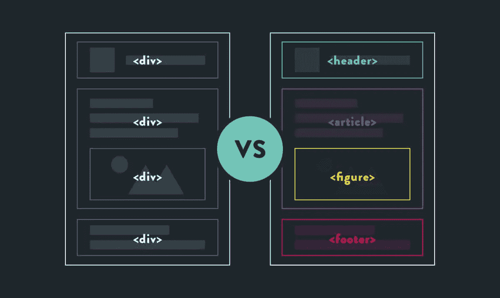

# 语义 HTML 解释和如何使用它

> 原文：<https://blog.devgenius.io/semantic-html-explained-and-how-to-use-it-3ef9e55b1846?source=collection_archive---------9----------------------->


[南安](https://unsplash.com/@bepnamanh?utm_source=unsplash&utm_medium=referral&utm_content=creditCopyText)在 [Unsplash](https://unsplash.com/s/photos/elephant?utm_source=unsplash&utm_medium=referral&utm_content=creditCopyText) 上的照片

# 什么是语义 HTML？

什么是[语义 HTML](https://developer.mozilla.org/en-US/docs/Glossary/Semantics#semantics_in_html) 元素？当看一个标签时，它看起来像任何其他的 HTML 标签，但是，它的含义和预期用途对于解释 HTML 代码的浏览器和可能阅读代码的开发人员来说是更清楚的。

可能常见的是，大多数 HTML 都是用`divs`或`spans`分开的。然而，这可能很难理解 div 背后的*意图*。但是，在语义 HTML 元素的情况下，我们可以更明确地使用标签来区分页面的所有部分，例如:

# 这看起来像什么？

下面是一个简单的可视化示例，展示了普通 HTML 与语义 HTML 的对比:



图片来自[https://seekbrevity . com/semantic-markup-important-web-design/](https://seekbrevity.com/semantic-markup-important-web-design/)

在左边，我们只使用 div 来分隔网页的结构。这是非常不明智的，有几个缺点。

在右边，我们可以更好地看到页面的实际布局以及每个部分所代表的内容。这使得我们的页眉-内容-页脚的布局更加有机。

# 利益

总结一下我们得到的好处:

*   网页结构更加清晰
*   搜索引擎优化的好处——网络爬虫更容易解析网站和理解内容
*   改进的 DX(开发人员体验)

# 但是我怎么用呢？

这里有一些如何使用语义标签的例子，注意，大约有 100 种语义元素可用，所以本文不会全部涵盖。

# 主要内容

对于大多数网页来说，你可以立即从使用更多的语义标签中获得一些好处！例如，您可以使用**页眉**、**主**和**页脚**标签将页面分成三个部分。在这种情况下，main 就是页面的主体。

关于 header 标签需要考虑的一些事情:它应该包含一些

# —

###### 标签。仅使用一个

# 标签！您的徽标或图标以及任何作者信息。

页脚通常包含但不限于版权信息、网站地图或任何其他联系信息。

```
<header>This is a header</header> 
<main>This is the main content</main> 
<footer>Footer</footer>
```

# 部分

通常用**部分**和**文章**标签来划分页面的各个部分。有人说这可以互换，但有一些明显的差异需要考虑！

**文章**标签应该包含不需要任何其他上下文的独立内容。虽然 section 标签被明确地绑定到页面的内容，但是被进一步划分成其各自的子部分

```
<article>This is self contained content</article><main> 
<section>Related Content</section> 
<section>Related Content</section> 
</main>
```

# 形象

一个**图**标签是一个图像/图片的绝佳选择。这通常应该用于更加独立的内容。这个标签的一个额外好处是它可以和另一个标签 **figcaption** 结合使用，在图片的底部添加一个小标题。

**figure** 标签包含了 **img** 和 **figcaption** 标签，让浏览器清楚这两个标签是相互关联的。

一个 **nav** 标签应该包含导航链接，可以导航到同一页面的其他部分或者其他页面。这些既可以用于导航条、菜单、目录，也可以用于任何涉及导航的东西。

这里有一个小例子。标签不是最漂亮的，但却是最主要的焦点:

如果你想要更多关于语义 HTML 的解释，请在下面的评论中告诉我！

更多内容见[相关代码](https://relatablecode.com)。

如果你喜欢这个，请随时在 LinkedIn 或 Twitter 上与我联系。

*原载于 2022 年 2 月 16 日*[*https://relatablecode.com*](https://relatablecode.com/semantic-html-explained-and-how-to-use-it/)*。*