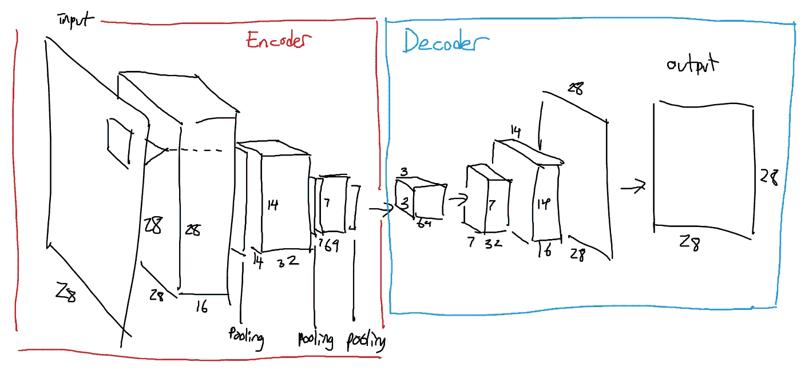
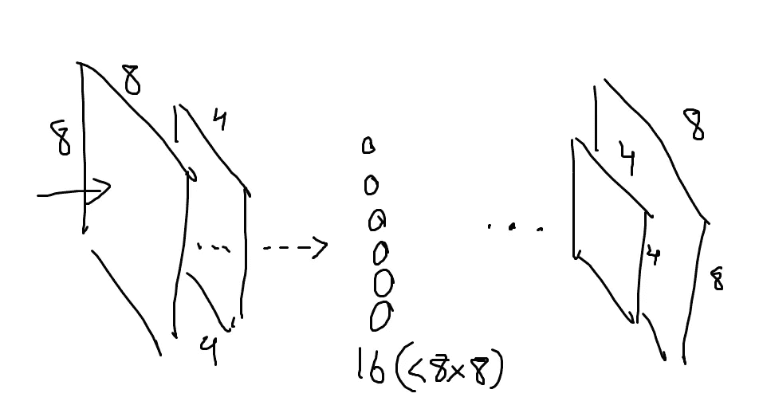
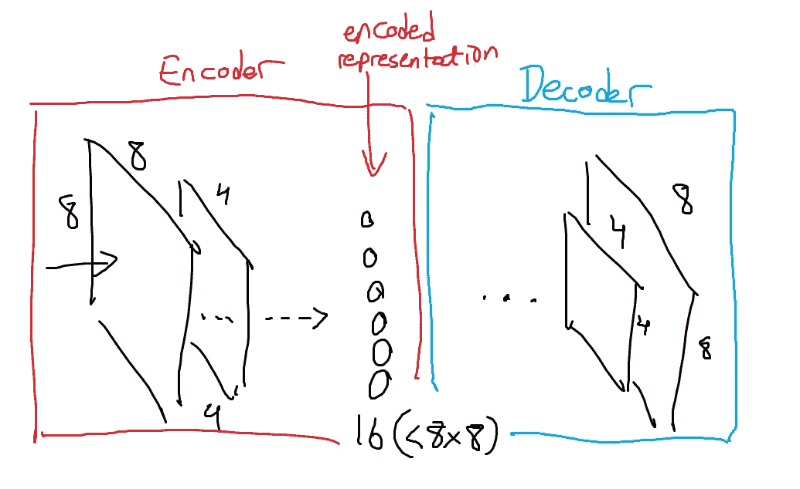
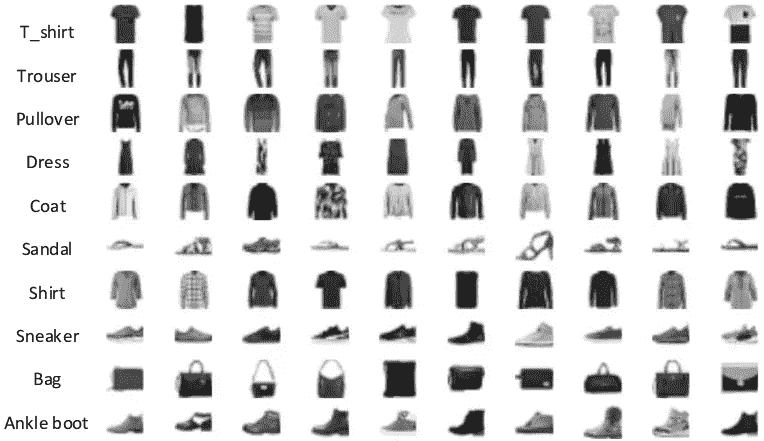
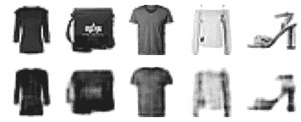
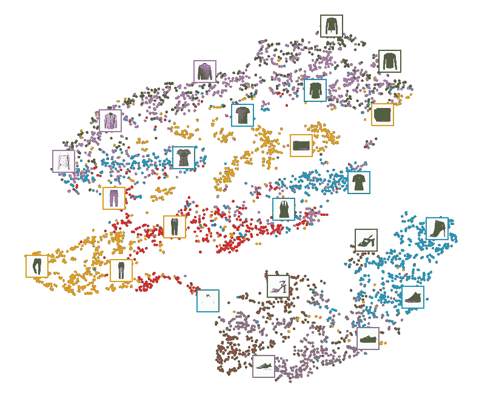
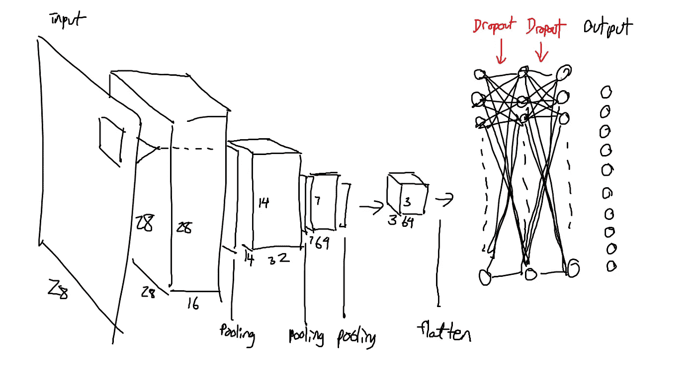

# 使用自动编码器的半监督学习

> 原文：<https://blog.devgenius.io/semi-supervised-learning-with-autoencoders-33f36305e816?source=collection_archive---------0----------------------->

对于大多数现实世界的问题来说，获取标记数据既费时又费钱。

例如，假设您想要训练一个模型来预测 r/wallstreetbets 上的帖子是否包含对特定股票的正面或负面情绪。您可以自动运行一个快速脚本来从 subreddit 中抓取帖子，但是要花几个小时来阅读这些帖子并给每个帖子贴上正面或负面的标签。

如果生产一个标签需要专家的意见，比如电子健康记录的分析，会怎么样？那么标记的数据可能要花费数万美元才能产生！

半监督学习是一种机器学习方法，它使用少量的标记数据和大量的未标记数据来解决监督学习问题。在本文中，我将解释什么是自动编码器，解释自动编码器的一些用途，并展示我使用时尚 MNIST 数据集进行的半监督学习的小型案例研究的结果。

# 什么是自动编码器？

自动编码器是一种能够在未标记数据中找到模式和结构的神经网络。一个典型的自动编码器被训练成输出其输入的副本，但是对网络施加了限制，使得它不能轻易地将输入复制到输出。

例如，网络的隐藏层通常比输入层和输出层具有更低的维度，迫使模型以更低维度的格式表示输入数据，然后使用该格式来重构输入。

这不是一个真实的例子，但上图显示了一个网络，该网络采用 8 x 8 数组(通常表示 2d 图像或其他内容)，并最终将要素映射到 16 维向量，然后再映射回 8 x 8 数组。通过像这样给网络添加一个“瓶颈”，我们希望中心的 16 维向量中的每个元素都代表数据的某种有用特征。

因此，我们可以使用数据本身作为模型的目标输出，在未标记的数据上训练自动编码器。我们希望它在数据中提取有用的特征，使我们能够在一个由相关标记数据组成的小数据集上训练一个有效的模型。

# 自动编码器是如何构建的？

自动编码器由编码器和解码器组成。

不切实际的自动编码器结构

编码器由通常逐渐变小的层组成，输出包含输入数据的编码表示的层。

然后，解码器将该编码表示作为输入，通常是编码器的镜像副本，目的是输出原始输入数据。

有时，编码器和解码器中使用的权重“绑在一起”解码器使用编码器权重的转置形式，以节省训练期间的时间和资源。这是因为在训练完自动编码器后，通常不使用解码器，所以它的实现对这个问题并不重要。

# 自动编码器的使用

总的来说，自动编码器只是一个模型，它被训练来复制它的输入，带有一些约束。然而，不需要对模型本身施加约束，并且一些模型可以具有比输入/输出层更大的隐藏层。

例如，您可以训练自动编码器对图像去噪。你获取一些输入图像，以某种方式添加人工噪声，并使用有噪声的图像作为输入。因此，模型被训练成在看到有噪声的版本后产生原始图像。它仍然被迫在一定程度上拾取输入中有意义的特征。

一个类似的例子是训练一个模型去模糊图像。

自动编码器也可以用于探索性的数据分析，我将在下一节中展示。

# 案例研究:时尚 MNIST

时尚 MNIST 是不同服装的 28x28 灰度图像的数据集。总共有 10 类服装，目标是预测每个图像所属的服装类别。

时尚 MNIST(图片来自谷歌)

我的训练集包含了 55000 个像这样的衣服的标签图像，但对于这个项目，我想假装我只有 5000 个。

## 自动编码器

这是我的基本自动编码器的结构。基本上，它获取一个 28x28 的图像，最终将其转换为 3x3x64 的表示形式(有点，这里不解释卷积网络)，最终再次输出一个 28x28 的表示形式。

这是它生成的一些图像，是在 55000 幅服装图像同时作为输入和目标进行训练后生成的。

## 使用自动编码器进行降维

我在编码器上附加了一个全局平均池层，这样它将输出一个 64 维的向量，而不是 3x3x64 的矩阵。然后，我使用一种不同的降维方法将我的数据降维为 2 维，这样我就可以绘制出我的数据的代表点。

这是自动编码器可用于可视化的一种方式。正如我们所见，鞋类在右下角，裤子在左下角，衣服/包在最上面。一些类别很容易分开，我们已经可以看到清晰的集群形成，而其他类别可能很难区分(例如，衬衫和东西，在这个视觉上重叠很多)。

我现在想在 5000 个带标签图像的小子集上训练一个模型，看看它能做得多好。我还想将其与在 55000 幅图像的完整训练集上训练的模型进行比较。

## 使用编码器进行监督学习

从上面的视频中，我们可以看到自动编码器产生的编码清楚地识别了输入图像中的有用特征。请记住，在 autoencoder 中,“编码”实际上表示为 64 个 3x3 的特征映射(3x3x64 ),但是我们将这些映射简化为一个二维向量以便可视化。编码可能包含比上图中更多的有用数据。

使用有限的标记数据，我们希望训练一个相当准确的模型，能够在时尚 MNIST 数据集上进行预测。

首先，我必须设计模型。我提出了一个简单的模型架构，并添加了一些功能来防止过度拟合。

我简单地将输出的特征地图展平成一个 576 维的向量，然后添加一些具有不同程度漏失的全连接网络层。

这是确定的，如果这没有多大意义，主要的想法是，我把编码器连接到我自己的网络。我现在使用这些编码作为神经网络的输入，该网络用于预测 10 种 MNIST 时尚。

## 结果

我训练了包含编码器的模型，并能够获得 89%的训练精度和 86%的验证精度。这表明该模型不是太过拟合，并且在服装分类方面相当有效。我没有做太多的模型微调，所以这是相当令人印象深刻的！

我还在整个训练数据集上训练了一个具有类似架构的卷积网络，并达到了 88%的验证准确率。

当我在较小的(5000 个观察值)数据集上训练该模型时，它只能达到大约 80%的验证准确率。

总的来说，这表明我们可以使用半监督学习的自动编码器来提高模型的性能。编码器模型是在少于 11 倍的数据上训练的，并且达到了相当好的准确度。

在数据科学的实际应用中，在评估特定方法时，考虑许多与手头问题无关的问题很重要，例如解决方案的效率和速度。希望这篇文章能很好地介绍有助于实现这一目标的许多方法中的一种。

加载/可视化数据的部分代码取自 Aurelion Geron 的教科书 Hands on Machine Learning。我不打算发布这篇文章的代码，因为我觉得它很基础。