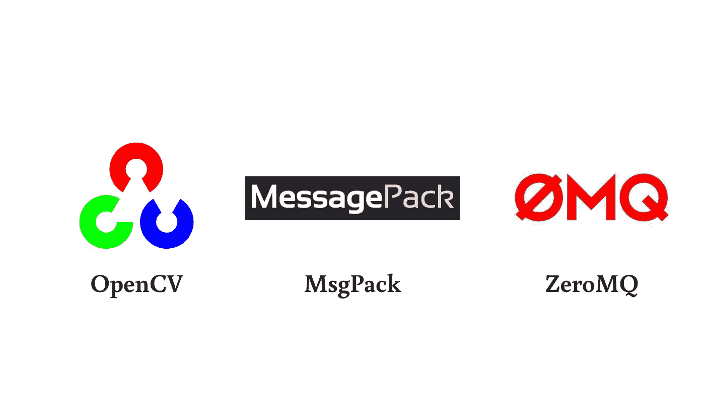

# 使用 Msgpack 和 ZeroMQ 发送并序列化您的 cv::Mat

> 原文：<https://blog.devgenius.io/send-and-serialize-your-cv-mat-using-msgpack-and-zeromq-17c9ce53eacf?source=collection_archive---------2----------------------->

## OpenCV + MessagePack + ZeroMQ ==三重威胁

三重威胁

在我实习的时候，我的任务是制作一个类似请求-响应的机制，发送一个 OpenCV 矩阵(cv::Mat)。要求是我们使用 [MessagePack](https://msgpack.org/index.html) 来序列化矩阵，使用 [ZeroMQ](https://zeromq.org/) 来发送和接收请求-响应。一开始，我认为这可能是一个简单的任务，因为在我看来，我只需要*序列化矩阵→发送序列化矩阵→接收序列化矩阵→在客户端反序列化它*。但是我错了😔。没我想的那么简单。该流程的主要问题是**如何序列化 cv::Mat，以便我们可以使用 ZeroMQ 发送它，以及如何反序列化它，以便我们获得与之前相同的矩阵**。事情变得更难了，因为我在这里使用 C++。因此在这个故事中，我将告诉你我在使用**【动态二人组】**、MessagePack 和 ZeroMQ 时的生活故事。尽情享受吧！

在这个故事的结尾，我们的目标是:

*   序列化 cv::Mat
*   使用 ZeroMQ 发送序列化的 cv::Mat
*   反序列化序列化的 cv::Mat

# 先决条件

你需要以下工具来追踪这个故事:

*   C++17
*   [CMake](https://cmake.org/) (或者其他你喜欢的构建工具)
*   [OpenCV](https://opencv.org/)
*   [cppzmq](https://github.com/zeromq/cppzmq)
*   [msgpack](https://github.com/msgpack/msgpack-c/tree/cpp_master)

需要注意的一点是，我不会在这里解释如何安装这些东西(opencv、cppzmq 和 msgpack)。相反，你可以浏览我给的链接，自己安装。

# [1]准备我们的文件

*   `image.hpp`
*   `server.cpp`
*   `client.cpp`
*   `CMakeLists.txt`

我将在下面详细解释这些文件。

# [2]设置 CMakeLists.txt

让我们从我们的构建文件`CMakeLists.txt`开始(注意，如果您决定使用其他构建系统，可以跳过这一步)

CMakeLists.txt

在这个文件中，我们定义了两个可执行文件:**服务器**和**客户端**。然后我们使用`find_package()`找到我们安装的库 ZeroMQ、MsgPack 和 OpenCV。最后，我们使用`target_link_libraries()`链接这些库。对于最低的 CMake 和 C++版本，可以根据需要进行编辑，但是在这个文件中，我们使用的是 CMake 3.10 和 C++17。

# **[3]准备我们的矩阵**

打开`image.hpp`文件并编写以下代码:

image.hpp

这里我们定义了一个名为 **Image** 的结构，其成员包括:

*   **矩阵**:它将保存我们的矩阵数据
*   **行**:我们的矩阵行
*   **列**:我们的矩阵列
*   **类型**:我们矩阵的类型

不要忘记添加`MSGPACK_DEFINE()`宏，以便 msgpack 可以序列化这个结构。

# [4]序列化

接下来，我们准备我们的矩阵。在这个故事中，为了表示 opencv 矩阵，我们将使用[这个图像](https://www.kaggle.com/code/mpwolke/cute-unicorns-computer-vision/data)并将它转换成`cv::Mat`。将这段代码保存在`server.cpp`文件中。

server.cpp /序列化 opencv 矩阵

我将我的图像文件命名为`unicorn.png`。读取图像后，我们将它保存到图像结构中，与其他数据成员放在一起。为了序列化我们的图像，我们首先创建一个 **sbuffer** 变量来保存序列化的图像，然后我们**用`msgpack::pack()`打包/序列化**它，接受我们的图像结构和 sbuffer。

# [5]请求-答复

对于请求-响应，我们从设置请求或客户机请求序列化矩阵开始。打开`client.cpp`文件。

client.cpp /请求或客户端

这里我们设置了 zeromq **上下文**和**套接字**来连接到我们定义的端点。然后，在 while 循环中，我们将请求字符串发送到服务器，如果服务器是活动的并且已经回复了响应，我们将使用`client.recv()`捕获响应，接受一个 zeromq **message_t** *(该变量将保存响应数据)*和一个可选标志，我们将该标志设置为 none。

接下来是响应或服务器。

server.cpp / response 或 server

与客户端相同，我们设置了 zeromq **上下文**和**套接字**，但是对于这一个，我们没有使用`connect`，而是使用了`bind`。接下来，我们使用`server.recv()`告诉服务器打开一个请求。下一部分和前面一样，我们序列化数据。最后，我们通过将我们的序列化数据放入 zeromq **message_t** 变量中来发送它(*我们首先定义一个新的****packed _ msg****变量，然后我们* ***使用* `memcpy`将我们所有的序列化矩阵数据复制到这个变量中，然后使用`server.send()`发送它。**

# [6]反序列化

最后一个，在从服务器得到响应后，我们反序列化它。

client.cpp /反序列化响应数据

我们需要添加的新代码从第 21 行开始。我们首先**解包/解串**opencv 矩阵。得到结果后，我们得到了我们的 opencv 矩阵，但是类型仍然在`std::vector<uchar>`，而不是`cv::Mat` 正因为如此，我们不能直接用 **cv::imshow()** 显示。然而，有一个窍门可以让我们克服这个问题。我们需要调用 **cv::Mat()** 重载成员函数并传递我们反序列化的数据(第 32 行& 33 行)。

假设你运行`server.cpp`和`client.cpp`，你会得到这样的**流程:**服务器打开请求→客户端发送他的请求→服务器处理 cv::Mat →然后发回并展示给客户端。如果一切顺利，客户端的图像独角兽图像将与服务器端的图像相同。

非常感谢你们坚持到最后。我真的很感谢你的时间，希望我们能在另一个故事中再次看到！拜拜…🤗

***参考文献:***

感谢我找到的这些令人敬畏的资源！

【1】[超越 HelloWrold](https://www.youtube.com/watch?v=nGAJ_vYxWUI)

【2】[独角兽形象](https://www.kaggle.com/code/mpwolke/cute-unicorns-computer-vision/data)