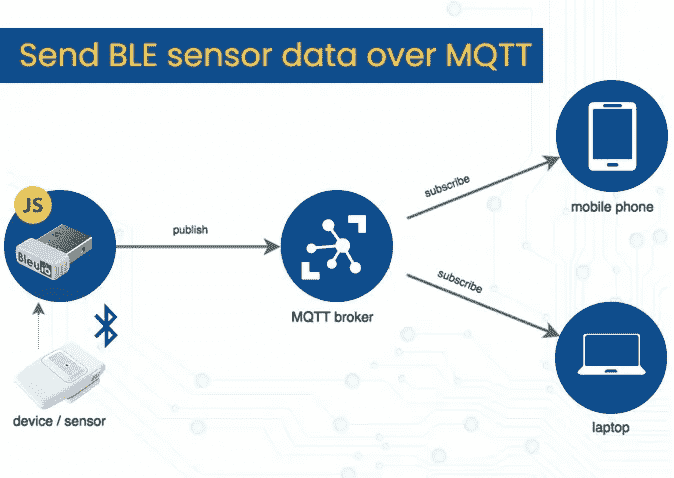
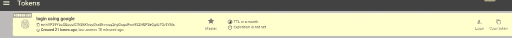
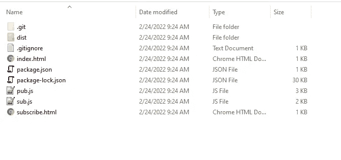

# 使用 Javascript MQTT.js 和 BleuIO 通过 MQTT 发送 BLE 传感器数据

> 原文：<https://blog.devgenius.io/send-ble-sensor-data-over-mqtt-using-javascript-mqtt-js-and-bleuio-5a3e81639aa6?source=collection_archive---------5----------------------->



我们生活在互联设备的世界里。物联网帮助我们更智能地生活和工作，并完全控制我们的生活。物联网的最新技术进步之一是 MQTT 网关，它充当云和物联网平台之间的中介。

MQTT 代表消息队列遥测传输。它是物联网设备和本地网络的关键通信协议之一。这是智能设备之间通信或机器对机器通信的理想协议。

# 什么是 MQTT 网关？

通常，MQTT 网关可以被定义为任何物联网平台和传感器之间的中介。它的工作原理是从这些传感器或智能设备获取数据，并将其转化为 MQTT。然后，它将数据传输到物联网平台或 MQTT 代理。

# 发布/订阅模式

发布/订阅模式(也称为发布/订阅)为传统的客户机-服务器体系结构提供了一种替代方案。在客户端-服务器模型中，客户端直接与端点通信。发布/订阅模型将发送消息的客户端(发布者)与接收消息的客户端(订阅者)分离开来。发布者和订阅者从不直接联系。事实上，他们甚至没有意识到对方的存在。它们之间的连接由第三个组件(代理)处理。代理的工作是过滤所有传入的消息，并将它们正确地分发给订阅者。

# MQTT 代理

在 MQTT 技术中，代理帮助处理客户。它可以一次管理数百、数千或数百万个相连的 MQTT 客户机，这取决于实现。其主要职能是:

*   接收信息
*   解码和过滤接收到的消息
*   确定哪个客户端对哪个消息感兴趣
*   根据客户的兴趣将这些消息发送给他们

# 该项目

让我们做一个简单的 BLE 2 MQTT 项目，它从一个名为 hibo Air 的 BLE [空气质量监控设备收集传感器数据，并将其发送给一个免费的公共 MQTT 代理。](https://www.hibouair.com/)

对于这个项目，我们将使用 Flespi。您可以随意选择任何公共或私有 MQTT 代理。

**步骤**

**要求**

*   一个[蓝色的](https://www.bleuio.com/)电子狗。
*   一种[空气质量监测装置 hibo air](https://www.hibouair.com/)。
*   公共 MQTT 代理(Flepsi 令牌)[https://flespi.com/mqtt-broker](https://flespi.com/mqtt-broker)
*   BleuIO Javascript 库。[https://www.npmjs.com/package/bleuio](https://www.npmjs.com/package/bleuio)
*   一个 Javascript 的构建工具(包裹)【https://parceljs.org/docs/ T2

**获得 Flespi 令牌**

*   在 Flespi 创建一个帐户。
*   登录到 Flespi 仪表板。
*   复制令牌



**下载源文件**

从[https://github . com/smart-sensor-devices-ab/ble2 mqtt _ bleuio . git](https://github.com/smart-sensor-devices-ab/ble2mqtt_bleuio.git)获取源文件

并运行 **npm 安装**

在根文件夹中，我们将看到两个名为 index.html 和 subscribe.html 的 Html 文件和两个名为 pub.js 和 sub.js 的 js 文件



Index.html 文件在 BleuIO 的帮助下，从 BLE 空气质量监测设备 HibouAir 收集传感器数据。

收集广告数据后，我们试图对其进行解码，并获得有意义的空气质量数据，包括二氧化碳、压力、温度、湿度和光照值。然后，我们使用主题名 HibouAirTopic 将数据发布到 Flepsi broker

Subscribe.html 文件作为订户工作，从代理读取传感器数据并显示在屏幕上。

要运行 index.html，我们只需键入

```
parcel index.html
```

**项目视频**